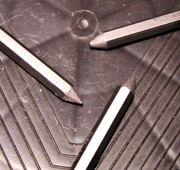

## Le graphite
### Les graphite, usage en arts plastiques
 **Le graphite**  

_Du grec_ graphein_, écrire._

_Cette variété du carbone est très employée dans la fabrication de crayons  
et substituts de "mines de plomb" (dans ce sens, synonyme de_ [plombagine](plombagine.html)_)._

_Nous n'évoquerons dans cette page le graphite qu'en tant qu'outil brut. Pour toute information sur la "matière graphite" et les crayons noirs, lire l'article consacré aux [crayons et mines.](crayon.html)_

_Le dernier point de cette introduction se doit d'être un avertissement concernant la [fixation](fixatifs.html) :  
le graphite est éphémère s'il n'est pas fixé._

_Mine de plomb et mine graphite_

Comme annoncé, oublions maintenant le crayon.

La mine de plomb est aujourd'hui du graphite (cf. [article sur les crayons et mines](crayon.html)). Elle se distingue cependant de ce que l'on nomme la "mine graphite" :

> \* la "mine de plomb" est classiquement recouverte d'une sorte de film plastique intimement collé. Il est possible - quoique pas si aisé - d'éplucher intégralement celle-ci à l'aide d'une bonne lame. L'intérêt de cette opération pourrait sembler discutable, mais il devient évident lorsque l'on sait que l'on rencontre davantage de variétés de graphites parmi les mines de plomb que parmi les autres formes habituellement disponibles dans le commerce. Ainsi par exemple, pour qui recherche une poudre 9B, il n'y a guère d'autres solutions simples que de décortiquer une mine 9B et la mettre en poudre.  
> Le diamètre de ces outils est à peu près toujours le même, celui d'un crayon.



> \* la "mine graphite", généralement hexagonale, n'est pas recouverte. Il s'agit de graphite nu. Voir photo ci-contre.  
> Plus épaisse que la mine de plomb, elle se prête bien à être sculptée.
> 
> \* dans la même famille d'outils, certaines mines pour [porte-mines "artistiques"](crayon.html#minesetportemines) sont également faites de graphite. Leur diamètre est un peu plus modeste que les variétés précédentes.

Il est possible de tailler toutes ces mines "à façon" à l'aide de papier abrasif notamment pour les dégrossir, puis avec un simple papier. On peut ainsi créer des arrondis, des méplats, de sorte à réaliser des aplats et différents types de lignes fines ou épaisses.

Enfin; le graphite peut être réduit en poudre avec du papier abrasif ou un gros taille-crayons. L'application peut alors être réalisée de multiples manières, un peu comme avec la poudre de pastel.

_Autres formes de graphite_

La [pierre noire](pierrenoire.html) semble un mélange naturel de graphite et d'argile tout à fait semblable aux mines de crayons actuelles, plus homogènes.

**La poudre de graphite** peut aussi être achetée directement sous cette forme, bien que certaines enseignes aient abandonné ce produit.

Mentionnons **les gros blocs de graphite**, informes, destinés soit à être mis en poudre, soit à utilisés tels quels sur de grandes surfaces. Ils peuvent atteindre une certaine valeur.

Enfin, il existe un **graphite synthétique [colloïdal](colloide.html)** dont le procédé de fabrication, à base de Carborundum ®, fut inventé par Edward Goodrich Acheson. Il s'agit d'un mélange d'huile ou d'eau (Oildag ® et Aquadag ®), de graphite extrêmement pur et de substances organiques variables. Il est utilisé dans l'industrie comme lubrifiant, mais qui sait s'il ne trouvera pas un jour d'autres applications ? Pour plus d'informations, [cliquer ici](carborundum.html#graphitesynthetique).

_La mise en solution du graphite : techniques originales_

Sur les traces d'Acheson, explorons différentes méthodes de mise en solution. 

Étape préalable : mettre en poudre le graphite si nécessaire (voir ci-dessus). Les graphites gras (HB à 9B ou plus) donnent des résultats moins estompés et plus facilement diluables.

La poudre peut être mélangée avec

**1\. une essence** 

> [L'essence de térébenthine](essences.html#essencedeterebenthine) donne des résultats **très intéressants !**
> 
> Il suffit de mélanger la poudre avec un peu de térébenthine de sorte à obtenir une encre légèrement épaisse que vous diluerez ensuite à votre souhait, toujours avec de l'essence. Étaler au pinceau (d'autres outils comme le chiffon ou l'éponge peuvent convenir).
> 
> Le résultat est vraiment étonnant.
> 
> Le tracé de "l'encre" pure ressemble par sa couleur et sa matière à celui d'un fusain très tendre. Par contre, la touche permise par l'application au pinceau est comparable à celle que l'on obtient avec les encres habituelles. De plus, il est possible non seulement d'obtenir des lavis très dilués, mais aussi **d'étaler** le graphite une fois sec ou de **le diluer à nouveau** !
> 
> Pour cette raison, le travail terminé doit vraiment être [fixé](fixatifs.html). L'huile de lin peut être utilisée à cette fin.
> 
> Nous n'avons pas encore testé le mélange [essence de pétrole raffinée](essences.html#lessencedepetrole) + graphite, qui devrait cependant donner des résultats en bonne partie comparables à ceux qu'offre la térébenthine.

**2\. de l'eau**

> Il n'y a pas mariage intime entre l'eau et le graphite (comme avec le fusain).
> 
> Au contraire, les surfaces obtenues sont très hétérogènes.
> 
> L'étalement à sec est réalisable.
> 
> La [fixation](fixatifs.html) en fin de travail est pratiquement indispensable.

**3\. de l'alcool, de l'huile, d'autres produits**

> ... les tests que nous avons réalisés ne donnent rien de particulièrement notable.


 [Communication](http://www.artrealite.com/annonceurs.htm) 

[](index-2.html#20131014)


```
title: Le graphite
date: Fri Dec 22 2023 11:27:17 GMT+0100 (Central European Standard Time)
author: postite
```
