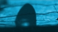

## "Hi-tech"
### Parlons "hi-tech", actualité des procédés en arts plastiques
 **[Pertinence](hitech.html#pertinence)** **Objet, description (du plus récent au plus ancien)** **Liens**       

[Les polycycles carbonnés (graphène, nanotubes, fullerène, diamants)](hitechmarchedesgouttes.html)

Cet article est la conclusion d'une petite série consacrée à ces métamatériaux ainsi qu'aux mécanismes qui leur sont associés. Objets d'un enthousiasme sans limites quant à leurs applications supposées, ils sont évoqués ici sous un angle plus réaliste. [Lire la suite.](polycyclescarbones.html)

_[Article interne](polycyclescarbones.html)_  
_(autre section)_

[](polycyclescarbones.html)

       Je vois votre mémoire (visuelle)

De quoi notre mémoire visuelle est-elle faite : la réponse (partielle) à cette question est un événement scientifique bouleversant mais elle souffre d'une désastreuse communication. Un remarquable travail peut se trouver voilé, partiellement gâché, par une communication inadéquate.... [Lire la suite.](hitechlirelamemoirevisuelle.html)

_[Article interne](hitechlirelamemoirevisuelle.html)_

[](hitechlirelamemoirevisuelle.html)

       Un [nouveau cap franchi dans l'animation holographique](hitechmarchedesgouttes.html)

Un précédent article posait la question "le compte à rebours a-t-il vraiment commencé ?". Nous aurions alors dû répondre par l'affirmative car une équipe américaine vient de réaliser une installation donnant des cadences de rafraîchissement de l'ordre d'une webcam... [Lire la suite.](hitechhologanimee2.html)

_[Article interne](hitechhologanimee2.html)_

[](hitechhologanimee2.html)

       [Un origami miroir](hitechmarchedesgouttes.html)

Ce nouveau chapitre des Dialogues de Dotapea évoque Ikaros, un voilier spatial japonais lancé cette année. Une bonne occasion de revenir sur le thème de la réflexion de la lumière... [Lire la suite.](chap28origamimiroir.html)

_[Article interne](chap28origamimiroir.html)_  
_(autre section)_

[](chap28origamimiroir.html)

       [La marche des gouttes](hitechmarchedesgouttes.html)

Après les [ferrofluides](hitech.html#ferrofluides), les gouttes qui marchent. Ou comment diriger un fluide à une échelle microscopique... [Lire la suite.](hitechmarchedesgouttes.html)

_[Article interne](hitechmarchedesgouttes.html)_

[](hitechmarchedesgouttes.html)

       [Fontaines laser](hitechfontaineslaser.html)

De l'installation expérimentale minuscule à 10€ du Laboratoire de Physique des Lasers (LPL-Paris XIII) à un ouvrage de bonne taille offrant plus de possibilités, le CNRS a fait évoluer un dispositif à vocation pédagogique vers un véritable point d'orgue programmé pour le cinquantenaire du laser (décembre 2010, Bordeaux).

[Lire l'article](hitechfontaineslaser.html)

_[Article interne](hitechfontaineslaser.html)_

[](hitechfontaineslaser.html)

       [Winscape](hitechwinscape.html)

Cela renverse tout : Ryan Hoagland a inventé la fenêtre qui peut faire d'une oeuvre un extérieur. [Lire l'article](hitechwinscape.html)

_[Article interne](hitechwinscape.html)_

[](hitechwinscape.html)

       [« Liquid glass », le vernis parfait ?](hitechliquidglass.html)

L'application en couche nanométrique d'un nouveau « vernis » à base de silice semble offrir de vertigineuses possibilités de conservation dans de nombreux domaines. [Lire la suite](hitechliquidglass.html)

_[Article interne](hitechcimentautonet.html)_

[](hitechliquidglass.html)

       [Nano-ciments et peintures autonettoyants : quoi et comment ?](hitechcimentautonet.html)

A l'occasion de la publication d'un rapport - assez ardu - de l'AFSSET (Agence française de sécurité sanitaire et du travail), la presse généraliste a eu l'occasion d'évoquer la dangerosité de ces produits. Partant de ce coup de projecteur, en marchant à rebours, journalistes et public ont pu obtenir quelques informations sur lesdits produits, connus seulement jusque là d'un nombre restreint de professionnels. Voici donc l'occasion d'évoquer ces ciments et peintures aux propriétés fantastiques. [lire la suite](hitechcimentautonet.html)

_[Article interne](hitechcimentautonet.html)_

[](hitechcimentautonet.html)

       [Khôl : les vertus protectrices inattendues du plomb](hitechvertusplomb.html)

La publication d'un travail de recherches interdisciplinaires dirigées par Philippe Walter, médaille d'argent 2009 du CNRS, pose de troublantes questions sur les vertus pharmacologique jusque là insoupçonnées d'un usage parcimonieux du plomb dans l'Antiquité.

_[Article interne](hitechvertusplomb.html)_

       [Les ferrofluides](chap26magnetisme.html#ferrofluides)

Il ne s'agit pas d'une véritable révolution technologique. Cependant, les applications plastiques sont évidentes.  
Ce sujet est traité au sein du chapitre XXVI des Dialogues de Dotapea.

_[Article interne](chap26magnetisme.html#ferrofluides)  
(autre section)_

[](chap26magnetisme.html#ferrofluides)

       [Le bleu « Mn-YIn »](hitechbleumnyin.html)

Un annonce trop enthousiaste ou une véritable découverte ?

Quelques mots sur un « nouveau bleu » qui laisse perplexe.

_[Article interne](hitechbleumnyin.html)_

[](hitechbleumnyin.html)

       [Les films souples haut-parleurs](hitechfilmssoupleshp.html)

Nous sommes là en présence d'une technologie aux applications potentiellement révolutionnaires. Certes les coûts sont encore élevés, mais déjà en baisse. Bien sûr, l'enjeu industriel est prodigieux... [Lire la suite.](hitechfilmssoupleshp.html)

_[Article interne](hitechfilmssoupleshp.html)_

[](hitechfilmssoupleshp.html)

       [Holographie animé en temps réel : le compte à rebours a-t-il vraiment commencé ?](hitechhologtempsreel.html)

Afficher un objet tridimensionnel animé sans rendre nécessaire le port de lunettes est un enjeu immense... [Lire la suite.](hitechhologtempsreel.html)

_[Article interne](hitechhologtempsreel.html)_       

Le "caoutchouc réparable"

A priori peu spectaculaire, ce nouveau matériau peut évidemment intéresser des plasticiens, mais aussi d'autres métiers créatifs, l'habillement par exemple... [Lire la suite](hitechcaoutchoucrep.html)

_[Article interne](hitechcaoutchoucrep.html)_        Les "pico-projecteurs"

Une invention qui intéressera en premier lieu les vidéastes, la plupart des artistes du numérique, les "installateurs", etc. Elle a aussi de fortes chances d'intéresser rapidement un large public.

On peut, grâce à une très impressionnante maîtrise technologique des [lasers](chap13laser.html), projeter des images de grande dimension à l'aide d'un simple portable ou d'un boîtier connecté.

_[Lien vers le site du fabricant](http://www.microvision.com/pico_projector_displays/index.html) (anglais)_        [Les "opales polymères"](hitechopalespolymeres.html)

Une recherche prometteuse non sans dimensions plastiques sur les métamatériaux dans le domaine chromatique et tridimensionnel.

_[Article interne](hitechopalespolymeres.html)_        [Les pigments à nanocharges](hitechnanocharges.html)

Une petite révolution dans le domaine des charges pigmentaires.

_[Article interne](hitechnanocharges.html)_        [L'aérogel/xérogel élastique](chap05aerogel.html#elastique)

Un nouvel avenir pour ce matériau ?

_[Article interne](chap05aerogel.html#elastique)_      


[Panorama des métamatériaux](chap11metamateriaux.html)

Chapitre complet publié sur Dotapea (XIème Dialogue).

Au sommaire :

> \* [le noir ultime,](chap11metamateriaux.html#noirultime)
> 
> \* [l'invisibilité,](chap11metamateriaux.html#invisibilite)
> 
> \* [les nanostructures de l'opale,](chap11metamateriaux.html#opalebilles)
> 
> \* [l'argile turquoise des Mayas,](chap11metamateriaux.html#argileindigomaya)
> 
> \* [l'acier des épées de Damas,](chap11metamateriaux.html#epeesdamas)
> 
> \* etc.

Nous tentons de mettre en perspective les échelles et les modes opératoires ainsi que les applications pour les arts plastiques et domaines proches.

_[Article interne](chap11metamateriaux.html)_

[](chap11metamateriaux.html)

       [L'aérogel](hitechaerogel.html)

Cette matière - le plus léger solide jamais créé par l'homme - est un nouveau Sphinx. Son aspect est irréel, elle est fascinante et encore énigmatique... [Lire la suite.](hitechaerogel.html)

_[Article interne](hitechaerogel.html)_

[](hitechaerogel.html)

     


Les mousses ultra-stables

Il s'agit de mousses aqueuses particulièrement stables (_ultrastable particle-stabilized foams_). Elles résistent plus de quatre jours sans se mettre à couler ni que les bulles d'air [coalescent](coalescence.html). Les mousses sont formées d'eau et de particules solides (par exemple de la [silice](silice.html)) recouvertes de molécules organiques simples (produits commerciaux).

Il reste à faire une véritable exploration des possibilités physiques et artistique de ces produits "[plastiques](plastique.html)".

_Lien vers une [recherche Google](http://www.google.fr/search?hl=fr&q=%22ultrastable+particle-stabilized+foams%22&meta=)._      


Les tissus lumineux numériques (Lumalive ®)

Une invention particulièrement impressionnante qui concerne de très nombreux domaines, y compris les arts plastiques. A surveiller de près selon nous car l'étendue des applications est incalculable à ce jour.

Il s'agit de tissus (lavables) affichant par eux-mêmes des images numériques animées grâce à des LEDs (diodes électroluminescentes) insérées dans les trames.

Amis vidéastes, plasticiens multimédias et professionnels d'autres domaines proches, une nouvelle perspective de mise en scène à la fois du corps (entre autres), des surfaces y compris souples, mouvantes, et des animations numériques s'est ouverte.

C'est ce que l'on est en droit d'appeler un nouveau support.

_[Vidéo](http://www.research.philips.com/newscenter/archive/2006/060901-lumalive.html) de la société auteure du procédé (en anglais)_

_...et un [article complet](http://www.research.philips.com/newscenter/archive/2006/060901-lumalive.html) (en anglais également)._

     


[L'holographie numérique](chap15holographienum.html)

Un nouvel article sous forme d'entretien est consacrée à cette technologie mais aussi à son avenir. Il s'agit du chapitre XV des Dialogues de Dotapea, troisième volet du triptyque _Laser et 3d_ :

**L'holographie numérique  
**et les autres procédés lumineux tridimensionnels :  
soixante ans après l'invention du hologramme,  
faisons le point

[Cliquer ici](chap15holographienum.html) pour accéder au chapitre XV      


Blender

Certains d'entre vous connaissent cet outil informatique, mais selon nous pas encore assez. Il peut intéresser quelques artistes fouineurs et... courageux. Donc parlons-en.

C'est un outil prodigieux (le mot n'est pas trop fort) d'animation de synthèse de type "tracé de rayon" de niveau professionnel qui est accessible dans le domaine public.

Même si Blender3d n'est pas nouveau, ce logiciel extrêmement puissant et tout à fait à la pointe de l'imagerie de synthèse a ceci de relativement inhabituel qu'il reste gratuitement à la disposition de tous. Il est donc à consigner au glorieux chapitre "si vous ne le croyez pas, voici la preuve que le web demeure partiellement une entreprise philanthropique".

Attention : c'est un outil dont la prise en main est très peu aisée. C'est un véritable univers. Y pénétrer est une entreprise qui nécessite du temps.

L'immensité des champs ouverts par ce logiciel permet cependant de trouver la patience, l'humilité et l'énergie nécessaires pour l'explorer, en s'aidant notamment des nombreux "tutoriaux" que l'on trouve sur le web.

_[Site Blender](http://blender3d.com/cms/Home.2.0.html) (en anglais)_      


L'armure liquide

C'est un sujet martial a priori.

Mais au-delà des performances hypothétiques qui pourraient être réalisées avec ce type d'assemblages initialement destinés à la fabrication de gilets pare-balles, il semble qu'une utilisation différente pourrait en être faite car il ne s'agit de rien d'autre essentiellement que d'un liquide capable de se raidir considérablement et instantanément à l'impact d'un projectile puissant (au point de le faire rebondir quelquefois), et de se liquéfier de nouveau l'instant suivant.

_[Article paru dans Le monde](http://www.lemonde.fr/web/article/0,1-0@2-3244,36-813680,0.html?xtor=RSS-3244)_
```
title: "Hi-tech"
date: Fri Dec 22 2023 11:27:20 GMT+0100 (Central European Standard Time)
author: postite
```
