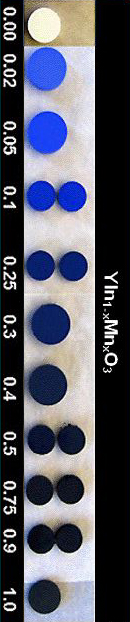

## "Hi-tech" - Bleu Mn-YIn
### Bleu Mn-Yin, nouveau bleu de manganèse - Section Hi-tech
 **Le bleu « Mn-YIn »**



Cet article a été amplement modifié suite à une prise contact directe avec l'auteur de cette invention, Mas Subramanian [\[1\]](hitechbleumnyin.html#note010) (interview [ci-dessous](hitechbleumnyin.html#interview)).

Nous pardonnera-t-on cette appellation mystérieuse et sans garantie, rendue nécessaire aussi longtemps que ce nouveau pigment ne jouira pas d'un intitulé officiel ? « Mn-YIn » réfère ici aux éléments manganèse (Mn), yttrium (Y) et indium (In) qui le composent - on a oublié l'oxygène pour faire court mais la formule exprimée sur l'image ci-contre donne ces indications. Dans la foulée, on remarque d'ailleurs qu'il est inutile d'ajouter un blanc ou un noir pour modifier la luminosité puisque il suffit de modifier les proportions des composants entre eux.

La découverte d'un nouveau bleu est bien sûr un joyeuse nouvelle pour qui aime la couleur, mais dans une première version de cet article, nous avons émis de sérieuses réserves à cause de la tonalité précisément un peu trop enthousiaste et précipitée, peut-être, de la presse anglo-saxonne.

Citons cette première version : « _Tout d'abord, évitons de reproduire une erreur (...) consistant à appeler cette couleur « bleu de manganèse ». (...) les services de communication (...) semblent oublier la préexistence d'un autre bleu de manganèse ([lien](bleuschauds.html#lebleudemanganese)). (...) il s'agit là d'un point très important à différent titres :_

> _\* comment comparer l'ancien et le nouveau bleu de manganèse ou son imitation ([phtalocyanine](phtalocyanines.html) de cuivre) devenue classique sur les palettes ?  
> Cette imitation n'est d'ailleurs pas née sans raison : en premier lieu elle est belle et plutôt stable, mais aussi utile car comme le signalent [François Perego](livres.html#perego) et Dotapea, le pigment original a un pouvoir siccatif (pour la peinture à l'huile) (...). Savoir que la molécule est agencée en octaèdres comme la documentation l'indique ne nous renseigne pas du tout sur l'intérêt de cette découverte. Ce pigment est-il plus ou moins siccatif que l'ancien, qu'apporte-t-il ?_
> 
> _\* considéré comme toxique par différents intervenants (auteurs spécialisés, distribution commerciale), « l'ancien » bleu, BaSo4+BaMnO4, reste à ce jour une énigme toxicologique, comme le manganèse en général. Cet atome est un constituant normal du corps humain, mais il existe au moins une pathologie bien connue, le manganisme, que l'on peut lui attribuer et peut-être plus particulièrement à ses oxydes, ou à l'aptitude que ceux-ci ont à changer de [valence](valence.html) en influençant les « systèmes » du cerveau. Le manganisme est une affection très grave et la toxicité du manganèse est un sujet difficile, toujours en cours d'étude comme chacun peut le constater à la lecture du [Reptox](liensutiles.html#csst) notamment.  
> Or, les communiqués et articles concernant le « nouveau » bleu de manganèse indiquent que celui-ci aurait un impact environnemental bénin. Cela semble un peu rapide._ »

Fin de citation. Nous assumons ces questionnements étant donné le manque d'informations à l'époque (décembre 2009).

Qu'en est-il finalement ? Mas Subramanian a répondu à nos questions en février 2010, ce qui nous permet de donner un éclairage plus précis. Voici le dialogue :

Dotapea : (...) On a more practical point of view, for the layman or the average painter, there are so far not so many details about your discovery on the internet. More precisely, could I kindly ask you to tell me what are the main differences between your pigment and the usual manganese blue, namely (BaSo4+BaMnO4) in terms of:

> \- stability...

 

 

Dotapea : (...) Cependant, d'un point de vue concret, pour le peintre décoratif ou artistique, on ne trouve qu'assez peu d'informations sur votre découverte. En particulier, puis-je vous demander ce qui distingue votre pigment de l'habituel bleu de manganèse (BaSo4+BaMnO4) en termes de :

> \- stabilité...

Mas Subramanian : Stable to very high temperatures 1200C.

 

 

Mas Subramanian : C'est stable jusqu'à de très hautes températures, 1 200°C.

Dotapea :

> \- ... reactivity towards painting oils. You may know that the usual manganese blue had poor siccative qualities...

 

 

Dotapea :

> \- ... de réactivité avec les peintures grasses à l'huile. La siccativité était le défaut majeur de l'ancien bleu de manganèse...

Mas Subramanian : I am not sure about exact paint oils. But it has been tested in paint formulations by a company and found to be very good and better than Co-blue.

 

 

Mas Subramanian : Je n'ai pas de certitudes sur des huiles à peindre. Mais cela a été testé par une entreprise dans des formulations destinées à la peinture et classé comme très bon et meilleur que le bleu de cobalt.

Dotapea :

> \- ... toxicity, since manganese is an element which toxicity is today still uncertain. Actually art dealers and most sources consider manganese blue as being toxic, hence his poor success.

Also, from a strict "painter's point of view" it is hard to understand why the presence of Y and In in an octahedral structure good yield a safer pigment, less toxic and maybe cheaper. May I ask you for your opinion in a few words?

 

 

Dotapea :

> \- ... et enfin d'innocuité puisque le manganèse est encore à ce jour un matériau dont on connaît assez mal l'impact toxicologique. Ici très concrètement, les détaillants et les auteurs Beaux-arts considèrent l'ancien bleu de manganèse comme un toxique. Il n'a donc n'a pas reçu un grand succès.

Ce n'est pas très facile d'un point de vue "purement peinture" de comprendre les rôles de l'yttrium, de l'indium et de la structure octaédrique, et au-delà pourquoi cela en fait un pigment "plus rassurant, plus fiable et plus accessible". Pourriez-vous en dire quelques mots s'il vous plaît ?

Mas Subramanian : In Mn blue Ba is more toxic and is a heavy element. The stability of pigment to temperatures, acid etc. makes it more stable and none of the elements is leached out.

It is not the coordination of Mn makes it less toxic.

 

 

Mas Subramanian : Dans le bleu de manganèse, le [baryum](baryum.html) est plus toxique et c'est un élément lourd. Le nouveau pigment est stable face à la température, l'acidité, etc., et aucun des éléments n'est exfiltré.

Ce n'est pas la coordination/configuration du manganèse qui le rend moins toxique.

Dotapea : Last, would it be possible that you send me some samples of your new dye?

 

 

Dotapea : Vous serait-il possible de nous faire parvenir des échantillons ?

Mas Subramanian : May be possible in the near future as we are working with a company to manufacture it. I will keep you posted.

 

 

Mas Subramanian : C'est possible dans un futur proche puisque nous travaillons avec une entreprise pour l'industrialiser. Je vous tiendrai informé.

On peut donc avancer sans trop se risquer que Mas Subramanian et son équipe viennent de créer un composé très intéressant et qu'il reste des points à éclaircir, ce qui devrait se faire à l'occasion de l'industrialisation. Dès l'arrivée des échantillons nous pratiquerons quelques essais et à notre tour nous vous tiendrons informés.  
 

Yttrium et indium

La documentation (_toute_ la documentation anglophone et francophone à ce jour) utilise en toutes lettres le mot manganèse, jamais le mot yttrium ni le mot indium, toujours abrégés (Y, In).  
Un choix de matériaux qui surprend car on a rarement affaire à de tels métaux dans l'univers pigmentaire.  
Il existe assez peu d'informations sur leur toxicité. L'yttrium serait spontanément combustible à l'air en tant que métal pur, c'est tout et c'est trop peu pour en tirer des conclusions.

Le procédé de fabrication du « bleu Mn-YIn » est présenté comme peu coûteux. En fait, comparativement au bleu de manganèse ancien, le bleu Mn-YIn vaudra forcément beaucoup plus cher car l'yttrium et l'indium sont aujourd'hui des métaux relativement coûteux. Mais ces données peuvent changer en fonction du marché.

Fabrication

Les échantillons sont préparés en chauffant les réactifs sous atmosphère ambiante (à l'air). Oxyde d'yttrium Y2O3 et d'indium In2O3. L'oxyde d'yttrium a été séché à 850°C préalablement. Les quantités adéquates de réactifs ont été mélangées soigneusement dans l'éthanol avec un mortier d'agate. Le mélange est ensuite pressé en pastille sous une pression de 40kg/m2. Les pastilles sont calcinées sous air pendant 12h à 1200°C puis deux fois sous air à 1300°C avec re-broyages intermédiaires. Vitesse de chauffage 300°C/heure.

(grâce à l'aide de [Jean-Louis](quinoussommes.html#jeanlouis))

Textes de référence

[La page de l'équipe scientifique](http://www.chemistry.oregonstate.edu/subramanian/updated%20group%2011%2009/index.htm)

Résumé gratuit et accès à un contenu complet : [ici](http://pubs.acs.org/doi/pdf/10.1021/ja9080666).

Conclusion

Si le magazine _Pour la science_ (édition française de _Scientific American_), principal relais initial de cette information en Francophonie, a cru utile de publier un article dithyrambique (et plutôt caricatural [\[2\]](hitechbleumnyin.html#note020)) au sujet de cette découverte soi-disant due au hasard, et si la presse américaine a présenté l'affaire comme une véritable copie de l'histoire de la découverte fortuite du futur bleu outremer (lapis-lazuli synthétique) par Vauquelin - [lien](outremer.html#genese) -, Dotapea cherche à présenter cette invention très intéressante d'un manière plus simple et pragmatique.

Les premières réponses de Mas Subramanian et les futurs tests sur des échantillons nous incitent à nous ouvrir sur une description précise de cette prometteuse nouvelle couleur.

\_\_\_\_\_\_

\[1\] Department of Chemistry, OSU, Université de l'Oregon, Etats-Unis.  
\[2\] On peut en juger au titre : « Un pigment bleu rival du lapis-lazuli ». Cette affirmation n'est malheureusement étayée que par une photo... de [lapis-lazuli](bleusfroids.html#lelapislazuliveritable) !

Cliquer sur le bouton « Précédent » de votre navigateur pour revenir dans le corps du texte.


 [Communication](http://www.artrealite.com/annonceurs.htm) 

[](index-2.html#20131014)


```
title: "Hi-tech" - Bleu Mn-YIn
date: Fri Dec 22 2023 11:27:20 GMT+0100 (Central European Standard Time)
author: postite
```
