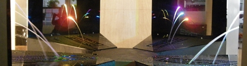
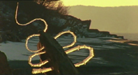
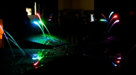
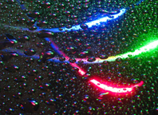

## "Hi-tech" - Verre liquide, vernis parfait ?
### Verre liquide, vernis parfait ? - Section Hi-tech
 **Fontaines laser  
([\*](hitechfontaineslaser.html#noteorthographe))**

De l'installation expérimentale minuscule à 10€ du Laboratoire de Physique des Lasers (LPL-Paris XIII) à un ouvrage de bonne taille offrant plus de possibilités, le CNRS a fait évoluer un dispositif à vocation pédagogique vers un véritable point d'orgue programmé pour le cinquantenaire du laser (décembre 2010, Bordeaux).



Guider la lumière, avant de devenir un enjeu technique et commercial (fibre optique) ou même scientifique, a été un défi en soi. Comment courber ces rayons toujours droits, immatériels mais inflexibles ?

Une question qui n'a pas d'âge.

Ainsi citerons-nous un extrait du document de l'In2p3 (accessible intégralement par le lien ci-contre) : « _Au milieu du XIXème siècle, Jean-Daniel Colladon eut l’idée lumineuse de concentrer les rayons issus d’une lampe sur l’embouchure du jet d’eau créé par un réservoir percé sur un de ses flancs. Le résultat qu’il décrit lui-même est spectaculaire: "la lumière circule dans ce jet transparent, comme dans un canal, et en suit toutes les inflexions !". Une expérience similaire fut réalisée dès 1840 par Jacques Babinet : ce dernier expliqua même comment le principe du guidage de la lumière pouvait s’étendre à des cylindres de verre courbés, anticipant ainsi les futures fibres optiques…_ »

[Faire de la physique autour des fontaines laser (Pdf de l'In2p3, avec entre autre la description d'un premier "montage à 10€")](http://fontainelaser.in2p3.fr/IMG/pdf/forget_fontaineslasers_apres_retour_referee.pdf)

[Le document "fondateur" du LPL-Paris XIII](http://www-lpl.univ-paris13.fr:8090/fontaine_laser.htm)

[La fontaine du cinquantenaire](http://fontainelaser.in2p3.fr/spip.php?rubrique1)

[Le site de l'artiste concepteur, Steve Veloso](http://steveveloso.com/)

[Le chapitre XIII des Dialogues de Dotapea, consacré au laser](chap13laser.html)

Une petite réserve toutefois : l'expérience est peut-être beaucoup plus ancienne car le verre n'est pas nouveau (il a pu être utilisé comme canal pour la lumière dès l'Antiquité, information non confirmée ([\*\*](hitechfontaineslaser.html#noteverre))) et avant lui, il y a eu la glace.

On pense par exemple à une oeuvre célèbre et intemporelle (ci-contre) de Andy Goldsworthy, réalisée avec quelques morceaux de stalactites, un peu d'eau liquide pour les souder, un rocher comme support et surtout un rayon de soleil levant.

Certes, cela ne fonctionne pas de la même manière et il y a un artifice car le serpentin ne traverse pas le rocher. Cependant, l'artiste piège bien la lumière dans un matériau transparent qui n'est pas de forme droite. L'homogénéité de l'illumination est parlante. Et cela a pu être réalisé au paléolithique.



Dans le cas de l'eau ou de la glace, c'est l'air lui-même qui joue le rôle de la gaine d'une fibre optique. Dans une fibre optique, on joue, en incorporant localement différents matériaux, sur un écart [d'indices de réfraction](refraction.html) entre le centre (ou _coeur_, très [siliceux](silice.html)) et la _gaine_ afin de canaliser la lumière. La gaine évite que celle-ci s'évade. Au lieu de cela, elle rebondit de proche en proche.

La gaine n'a pas un rôle purement protecteur comme on peut le lire parfois, ici ou là. Elle fait beaucoup plus et ce que l'on nomme _le protecteur_ est un troisième milieu situé autour de la gaine, toujours dans le corps même de la fibre.

Note : la présence de silice très pure dans la fibre peut surprendre. En effet, comment un matériau aussi cassant peut-il être souple ?

C'est tout simplement sa finesse (10µm) qui fait sa souplesse, comme pour un fil métallique. Plus c'est fin, plus c'est souple.

Entre l'indice de [réfraction](refraction.html) de l'eau et celui de l'air, l'écart est assez important pour que la lumière soit également canalisée.

L'un des enjeux des fontaines laser est de faire comprendre que c'est la variation de l'indice de réfraction qui permet de "courber" la lumière.

Un autre extrait du document de l'In2p3 : « _Il s'agit tout d'abord d'expliquer le guidage de la lumière par réflexion totale dans les jets d'eau, ces derniers formant une version macroscopique des fibres optiques. Ici le milieu guidant est aqueux et non vitreux, et la « gaine  » est faite d’air : les notions fondamentales (contraste d’indice avec un indice plus fort dans le coeur que dans la gaine, réflexion totale, courbure possible) sont bien respectées. Dans le cas du guidage dans un jet d’eau, la différence entre l’indice du coeur (neau\=1,33) et l’indice de la gaine (nair\=1) est bien plus important que pour une fibre optique classique (valant dans ce cas quelques millièmes) et l’injection s’en trouve grandement facilitée._ »

Autre point fort pédagogique : « _Le calcul de la vitesse de l'écoulement repose sur l’application de l’équation de Bernoulli et le calcul de la trajectoire du jet d'eau reste simple : quelques notions de mécanique des fluides de base peuvent ainsi être introduites._ » On notera au passage que l'équation de Bernoulli devrait être prochainement abordée sur Dotapea.

Quant au [laser](chap13laser.html), bien sûr il est au centre de ces dispositifs. Il suffit d'essayer d'obtenir les mêmes résultats avec une lampe de poche pour comprendre à quel point cette lumière est différente par sa concentration directionnelle (si ces termes sont biens choisis).



L'eau semble se teinter d'une manière uniforme. On le constate avec une seule couleur mais c'est encore mieux avec trois, les trois primaires (rouge, vert, bleu) de la [synthèse additive](syntheseadditive.html), car on obtient une illustration directe de ce phénomène en modulant l'intensité des trois sources colorées.

Ces dispositifs ont-ils leur place dans une section nommée « hi-tech » ?

En fait chers amis lecteurs, à strictement parler non, pas du tout, puisque l'on célèbre une technologie déjà vieille de cinquante ans.

Mais à moins strictement parler, oui, tout à fait !

Pour deux raisons :

> \* comme le [chapitre XIII](chap13laser.html) peut le faire sentir en entrant dans le détail du sujet, le laser demeure une haute technologie même cinquante ans après son invention. Au-delà, il nous réserve sans doute encore quelques surprises. On pense entre autres à l'avenir de [l'holographie](chap14holographie.html), encore débutante, mais aussi à ce qui va suivre le "blue ray" balbutiant, aux applications dans les domaines de la fusion nucléaire, du pointage des télescopes, etc. Le chemin parcouru donne déjà le vertige mais la science n'a très probablement pas fini d'explorer les applications du laser.
> 
> \* ce jubilée d'or ([\*\*\*](hitechfontaineslaser.html#notejubileedor)) est marqué par l'intervention d'un jeune artiste (voir lien dans [l'encadré](hitechfontaineslaser.html#encadre)) travaillant avec une équipe de scientifiques. C'est une manière de travailler qui reste encore extrêmement marginale mais qui pourrait se développer. Sur ce point également on peut entrevoir des perspectives.



\_\_\_\_\_

(\*) laser ne prend pas de s en apposition.

(\*\*) La transmission dans le verre de l'époque n'a cependant pas pu dépasser quelques centimètres. C'était aussi le cas des premiers câbles optiques. De toute façon même pour ceux qui ont suivi, c'est bel et bien la lumière laser qui permet de faire beaucoup mieux.

Cependant, 3 ou 5 cm ou même un peu plus (avec du cristal), cela nous semble modeste mais c'est suffisant pour obtenir quelques effets. L'autre partie du problème était de bien concentrer le rayon. A partir d'Archimède, c'est possible mais encore une fois sans comparaison avec la précision des lasers.

(\*\*\*) un jubilée d'or célèbre un cinquantenaire.

Cliquer sur le bouton « Précédent » de votre navigateur pour revenir dans le corps du texte.


 [Communication](http://www.artrealite.com/annonceurs.htm) 

[](index-2.html#20131014)


```
title: "Hi-tech" - Verre liquide, vernis parfait ?
date: Fri Dec 22 2023 11:27:21 GMT+0100 (Central European Standard Time)
author: postite
```
