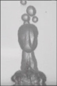

## "Hi-tech" - Verre liquide, vernis parfait ?
### Verre liquide, vernis parfait ? - Section Hi-tech
 **« Verre liquide »  
le vernis parfait ?**

[Lien direct vers l'addendum](hitechliquidglass.html#addendum)

L'application en couche nanométrique d'un nouveau « vernis » à base de silice semble offrir de vertigineuses possibilités de conservation dans de nombreux domaines.

Le 4 mars 2010, le site du journal Courrier International publiait la traduction d'un article de Die Welt sous l'intitulé « Un revêtement en silice plus glissant que le Téflon ».

Nous allons revenir sur cette annonce quasiment ignorée en France en tentant d'apporter quelques éclaircissements supplémentaires.

La société allemande Nanopool (Sarre) a mis au point un « revêtement » dont les propriétés semblent en fait bien plus étendues que celles du Téflon.

[Le site du fabricant Nanopool (anglais)](http://www.nanopool.eu/couk/index.htm)

[Exemples en vidéo](http://www.nanopool.eu/couk/download.htm)

[L'article de Courrier International (français)](http://www.courrierinternational.com/article/2010/03/04/un-revetement-en-silice-plus-glissant-que-le-teflon)

[« La tasse que l'on ne lave jamais », original sur le site de Die Welt (allemand)](http://www.welt.de/die-welt/vermischtes/article6276160/Die-Tasse-die-sich-selber-spuelt.html)

Ce « Liquid glass » (Flüssigglass, verre liquide) est en effet une substance invisible à l'oeil nu, résistante à la chaleur, ne pouvant être rayée, applicable avec un simple pinceau, un chiffon ou en aérosol, et non toxique, qui a une particularité extraordinaire : une fois sèche, rien ne peut s'accrocher dessus. Pas même une bactérie. Rien n'attache (voir lien vidéo dans l'encadré).

Contrairement aux ciments et peintures autonettoyants dont il a été question récemment dans cette section ([lien](hitechcimentautonet.html)), l'action de ce produit serait purement mécanique et non chimique. Ce serait - du moins à sec - une couche de [silice](silice.html), c'est-à-dire de [verre](verre.html), mesurant 100 nanomètres d'épaisseur et pouvant s'appliquer - sous forme liquide - sur un support souple comme du tissu par exemple.

Il pourrait s'agir d'une sorte de « bouche-pores » très particulier. Consulté, Jean-Louis ([lien](quinoussommes.html#jeanlouis)) fait d'abord un rapprochement avec [l'aérogel](chap05aerogel.html) :

> « Tel que je comprends, c'est le classique "verre liquide" revisité. Ce sont sûrement les mêmes produits de départ que pour faire des aérogels à partir de solutions hydro-alcooliques de TMOS (tétraméthoxysilane). Ce n'est pas forcément [hydrophobe](h.html#hydrophilephobe) comme le téflon, ça doit juste boucher les pores et faire une couche fine, donc flexible, de verre de silice. »

Première interprétation à chaud pour une invention encore toute récente dont on ne sait pas tout (voir [addendum](hitechliquidglass.html#addendum)) et que l'on est impatient de mieux connaître tant elle paraît prometteuse.

Ainsi, alors que l'aérogel demande un processus de séchage très particulier, ce qui frappe ici est la facilité d'application sur toutes sortes de supports.

On pense naturellement - a minima - à une utilisation comme vernis pour les arts plastiques et décoratifs.

Mais pour le moment, dans l'univers des arts, le Liquid glass semble n'avoir été employé que pour la protection des statues du mausolée d'Atatürk (photo ci-contre où l'on peut observer une aspersion du produit en spray sur une oeuvre située en plein air). La question reste ouverte pour d'autres types d'oeuvres.

Les tableaux par exemple.

Le vernissage d'un tableau nécessite normalement la possibilité de dévernir pour placer un vernis neuf. Qu'en serait-il du Liquid glass ?

« C'est réversible par traitement à l'acide fluorhydrique », répond Jean-Louis (le [Reptox](liensutiles.html#csst) indique effectivement que cet acide dissout la silice). Ainsi, un dévernissage semble difficile mais peut-on raisonner de cette manière en présence d'un produit aussi stable et peu agressif ? On ne tranchera pas mais on rappellera que si sur des périodes extrêmement longues, le verre n'est pas totalement inerte (voir [Courrier des Lecteurs sur le smalt](courrierdeslecteurs2009c080.html#20091026ev)), c'est lorsqu'il est adjoint de potasse ou de soude, voire de plomb ou d'autres [fondants](fondant.html), que cela pose un problème bien identifié, alors qu'ici nous avons affaire à une silice pure.

Alors, le Liquid glass est-il le vernis des vernis ? Ce produit inoffensif, invisible, neutre, résistant, facile à appliquer sur toutes sortes de surfaces, correspond-t-il au rêve de générations d'artistes, d'experts, de chercheurs, de collectionneurs et d'industriels dont certains ont consacré leur vie à la question de la conservation des oeuvres d'art ?

La réponse de Dotapea sera normande car deux problèmes subsistent :

> \* trop peu de tests ont été réalisés pour établir une évaluation empirique rigoureuse correspondant au niveau d'exigence nécessaire au traitement d'oeuvres de maîtres (une expertise du C2RMF serait bienvenue),
> 
> \* les tarifs sont inconnus, donc on ne mesure pas encore très clairement le champ d'application concret. Ce « verre liquide », ce SiO2 ultra « hi-tech », sera-t-il un produit populaire ou bien demeurera-t-il réservé aux commandes d'états ?

Quoi qu'il en soit, nous pouvons affirmer sans risques que cette invention élégante (ni destructive, ni intrusive) est du plus haut intérêt et qu'elle peut d'ores et déjà être exploitée dans un large éventail de contextes.

**Addendum**


Il n'est pas certain que le Liquid glass soit hydrophobe comme le téflon, cela a déjà été dit ci-dessus. Il s'agit au contraire d'une surface de silice qui devrait logiquement être hydrophile. L'effet bouche-pores que l'on peut supposer empêcherait la surface d'être salie, mais elle n'aurait aucun rapport avec l'hydrophobie et l'oléophobie du PTFE - polytétrafluoroéthylène -, à savoir le constituant du téflon (et donc des produits Téfal ® évoqués sur le site du fabricant) dont on dit qu'il est même « auto-phobe » ! \[lire ci-dessous [quelques mots](hitechliquidglass.html#quelquesmots) sur le téflon et le fluor\]

Sur les vidéos de l'entreprise Nanopool (voir [liens ci-dessus](hitechliquidglass.html#indexrefs)), les liquides glissent sur la surface, mais cela peut être l'effet des propriétés d'imperméabilité du verre, pas nécessairement d'un effet hydrophobe. A noter que dans les deux cas cela fonctionne avec les bactéries : elles n'aiment pas les surfaces lisses.

Téfal et effet lotus :

une réelle hydrophobie

pour le Liquid glass ?

Un effet hydrophobe n'est pas à exclure si le film de silice qui se forme est nano-structuré sous la forme du fameux "effet lotus" identifié dès les années 1970 (lien ci-contre).

Notons au passage que cet effet concerne tous les liquides, aussi bien polaires qu'apolaires ([lien sur polaires/apolaires](polaireapolaire.html)).

Au-delà, pour revenir au Liquid glass, il semble difficile de former en une application simple (spray ou autre) le film de silice (et le recouvrir éventuellement de molécules hydrophobes additionnelles). La préparation de nano-structures n'est habituellement pas aussi aisée.

Une rugosité non périodique pourrait cependant expliquer le phénomène, ou encore un traitement au [silane](silane.html), mais il ne s'agit là que d'hypothèses.

Notons au passage que l'on ne sait toujours pas tout sur le téflon puisque celui-ci, malgré son âge, reste protégé par brevet.

Quelques mots sur le téflon et le fluor

On peut supposer que la présence dans le PTFE [\[lien\]](hitechliquidglass.html#ptfe) constitutif du téflon, de l'atome le plus [électronégatif](electronega.html) qui soit à savoir le fluor, explique par une polarité importante du polymère sa puissante oléophobie. Mais il semble moins simple de comprendre son hydrophobie.

Celle-ci est peut-être - disons bien peut-être - à rechercher du côté d'éventuels comportements atypiques entre hydrogène (l'hydrogène de l'eau) et fluor.

Le couple hydrogène/fluor se comporte effectivement de manière curieuse : HF est un gaz acide corrosif à l'extrême (au point de liquéfier le verre) qui s'assemble notamment aux alentours de volcans tels que l'Eyjafjöll islandais en un polymère très léger, à savoir 2(HF), un liquide mortellement toxique. Précisons que ce fluorure d'hydrogène n'est pas un composant du panache de fumée volcanique qui traversa l'océan à grand bruit médiatique en avril 2010, mais un phénomène local.

Cependant, sur les rapports fluor/hydrogène, un travail reste à faire de notre côté pour comprendre ce qui opère dans l'hydrophobie du téflon. Des idées, des indications ? N'hésitez pas à [nous écrire](ecrire.html).

[](http://www2.cnrs.fr/presse/thema/376.htm)  
Effet lotus :  
un [article](http://www2.cnrs.fr/presse/thema/376.htm) avec vidéos

dans l'espace presse

du site du CNRS


 [Communication](http://www.artrealite.com/annonceurs.htm) 

[](index-2.html#20131014)


```
title: "Hi-tech" - Verre liquide, vernis parfait ?
date: Fri Dec 22 2023 11:27:21 GMT+0100 (Central European Standard Time)
author: postite
```
