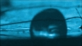

## "Hi-tech" - Films souples haut-parleurs
### Films souples haut-parleurs - Section Hi-tech
 **La marche des gouttes**

Après les [ferrofluides](chap26magnetisme.html#ferrofluides), les gouttes qui marchent.  
Ou comment diriger un fluide à une échelle microscopique.

Il ne s'agit pas ici d'une découverte précise mais de tout un champ de recherches nommé la microfluidique. Peu connu du grand public, il est pourtant très actif et porteur d'enjeux décisifs.

Description :

> _« La microfluidique est une technique visant à maîtriser le transport et la manipulation de nanolitres_ [\[1\]](hitechmarchedesgouttes.html#notenanolitres) _de fluides dans des canaux miniaturisés._
> 
> _La microfluidique permet d'intégrer, dans un seul dispositif, plusieurs opérations successives d'un protocole complexe d'analyse. Cette intégration passe notamment par la maîtrise du mouvement, de la distribution, éventuellement du stockage des réactifs et de l'échantillon, ainsi que des conditions physiques des réactions chimiques, en particulier la température, au sein du dispositif._
> 
> _La difficulté réside dans le changement de comportement de ces fluides à ces échelles, qui nécessite des recherches approfondies, notamment en modélisation, avant de concevoir un tel microsystème. »_ [\[2 (réf.)\]](hitechmarchedesgouttes.html#notecitationcommuniquecea)


Le rapport avec l'objet de Dotapea, à savoir les arts plastiques et domaines voisins ?

Il est difficile de répondre avec précision et c'est pourquoi cette entrée de la section « Hi-tech » arbore autant de points d'interrogation.

Cependant il serait dommage de ne pas en parler. En art, en design, en architecture, en décoration, nous utilisons des substances liquides - durablement ou temporairement liquides - et pour le moment, le seul moyen de les animer hormis la pesanteur est d'employer des [ferrofluides](chap26magnetisme.html#ferrofluides), technique intéressante mais limitée.

La microfluidique, de par son nom même nous indique qu'elle concerne des dimensions très réduites. Aujourd'hui, il s'agit de créer des nanolabos, des biopuces, ..., un bestiaire du tout petit. Mais d'une part les oeuvres artistiques ne sont pas limitées en taille, d'autre part, l'important est celle de ce qui est véhiculé (à savoir des gouttes), pas celle des dispositifs actuels qui sont orientés vers une miniaturisation d'intérêt médical, industriel, etc.

Sans parler de la possibilité de filmer, de mettre en scène. A propos, voici en citation quelques images extraites d'une vidéo ([voir absolument la version complète de 5mn46 sur Universcience.tv](http://www.universcience-vod.fr/media/793/laboratoire-de-poche.html)) consacrée à une recherche biomédicale menée par le [CEA-Leti](http://www-leti.cea.fr/) de Grenoble :





C'est une toute petite goutte qui marche (de droite à gauche). Cette séquence ne dure que quelques secondes.

Terminons cet article exploratoire par une métaphore en forme de point d'interrogation : jusqu'où cette goutte à l'allure décidée ira-t-elle ?

\_\_\_\_\_\_

\[1\] Un nanolitre correspond à 10\-9 litre  
\[2\] in dossier de presse _Les nanobiotechnologies pour la santé : les avancées du pôle grenoblois_,  
Congrès Nanobioeurope, CEA-Grenoble, 16 juin 2009, p. 6 - [Lire le document Pdf](http://www.cea.fr/content/download/20303/303986/file/Dossier-Nanobiotechnologies-CEA-16062009.pdf), intéressant.

Pour revenir dans le corps du texte, cliquez sur le bouton "précédent" de votre navigateur


  [Communication](http://www.artrealite.com/annonceurs.htm)
```
title: "Hi-tech" - Films souples haut-parleurs
date: Fri Dec 22 2023 11:27:21 GMT+0100 (Central European Standard Time)
author: postite
```
