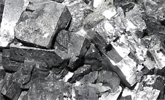

## "Hi-tech" - Les vertus du plomb
### Les vertus protectrices inattendues du plomb - Section Hi-tech
 **Khôl : les vertus protectrices  
inattendues du plomb**

Non, Dotapea n'a pas viré de bord et ne défend pas l'usage du plomb !

Cependant, comme dans le cas du mercure évoqué dans le courrier des lecteurs ([lien](courrierdeslecteurs2008b040.html#20081030dv)) et dans le corps du site ([lien](mercure.html)), on ne peut pas être univoque. Une récente publication ([lien externe](http://pubs.acs.org/doi/abs/10.1021/ac902348g)) de Philippe Walter (médaille d'argent du CNRS en 2009 [\[1 - note participants\]](hitechvertusplomb.html#note010)) nous invite à considérer avec respect et intérêt des pratiques pharmacologiques qui aujourd'hui s'avèrent pertinentes alors que notre époque aurait plutôt tendance a les rejeter _a priori_.

Attention cependant : ces découvertes sont associées à des âges très anciens où le plomb n'était sans doute pas aussi présent que dans l'environnement contemporain. On ne peut utiliser sans risques aujourd'hui une antique recette égyptienne qui correspondait de plus à un contexte sanitaire particulier.

Commençons par un procédé pharmacologique extrait d'un papyrus égyptien daté du IIème millénaire BC (le "papyrus Ebers"). Il s'agit de la formulation d'un khôl permettant de lutter contre des infections oculaires et c'est la base du travail de Philippe Walter : « _galène : 1/32 ; suc de baumier [\[2\]](hitechvertusplomb.html#note030) : 1/16 ; [calamine](calamine.html) : 1/16 ; ocre rouge \[tjerou\] : 1/64 ; minéral-sia [\[3\]](hitechvertusplomb.html#note030) du Sud : 1/64. \[Cela\] sera broyé finement, préparé en masse homogène et placé dans les yeux jusqu'à ce qu'ils guérissent parfaitement._ »

[](galene.html)

La galène (image ci-dessus) est un sulfure de plomb mêlé de métaux divers, possiblement [d'antimoine](antimoine.html) dans le cas du khôl (cf. [étymologie](khol.html) de ce mot) dont il est question ici. Encore faut-il préciser qu'il existe à travers le monde différents types non seulement de galènes mais aussi de khôls, dont une partie seulement contient du plomb et de l'antimoine. Ici nous parlons d'une variété précise, codifiée, identifiable, que l'on peut comparer à des échantillons d'époque.

En effet, en suivant les indications du papyrus, Philippe Walter et Pauline Martinetto ont reconstitué deux des trois substances blanches (la galène brute et l'ocre donnant par ailleurs les tons sombres) présentes dans les "trousses de maquillage" égyptiennes des collections du musée du Louvre : la laurionite - directement recréée à partir de la recette - et la phosgénite - un composé créé à partir de [litharge](litharge.html), de sel, de [natron](natron.html) et d'eau - qui n'existent pas à l'état naturel et nécessitent une fabrication assez lente.

Mais ne restons pas trop techniques et venons-en au coeur de la découverte.

Ce coeur se situe dans un usage médical largement répandu. Philippe Walter le rappelle : « _Il faut noter que l'ensemble de la population, hommes, femmes et enfants, de toutes classes sociales, employaient ces cosmétiques_ ». Un bémol cependant sur ce point : différentes parutions semblent confondre ce khôl d'emploi curatif avec des produits à base de céruse qui comptent parmi les maquillages les plus dangereux jamais employés ([lien](ceruse.html#foliehumaineconservatisme)).

Quelle est donc la "bonne chimie du plomb" ?

C'est la question à laquelle Christian Amatore a tenté de répondre à l'aide d'un outil "hi-tech" mis au point avec Mark Wightman (voir [note 1](hitechvertusplomb.html#note010)) car pour lui, le problème se posait ainsi : « _Quand Philippe Walter m'a parlé de cet aspect médical, j'ai pensé que les ions plomb ressemblaient à ceux du calcium, et qu'ils pouvaient induire une confusion biochimique vis-à-vis des cellules_ », les ions calcium jouant un rôle dans le système immunitaire.

C'est ce qui a été vérifié avec la "synapse artificielle" de Amatore et Wightman. Il s'agit d'une électrode de dimension micrométrique capable de mesurer les flux de molécules émises par une bactérie isolée, avec une réactivité comparable à celle d'une véritable synapse, de l'ordre de milliers de molécules par milliseconde.

Les cellules testées, des kératinocytes (cellules de la peau) ont effectivement répondu à la stimulation provoquée par un lâcher de molécules de laurionite en émettant d'importantes quantités de monoxyde d'azote, agent permettant à son tour de dilater les vaisseaux capillaires, aidant les macrophages à se rendre sur les lieux d'un éventuel festin de bactéries infectieuses.

Selon Philippe Walter, «  _S'il y avait en permanence des "patrouilleurs" macrophages dans l'oeil, les bactéries n'avaient aucune chance_ ». « _Cela confirme le rôle protecteur de ce maquillage, qui n'était pas disposé sur les cils, mais sur l'épaisseur même de la bordure de la paupière. Si bien qu'à chaque fois que l'on fermait l'oeil, celui-ci était balayé par l'onguent_ ».

De quoi mettre en déroute les bacilles des marais environnant certaines régions proches du Nil, c'est l'hypothèse soutenue.

Cette démarche de reconstitution de savoir-faire perdus n'est pas un cas isolé. Elle évoque nos retrouvailles tardives, en 2001, avec la pourpre, dont le procédé de teinture fut difficile à reconstituer après des siècles d'oubli. [Lien.](pourpre.html#petitehistoiredelapourpre)

On peut citer également les épées de Damas, le turquoise maya, l'électrolyse de Bagdad, objets parmi d'autres d'une véritable attention scientifique contemporaine.

Les Egyptiens connaissaient peut-être les terribles inconvénients d'un usage moins parcimonieux du plomb. Les Grecs et les Romains le pressentaient de manière encore très grossière à nos yeux. Ainsi Pline l'Ancien écrivait-il « _prise à l'intérieur, la céruse est un poison_ », ce qui est à strictement parler le moins que l'on puisse dire.

On sait aujourd'hui que les métaux lourds ont une malencontreuse tendance à s'accumuler dans les organismes vivants, et de plus à se transmettre au fil de la chaîne de prédation. Or, alors même que nous l'apprenions (ou le réapprenions), nous avons abondamment répandu ces substances pendant plusieurs décennies, notamment dans l'atmosphère (essences avec plomb), et un peu partout. Par exemple en Chine en 2007 on continuait à peindre avec des peintures au plomb des jouets vendus sur toute la planète ([voir affaire Mattel](blog2007.html#peintureplomb)).

L'accumulation de plomb dans les organismes et dans l'environnement contemporains rend évidemment inapplicables tels quels les procédés pharmacologiques des Egyptiens des milliers d'années plus tôt. Cependant, le travail de Philippe Walter ouvre des pistes et ouvre surtout les yeux sur l'excellence de très anciens savants dont la pensée se prolonge jusqu'aux axes de recherche les plus pointus.

Ce qui n'est peut-être pas le moindre des mérites d'un travail essentiellement interdisciplinaire, ouvert jusqu'aux bords de la paupière.

Jusqu'aux bords de la paupière

\_\_\_\_\_\_

\[1\] Un projet particulièrement interdisciplinaire.

Philippe Walter et Pauline Martinetto travaillent au Centre de Recherche pour la Restauration des Musées de France (C2RMF, CNRS) et ont utilisé une invention conjointe de l'électrochimiste moléculaire Christian Amatore (ENS, CNRS, Université Pierre et Marie Curie) et de Mark Wightman (Université de Caroline du Nord, Etats-Unis), sans parler de collaborations fréquentes avec le CEA et de sources médicales et archéologiques dont les traductions des papyrus Ebers et Smith par Thierry Bardinet (Ecole pratique des hautes études, Sciences historiques et philologiques).

Il s'agit bien d'un ouvrage de longue haleine, centré dans les sous-sols du Louvre, tout près du synchrotron Aglaé du C2RMF... et de l'esprit errant de Belphégor.

\[2\] ... et non "suc de baumir", coquille du communiqué de presse copiée-collée par toutes les grandes publications francophones.

Le baumier est un arbre produisant un suc qui fut réputé pour ses vertus ophtalmologiques dans différentes civilisations antiques et médiévales.

\[3\] Ce "sia" pourrait être une simple abréviation du traducteur pour désigner l'aragonite (voir [calcaire](calcaire.html)), parfois abrégée sous la forme SiAr ou bien [l'anhydrite](platreliant.html#anhydrite), abrégée SiAn. Il ne s'agit là que de vagues pistes, merci de nous communiquer toute information concernant le terme "minéral-sia". [Nous écrire.](ecrire.html) 

Cliquer sur le bouton « Précédent » de votre navigateur pour revenir dans le corps du texte.


 [Communication](http://www.artrealite.com/annonceurs.htm) 

[](index-2.html#20131014)


```
title: "Hi-tech" - Les vertus du plomb
date: Fri Dec 22 2023 11:27:21 GMT+0100 (Central European Standard Time)
author: postite
```
