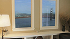

## "Hi-tech" - Verre liquide, vernis parfait ?
### Verre liquide, vernis parfait ? - Section Hi-tech
 **Winscape**

**Faire d'une oeuvre un extérieur**

Simple montage informatique réalisé par un ingénieur bricoleur génial ou véritable perspective artistique fondamentale ?

A le lire, on n'est pas sûr que l'inventeur, Ryan Hoagland, mesure véritablement les applications de son invention. Mais il n'est peut-être pas le seul (cf. [ce lien](http://www.rationalcraft.com/PressContact.html) où seul Popular Science semble avoir une approche moins réductrice).

Pour se faire une idée du potentiel, merci de cliquer tout d'abord sur le lien ci-contre.

Il s'agit d'une synthèse de technologies, d'un assemblage. Cela commence par une application détournée de la technologie WII-Remote inspirée par les travaux de [Johny Chung-Lee](http://johnnylee.net/projects/wii/), évoqués dans la page [making-of](http://www.rationalcraft.com/Winscape_MakingOf.html).

[La page de l'inventeur avec démonstration vidéo (anglais)](http://www.rationalcraft.com/Winscape.html)

[](http://www.rationalcraft.com/Winscape.html)

Le reste semble presque aller de soi :

> \* un "collier infrarouge bricolé" permet à l'ordinateur de localiser précisément le "visiteur" par l'intermédiaire d'un "Wiimote" du commerce.
> 
> \* l'ordinateur équipé d'un logiciel (Winscape, disponible sur Mac uniquement à ce jour, prix 9,95$) transmet des informations à un serveur spécialisé.
> 
> \* ce serveur dispose de plusieurs sources vidéo en très haute définition et livre à l'ordinateur client l'image à projeter sur les écrans HD (voir deux schémas [ici](https://cbonvin.fr/sites/www.rationalcraft.com/Winscape_App_files/WinscapePreferenceDisplay.png) et [ici](https://cbonvin.fr/sites/www.rationalcraft.com/Winscape_App_files/WinscapePreferenceTracking.png)) en fonction de la localisation du spectateur transmise par Winscape.
> 
> Le plus important est que le serveur n'a ainsi à transmettre qu'une partie de l'ensemble de la vidéo, de sorte que la transmission peut se faire sur une ligne à haut débit normale.

Ces fonctions (ici très résumées) existent toutes depuis longtemps. Il fallait penser à les mettre ensemble.

Là où l'inventeur se trompe, c'est lorsqu'il écrit ceci :

 _"The effect will only look correct to the one person in the room wearing the tracking device, so it's presented more as a fun party gimmick than as a feature for full-time use."_

 

 

_"L'effet semblera correct à la seule personne portant dans la pièce le périphérique de suivi, donc c'est présenté comme un gadget pour soirée plus que comme un dispositif d'emploi permanent."_

Il se trompe car il ne semble pas être pleinement conscient des ressources artistiques de son invention. Il fait pourtant d'un tableau une fenêtre. D'un tableau ou d'une photo, d'une vidéo, d'une animation en imagerie de synthèse.

Il se trompe une deuxième fois parce que le fait que son dispositif ne soit pas visible par plusieurs personnes au même endroit en même temps est peu important dans la mesure où nous sommes déjà le plus souvent seuls à regarder un écran. Comptez-vous ! Combien êtes-vous devant cette page web ?

Ryan Hoagland a inventé la fenêtre-à-voir-les oeuvres, ou l'oeuvre-qui-se-livre-à-travers-la-fenêtre. Une révolution copernicienne, un renversement du phénomène de perception de l'oeuvre.

Au-delà d'applications anecdotiques servies comme exemples autour du Golden Gate ou de Manhattan, on entrevoit une quantité infinie d'univers artistiques perçus pour la première fois **comme des extérieurs**.

> Chapeau, Mr. Hoagland.

Note : pour contacter l'inventeur par exemple pour mettre au point une installation, il suffit d'utiliser le lien en haut de cet article. Merci de nous tenir informés d'applications dont nous pourrions parler dans ces pages.

L'enjeu esthétique :  
un renversement, l'oeuvre conçue comme un extérieur


 

 [Communication](http://www.artrealite.com/annonceurs.htm) 

[](index-2.html#20131014)


```
title: "Hi-tech" - Verre liquide, vernis parfait ?
date: Fri Dec 22 2023 11:27:22 GMT+0100 (Central European Standard Time)
author: postite
```
