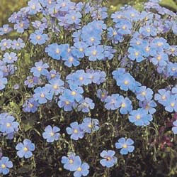
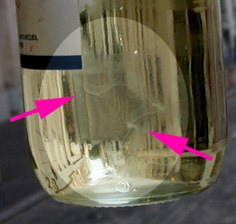
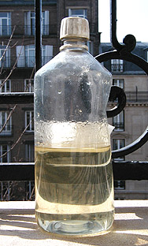
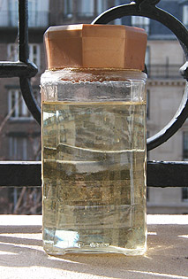

## L'huile de lin
### L'huile de lin, usage en arts plastiques et autres
 **L'huile de lin**



_Le lin est une jolie plante herbacée - une vivace à la santé fragile dont il existe quelques variétés annuelles - donnant de jolies fleurs bleues très légères suspendues au bout de longues tiges, frissonnant et voletant au moindre vent. Un champ de lin en fleur - de juin à septembre selon les variétés - est d'une beauté aérienne._

_Le genre humain doit à cette petite plante de trente à soixante centimètres de haut une impressionnante quantité de produits : huiles à peindre, patines, huile de protection, graines et farines à usage pharmaceutique, textiles vestimentaires, toiles à peindre, papiers chiffon de haute qualité, jolis bouquets et même le mot_ ligne _(du latin_ linea_). Rudolf Diesel, inventeur du moteur du même nom, testa même avec succès l'huile de lin comme carburant._

Sommaire

[Fabrication, provenance, formulation](huiledelin.html#fabricationprovenance)

[\- Formulation chimique](huiledelin.html#formulationchimique)

[Caractéristiques](huiledelin.html#caracteristiques)

[Tendances de l'huile de lin, implications](huiledelin.html#tendancesdelhuiledelinimplications)

[Qualité](huiledelin.html#qualite)

[Utilisations habituelles de l'huile de lin en peinture, problèmes rencontrés couramment et solutions](huiledelin.html#utilisationsclassiquesdelhuiledelin)

[Différents types d'huiles de lin disponibles dans le commerce](huiledelin.html#differentstypesdhuilesdelindisponiblesdanslecommerce)  :

\- [Huile de lin décolorée](huiledelin.html#huiledelindecoloree)

\- [Huile de lin clarifiée](huiledelin.html#huiledelinclarifiee)

\- [Autres huiles de lin et autres applications](huiledelin.html#autreshuilesdelin)

_Elle provient de l'Asie perso-syro-anatolienne ou du Caucase et est cultivée depuis des milliers d'années en Assyrie et en Égypte, mais son emploi comme huile à peindre remonte seulement au XVème siècle (lire l'article sur [les huiles](huiles.html))._

_**Les variétés acclimatées aux climats du Nord ("huiles de pays"), à fibres plus longues, donnent aujourd'hui surtout des textiles** ([lire l'article sur les fibres des toiles à peindre](fibres.html))._

**Fabrication, provenance, formulation**

Les huiles les plus réputées pour la peinture proviendraient de La Plata et Bombay, cependant la qualité des huiles à peindre ne dépend pas seulement de la provenance, mais aussi du mode d'extraction. Le procédé classique consisterait à sécher, puis griller légèrement les graines avant compression. Le procédé actuel serait souvent basé sur la vapeur, qui permet d'extraire davantage d'huile. En revanche la siccativité de l'huile produite serait plus faible. (informations non confirmées mais provenant de l'ouvrage de référence de Xavier de Langlais, _[La technique de la peinture à l'huile](livres.html#langlais)_)

Certaines entreprises proposent une huile de lin dont la provenance est exactement celle qui était à la disposition des anciens maîtres : le Nord de la France et la Pologne, zones de lins à fibres. Le pressage est entièrement réalisé à froid. C'est une autre logique. Le produit obtenu serait "souple et dur". Il est assez coûteux. Nous ne l'avons pas testé.

Enfin sont apparues d'autres sources d'approvisionnement : le Maroc et l'Argentine. Nous manquons d'informations à leur sujet. Merci de [nous faire part de vos expérience](ecrire.html) des huiles des différents lieux de production et des huiles "à l'ancienne".

Formulation chimique

[Important : lire en premier l'article du glossaire consacré à l'acide linoléique, l'acide linolénique et les ALC](linoleiquelinoleniquealc.html)

Le principal constituant, le dénominateur commun, de ces huiles de lin est la linoléine, soit l'ensemble des [esters](ester.html) [glycériques](glycerine.html) de l'acide linoléique ([acide gras](acidesgras.html) [diéthylénique](diene.html#diethylenique)) et de l'acide linolénique (acide gras triéthylénique).

#### CH2OH-CHOH-CH2OH \[glycérine\]  -  CH3\-CH2\-(CH=CH-CH2)3\-(CH2)6\-COOH\[acide alpha linolénique\]


#### CH2OH-CHOH-CH2OH \[glycérine\]  -  CH3\-(CH2)4\-(CH=CH-CH2)2\-(CH2)6\-COOH\[acide linoléique\]


En fait, l'huile de lin contient d'autres esters minoritaires non négligeables, notamment ceux de [l'acide oléique](oleine.html#oleique.htm). Tous ces composants sont très souvent présents dans d'autres huiles, mais celle du lin concentre une quantité particulièrement importante d'esters de l'acide alpha linolénique alors que l'acide oléique, assez saturé, est très banal et que l'acide linoléique, déjà plus intéressant, est présent dans d'autres huiles à peindre qui ne sont pas de mauvaise qualité mais sont bien moins siccatives.

[Voir aussi _Formation des triglycérides_ in _La saponification et l'estérification_](saponification.html#formationtriglyceride)

#### **Caractéristiques**

Qu'est-ce qui caractérise l'huile de lin par rapport aux autres huiles à peindre ?

> \* Parmi les huiles à peindre, c'est celle qui siccative le plus rapidement (on dit plutôt "siccativer" que "sécher", pour des raisons exposées dans [l'article consacré aux huiles](huiles.html)) bien qu'elle soit concurrencée par [l'huile de Canton](huiledenoix.html#lhuiledecanton) et quelques autres très [insaturées](saturation.html), mais celles-ci ne sont pas véritablement considérées comme des huiles à peindre.


> \* Une fois solidifiée, c'est la plus résistante et la plus souple.

> \* Elle adhère fort bien à différents métaux, dont l'or et certains fers (lire [_Exemple de la Tour Eiffel_ in _enduction des métaux pour la peinture_](metaux.html#enductiondesmetauxpourlapeinture)). Que serait la Tour Eiffel sans l'huile de lin ? Sûrement un fatras de poutres rougies non par le soleil couchant comme sur la photo ci-contre mais par une rouille qui l'aurait dévorée depuis longtemps. L'extrême résistance de cette huile et ses capacités d'adhérence sont des caractéristiques concrètes de tout premier plan.  
> Signalons également qu'elle peut servir de colle pour divers matériaux légers. Les [feuilles métalliques](feuillesmetalliques.html) notamment.
> 
> \* C'est celle pour laquelle il existe le plus de "recettes" (cuisson, addition de produits siccatifs ou autres) et de procédés éprouvés depuis cinq siècles, bien que l'huile d'oeillette et l'huile de noix la suivent de près.
> 
> \* Elle jaunit en l'absence de lumière mais s'éclaircit à nouveau en présence d'une ambiance claire. Nous y reviendrons.

Ces vertus en font la plus recherchée, en tant que liant, _pour les amateurs comme pour les professionnels_ (sauf exigences spécifiques). Sa plus grande concurrente est l'huile d'oeillette qui a aussi ses avantages et ses lettres de noblesse, mais n'a pas sa siccativité.

Densité  : 0,930 à 0,935. Point de congélation - 29°. Point d'ébullition : 387°. (données [Xavier de Langlais](livres.html#langlais))

Diluants  : [essences](essences.html) non aromatiques.

Dissolvants  : [alcool à brûler](methanol.html#lalcoolabruler) (dissolution "molle" mais relativement peu dangereuse pour un emploi ponctuel maîtrisé), [ammoniaque](ammoniac.html) et autres [alcalis](alcali.html) fort (dissolution forte, dangers importants pour le vivant), [hydrocarbures benzéniques](benzene.html) (dissolution forte, dangers extrêmes pour le vivant).

Nocivité : faible. En cas d'ingestion cette huile n'est guère bonne mais son effet n'est que celui d'un laxatif (information [Reptox](liensutiles.html#csst)). Comme avec les autres huiles y compris alimentaires, le contact avec les yeux n'est pas particulièrement conseillé. Elle n'est pas non plus un allergène notoire, même si ce cas ne relève pas de l'impossible.

Il faut par contre souligner qu'elle est inflammable, comme la plupart des huiles. Chaude ou bouillante elle peut évidemment provoquer des lésions. Ne jamais jeter de l'eau sur une huile en feu (risques de projection et de propagation).

**Tendances de l'huile de lin, implications**

_La peinture en tubes (invention du XIXème siècle) requiert une insensibilité maximale à l'absence prolongée d'éclairage ainsi qu'une siccativité compatible avec les exigences du stockage._

Or, l'huile de lin a une tendance :

> \* Comme nous l'avons dit, elle jaunit lorsque la lumière manque _mais retrouve son éclat et sa neutralité quand on la replace à la lumière_. Une opinion encore très répandue omet totalement ce dernier point pourtant crucial : l'huile de lin fraîche ou sèche réagit à la lumière de manière généralement **réversible**.

Certaines "traditions" en relation avec ce sujet sont évoquées dans l'article consacré à l'huile d'oeillette (_[Critique d'une tradition de broyage](huiledoeillette.html#critiquedunecertainetraditiondebroyage)_).

Dans le cas des peintures en tubes seulement, il est tout à fait logique que la plupart des fabricants comme des acheteurs souhaitent que la pâte non exposée à la lumière pendant des semaines, des mois ou des années, soit utilisable telle quelle à la sortie du tube, juste au moment de peindre. L'huile de lin ne suscite véritablement des réserves que dans ce cas précis du conditionnement en tube et dans celui où le peintre sait d'avance que le tableau sera durablement conservée en milieu obscur.

_**Même si l'huile d'oeillette, l'huile de carthame et quelques autres ne doivent pas être dénigrées, nous devons signaler que rares sont les fabricants qui ne se sont pas lancés, à tort ou à raison, dans une entreprise de bannissement de l'huile de lin.**_

C'est dommage car l'emploi d'autres huiles peut poser des problèmes

> \* _de siccativité_ : si le produit doit effectivement pouvoir supporter le stockage, qu'en est-il de l'allongement des temps de séchage des tableaux ? [L'huile d'oeillette](huiledoeillette.html), [l'huile de carthame](huiledecarthame.html), [l'huile de tournesol](autreshuiles.html#lhuiledetournesol), [l'huile de soja](autreshuiles.html#lhuiledesoja) sont d'excellentes huiles à peindre (comme liants majeurs ou mineurs selon les cas car les mélanges sont possibles), mais elles nécessitent une autre approche. Pourtant, soyons juste, il faut reconnaître que la plupart des fabricants traitent leurs huiles avec assez de soin pour que la différence de siccativité avec l'huile de lin soit finalement moins sensible que l'on ne pourrait s'y attendre.
> 
> \* _de jeunesse_ : de nouvelles huiles (carthame, soja) sont apparues sans que l'on connaisse véritablement leurs propriétés de conservation à long terme. Ne jetons pas la pierre aux fabricants : leurs recherches constituent des apports techniques importants pour le _procédé à l'huile_.

Voir à ce sujet l'article [Séparer ou non liants et pigments](separerounon.html).

**Qualité**

Charge électrochimique

Qu'elle soit employée dans le cadre d'un travail artistique, décoratif ou simplement protecteur, une huile de lin ne devrait jamais être [acide](acides.html).

Une démarche s'impose : le test au [papier tournesol](papiertournesol.html).

Ceci n'est pas un détail insignifiant : une huile acide risquerait de dégrader à court ou moyen terme certains supports, certains pigments et certains médiums.

Netteté et coloration

La netteté d'une huile est importante. Un produit tel que celui-ci, vendu comme huile de lin décolorée en région parisienne en 2006 peut susciter questionnement :



Pourquoi cette sorte de "nuage de fumée" atypique dans un produit neuf où aucun objet n'a trempé ? Une substance étrangère, une dégradation ou bien une particularité du traitement est évidente. Dans ce cas précis, on constate une autre anomalie : une teinte un peu "jaune citron" (peu sensible à l'image), mais on ne peut en tirer aucune conclusion.

Ni paranoïa ni prise de risque

Il faut le dire, certaines anomalies - notamment de coloration - ne signifient pas nécessairement qu'un produit est de mauvaise qualité. Mais il vaut mieux effectuer des vérifications (notamment olfactives) et demander au marchand des explications aussi claires que le produit doit l'être car celui-ci, que vous l'utilisiez comme liant ou comme adjuvant, est une clé de voûte, sur le plan technique, de votre travail de peinture. Le sujet est sérieux et mérite une certaine attention.

Odeur et contrefaçon

> Pour inciter encore davantage à une raisonnable prudence, rappelons que [Xavier de Langlais](livres.html#langlais) écrivait déjà que certaines huiles de lin falsifiées sont mêlées d'huile de poisson. Et de fait, _**ATTENTION :** toute huile de lin ayant une odeur de poisson est suspecte. Un cas nous a rapporté en 2006, en France_ (il ne s'agit pas du flacon évoqué ci-dessus). L'information donnée par le Maître armoricain est donc tout à fait d'actualité. De telles contrefaçons sont des délits qui n'ont rien d'anodin et qui intéressent directement les [autorités concernées](liensutiles.html#contrefacon).

Fournisseur et qualité : les bonnes et les mauvaises surprises

_Liquide troublé, coloration bizarre, mauvaise odeur_ - sans parler de l'acidité que l'on ne peut pas tester en magasin - : voilà des paramètres à vérifier pour éviter les mauvaises surprises. Mais pour nous en réserver de bonnes, évitons aussi certains a priori : les huiles de lin vendues dans des magasins "demi-gros BTP" ne doivent pas forcément être dédaignées, y compris pour des travaux artistiques. En fait, tout est possible.


Reconnaître une bonne huile, c'est simple

Une huile claire, nette se reconnaît au premier coup d'oeil. On peut tolérer un peu plus de coloration pour les [huiles "clarifiées"](huiledelin.html#huiledelinclarifiee). Sur la photo ci contre (_huile décolorée à gauche, clarifiée à droite_), l'huile décolorée a été claircée au soleil (voir [cuisine des huiles](cuisinedeshuiles.html)) et commence à présenter un niveau très correct de décoloration, ce qui lui donne une teinte encore chaude, pas "jaune citron". A droite, l'huile clarifiée n'a pas encore été suffisamment claircée mais peut déjà être considérée comme utilisable pour la peinture. L'huile décolorée est parfaitement prête à l'emploi.

Ne pas demander des miracles

Pour terminer sur le chapitre de la qualité, signalons que certaines huiles vendues sous conditionnement plastique opaque sont d'une qualité vraiment incompatible avec la peinture. Elles sont destinées à protéger ou teinter les bois, les terres cuites, etc.

**Utilisations habituelles de l'huile de lin en peinture, problèmes rencontrés couramment et solutions**

L'huile de lin sert avant tout comme liant. Peu présente dans les tubes, comme on l'a dit ci-dessus, elle est généralement la pièce majeure de l'atelier des peintres pratiquant l'huile en séparant liant et pigments (lire l'article _[Séparer ou non liants et pigments](separerounon.html)_).

Autre utilisation de premier plan : certains peintres l'emploient pure comme adjuvant, comme médium. Certes, cela accroît le satiné et la transparence, mais aussi, RADICALEMENT, les temps de séchage, sans parler des risques d'accident pictural. Beaucoup de débutants sont littéralement piégés par ce phénomène. Il n'est pas rare qu'ils pensent que le produit est défectueux. En fait, l'emploi pur est à réserver aux peintres qui souhaitent pouvoir travailler dans le frais pendant une période allongée. Mais ce n'est pas une bonne solution pour plusieurs raison :

> \* l'excès d'huile de lin provoque d'horribles plissements au séchage - ce qui n'est pas le cas de toutes les autres huiles à peindre -,
> 
> \* il est beaucoup plus judicieux d'employer des huiles moins siccatives en quantités d'autant moins importantes.

Enfin, un cas courant consiste à réaliser un mélange huile de lin + essence de térébenthine à utiliser comme médium. La proportion 50/50, très utilisée, est vraiment très grasse. Il est important de garder à l'esprit que l'huile est déjà présente dans la peinture !

La seule justification valable de l'adjonction d'huiles à peindre au-delà des questions d'allongement du temps de séchage, c'est la compensation d'une dilution trop massive. Une peinture trop diluée est fragilisée. Il y a lieu dans ce cas de réintroduire du liant. Cependant, le plus souvent on peut se servir de [résines](gommesetresines.html) naturelles diluées dans [l'essence](essences.html) en atelier (voir _[Préparations "faites maison"](preparationsfaitesmaison.html)_ et par exemple _[Le médium dammar](mediumdammar.html)_). De telles préparations, si elles ne sont pas trop cireuses, ne sont pas réellement "siccatives", comme on l'entend dire parfois, mais allongent beaucoup moins les temps de séchage que les médiums trop oléagineux qui continuent à être utilisés beaucoup trop systématiquement. Par ailleurs, les résines semblent favoriser généralement une siccativation de bonne qualité structurelle.

Lorsque l'apport d'huile paraît indispensable, il doit être progressif, par couches de plus en plus grasses (fameuse règle du _[gras sur maigre](grassurmaigre.html)_), le temps de siccativation jouant cependant le rôle majeur. On adjoint couramment à l'huile un [liant émulsion](liantsemulsions.html) et/ou éventuellement un [siccatif](siccatifs.html) métallique (qui rentrent fréquemment dans la composition des médiums du commerce) afin de ne pas se trouver confronté à des temps de séchage disproportionnés.

**Différents types d'huiles de lin disponibles dans le commerce**



_**Huile de lin décolorée**_

Traitement artificiel par filtrage au travers de terres ou de sables. Traitement efficace mais pouvant être amélioré. Voir ci-contre une huile décolorée achetée dans le commerce puis traitée au rayonnement solaire.

L'évolution de la coloration est "foudroyante" lorsqu'elle est exposée au soleil. Quinze jours suffisent pour que la décoloration soit apparente. Mais au bout d'un an à peine, le processus cesse d'évoluer de manière significative, du moins en apparence. On remarque que le flacon s'est déformé sous l'effet d'une baisse de pression à l'intérieur. Cela signifie que le processus de [siccativation](sechagesiccativation.html) par incorporation d'oxygène a commencé. Aussi faut-il rester raisonnable en ce qui concerne le temps d'exposition. Si celui-ci est trop long, l'huile se transforme trop pour être employée comme liant à peindre. Lire _[La cuisine des huiles.](cuisinedeshuiles.html)_

**_Huile de lin clarifiée_**

Traitement naturel : repos prolongé à l'abri de l'air, en exposition au soleil.

En théorie, d'après les fabricants, l'huile de lin clarifiée est 



 \* plus jaune que la version décolorée artificiellement, 

 \* moins photosensible donc plus stable, 

 \* plus siccative.

Il y a de quoi émettre quelques réserves au sujet de ces affirmations.

Il est vrai qu'à l'achat, l'huile clarifiée est nettement plus jaune que l'huile décolorée. Par contre elle est vraiment photosensible car elle finit par devenir encore plus claire que l'huile décolorée à traitement équivalent aux rayons solaires (compter une quinzaine de jours). Cela tend à prouver qu'elle a été insuffisamment exposée à l'astre du jour lors du processus de fabrication industrielle, mais ce n'est pas un défaut rédhibitoire.

La réputation de meilleur siccativité qui lui est généralement attribuée n'est pas usurpée, mais elle n'est pas spectaculaire.

**_Autres huiles de lin et autres applications_**

Mentionnons [les huiles cuites](autreshuiles.html#lhuiledelinbouillie) et la [standolie](standolie.html) (stand-oeil), traitées séparément.

Il existe aussi des huiles de lin préoxygénées, utilisées en peinture décorative ou industrielle. Voir _[Huiles soufflées](autreshuiles.html#huilessoufflees)_.

Dans le domaine du **traitement non artistique des bois (protection)**, on utilise des huiles de lin de qualité souvent inférieure. Elles sont généralement conditionnées dans des bouteilles de plastique opaque. En peinture murale tout comme dans le domaine artistique, ces huiles impures sont unanimement déconseillées, sauf effet recherché.

Certaines **peinture à la chaux, à la caséine, à la cire, différentes patines, etc.** et diverses techniques des arts décoratifs feraient grand profit de l'adjonction d'huile de lin - parfois pigmentée - jouant en quelque sorte le rôle de "fixatif" (pour la [chaux](chaux.html#badigeonlaitdechaux) en particulier) et de liant auxiliaire solidifiant et assouplissant ou encore comme vernis. Attention : cette solution est à éviter pour tous les liants alcalins (chaux, caséine et plâtre essentiellement) car elle produit une réaction chimique aux effets désastreux à moyen ou long terme ([voir Saponification](saponification.html)).

Certains peintres l'emploient comme **substitut de vernis** pour la peinture à l'huile ([lire passage _in_ Les vernis définitifs](vernisdefinitifs.html#adjonctionfinaledunefinecouchedhuile)).

Par ailleurs, certains **vernis** très particuliers à [l'alcool éthylique](alcools.html#ethanolpur) contiendraient de l'huile de lin ayant fonction d'assouplir les résines et de tempérer l'agression des surfaces. Cette information n'est pas confirmée et pourrait être douteuse car l'éthanol ne se mêle pas plus à l'huile que l'eau pure.

**On trouve encore d'autres utilisations de l'huile de lin :**

> \* en adjonction dans certains [stucs](stuc.html), [staffs](staff.html) et produits plâtreux moulables. Elle est en effet protectrice, imperméabilisante, chimiquement neutre (si elle est de qualité correcte), à la fois solidifiante et assouplissante. Les utilisations conjointes avec des produits plâtreux et poreux sont réalisées dans différents domaines ([détrempes murales](temperadetrempes.html#ladetrempe), [gessos](fabriquerungesso.html), etc.). Cependant, là aussi, il y a danger de saponification et le [vinyle](vinylegloss.html) est en train de la remplacer non sans avantages.
> 
> \* comme composant majeur des [mixtions](mixtion.html) à dorer,
> 
> \* comme liant majeur du [linoléum](linoleum.html), utilisé en gravure,
> 
> \* l'emploi dans le [mastic de vitrier](mastic.html), substance pouvant trouver quelques applications en arts plastiques.

Lire absolument l'article _[Cuisine des huiles](cuisinedeshuiles.html)_.


 [Communication](http://www.artrealite.com/annonceurs.htm) 

[](index-2.html#20131014)


```
title: L'huile de lin
date: Fri Dec 22 2023 11:27:22 GMT+0100 (Central European Standard Time)
author: postite
```
