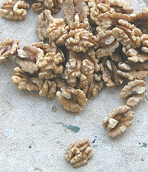

## L'huile de noix
### L'huile de noix, usage en peinture et arts plastiques
 **Les huiles de noix**  _Certains peintres l'utilisent toujours de nos jours, souvent comme composant de médiums._

Caractéristiques générales

Elle est pratiquement incolore. Sa fluidité n'a rien de très particulier contrairement à ce qu'affirment certains auteurs (sauf variétés particulières, peut-être).

Sa siccativité se situerait entre celle de l'huile de lin et celle de l'huile d'oeillette. Elle peut être augmentée par l'adjonction de [litharge](litharge.html). D'ailleurs, c'est très souvent le cas, l'huile de noix servant beaucoup plus dans la fabrication d'adjuvants que comme huile à peindre.

L'huile de noix a acquis, à tort ou à raison, la réputation de rancir (jaunir, devenir odoriférante), à cause de sa forte teneur en acides gras essentiels (notamment en acide [linolénique](linoleiquelinoleniquealc.html#linolenique)), dit-on. Certains opposent une opinion plus favorable : elle jaunirait moins que l'huile de lin. Parmi nos contacts, nul n'a constaté de rancissement. Si vous avez expérimenté ce phénomène, merci de [nous le faire savoir](ecrire.html).

 Un premier témoignage donne des éclaircissements  
[Lien in Courrier des Lecteurs](courrierdeslecteurs2011c050.html)

[L'huile de lin](huiledelin.html) jaunit dans l'obscurité mais redevient limpide à la lumière. L'avantage comparé de l'huile de noix consisterait donc en une absence de photosensibilité combinée à une siccativité assez bonne, ce qui la ferait ressembler à [l'huile d'oeillette](huiledoeillette.html) ou à [l'huile de carthame](huiledecarthame.html) ainsi qu'à quelques autres.



Attention à la qualité

> \* la qualité "_huile de cerneaux de noix **émondés**_" (triés, débarrassés des impuretés ligneuses, une qualité alimentaire, comme sur la photo ci-contre) est bien supérieure à la variété ordinaire - souvent chauffée au pressage - qui est acide, sombre et moins siccative. C'est la variété "cerneaux émondés" qui jaunit le moins.
> 
> \* le terme "huile de noix vierge" est trop vague. On ignore, avec une telle appellation, si les cerneaux ont été ou non émondés.
> 
> \* certains fabricants proposent une _huile de cerneaux de noix émondés puis cuite à la [litharge](litharge.html)_, soit une huile noire de bonne qualité. Il s'agit d'un produit d'origine ancienne évoqué [ci-dessous.](huiledenoix.html#lhuilenoire)

Dans tous les cas, une démarche s'impose : le test préalable au [papier tournesol](papiertournesol.html).

**L'huile noire**

A base d'huile de noix et de siccatif ([litharge](litharge.html)), elle semble avoir souvent été le liant des fonds rouges et gris de la Renaissance, ou du moins un adjuvant important. Elle autoriserait aussi des "[jus](jus.html)" très siccatifs.

**Une recette :**

> \* huile de noix (8 parts)
> 
> \* litharge (2 parts)

Les mesures sont exprimés en poids et non en volume.

Cette huile aurait été utilisée très tôt par certains maîtres vénitiens en conjonction avec de la cire, limitant l'aspect coulant de ce liant effectivement lourd à cause de la présence de plomb. Il s'agit du fameux [médium vénitien](mediumspourlhuile.html#mediumgelvenitien). De nos jours encore, il n'est pas rare qu'un professeur de peinture à l'huile préconise un adjuvant cireux (parfois des vernis) pour une huile noire.

De même, des recettes flamandes mettent une huile noire à contribution dans la fabrication de médiums, notamment le célèbre [médium flamand](mediumflamand.html) à base de [résine mastic](resinemastic.html).

Caractéristiques physiques de l'huile de noix

Mises à part les variétés particulières évoquées ci-dessus, l'huile de noix communément utilisée en peinture a une densité de 0,926 à 0,927. Point de congélation : -27°. Point d'ébullition proche de celui de l'huile de lin, vers 386°. (données [Xavier de Langlais](livres.html#langlais)).

Les diluants sont ceux de toutes les huiles : les [essences](essences.html) principalement.

L'huile de Canton et l'huile d'abrasin : huiles d'autres noix

Cette section est ponctuée de verbes au conditionnel.  
L'enquête est en cours.  
Nous espérons pouvoir présenter prochainement des informations plus précises.

Huile de Canton, huile d'abrasin, huile de bois de Chine ou huile de bois, huile de _toung_, de _tung_ (orthographe utilisée dans les documents légaux) ou de _tang_ -, il semble que ces appellations confuses et probablement erronées désigneraient souvent le même produit en Occident - alors que ce n'est peut-être pas le cas en Chine (cf. _[L'huile de bois de Chine](autreshuiles.html#lhuiledeboisdechine))_ ni dans le reste de l'Asie et de l'Océanie.

Il s'agirait de **l'huile de la noix de l'arbre _tung_** ou plutôt de différentes espèces d'aleurites (voir [ci-dessous](huiledenoix.html#precisionsaleurite)**).** Elle est utilisée notamment pour réaliser des vernis de haute qualité en décoration. On mentionne également sa présence dans certains vernis marins et certaines encres, ainsi que dans des papiers imperméabilisés. Très brillante, elle serait fort solide. Elle présente une particularité remarquable : ester de l'acide élaéostéarique, elle dispose de trois doubles liaisons et tire de cette [insaturation](saturation.html) une siccativité particulièrement remarquable. Une cuisson à 200-300°C, pratiquée lors du conditionnement du produit commercialisé permettrait de réduire en partie cette siccativité tantôt pénalisante, tantôt recherchée.

D'odeur désagréable, elle serait non toxique mais pourrait présenter certains dangers d'ignition. [Lire passage _in_ Les huiles.](huiles.html#dangerignition)

Le produit vendu en Occident sous l'intitulé "huile d'abrasin" correspondrait à une huile destinée à la finition et la protection du bois qui serait particulièrement résistante à l'eau et aux [alcalis](alcali.html) (donc à l'eau de mer en effet) et protègerait de la rouille les métaux ferreux (auxquels elle adhèrerait bien).

Elle pourrait être polie et cirée ou traitée à l'aide d'une "[standolie](standolie.html) d'huile d'abrasin" (huile d'abrasin polymérisée dans l'absence d'oxygène).

L'huile de bois de Chine correspondrait à un autre arbre de la même famille des aleurites, qui fournissent toutes des huiles fort siccatives issues des graines de ces végétaux. Il semble qu'il existerait cinq variétés de cette branche des euphorbiacées, poussant naturellement de l'Asie centrale à l'Extrême Orient en passant par la Malaisie (bancoulier) et l'Océanie. Elle est aujourd'hui cultivée en d'autres lieux.

Dans tous les cas semble-t-il, à partir des graines broyées, on obtient une huile de bois noire par un processus de torréfaction et un huile blanche, réputée plus neutre chromatiquement que l'huile de lin (information non confirmée), sans torréfaction.


 [Communication](http://www.artrealite.com/annonceurs.htm) 

[](index-2.html#20131014) 


```
title: L'huile de noix
date: Fri Dec 22 2023 11:27:22 GMT+0100 (Central European Standard Time)
author: postite
```
