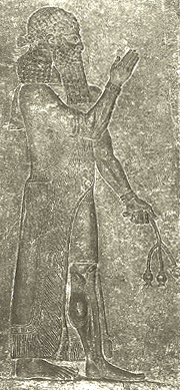

## L'huile d'oeillette
### L'huile d'oeillette, usage en peinture et arts plastiques
 **L'huile d'oeillette**  

**Caractéristiques générales**

Elle ne jaunit presque pas. Elle n'a pas le comportement photosensible de [l'huile de lin](huiledelin.html). Elle est réputée plus claire mais dans les faits, une huile de lin bien claircée (voir [cuisine des huiles](cuisinedeshuiles.html)) est encore plus claire. Cependant, nous n'avons pas encore essayé de claircer une huile d'oeillette, aussi la comparaison s'arrêtera-t-elle là pour l'instant. En tout cas, un atout majeur de ce produit semble bien être de ne pas varier en fonction de la luminosité ambiante.

Elle a longtemps été utilisée - et l'est encore dans une large mesure - pour le broyage des couleurs en tube, avant et après l'apparition des huiles de [carthame](huiledecarthame.html) et de [soja](sojahuile.html) entre autres.

Elle a deux particularités spécifiques bien connues :

> \* elle sèche beaucoup plus lentement que l'huile de lin. Certaines huiles d'oeillette resteraient même indéfiniment poisseuses (information non confirmée). Pour cette raison, selon [Xavier de Langlais](livres.html#langlais), les fabricants y incorporeraient (parfois ?) du [manganèse](manganese2.html).  
> Nous savons par ailleurs que la lente siccativation de l'huile d'oeillette est précisément ce qui séduit certains peintres souhaitant pouvoir travailler le plus longtemps possible dans le frais.
> 
> \* elle ne donnerait pas des couches aussi solides à sec : elle aurait moins de texture, de fibre. Il faut cependant spécifier que l'oeillette - de bonne qualité - n'est tout de même pas fragile, comme les oeuvres des maîtres anciens en témoignent.

Elle est moins grasse que l'huile de lin ([lire tableau des indices d'iode in La saturation](saturation.html#indicediode)).

**Caractéristiques physiques**

Densité : 0,925. Point de congélation : -18°. Point d'ébullition très voisin de celui de l'huile de lin, vers 385° (données Xavier de Langlais)

N'hésitez pas à tester l'acidité de votre huile à l'aide de [papier tournesol](papiertournesol.html). Elle devrait être bien neutre.

Les diluants sont ceux de toutes les huiles : les [essences](essences.html) principalement.

**Critique d'une certaine tradition de broyage**

Une tradition - surtout orale - recommande l'emploi d'huile d'oeillette pour les couleurs les plus claires ou du moins les blancs et les bleus. L'huile de lin ne devrait tout de même pas être réservées aux seules teintes foncées, surtout quand on sait que son jaunissement (qui n'advient que sous certaines conditions) est réversible et qu'une huile bien claircée est d'une clarté limpide assez tenace ([Lire passage in _L'huile de lin_](huiledelin.html) et _[La cuisine des huiles](cuisinedeshuiles.html)_). On peut d'ailleurs soupçonner dans ce point de vue des préoccupations dont le rapport avec la qualité de la peinture est secondaire. Quoiqu'il en soit, on ne peut en aucun cas cautionner une pratique consistant à négliger les couleurs sombres et/ou à ignorer le conditionnement préliminaire des liants.

La solidité de la pâte, un temps de séchage correct en adaptation au pigment, une couche sèche de bonne qualité, voici des arguments plus déterminants dans le choix de l'huile, sauf pour qui réserve à ses tableaux le destin peut-être un peu triste d'un lieu d'exposition obscur, qui effectivement aurait pour résultat de faire jaunir l'huile de lin. En ce cas, le choix de l'huile d'oeillette s'impose avec évidence, mais il ne faut en aucun cas négliger les autres motivations qui ont amené de nombreux maîtres du Nord à préférer cette huile avec raison car en effet, leurs oeuvres se sont très bien conservées.

IMPORTANT : l'utilisation combinée d'huiles ne siccativant pas à la même allure peut donner de très mauvais résultats si une étude en liaison avec le pigment employé n'est pas réalisée auparavant : le risque de plissement et de craquellement est très élevé si vous posez une huile siccativant vite par-dessus une huile siccativant lentement (toujours en tenant compte des pigments en présence), sauf si la siccativation de la couche inférieure est complètement achevée, ce qui représente des années voire des décennies.

**Emploi dans les émulsions**

Il est très recommandé par [Xavier de Langlais](livres.html#langlais).

En effet, la présence d'un autre liant, aqueux donc facilitant la [siccativation](sechagesiccativation.html) (sauf empâtement épais), tenant bien, pourrait être de nature à compenser ce qui peut passer pour le point faible de l'oeillette, la siccativation plutôt lente.

**Une quasi inconnue : l'huile d'oeillet**

Elle n'a en fait aucun rapport avec l'huile d'oeillette.

[Lire texte in Les autres huiles.](autreshuiles.html#lhuiledoeillet)


 [Communication](http://www.artrealite.com/annonceurs.htm) 

[](index-2.html#20131014)


```
title: L'huile d'oeillette
date: Fri Dec 22 2023 11:27:22 GMT+0100 (Central European Standard Time)
author: postite
```
