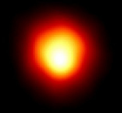
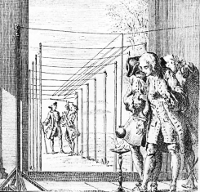
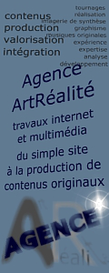
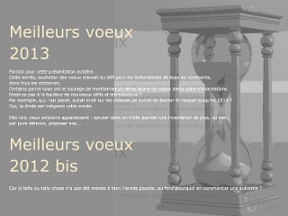
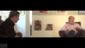

## Dotapea - Blog du réseau ArtRéalité
### Index, page d'accès de Dotapea - blog actus, conseils
  **[](rss.html)**

**[Au fil des dépêches](rss.html)**


**[Naviguer sur Dotapea](players/plandusite/naviguersurdtp/index.html)**

Actualités

(blog éditorial du réseau ArtRéalité)

[\[accès infos permanentes\]](index-2.html#infospermanentes)

[\[conseils d'utilisation en marge gauche\]](index-2.html#conseils)

14/10/2013

> **Fin**
> 
> L'énorme bug de la messagerie [mentionné précédemment](index-2.html#20131003) n'a pas été corrigé par OVH, le gestionnaire du serveur dédié qui nous sert de support informatique depuis sept ans pour les sites Dotapea.com et ArtRéalité.com, mais nous avons pu en quelque sorte le court-circuiter. Donc vous pouvez de nouveau nous écrire.
> 
> Mais vous ne le devriez pas.
> 
> Cette affaire est pour nous la goutte d'eau. Avant d'en dire plus et après douze ans d'existence, prenons le temps d'un petit retour sur le passé.
> 
> Il y a eu avant tout le mépris des annonceurs et partenaires potentiels français depuis neuf ans. Comprenez que pour ces personnes, l'Internet est aux médias ce que le langage Sms est à la langue française. Dit autrement, "le ouèbe sa vo rien" même à 12 000 pages lues par jour, sauf à payer "une présence via Gougueule paske c un nom". Que voulez-vous faire ? On a pris le temps de les connaître, les commerciaux français de ce métier (comme des autres métiers, souvent) : des réactionnaires caricaturaux, binaires, qui façonnent leurs propres échecs. Pardon de régler des comptes, mais ces acteurs-ci sont les principaux responsables de cette fermeture, ce serait donc bien bête de les oublier au moment de baisser le rideau.
> 
> Et puis est survenue cette année une baisse d'audience alors que nos contenus s'étaient étoffés. De notre point de vue c'est choquant, difficile à comprendre. Elle pourrait être imputée aux succès croissants de Facebook et de Twitter.
> 
> Ecrire sur Facebook, c'est travailler pour Facebook. Tracking commercial effréné, pub et auteurs bénévoles, voilà les ressorts. Twitter ou Google+ n'existeraient pas davantage sans les contenus naïvement apportés par les internautes à ces géants cotés en bourse dont ils ont entièrement fait la fortune. Donc un transfert de nos contenus sur ces médias serait par essence inadmissible, délirant.
> 
> Nous garderons en ligne les sites A.R. une dizaine de mois si Ovh est encore capable d'ici-là de maintenir un serveur dédié et si les attaques virales de l'an dernier (identifiées en provenance de l'île de Hainan, République Populaire de Chine et haut lieu réputé de la piraterie politique et économique) ne se renouvellent pas. Eh oui, repensons au gouvernement chinois pour qui les mots "Aï weï Weï Liberté Démocratie Chine Tibet Ouigour Xinyang" mentionnés quelquefois l'an dernier sont un signal suffisant pour attaquer très violemment une cible informatique y compris à l'étranger, au plus parfait mépris du droit international. A ceux-là l'on peut proposer, comme jadis un autre à Fontenoy - non loin d'ici -, de tirer les premiers, là c'est quand ils veulent pendant ces dix prochains mois. Et ce serait un beau jour pour mourir. Nous verrons bien.
> 
> En douze ans on n'a peut-être pas tout essayé, mais beaucoup de choses et pour quoi in fine ?
> 
> Pour de bons moments, plein d'histoires marrantes, parfois éclatantes comme le soleil, insoupçonnées, oui oui, et moins drôles aussi, atterrantes, tristes, mais toujours très intenses, et de l'autre côté du média, la fidélité des lecteurs fut très souvent notre lumière dans ce travail un peu souterrain en apparence. [Ce travail ressemble un tout petit peu à celui d'un alchimiste.](http://www.universalmusic.fr/alain-bashung/video-clip/alain-bashung-Faites-Monter-(Version-Chloe)/)
> 
> Enfin, c'est beaucoup trop d'argent dépensé sans retour, nous pouvons le dire. Ce n'est plus possible. Pas très normal non plus.
> 
> Sans parler du temps passé évidemment, Dotapea et ArtRéalité coûtent leur prix. Certes rien à voir avec les budgets des médias classiques mais notre réseau n'est pas fait de millionnaires. Faire appel aux dons comme le fait Wikipedia, non, c'est hors de nos intentions et pour nous à la limite du rebutant : nous ne sommes pas des ONG, prétendre à cela serait évidemment une imposture.
> 
> Nous n'étions pas de cette école. Notre idée directrice était plutôt que tout cela évolue naturellement, en trouvant de vrais partenaires économiques et non en rançonnant les lecteurs d'une manière ou d'une autre. Un échec est un échec, difficile de ne pas s'en rendre compte en 2013. L'énergie dépensée ira dorénavant ailleurs.
> 
> Merci, merci infiniment à tous pour l'océan de vos présences - vous avez été si nombreux ! - et aux fidèles en particulier ou à ceux qui nous ont écrit, que l'on a rencontrés parfois. Merci infiniment à celles et ceux qui ont été des participants actifs, en premier lieu à Jean-Louis, l'ami physicien qui a tant apporté à ces pages notamment via les Dialogues de Dotapea.
> 
> C'était une magnifique aventure grâce à vous, mais elle est sans lendemain dans ce contexte français de blocages plus que persistants et de montée des extrêmes. Nous espérons avoir apporté un tout petit quelque chose et nous souhaitons la meilleure chance à ceux qui prendront le relais. S'il n'y en a pas, tant pis, suivons le conseil de David Bowie et ne restons pas moroses même quand un peu tout autour de nous se casse la.... : [Let's Dance !](http://www.youtube.com/watch?v=N4d7Wp9kKjA)

Emmanuel LUC,

éditeur internet français.

Namur, Belgique.

3/10/2013

> Enorme bug de la messagerie
> 
> Une anomalie est apparue : nous ne recevons presque plus de messages. Il nous a fallu du temps (quinze jours au total) pour nous en apercevoir et pour le confirmer alors même que le travail sur les sites continuait. Le bug est en cours de traitement par la société OVH qui gère le serveur dédié à Dotapea/ArtRéalité.
> 
> Malheureusement, nous n'avons aucune précision de la part de cette entreprise sur le temps de réparation. Quelques jours, une semaine, plus ? Aussi pour le moment, ne nous écrivez pas.
> 
> Cette anomalie sans précédent en douze ans tombe fort mal à propos puisque nous venions de lancer une campagne de demande d'aide. Un message sera placé sur ce blog dès que la situation normale sera rétablie.

23/9/2013

> Les couleurs naturelles d'une campagne lointaine
> 
> La lumière d'un autre soleil et son filtrage par une autre atmosphère que la nôtre donneraient au mécanisme naturel de photosynthèse d'autres choix.
> 
> Les rayons de fortes et de faibles longueur d'ondes, le rouge et le bleu, sont absorbés par les chlorophylles "a" et "b"  (la b étant un peu plus centrée, la a débordant sur les ultraviolets). Mais selon une [étude du Godard Institute](http://www.nasa.gov/centers/goddard/news/topstory/2007/spectrum_plants.html) de la NASA, il pourrait en être autrement sur des mondes autrement éclairées.
> 
> « _"Nous pouvons identifier la longueur d'onde du candidat le plus fort pour la couleur dominant la photosynthèse sur une autre planète", dit Nancy King, auteur principal de l'étude et biométéorologiste à l'Institut Goddard pour les études spatiales \[GISS\] de New York._ »
> 
> (« _"We can identify the strongest candidate wavelengths of light for the dominant color of photosynthesis on another planet," said Nancy Kiang, lead author of the study and a biometeorologist at NASA's Goddard Institute for Space Studies, New York._ »)
> 
> La biochimie de la chlorophylle est donc adaptable. L'est-elle par un jeu darwinien, au fil de l'évolution ? L'article ne le précise pas (mais le suggère). Par contre il indique que les "bandes absorbantes" peuvent théoriquement s'étendre non seulement sur toutes les couleurs mais aussi jusque dans l'infrarouge. Autre point fort de l'étude, le fait que parmi les couleurs qui parviennent à la surface de notre terre, le vert est aussi un peu moins abondant que le rouge et le bleu. Cela concorde : le moins abondant est le moins absorbé, il y a donc adaptation. Ce qui autorise à penser que la chlorophylle se serait également adaptée, mais autrement, dans un milieu lumineux différent. Par exemple en absorbant plus d'infrarouges parce que ce rayonnement est plus intense dans cet ailleurs, ou pourquoi pas plus de rouge et de vert, nous offrant des plantes bleues ?
> 
> N'est-ce pas, à bien y réfléchir, une belle nouvelle ? Celle-là promet des mondes vivants d'aspect non uniforme mais différent et varié, voire exotique comme le gazon orangé de l'image de Doug Cummings, ci-contre. Et pourtant, aussi exotiques que puisse paraître les couleurs de ces paysages, elles sembleraient sans doute très banales et pour le coup, "toutes naturelles", à d'éventuels plasticiens natifs.
> 
> Amusant n'est-ce pas ? Parce que c'est probablement vrai.

[](images/plantesautresmondes.jpg)

\[cliquer pour agrandir\]

_A quoi les plantes ressembleraient-elles sur d'autres mondes ?_

Caltech illustration par Doug Cummings

22/9/2013

> AJUSTONS !
> 
> Signe de la reconnaissance d'un besoin de plus d'organisation et de précision, Dotapea fait, à l'aide de son cher espace de communication, une demande d'aide à son lectorat. Pour deux raisons :
> 
> > \* devant Google qui semble depuis quelque temps déjà référencer notre site n'importe comment - cf. les 260 millions de résultats parfaitement débiles à une simple recherche sur le mot "Dotapea", à tester vous même dès aujourd'hui -, il nous semble utile et même nécessaire de multiplier les liens sans quoi nous risquons de devenir invisibles et inaudibles, même si l'on en est encore loin à ce jour grâce à votre fidélité. C'est là que vous, amis lecteurs, pouvez jouer un rôle actif.
> > 
> > \* la relecture, la bonne tenue des pages du site, c'est l'affaire d'un groupe de lecteurs/correcteurs. Là aussi nous faisons appel à votre secours.
> 
> Enfin, entrer dans un dialogue avec des personnes coopérant à ces projets et connaissant donc bien Dotapea nous permettrait de trouver de bonnes suggestions, de potasser de nouveau les avant-projets et projets actuels, bref de travailler de manière plus "ample" et "moins floue", si ces mots conviennent.
> 
> Pour plus d'informations, cliquer [ici](communication1.html) ou sur l'image ci-contre. Et merci pour tout feedback, toute prise de contact à ce sujet.

19/9/2013

> Modifications pratiques
> 
> Recherches
> 
> > \* Le paramétrage a été totalement refait
> > 
> > \* Dorénavant, les recherches sont effectuées sur Dotapea.com exclusivement
> > 
> > \* La page de résultats fait apparaître des images miniatures
> > 
> > \* Sur n'importe quelle page, après avoir tapé l'argument de recherche, il suffit d'appuyer sur Entrée. Il n'est plus nécessaire de cliquer sur "Chercher".
> > 
> > \* La zone d'entrée des arguments est beaucoup plus large.
> 
> Bannière du haut
> 
> > \* Elle a été légèrement simplifiée de sorte que certaines anomalies d'affichage n'apparaissent plus avec les fenêtres étroites. Les fonctions sont inchangées et l'image principale également.
> 
> Glossaire
> 
> > \* [L'index alphabétique](glossaire.html) bénéficie d'un design nouveau (encore merci, Blender3d)
> > 
> > \* Quelques petites erreurs de cadrage ont été corrigées dans l'ensemble des pages de la section.

14/9/2013

> Recettes de Raadvad
> 
> Le Courrier des Lecteurs continue à rattraper son retard à la diffusion publique. A cette occasion, notons dans ce blog une seconde mention d'un document fort intéressant, publié par iBiblio.org et créé par Søren Vadstrup pour le bouillonnant Centre Raadvad, au Danemark.
> 
> Ce document évoque des procédés traditionnels de peinture, dont certains sont des classiques (utiles) et d'autres ont de quoi titiller la curiosité de nos chers Lecteurs. Ainsi découvre-t-on le sang de boeuf, la peinture à l'algue rouge (carraghénine) le l'huile au goudron de bois, qui n'étaient pas mentionnés sur Dotapea.
> 
> Ce texte est en accès gratuit. Pour le rendre plus accessible, nous avons traduit l'index des recettes. Pourquoi ne pas y jeter un coup d'oeil ?
> 
>  [](courrierdeslecteurs2012a130.html)**[Lien](courrierdeslecteurs2012a130.html)**

> Effet Rayleigh et nébuleuses
> 
> Sur Dotapea, les modifications et ajouts ont lieu un peu tout le temps. Parfois, même pour de "petites choses", nous aimerions faire partager nos découvertes qui sont le plus souvent noyées dans la masse rédactionnelle du site.
> 
> Il en va ainsi d'un court passage ajouté au chapitre VII des Dialogues de Dotapea. Qui niera la poésie du tout scientifique effet de diffusion Rayleigh ? Lien sur l'image ci-contre.

9/9/2013

[](chap07rayleigh.html#nebuleuses)

Copyright © [Robert Gendler](http://www.robgendlerastropics.com/)

(cité in [Nasa Apod du 28/12/2001](http://apod.nasa.gov/apod/ap011228.html))

> Nanotubes, graphène, fullérène et diamant bleu :
> 
> **un nouvel article consacré aux applications dans le domaine des métamatériaux polycarbonés**
> 
> Pas d'effets d'annonces, pas de promesses de nouveaux mondes ou de lendemains de cristal : le respect de la plus stricte ligne éditoriale "_Art et Réalité_" est ici de mise.
> 
> Après une exploration des concepts de [conduction électrique](conductionelec.html) et de [polycycles moléculaires](polycyclique.html), nous en venons au vif du sujet : les (maigres) applications artistiques, architecturales et autres de ces matériaux trop souvent dépeints comme des panacées universelles. Pour conclure sur une constatation : le chemin parcouru pour comprendre vaut peut-être plus que les résultats obtenus.
> 
>  [](polycyclescarbones.html)**[Lien](polycyclescarbones.html)**

23/8/2013

> Plus de pub Google
> 
> Nous avons supprimé la publicité Google du site Dotapea.
> 
> La raison en est que Dotapea ne souhaite pas suivre la tendance au bas prix pratiqué sur l'internet. Poursuivre deviendrait absurde voire préjudiciable dans une certaine mesure.
> 
> Nous invitons tous les éditeurs à faire de même. Une réaction globale pourrait avoir un impact. Nous ne sommes pas un média au rabais propice au parasitage, nos espaces ne sont pas à la disposition des agents publicitaires qui certes obtiennent, eux, de bons rapports mais font selon nous un très mauvais calcul. Sans nous, pas de profits publicitaires sur l'internet.

10/8/2013

> \[Editorial\]
> 
> Pernicieuses Perséides  
> (le cosmos n'est pas un espace imaginaire)
> 
> Occasion de célébrer une ou plusieurs « Nuits des étoiles » devenues populaires, l'événement annuel des Perséides, insistantes Cassandre, nous délivre en réalité un fort sombre présage.

[](polycyclescarbones.html)

> Comme nous l'apprend une recherche sur l'Internet - en général mieux documenté en anglais sur ce sujet -, cet "essaim" d'étoiles filantes est en quelque sorte le résidu du passage de la comète Swift-Tuttle. Notre terre et la comète ont la fâcheuse particularité de croiser leurs plans orbitaux pourtant très différents de manière plutôt dangereuse.
> 
> Le périhélie cométaire est de 0,96UA (96% de la distance terre-soleil). Ainsi, lorsque l'astre croise l'orbite terrestre en la frôlant immanquablement tous les 133 ans, sa vitesse est maximale, d'environ 60km/s.
> 
> L'astre, composé de glace et de roche, a un noyau dit "dur" de 26km de diamètre. L'outil en ligne « Earth impact effects program » (Imperial College of London, Purdue University, [lien externe](http://impact.ese.ic.ac.uk/ImpactEffects/)) nous permet de nous faire une représentation de la violence d'un éventuel impact.
> 
> On ne citera que quelques chiffres : la profondeur théorique d'un cratère continental serait de l'ordre de 60km, ce qui signifie plutôt une véritable ouverture de la croûte terrestre.
> 
> Une chute dans la mer, pour une profondeur océanique moyenne (3 750m), mordrait également sur le manteau et créerait sur le fond marin un cratère de 300km de diamètre. Elle engendrerait un tsunami dont la hauteur serait de 1 000 à 2 100m, à comparer avec les 15m du tsunami de Tohoku en 2011.
> 
> L'impact, qu'il soit terrestre ou océanique, provoquerait un séisme de magnitude 11 au moins, soit plus qu'aucun séisme répertorié, ce qui n'a rien de surprenant s'agissant d'un corps incident dont le diamètre est supérieur de 10km à l'astre supposé avoir provoqué l'extinction des dinosaures.
> 
> Bien sûr il faut nuancer ces chiffres car la puissance de l'impact dépend beaucoup de l'angle d'incidence (45° dans cette estimation), de sa position sur la sphère terrestre et de la vitesse relative des deux corps. Mais chacun aura compris qu'il s'agirait de toute façon d'un événement absolument terrible.
> 
> Selon les sources, une telle catastrophe ne peut que se produire, mais les prévisions orbitales nous donnent de 1000 à 2000 ans de sursis. Un chiffre purement indicatif car nous ne savons rien de l'état structurel du noyau de Swift-Tuttle, ce qui rend son évolution orbitale modérément prévisible car des sections peuvent se détacher et modifier sa trajectoire.

  


Swift-Tuttle

Copyright © 1992 H. Mikuz (Crni Vrh Observatory, Slovenia)

> Ce n'est pas le seul danger cosmique qui nous guète. L'autre grand péril est encore plus immédiat : l'explosion programmée de la géante Bételgeuse. Sa masse de quinze millions de soleils peut littéralement nous exploser au nez maintenant ou d'ici quelques milliers d'années tout au plus, noyant notre planète dans un flux de rayonnements, puis de particules très énergétiques, auquel la vie aurait bien du mal à survivre (surtout à survivre en l'état) si nous ne nous y préparions pas.
> 
> S'y préparer implique un effort immense, mais c'est ça ou bien un cataclysme. Ce n'est pas abstrait, ce n'est pas non plus de la science-fiction.
> 
> Ces deux dangers majeurs sont tout à fait identifiés par les astronomes et bien documentés.

  


Bételgeuse par Hubble  
3/3/1995

Il s'agit de l'une des premières images d'une surface stellaire.

> Ainsi, pour cette célébration de la Nuit des étoiles, ArtRéalité (qui parle d'art et de réalité), aimerait rappeler que nous sommes tout petits et infiniment fragiles à ce stade de notre évolution (c'est le sens de l'illustration ci-contre). L'espace n'est pas une abstraction et il peut nous le rappeler à tout moment avec une brutalité radicale - quoique très ordinaire à l'échelle astronomique -, ce que l'observation des étoiles filantes estivales ne permet pas forcément de bien saisir.
> 
> Il serait donc utile de commencer à "grandir".
> 
> L'essaim des Perséides devrait nous encourager à mettre en place des parades et, plus globalement, à envisager notre action dans l'univers autrement que comme de coûteuses, inutiles et puériles parades de cow-boys en orbite, sur la lune ou sur Mars. La présence humaine n'est vraiment pas prioritaire.
> 
> Mais même l'initiative Planetary Resources, initiée par les fondateurs de Google et destinée à exploiter le minerai des astéroïdes notamment à des fins d'utilisation terrestre grâce à des moyens cybernétiques un peu plus réalistes, pourrait si elle avait une chance d'aboutir nous priver d'un matériau qui sera demain d'une nécessité vitale dans l'espace. [Lien externe.](http://www.planetaryresources.com/)
> 
> En d'autres termes, le cosmos n'est pas un nouveau Far-West, n'est pas Star Trek ni Luna-Park ni Outland (et ses mines), n'est en fait ni une plaisanterie, ni un terrain de jeu, ni un univers artistique. Nous sommes dedans, c'est un seul monde réel.

Emmanuel LUC  
éditeur Dotapea/ArtRéalité  
Profondeville, Belgique

7/8/2013

  
[](http://www.nasa.gov/mission_pages/cassini/whycassini/cassini20130722.html#.UgYgDqw0-Sq)  
La terre et Saturne  
Sonde Cassini, 22/7/2013  
Cliquer sur l'image pour afficher la photo en grand format sur le site de la Nasa.

> Bleu de France
> 
> Quelques mots sur ce diamant extraordinaire - non seulement superbe et chargé d'une histoire impressionnante, mais aussi phosphorescent en rouge et semi-conducteur - dans l'article consacré aux bleus froids.
> 
>  [](bleusfroids.html#bleudefrancediamant) [Lien](bleusfroids.html#bleudefrancediamant)

22/7/2013

> _Les sanglots longs des violons de l'automne_
> 
> _Bercent mon coeur d'une langueur monotone._
> 
> 
> 
> Ce site est désormais dédié
> 
> > \* comme auparavant, à Baruch Spinoza et Giordano Bruno
> > 
> > \* et dorénavant aux victimes du national-socialisme et à la Résistance.
> 
> Cette décision intervient après les **_déclarations insupportables_** d'un maire U.D.I., M. Gilles Bourdouleix (France). [Lien.](http://www.lefigaro.fr/politique/2013/07/22/01002-20130722ARTFIG00337-un-maire-evoque-hitler-face-a-la-presence-de-gens-du-voyage.php)
> 
> Elle est destinée à rappeler des règles reconnues à l'échelle internationale et, concernant l'objet de ce site, à nous souvenir qu'un passé encore récent - à peine septante ans - démontra que l'art et la science ne peuvent exister sous le règne de régimes infâmes si ce n'est sous la forme d'une Résistance réelle.
> 
> Il faut choisir entre art et sciences ou bien nazisme. Ce n'est pas compatible.

_Emmanuel Luc, éditeur_

1/7/2013

  
[](bleusfroids.html#bleudefrancediamant)

> La conduction électrique
> 
> Toujours dans l'optique d'impulser une curiosité des artistes (et des autres) pour les nanosciences, Dotapea publie un article consacré à la conduction électrique à la fois en complément de l'extension de l'article _[Valence](valence.html#bandes)_ annoncée ci-dessous le 21/6 et de la refonte de l'article _[Polycycles](polycyclique.html)_ annoncée le 12/6, et en préparation d'un autre article abordant les méta-matériaux polycycliques sous un angle beaucoup plus panoramique.
> 
> Dit autrement, au risque de solliciter votre patience chers lecteurs, on ne peut construire un édifice même modeste sans commencer par les fondations :)
> 
> [](conductionelec.html) [Lien](conductionelec.html)

21/6/2013

> Conducteurs, isolants, semi-conducteurs...
> 
> Pourquoi un corps est-il conducteur, semi-conducteur ou isolant ? Des éléments de réponse dans une nouvelle extension de l'article consacré à la _valence_.
> 
> > [](valence.html#bandes) [Lien](valence.html#bandes)
> 
> Nous avons voulu traiter ici de cette partie de la théorie des bandes aussi clairement que possible, la documentation disponible sur le réseau n'étant à ce jour pas particulièrement limpide. Ceci en prévision d'un futur développement sur les polycyles bidimensionnels, sujet d'avenir, fascinant et très pointu, que nous avons à peine commencé à évoquer juste ci-dessous.

12/6/2013

[](conductionelec.html)

> Du nouveau...
> 
> ...dans le fonds documentaire. L'article consacré aux molécules polycycliques a été récrit et illustré (cliquer sur l'image ci-contre). Par ailleurs, les termes [sorption](sorption.html), absorption et adsorption sont maintenant décrits.

10/6/2013

> Courrier des lecteurs : un rattrapage toujours en cours
> 
> Le site continue à rattraper son retard. Il est vrai que le volume des questions des lecteurs est impressionnant. La profondeur et la qualité des questionnements convoque souvent les acteurs du Réseau ArtRéalité.
> 
> N'hésitez pas à [nous écrire](ecrire.html).

23/5/2013

> Changement de régie
> 
> Depuis hier, une nouvelle régie de communication est en place. Disposition temporaire, transition entre une mécanique pilotée par la société QuidNovi et une future solution intégrée à une refonte des sites ArtRéalité sur plateforme Wiki-wiki-web.
> 
> Il s'agit donc d'un changement durable sans être définitif.
> 
> Il faut aussi entendre par ce changement que nous sommes moins ouverts dorénavant à la présence d'annonceurs, surtout dans des cadres cheap/low cost. Les candidats peuvent cependant [nous écrire](ecrire.html).

[](polycyclique.html)

> Agence ArtRéalité
> 
> La première campagne de cette régie est consacrée à notre nouvelle activité d'agence multimédia internet.
> 
> Pourquoi une agence ?
> 
> Parce que c'est pour nous un moyen de faire vivre le Réseau ArtRéalité - ce qui a un coût - et de le développer, mais aussi parce que nous avons acquis un savoir-faire au cours de douze années de présence à la fois sur internet et dans le monde réel.
> 
> Cette agence ne limite pas ses interventions au seul univers artistique. Elle répond à un large éventail de besoins internet (voire intranet) et multimédia sur la base d'une "philosophie du contenu". Par expérience, nous savons que la pierre angulaire du développement informatique est actuellement la production de contenus : textes, sons et images. Au-delà il faut intégrer et valoriser ces contenus - parfois même au-delà de l'Internet - et c'est aussi une spécialité. Nous pouvons au choix proposer une production, une intégration ou bien les deux.
> 
>  [](http://agence.artrealite.com/) [Agence.ArtRéalité.com](http://agence.artrealite.com/)

6/5/2013

> Bellastock 2013
> 
> Cette année à Versailles sur le site désormais civil de l'ancienne base de Pion (21 hectares, 1 000 participants), la ville éphémère de ce festival d'architecture sera faite de... plantes !
> 
> Citons les idées-forces :
> 
> > \> une simplicité technique : c'est l'architecture du peu, puisqu'elle consiste à faire avec ce qui est immédiatement disponible. C'est une approche particulière des cycles et des mouvements de la matière en architecture, thème cher à Bellastock.
> > 
> > \>
> > 
> > une esthétique propre : les constructions en végétal sont d'une beauté brute, on y reconnaît la nature de façon directe, sans détour.
> > 
> > \>
> > 
> > une révolution des concepts : le rapprochement brut avec le naturel fait vaciller la notion de durabilité (omniprésente dans les démarches environnementales et écologistes). Les structures en végétal sont naturellement éphémères (donc non durables par définition) : le bois pourrit, les végétaux envahissent une construction qui finit par se décomposer.
> > 
> > \>
> > 
> > une richesse architecturale sans borne et toujours renouvelée
> 
> Cette année encore, ArtRéalité/Dotapea ne saurait trop conseiller cette visite aux personnes intéressées par les arts plastiques car les préoccupations en jeu ici les concernent autant que les architectes.
> 
> Portes ouvertes dimanche 19 mai.
> 
> Présentation, informations
> 
>  [](http://www.bellastock.com/architecture-et-plantes/) [cliquer ici](http://www.bellastock.com/architecture-et-plantes/)
> 
> Le site complet : [bellastock.com](http://www.bellastock.com/)
> 
> Pour mémoire : [interview filmée de Grégoire Saurel](http://entrepot.artrealite.com/players/20120426/index.htm) in _Les entretiens à l'Entrepôt_ (prod. ArtRéalité 2012).

27/4/2013

> Publication du courrier des lecteurs
> 
> Nous pouvons annoncer la reprise de cette publication. Elle sera très progressive car elle était arrêtée au mois d'août 2011.
> 
> C'est, il faut le préciser, un long travail.
> 
> Nous commençons par l'intéressant apport d'une lectrice concernant le jaunissement des huiles. [Cliquer ici.](courrierdeslecteurs2011c040.html)

8/4/2013

> Déménagement

[](http://agence.artrealite.com/)

> Le siège du Réseau ArtRéalité n'est plus à Paris ni même en France.
> 
> Les raisons sont multiples mais dans ce contexte, on ne citera que la principale : la France est trop chère. Paris deux fois plus que Bruxelles (où la vie artistique est aussi animée) et non loin de trois fois plus que Montréal.
> 
> On n'épiloguera pas davantage. A ce stade, c'est inutile.
> 
> A nous donc, entre autres joies, les superbes berges de la Meuse et les vibrations de la ville de Bruxelles. La Belgique est un pays charmant.

_Emmanuel LUC, éditeur_


10/3/2013

> Entretiens à l'Entrepôt, [nouvelle vidéo](http://entrepot.artrealite.com/players/20130306a/index.htm) en ligne :
> 
> > 13 - tournages 31/5 et 26/7, publication 7/3/2013,
> > 
> > Michel Menu, directeur de la Recherche du C2RMF
> 
> Sous le Louvre, un centre de recherche palpite. On vient du monde entier explorer des oeuvres, parfois à l'atome près. Cependant, les esprits ont renoncé dès le début de cette aventure à toute rupture entre arts et sciences, entre approche purement technique et théorie artistique.
> 
> > \- [1ère partie](http://entrepot.artrealite.com/players/20130306a/index.htm) : 22mn

[](http://entrepot.artrealite.com/players/20130306a/index.htm)

> > \- [2ème partie](http://entrepot.artrealite.com/players/20130306b/index.htm) : 23mn
> 
> Autres nouvelles
> 
> Probable changement de siège d'ici la fin du mois prochain. De Paris nous passons à Bruxelles (si tout va bien) non pour y faire des économies d'impôts mais parce que le m2 y est abordable, ce qui n'est plus le cas en France où pour une raison inconnue il vaut rien moins que le double. Trop cher pour nous.
> 
> Une vidéo sera tournée sur les nouveaux lieux pour expliciter ce choix plus en détail. Et parler des autres projets en cours.

1/2/2013

> Les nouvelles

> L'essentiel consiste dans le rattrapage des montages un peu en retard des Entretiens aux Entrepôts. D'autres initiatives sont au programme mais patience chers lecteurs, l'heure des annonces n'est pas encore venue.

11/1/2013

> Les voeux à la carte

> 2013 ou 2012 bis, quel que soit votre choix, bonne année chers amis lecteurs.
> 
> [](images/voeux2013ou2012.jpg)
> 
> [Cliquer pour agrandir](images/voeux2013ou2012.jpg)

[](http://entrepot.artrealite.com/players/20130306b/index.htm)

_Archives_

[2012](blog2012.html)

[2011](blog2011.html)

[2010](blog2010.html)

[2009 - 2](blog20092.html)

[2009 - 1](blog20091.html)

[2008 - 2](blog20082.html)

[2008 - 1](blog20081.html)

[2007](blog2007.html)

**\_\_\_\_\_**

 ** Informations permanentes ** 

Pourquoi un oeuf comme logo ?

[Explications dans l'article consacré à l'oeuf.](oeuf.html#loeufdedotapea)

Qui sommes-nous ? Que signifie "Dotapea" ?

[Cliquer ici pour obtenir quelques réponses...](quinoussommes.html#quesignifiedotapea)

Dédicaces

Ce site est dédié à Giordano Bruno, à Baruch Spinoza, aux victimes du national-socialisme et à la Résistance.

Merci de parcourir nos pages

_Réseau ArtRéalité_

**Conseils pour utiliser au mieux Dotapea.com**

  
**agrandir la fenêtre** de votre navigateur au maximum. Si nécessaire, fermez la fenêtre interne des favoris.

  
utiliser un **format d'affichage** d'au moins 1024x768 pixels. Pour la plupart des pages, une largeur de 800 suffit.

le **confort maximal** de navigation est obtenu avec [FireFox](http://www.mozilla.org/).

pour tout questionnement sur la **navigation générale dans Dotapea**, voir le [mode d'emploi](players/plandusite/naviguersurdtp/index.html) vidéo. 

**calibrer les couleurs** de l'écran. [Lire la note "réglage couleurs" de la page d'accueil](accueil.html#reglagemoniteur). Cette note est pourvue d'un lien vers une "page calibrage" à accès gratuit sur pourpre.com.

**Problèmes d'impression** [voir ici](courrierdeslecteurs2010c080.html#20100919pb)

Vous utilisez un **Macintosh** et Safari et certains éléments visuels s'affichent bizarrement. Les plus récentes versions ne posent plus guère ce problème, donc une mise à jour suffit.

Il en va de même pour Opera. 

Les **visuels communication** ne s'affichent pas dans la marge grise, à droite de la fenêtre, comme elles devraient le faire sagement. Essayez d'agrandir la fenêtre au maximum, supprimez la "barre de boutons" (Macintosh) ou de "favoris" (Internet Explorer). 

\_\_\_\_\_\_

Copyright © www.dotapea.com. Tous droits réservés


 

 [Communication](http://www.artrealite.com/annonceurs.htm) 

[](index-2.html#20131014)

  
```
title: Dotapea - Blog du réseau ArtRéalité
date: Fri Dec 22 2023 11:27:26 GMT+0100 (Central European Standard Time)
author: postite
```
