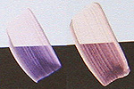

## Les pigments interférentiels
### Les pigments interférentiels, usage en arts plastiques
 **Les pigments interférentiels,  
le mica**

Tous détails sur les phénomènes interférentiels  
\--> [cliquer ici](chap08interferences.html)

Accès direct MICA --> [cliquer ici](interferentielspigments.html#mica)



_"Interférentiels", "[iridescents](iridescence.html)", "nacrés", il s'agit en général d'une même catégorie de pigments au point de vue du procédé de fabrication. Dans le secteur industriel, un pigment est enrobé d'une substance transparente lui conférant certaines propriétés de brillance, de chromatisme. Il semble qu'il existe d'autres possibilités de mettre en oeuvre cette propriété de la lumière qui est exposée plus en détail dans un chapitre des Dialogues de Dotapea ([cliquer ici](chap08interferences.html))._

Attention : ces produits ne doivent jamais être broyés par le peintre car cela détruirait d'un seul coup leur structure et leurs propriétés.

Les combinaisons les plus courantes sont faites de pigments enrobés de mica. Elles jouent sur les transparences et les reflets, particulièrement sur fond lisse selon les fabricants.

Ces couleurs peuvent avoir l'une de ces deux propriétés :

> \* un aspect métallique basé sur la transparence du pigment enrobant le mica, couche d'un épaisseur réglée très précisément en fonction des fréquences des photons que l'on veut bien laisser revenir vers l'observateur. Sur fond sombre, l'aspect métallique est maximal.
> 
> \* une variation chromatique en fonction de la position relative de l'observateur (goniochromaticité). Sur fond clair, ce phénomène prend toute son ampleur. Il a un aspect nacré.

Leur emploi en peinture n'est pas très facile (risque du kitsch). La cosmétique ouvre d'autres possibilités, notamment en [body painting](peau.html).

Ces pigments sont en principe de taille micrométrique.

Mica

[Lire absolument l'article du glossaire](mica.html)

Certains fabricants de pigments incluent des poudres de mica dans leur offre commerciale, mais il ne faut certainement pas croire pour autant que l'action d'enrober un grain de pigment dans le but de créer un pigment interférentiel est une opération réalisable sans outillage industriel.

En fait le mica produit à lui seul des effets de brillance assez intéressants et il peut être exploité picturalement pour ses propres caractéristiques.


```
title: Les pigments interférentiels
date: Fri Dec 22 2023 11:27:27 GMT+0100 (Central European Standard Time)
author: postite
```
