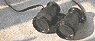

**Lettre L**

Accès direct aux autres lettres :

**Index lettre L**

**Commentaires**

Destinations  
(cf. [légende](l.html#legendeicones))


**[Laiton](laiton.html)**

**[Lampant](lampant.html)**

**[Lanoline](lanoline.html)**

**Lanthanides**

[Passage _in Courrier des Lecteurs première saison_](courrierdeslecteurs2010a130.html#20100319slterresrares)
**Lapis-lazuli**

A. [Passage in _bleus moyens ou froids._](bleusfroids.html#lelapislazuliveritable)

B. Sur le même thème :

> \- _[Les outremers](outremers.html)_ (familles chimiques de pigments)
> 
> \- _[L'azur](azur.html)_.
**[Laser](chap13laser.html)**

**[Lasure](lasure.html)**

**[Latex](latex.html)**

**[Lavage](lavage.html)**

**[Layout](layout.html)**

**[Lécithine](lecithine.html)**

**[Lépidolite ou lépidolithe](lepidolithe.html)**

**[Léviger, lévigation](leviger.html)**

**Lévogyre**

[Voir _dextrogyre._](dextrogyre.html)
**Liage, liant**

A. _[A propos des liants](chap01liants.html)_, chap. I des Dialogues de Dotapea.

B. _[Le mouillage pigmentaire](chap22mouillage.html)_, chapitre XXII.

C. _[Le liant](liant.html)_, article du glossaire.

D. _[Les liants font les procédés](liants.html)_, tête de section. 


**[Liaisons entre atomes](liaisons.html)**

(liaisons métalliques, ioniques, covalentes et de Van der Waals)
**[Liber](liber.html)**

**[Lie, lie de vin ou lie-de-vin](lie.html)**

**Lin**

A. [Huile de lin.](huiledelin.html)

B. [Toile de lin.](fibres.html#lelin)


**[Limaille](limaille.html)**

**[Limonite](limonite.html)**

**[Linoléique (acide), ALC, acide linolénique](linoleiquelinoleniquealc.html)**

**[Linoléum](linoleum.html)**

**[Linoxine](linoxine.html)**

**[Lipide](lipide.html)**

**[Liquidambar](liquidambar.html)**

**[Litharge](litharge.html)**

**[Lithium et oxyde de lithium](lithium.html)**

**[Lithopone](lithopone.html)**

**Livre d'apothicaire**

[Passage _in La toxicité._](toxicite.html#nociviteconnue)
**[Lumière noire](lumierenoire.html)**

**Luminescence ou photoluminescence**

A. [_Article dédié._](photoluminescence.html)

B. _[Pigments fluorescents et phosphorescents.](phosphofluo.html)_


**[Lune](lune.html)**

**[Lustre](lustre.html) [et demi-lustre](lustre.html)**

**Lytose**

[Passage _in Le liant méthylcellulosique_](methylcellulosiqueliant.html#synonymes)
\_\_\_\_\_

**Légende des icônes/liens (destinations)**

_Pour éviter toute surprise lors de la navigation, nous avons créé cette signalétique :_

article du glossaire

article hors glossaire

_passage_ situé dans un article du glossaire

_passage_ situé dans un article hors du glossaire

  liens en "portail", ouvrant sur différentes adresses

 

 [Communication](http://www.artrealite.com/annonceurs.htm) 

```
title: Lettre A
date: Fri Dec 22 2023 12:23:50 GMT+0100 (Central European Standard Time)
author: postite
```
