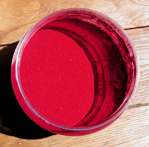

## Les laques anciennes
### Les laques anciennes, utilisation en arts plastiques et en teinturerie
 **Laques anciennes (couleurs)**  _Il existe d'autres substances colorantes anciennes comme le [safran](jaunes.html#lesjaunessafran) et le [curcuma](jaunes.html#curcuma) par exemple, dont on peut faire des laques par dilution, mais celles qui suivent ci-dessous sont transparentes par essence et méritent davantage l'appellation classique de "laques"._

_Voici une énumération qui n'a pas prétention à être exhaustive :_

> \* **_la garance_** fait l'objet d'un [article séparé](garance.html).
> 
> \* **_les carmins et le kermès._**
> 
> > \* _Le [carmin](laquesanciennes.html#degarance) de garance_ ou _d'alizarine_ a été créé par Bourgeois en 1816 ("carmin" est alors, dit-on, la contraction de "kermès" - de l'arabe _kermiz_ - et de _minium_, information non confirmée). Nous ignorons si sa composition à l'époque était déjà celle d'aujourd'hui (généralement un rouge [anthraquinonique](anthracene.html)). Elle a disparu dans le courant du XIXème siècle ([lire passage _in_ Laques](laques.html#disparitionsdiverses)) mais il est possible que ce pigment fut lui-même destiné à remplacer les couleurs à base de cochenille, trop fugaces, comme...
> > 
> > \* ... _le carmin de cochenille_ et _le rouge kermès_. Evoquons leurs liens et leurs différences.  
> > Le premier est en quelque sorte issu du second. Ce qui les distingue, ce n'est guère leurs caractéristiques en tant que colorants : ils se ressemblent énormément. Les lieux et modes de production sont, eux, différents :
> > 
> > > \* _le kermès_ est fabriqué avec les oeufs des cochenilles (_kermes vermilio_ ou _kermes ilicis_) parasitant un chêne méditerranéen dit chêne kermès, poussant en Espagne et dans les îles grecques, ou, selon certaines sources (très crédibles), avec les femelles détachées de l'arbre avant la ponte, puis broyées. On en tire l'acide carminique, que l'on mêle à de [l'alun](alun.html). Il serait possible de le "vermillionner" (rendre plus orangé) en le soumettant aux acides du vinaigre ou du citron.  
> > > Le terme de kermès est en fait probablement très ancien. En sanscrit, il donne _kermi_, en arabe _quirmiz_, en anglais _crimson_, en français _cramoisi_. Ce vocable international signifierait "ver" - un mot qui lui-même a donné "[vermillon](vermillons-2.html)".  
> > > Cette couleur fort coûteuse aurait eu un grand succès comme substance tinctoriale et comme pigment à peindre et à écrire durant la période médiévale en Europe, de la Pologne (importante zone de production, basée sur _porphyrophora polonica_) à l'Arménie (autre zone de production plus ancienne, attestée à partir du 1er millénaire BC, fondée sur _porhyrophora hameli_, variété petite prospérant de la Baltique à l'Ukraine sur la _gnavelle vivace_) en passant par Florence, Venise et la Turquie. Elle aurait même été décelée dans une grotte préhistorique (Adaouste, France). Elle périclite à partir du XVIIème siècle et disparaît presque totalement à la fin du XIXème.
> > > 
> > > \* _le carmin de cochenille_ est fabriqué par ébullition de l'insecte femelle (récolté juste avant la ponte) de la variété mexicaine de cochenille qui parasite les cactus de type _nopal_ (de l'aztèque _nopalli_, figuier de Barbarie mexicain semblable à l'_oponce_ grec).  
> > > Initialement, les Amérindiens l'utilisent déjà à grande échelle comme teinture (mordant : [alun](alun.html) ou jus de citron) et comme pigment à usages divers. Les conquistadores l'importèrent en Europe dès 1520 ou 1540.  
> > > Au XVIIIème et au XIXème siècles, ces cactus ont été implantés en Algérie, en Afrique, à Java, en Espagne et aux îles Canaries (premier exportateur au XIXème siècle) et cultivés à grande échelle, le rendement des parasites du _coccus cacti_ s'avérant très supérieur à celui du _[kermes vermilio](laquesanciennes.html#kermes)_. Approximativement, un hectare (carré de 100m de côté) donnait 300 kg de cochenille, un excellent chiffre, une rentabilité exceptionnelle augmentée par la surexploitation de la main d'oeuvre souvent en esclavage. On devine derrière ces données l'intérêt industriel et économique de cette couleur voisine du kermès, beaucoup trop rare et cher, près de dix fois moins rentable, et l'ampleur du bouleversement créé par la suite lors de l'invention d'un carmin purement industriel ajoutant la permanence aux qualités initiales du produit animal.
> > > 
> > > \* Mentionnons une variété asiatique de la cochenille, dite _"cochenille à laque"_ : _kerria lacca_. Elle croît sur différents arbres d'Asie, mais nous ne disposons d'aucune précision à son sujet (merci de [nous apporter vos témoignages](ecrire.html)).
> 
> L'offre actuelle du commerce est faite d'imitations et nous fait découvrir des variétés nouvelles de carmins, parfois un peu trop mauves, proches de la [pourpre](pourpre.html).
> 
> Lecture conseillée : [Le carmin sur Pourpre.com](http://pourpre.com/chroma/dico.php?typ=fiche&&ent=carmin)
> 
> \* **_la gaude_** (du germanique _walda_ et/ou d'après le mot latin _gaude_ signifiant _être en joie_, _mettre en joie_), dite aussi _giallolino_ ("le petit jaune", une appellation somme toute très imprécise qui s'est également appliquée au [jaune de Naples](jaunedenaples.html#giallorino)) et _laque d'Avignon_. Elle fut extraite dès le néolithique de la plante éponyme (gaude, _reseda luteola_), variété de réséda (du latin _resedare_, calmer, à cause de vertus médicinales supposées - noter qu'en anglais réséda se dit curieusement _mignonette_), plante herbacée pouvant atteindre 1,50m, qui serait actuellement interdite à la cueillette en France car en voie de disparition.  
> Elle donne un jaune, mais aussi, par association avec différents bleus (notamment la [guède](bleus.html#laguede), dès l'époque gauloise), des _verts réséda_ assez célèbres. L'une des raisons de son succès est son faible coût.  
> En tant que teinture, la gaude est désignée au XVIIIème siècle comme teinture "[grand teint](teint.html)" (_elle est l'un des rares jaunes à ne pas brunir_). Elle est très utilisée à cette époque, peut-être grâce au renouveau progressif de la couleur jaune en Occident (voir [les jaunes](jaunes.html)).  
> On la mentionne aussi comme l'un des deux jaunes utilisés pour les enluminures, plus tard en peinture. Elle était alors nommée _laque de gaude_ ou _giallolino_ (en italien, _petit jaune, jaune pâle_). Elle sert bien plus tard en peinture décorative (papiers peints notamment). On la prépare avec de la craie naturelle et de [l'alun](alun.html), qui sert aussi à préparer une teinture avec la même substance.  
> La plante est encore cultivée intensivement en Europe au XIXème siècle. Elle est alors remplacée par le [quercitrin](qr.html#quercitrinetquercitron) puis les pigments synthétiques.  
> A tort ou a raison, la gaude a la réputation d'être fugace, mais c'est surtout en comparaison avec des pigments jaunes beaucoup plus récents disposant d'une permanence exceptionnelle.
> 
> \* **_l'orseille._** [Elle est traitée dans l'article consacré aux violets et aux mauves](violetsetmauves.html#lorseille).
> 
> \* **_le rouge brésil_** est traité [dans l'article consacré aux rouges](rouges.html#leroseourosetteancien).



Voir aussi [_Rouges_](rouges.html).


 

 

 [Communication](http://www.artrealite.com/annonceurs.htm) 

[](index-2.html#20131014)


```
title: Les laques anciennes
date: Fri Dec 22 2023 11:27:31 GMT+0100 (Central European Standard Time)
author: postite
```
