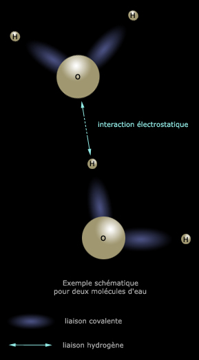

## Les liaisons entre atomes
### Les liaisons entre atomes, portée en arts plastiques
 **Les liaisons  
entre atomes**

Ce sujet aussi difficile qu'essentiel - il s'agit d'évoquer la cohésion de notre univers, c'est une sorte de « clé » - est traité non sans quelques retours nécessaires sur d'autres concepts. Nous conseillons une lecture complète (avec exploration des différents liens) et progressive.

On ajoutera que la question des liaisons (toutes les liaisons, y compris mécaniques) est déterminante pour les phases de la matière (gaz, liquide, solide). Ainsi, on mesurera la portée du sujet abordé ici en lisant en premier lieu ce [court passage](gazliquidessolides.html#liaisons) de l'article _Les phases de la matière_.

Chaque atome est pourvu d'une capacité de garder près de lui ses propres électrons. Cela se nomme [l'électronégativité](electronega.html). Quelques exemples : certains atomes métalliques sont relativement faibles (vers le bord gauche de la table de Mendeleïev) et leurs électrons ont peu de difficultés à s'en éloigner ; l'oxygène est par rapport à eux un séducteur, enfin le fluor est de toute la [table de Mendeleiev](annexe1.html) le plus attractif.

Mais cette propriété intrinsèque des éléments ne prend son sens que lorsque les atomes sont mis en présence. La différence entre les électronégativités est en effet essentielle car elle détermine quel type de liaisons va pouvoir s'instaurer. Cette différence est nommée le delta (Δχ). Lorsque Δχ est supérieur à 2, il va s'agir de liaisons ioniques. En deçà, par exemple dans le cas d'un couple d'éléments identiques comme notre familier O2, on pourrait croire que les atomes sont mutuellement « indifférents », mais un autre type de relations s'installe, ce sont les liaisons covalentes.

> \* **liaisons** **[ioniques](ion.html)**.
> 
> Dans le sel de table, Na et Cl subissent une attraction forte, de nature [électrostatique](chap20echelles.html#electrostatique). D'une manière générale, dans les [sels](formationdesels.html), la différence entre les électronégativités est importante (comme on l'a dit, Δχ\>2) parce qu'un sel est généralement constitué d'un non-métal souvent fortement électronégatif - l'anion - associé à un métal qui l'est moins - le cation. C'est le cas courant.
> 
> Il s'agit d'une liaison polaire. Le pôle + est du côté du métal (ou du moins électronégatif), le - du côté du non-métal (ou du plus électronégatif).
> 
> Particularismes
> 
> La taille d'un atome peut aussi influer sur son électronégativité. Si l'on peut saisir une tendance globale qui est que de gauche à droite sur chaque ligne de la [table de Mendeleïev](annexe1.html), les électronégativités croissent, il existe des exceptions comme le tout petit hydrogène ou une partie des métaux commençant à la colonne zinc/cadmium/mercure. Ainsi, l'or est le plus électronégatif de la sixième ligne malgré sa position presque centrale.
> 
> On peut aussi noter qu'entre deux non-métaux, les électronégativités peuvent donner un delta supérieur à 2, ce qui n'est pas le cas entre deux métaux.
> 
> Lire [passage](electronega.html#liaisonpolaire) in _Electronégativité, liaisons et liaisons polaires_.

> \* **liaisons covalentes** Lire [l'article](covalence.html) qui leur est consacré.

> \* **liaisons** **métalliques**
> 
> Un électron peut circuler parmi des millions d'atomes, autorisant notamment la circulation d'un courant. Ne pas se méprendre sur l'intitulé : en fait de métaux, il peut aussi bien s'agir de molécules [cycliques](cyclique.html) (voir définition du [métal](metal.html) et surtout [passage](chaine.html#liaisonsaromatiques) in _Les chaînes_).
> 
> **\* les liaisons hydrogène**

L'Académie française les définit d'une manière sobre :

> _« (...) liaison [électrostatique](electricite.html#electrostatique) entre deux atomes électronégatifs assurée par l'atome d'hydrogène. »_

Entendre par "atomes électronégatifs" des atomes ayant une forte [électronégativité](electronega.html).

On trouve d'autres définitions, pas toujours très cohérentes. Aussi se contentera-t-on ici des points les plus prégnants, sans lésiner sur le conditionnel.

D'abord il s'agirait « _\[d'une\] liaison dont peu de monde soupçonnait l'importance, il y a quelques années encore_ » (Yves Maréchal, CEA Grenoble, _in_ [page externe](http://www.cnrs.fr/cw/dossiers/doseau/decouv/proprie/liaisonHydro.html) sur le site du CNRS). C'est tardivement et contre toute attente la biologie qui aurait apporté un regard nouveau sur la portée de ce phénomène. Ce point de vue ne semble pas unanime cependant (voir ci-contre).

Caractéristiques générales

L'exemple le plus couramment utilisé est l'eau où les molécules H2O sont liées entre elles par les hydrogènes.

Ci-dessous, une figure tente de représenter très schématiquement un exemple portant sur deux molécules.

**Vue d'ensemble** **et précisions**

par [Jean-Louis](quinoussommes.html#jeanlouis)

Lors de la formation d'une liaison [covalente](covalence.html), les atomes qui se lient mettent des électrons en commun sur une orbitale, un "nuage électronique". Sauf dans les liaisons homo-atomiques, comme la liaison C-C, l'un des atomes aura toujours tendance à attirer un peu plus que son quota de ce nuage, il sera donc chargé un peu plus négativement que l'autre. Par exemple dans H2O, les hydrogènes sont déficitaires en électrons, l'oxygène excédentaire.

Ces petits déséquilibres de charges sont alors la source d'interactions [électrostatiques](electricite.html#electrostatique) qui peuvent être intra- ou intermoléculaires, les liaisons H ou liaisons hydrogène. Comme le déséquilibre électronique a lieu suivant l'axe de la liaison covalente qui en est la cause, les interactions [électrostatiques](electricite.html#electrostatique) qui en résultent sont directives, elles ont lieu préférentiellement suivant l'axe de la liaison.

Dans une liaison H il y a forcément un atome d'hydrogène et deux atomes électronégatifs tels que O, N ou F. L'hydrogène est lié de façon covalente à l'un des atomes O, N ou F, ce qui, du fait de l'électronégativité, donne lieu à une répartition électronique asymétrique, l'atome H portant un petit excès de charge positive. Cet excès de charge interagit avec le deuxième atome électronégatif, c'est la liaison H.



Comme dans la définition de l'Académie, on est en effet en présence d'un atome, O, possédant une électronégativité assez forte (3,4) lié à d'autres O par le biais de H. Il s'agit en l'occurrence de liaisons intermoléculaires, même si la "portée" de la liaison hydrogène est aussi intramoléculaire.

On n'est pas ici dans la covalence (même si celle-ci joue un rôle dans le phénomène comme on peut le lire ci-contre), on n'est pas non plus dans une liaison ionique car l'hydrogène, malgré sa toute petite taille, possède une électronégativité proportionnellement très importante : 2,1. Il est plus attractif que tous les éléments des sept premières colonnes de la table de Mendeleïev ([lien](annexe1.html#h)).

Ainsi, le Δχ entre O et H vaut seulement 1,3, et d'ailleurs si H a bien accès aux liaisons covalentes (citons H2), il lui est théoriquement impossible (information non confirmée) d'établir une liaison ionique avec un autre élément quel qu'il soit puisque la plus forte électronégativité connue (fluor) est de 4 et la plus faible de 0,7 (francium) alors que, comme dit ci-dessus, une telle liaison nécessite un différentiel de 2 points sur l'échelle de Pauling.

 

 

Les liaisons H sont relativement fortes, plus fortes que les interactions de van der Waals (voir [ci-dessous](liaisons.html#vanderwaals)), moins fortes que les liaisons covalentes et ioniques. Elles varient d'un composé à l'autre. Ces liaisons jouent un rôle important dans de nombreux phénomènes, notamment les propriétés de l'eau (points de fusion et d'ébullition, structure) et d'autres composés. Elles stabilisent les liaisons entre bases dans notre ADN, où leur caractère réversible est mis à profit lors de la transcription.

Elles sont aussi utiles dans les [élastomères auto-réparants](hitech.html#caoutchoucreparable), ceux qui se recollent après qu'on les a coupés si on remet les deux bouts en contact.

Cette notion de liaison H est apparue vers 1912 (T.S. Moore et  T.F. Winmill).

Concernant l'importance des liaisons H, je dirais qu'on en est conscient depuis le début, et en tout cas certainement après les travaux de Crick et Watson sur l'ADN.

> Terminons par une autre citation de la page web de Yves Maréchal : « _Dans l'eau liquide ou la glace, où il n'y a que des molécules d'eau, cela permet d'avoir un nombre de liaisons hydrogène particulièrement élevé : autant que de liaisons de valence._ » En effet, H se situant dans la première colonne de la table de Mendeleïev, il devrait pouvoir (information non confirmée) engager 17 liaisons avec d'autres atomes (voir à ce sujet [passage in table de Mendeleïev](annexe1.html#valence) et [valence in Glossaire](valence.html)).
> 
> Ainsi, si l'hydrogène - à savoir un malheureux proton accompagné d'un électron, le plus banal élément présent dans l'univers - semble de peu de poids par rapport aux autres atomes, il est particulièrement privilégié par la nature qui lui a conféré une électronégativité totalement atypique et une capacité de relier entre eux un nombre conséquent d'atomes grâce à une liaison entièrement dédiée, privilège qui fait de lui sans doute une brique de la vie, comme le rappelle Jean-Louis au sujet de l'ADN.

plus un dernier type de liaisons, substantiellement différent :

> \* **les "forces de liaison faibles"** - (à ne pas confondre avec l'interaction faible) -, dites aussi "de Van der Waals".  
> Elles sont essentiellement de type [dipolaire](dipole.html).
> 
> Elles sont de trois sortes (orientation, dite de Keesom, induction, dite de Debye, dispersion, dite de London) et toutes de courte ou très courte portée - de 1/r6 à 1/r8 -, mais fondamentales dans beaucoup de petits phénomènes subtils d'adhésion, de [mouillage](chap22mouillage.html) ou d'assemblage.

Voir aussi :  
_le rayon atomique de Van der Waals_  
[Lien.](rayonsatomiques.html#vanderwaals)

Pour terminer, on peut évoquer les liaisons de types multiples au sein d'un même assemblage moléculaire : [lire passage](courrierdeslecteurs2010a130.html#20100319slliaisonsdiverses) in Courrier des Lecteurs.

Avec l'aide de [Jean-Louis](quinoussommes.html#jeanlouis)


 [Communication](http://www.artrealite.com/annonceurs.htm) 

[](index-2.html#20131014)


```
title: Les liaisons entre atomes
date: Fri Dec 22 2023 11:27:33 GMT+0100 (Central European Standard Time)
author: postite
```
