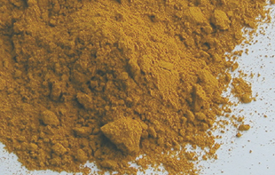

## Les liants
### Les liants, usage en arts plastiques et autres
 **Les liants font les procédés** 

_Un autre type de présentation du sujet :  
 [Les dialogues de Dotapea, chap. I, Autour des liants](chap01liants.html)_

_Le terme de liant n'est pas réservé aux arts plastiques._

_On le retrouve en art culinaire, domaine frère. Mieux : dans ces deux disciplines, on utilise souvent les mêmes substances (huiles, œufs, gélatines, dérivés lactiques, farines et même certains pigments) et l'on exploite la même fonction agglutinante (le terme d'_agglutinant _est d'ailleurs parfois employé dans le même sens dans ces deux domaines)._

_Seuls les produits trop [saturés](saturation.html) - ceux qui ne sèchent pas et ne se lient à rien- ne sont généralement employés qu'en cuisine et surtout en mécanique, car la diététique contemporaine nous apprend que les huiles les plus saturées sont aussi celles qui font enfler les chiffres du plus mauvais cholestérol (le LDL), ce que les cuisiniers n'ignorent plus._

_En peinture, il n'est pas faux, même si c'est un peu simplificateur, de considérer le liant comme une "colle à pigments et à supports" donnant à la couleur une viscosité qu'elle n'a pas naturellement tout en la protégeant. Les chimistes spécialisés contemporains semblent cependant surtout attachés au fait que le liant "_mouille le pigment_" (il faut parfois l'aider pour cela avec des agents mouillants). Il est effectivement très important de mentionner qu'il autorise, ce faisant, la constitution d'une substance "plastique", malléable, pouvant être posée sur une surface, moulée, projetée ou placée dans un récipient et manipulée par la suite avec toute sorte [d'outils.](outils.html)_

**Sommaire**

[Des pigments agglutinés par des liants qui déterminent des procédés de peinture](liants.html#lesprocedes)

[Le mordant est à la teinture ce que le liant est à la peinture (article du glossaire)](mordant.html)

[Caractéristiques propres aux liants](liants.html#caracteristiquespropresauxliants)

\- [la base et le diluant](liants.html#labase)

\- [la viscosité, l'adhérence et le tirant](liants.html#laviscositeladherence)

\- [séchage, siccativation](liants.html#siccativite)

\- [altération de l'aspect consécutif au séchage](liants.html#alterationdelaspectlorsdusechageoudelasiccativation)

\- [brillance, rétention de brillant](liants.html#brillanceretentiondebrillant)

\- [résistance mécanique, élasticité](liants.html#resistancemecanique)

\- [permanence](liants.html#permanence)

\- [réversibilité](liants.html#reversibilite)

\- [thermosensibilité](liants.html#thermosensibilite)

\- [capacité d'empâtement](liants.html#capacitedempatement)

\- [étalement, tendu, surfactant](liants.html#etalementtendu)

\- [transparence, finesse, précision](liants.html#transparencefinesse)

\- [perméabilité, respiration](liants.html#permeabilite)

[Les colorants liants ou mordants](liants.html#lespigmentsliantsoumordants)

_Par ailleurs, le liant ne permet une adhérence que par l'intervention d'un facteur extérieur : présence d'oxygène ou cuisson (courante en peinture industrielle ou dans les arts du feu). Il joue donc le rôle d'intermédiaire non seulement avec le support, mais aussi avec l'environnement pris dans le sens le plus large, intégrant l'action humaine comme celle du soleil, de l'air, des siccatifs ou des bactéries, ce qui nous incite à le considérer comme médiateur._

_Les premières peintures rupestres connues (Tsodilo, Arnhem, Lascaux, Chauvet, Altamira, etc.) étaient souvent réalisées sans liant. La plupart n'aurait pas résisté à une exposition même brève à l'air libre. En Australie, on commença très tôt (cf. [Anne Varichon](livres.html#annevarichon)) à utiliser le suc d'orchidée sauvage, le jaune [d'œuf](oeuf.html), la [cire](cires.html) et divers produits d'origine végétale comme liants. On mentionne l'emploi de graisses animales au paléolithique en Europe._

_Mais parmi les tous premiers liants de grande efficacité, outre l'œuf et la cire qui on fait leurs preuves, nous citerons la [gomme arabique](gommearabaquar.html) et probablement aussi la gomme de merisier (que nous connaissons mal). Les huiles à peindre n'apparaîtront que très tardivement, bien après le jaune de l'œuf, sigle de Dotapea.com, et une bonne quantité de produits ayant démontré leur bonne adaptation à des contextes précis d'emploi pictural._

[](oeuf.html#loeufdedotapea)

Des pigments agglutinés par des liants qui déterminent les procédés de peinture

Toute peinture est constituée au moins :

> \* de [pigments](pigments.html)
> 
> \* d'un, voire de plusieurs [liants](liant.html) qui mouillent et collent les pigments entre eux tout en les faisant adhérer au [support](supportsetpreparations.html).

Un tube, un pot de peinture ou d'encre, une cartouche de stylo, une recharge de feutre, de la peinture-poudre industrielle, _c'est presque toujours du pigment mélangé à du liant_. Il est généralement facile de se procurer ces deux éléments séparément et de faire soi-même le mélange (voir article "[séparer ou non liants et pigments](separerounon.html)"). Sur la distinction entre liants et colles, lire l'article consacré aux [colles](colles.html).

_**C****haque procédé de peinture réfère à un liant spécifique**__._ On parle de "procédé à [l'huile](huiles.html)", de "[tempera](tempera.html) à [l'œuf](oeuf.html), à la [caséine](caseine.html) ou à la [colle](colles.html)", de peintures [synthétiques](liantssynthetiques.html), [acryliques](acryliquegloss.html), [vinyliques](vinylegloss.html), [méthylcellulosiques](methylcellulosiqueliant.html), de [peinture à fresque](fresque.html) au [mortier](mortier.html), etc... En principe, c'est le liant qui va définir la manière dont vous pourrez peindre, les supports possibles, et surtout les types de résultat que vous serez susceptible d'obtenir.

Les seules exceptions sont les liants qui sont en eux-mêmes colorants comme le [graphite](graphite.html) ou la [craie](craie.html) naturelle, généralement utilisés en dessin car par définition ils rendent impossible le polychromatisme sinon en jouant sur un fond coloré ou sur des techniques mixtes. Voir plus loin _[Les colorants liants ou mordants](liants.html#lespigmentsliantsoumordants)_.

Le mordant est à peu près à la teinture ce que le liant est à la peinture

Lire à ce sujet [l'article _Mordant_ du glossaire](mordant.html).

Caractéristiques propres aux liants

**La base et le diluant**

Aqueuse, oléagineuse, [encaustique](encaustique.html), [cétonique](cetone.html), etc., nommée ainsi en fonction tantôt de la nature du liant (ex. : _peinture à l'huile_), tantôt de celle de son produit diluant (ex. : peintures aqueuses ou _[détrempes](detrempe.html)_).

Certaines peintures ont une double base chimique (lire _[Les émulsions](liantsemulsions.html)_), à la fois aqueuse et grasse et autorisent éventuellement l'emploi de deux diluants de natures différentes.

**La viscosité, l'adhérence et le tirant**

On l'a dit : un liant est une sorte de colle dont l'action s'exerce à la fois sur le pigment et le support.

_La viscosité_ ([sur ce mot, lire absolument l'article du glossaire](viscosite.html)) de cette "colle" dépend d'un grand nombre de facteurs qui ont été l'objet de recherches et d'expériences depuis la préhistoire. Elle interagit avec d'autres facteurs comme l'aptitude à la [siccativité](liants.html#siccativite) du liant, mais aussi du pigment. Il existe des viscosités à la fois lentes et très puissantes, donnant un résultat très solide, comme dans le cas de [l'huile de lin](huiledelin.html). A proprement parler, pour le peintre, l'artiste, le concept de viscosité n'est pas le plus utile. Celui de "_tirant_" est peut-être plus précis bien qu'il se comprenne intuitivement et par la manipulation, pas en tant que concept scientifique. Il recouvre certainement d'autres phénomènes physico-chimiques.

Notamment, la manière dont le liant s'étire, englobe le pigment ("sa manière d'être visqueux") détermine ce type de facteurs. L'aquarelle semble enrober presque chaque grain de pigment tandis que l'huile et l'acrylique les piégent dans leur propre masse. Voir plus loin [Transparence, finesse, précision](liants.html#transparencefinesse).

_L'adhérence au support_ est essentielle bien sûr. Il faut d'ailleurs distinguer l'adhérence du liant pur, par exemple utilisé comme enduit, de celle de la peinture, toujours inférieure à cause de la présence du pigment qui, lui, n'a que peu de viscosité.

_L'adhérence humide_ est un concept technique de la peinture décorative. Il s'agit de l'adhérence sur support humide et/ou en atmosphère humide. Il est intéressant car il autorise certains procédés plastiques par modification du support. L'eau annulera temporairement, localement ou globalement, l'adhérence de la peinture à l'huile. Pendant ce temps, des choses deviennent possibles.

A l'inverse, le même principe peut être appliqué à l'aide un corps gras qui altèrera l'adhérence d'une peinture aqueuse (le retrait de corps gras créant cependant des difficultés plus importantes).

_Le tirant_ est la viscosité d'une pâte à peindre, mais c'est surtout pour le peintre une sensation "mécanique" bien réelle, bien sensible, qui peut changer au cours d'une séance, à mesure que le diluant s'évapore. Cela se ressent comme une résistance concrète.

Certaines colles semblent presque "tirer de leur côté" tant elles sont visqueuses. On dira donc que le tirant est avant tout la sensation de la viscosité avant d'être un synonyme banal de celle-ci.

**Séchage et siccativitation**

La distinction entre ces deux termes est explicitée dans [un article du glossaire](sechagesiccativation.html).

Pour faire court et simple, on n'évoquera ici que le terme de "siccativité" entendu comme aptitude d'un liant à se solidifier.

La siccativité d'un liant peut être :

> \* nulle (œuvres restant à l'état liquide, à l'horizontale, difficiles à conserver)
> 
> \* totale, mais plus ou moins lente en fonction de la nature chimique de la pâte, de son épaisseur et de sa dilution
> 
> \* ou [réversible](liants.html#reversibilite) ([cires](cires.html), [colle de peau](colledepeau.html), [gouache](gouache.html)).

**Altération de l'aspect lors du séchage ou de la siccativation**


Un liant peut se présenter pur, comme l'huile de lin, ou pré-dilué, comme le liant acrylique qui comporte à peu près une moitié d'eau (en volume, voir _[extrait sec](extraitsec.html)_). Parfois, la quantité de diluant nécessaire à l'utilisation du produit est considérable, comme dans le cas de la [gomme laque](gommelaque.html) (ci-contre). A l'opposé, un tube de peinture à l'huile ne contient pas d'essence et un godet d'aquarelle est sec.

Naturellement, la présence de diluant (incorporé ou ajouté) implique nécessairement un [retrait](retrait.html) au séchage, mais en fonction de la manière dont le liant se polymérise - particulièrement la rapidité et l'homogénéité de ce phénomène -, la pâte conservera plus ou moins son volume initial.

La base chimique du liant détermine la type de diluant utilisable, mais aussi l'aspect pictural final moyen d'une peinture. La gomme laque décirée et les peintures oléagineuses sont probablement les liants autorisant le résultat sec le plus semblable à l'œuvre fraîche. Cependant, dans tous les cas une règle demeure  : lorsque le diluant est très présent ([jus](jus.html), [glacis](glacis.html), [lavis](lavis.html)), le volume diminue beaucoup au séchage. Une coulure qui semble épaisse lorsqu'elle est fraîche paraît souvent bien mince à sec.

**Brillance, rétention de brillant**

La brillance est dans l'ensemble l'apanage des liants purs. Pigmentés, tous deviennent plus mats.

Mais un liant ou une peinture (liant + pigment + adjuvant éventuel) peut évidemment présenter une brillance.

Dans certains cas, notamment lorsqu'une peinture est exposée à l'air libre, à l'extérieur, ce brillant peut s'éteindre. A l'inverse, la "rétention de brillant" correspond à une propension à la conservation de ce caractère malgré le temps et les intempéries.

**Résistance mécanique, élasticité**

Elle dépendent

1.  de la concentration en liant et en adjuvants (diluer une peinture sans adjuvant visqueux, c'est la fragiliser). Certains adjuvants comme la glycérine et différents liants synthétiques augmentent l'élasticité des peintures à l'eau. Certaines résines utilisées en peinture à l'huile rendent celle-ci plus résistante tant dans le contexte de la conservation (tout pigment mal protégé réagissant au contact de l'air et des ultraviolets) que dans celui de la [réticulation](reticulation.html), lors du séchage, où se posent aussi des problèmes mécaniques, de mouvements non homogènes particulièrement, notamment à l'échelle macromoléculaire et, consécutivement, à notre grand effroi, à l'échelle de notre acuité visuelle.
    
2.  de la résistance propre du liant et de sa densité dans la pâte. Les liants élastiques comme l'acrylique et le vinyle tolèrent davantage de types de supports que la caséine ou la chaux qui sont plus rigides
    
3.  du bon choix et de la bonne préparation du support : liant souple pour support souple, liant souple ou dur pour support dur. Un support mal préparé, une peinture ou un enduit mal choisi, ce sont les cauchemar des restaurateurs, des conservateurs de musées, des collectionneurs et de tous les amateurs d'art, comme quelques visites dans différents musées peuvent nous en convaincre.
    

**Permanence : colorations intempestives (jaunissement, blanchiment, noircissement ), résistance générale**

> \* la coloration inopportune d'un liant est parfois réversible (voir [huile de lin](huiledelin.html))
> 
> \* une coloration plus durable peut se produire à la suite de mauvais mélanges ou d'applications sur des supports inadéquats (acides, par exemples, ou soufrés, lorsque la peinture étendue par-dessus est mêlée de plomb)
> 
> \* elle peut être liée à certains points faibles du liant (ex. : tendance de l'huile de noix à rancir - ou réputation de) ou bien à la trop faible proportion de liant par rapport au pigment : c'est le problème de [l'aquarelle](gommearabaquar.html) notamment, peinture exploitant au maximum les possibilités de dilution de la gomme arabique. On a déjà vu des tableaux "s'écrouler" littéralement par plaques de pigments trop peu liés
> 
> \* la question de la résistance est souvent en rapport avec la réversibilité. Une peinture permanente doit résister à l'action de ses solvants (surtout lorsqu'il s'agit de peintures aqueuses). De plus, elle doit aussi se confronter avec succès à l'air ambiant, l'humidité, les polluants, la température, les ultraviolets, les bactéries, etc.

A lire absolument : [Longévité des peintures](courrierdeslecteurs2009b020.html#20090620th) in _[Courrier des Lecteurs](courrierdeslecteurs.html)_.

**Réversibilité**

C'est l'aptitude d'une peinture (ou d'un autre produit, une colle par exemple) qui a séché à se remettre en solution en présence de ses solvants normaux. La gouache est réversible mais pas l'acrylique ni l'huile. Une aquarelle de qualité n'est pas censée être très réversible. La caséine, par contre, est réversible dans un premier temps, puis pratiquement plus jamais.

La réversibilité d'une peinture n'est pas sans rapport, dans certains cas, avec son aptitude à se [saponifier](saponification.html). La plupart des liants étant des esters, ils peuvent en effet réagir à une base, à de l'eau ou a fortiori à une eau alcaline comme le sont de nombreuses eaux du robinet.

Une peinture à l'eau serait généralement, dit-on, moins réversible dans une atmosphère chaude. Information non vérifiée.

A l'inverse de la réversibilité se trouvent la lavabilité et la lessivabilité, propriétés des peintures résistant au lavage, voire à une certaine action abrasive. L'acrylique est lavable, l'huile un peu moins, mais ce sont surtout les peintures décoratives comme la [glycérophtalique](glycerophtalique.html), les différents [alkydes](alkydes.html), les [polyuréthanes](polyurethane.html) et encore davantage les peintures-poudres et autres procédés industriels ainsi que [les émaux](email.html) qui sont représentatifs de cette faculté de résistance à la réversibilité.

**Thermosensibilité**

La sensibilité à la chaleur définit une forme de "[réversibilité](liants.html#reversibilite)" qui est particulièrement déterminante pour les peintures dans lesquelles les _cires_ sont présentes.

Lorsqu'une cire refroidit, elle coagule. C'est très rapide, cela permet de bloquer certains mouvements mécaniques indésirables. Mais solidifiée, une cire devient un solide cassant, fragile.

Lorsqu'elle chauffe, elle se liquéfie, provoquant sans délai des accidents irréversibles.

Il est donc important d'employer les produits thermosensibles à bon escient. Tout particulièrement, les appareils d'éclairage trop rapprochés sont des dangers potentiels.

Lire [Les cires comme adjuvants](cirecommeadjuvant.html), [Les cires, l'encaustique](cires.html).

**Capacité d'empâtement**

Sauf techniques très spéciales, seules l'acrylique et l'huile permettent l'empâtement, sous certaines conditions. Des auxiliaires sont quand même généralement indispensables à partir d'une épaisseur de l'ordre de deux ou trois millimètres tout au plus.

Le mortier à fresque et surtout le plâtre peuvent-ils être considérés comme empâtant ? Plus ou moins, on dira plutôt que ce sont des liants "plastiques".

**Étalement, "tendu", surfactant**

_Voir absolument [Tension, tension superficielle, tensioactif](tensioactivite.html)._

_Sur le concept de surfactant,  
_[lire définition _in Les dialogues de Dotapea, chap. I, A propos des liants_](chap01liants.html#surfactant)_._

Le concept d'étalement ne doit pas être confondu avec celui de [dilution](diluantssolvants.html). Une peinture très "diluable" comme [l'aquarelle](gommearabaquar.html) n'est absolument pas "étalée" au sens de "tendue".

Alors qu'entend-on par ces termes ?

_Une peinture peut, par sa nature et celle de son diluant, avoir tendance ou non à s'étaler sur le support à peindre et à former rapidement une surface homogène où le coup de pinceau ne laisse pas d'empreinte, comme dans le cas typique de la [gomme laque](gommelaque.html)._

Dans les domaines des arts plastiques ou décoratifs, le terme "tendu" correspond à peu près semble-t-il - et sous toute réserve - au concept physico-chimique de tensioactivité.

La [standolie](standolie.html) en peinture à l'huile et les [diffuseurs](produitsacryl.html#diffuseursfusants) en peinture acrylique permettent d'accroître le tendu.

Plastiquement parlant, une peinture tendue ou rendue telle permet des transitions très homogènes, très "lisses", des aplats, mais aussi des flous.

[Lire aussi passage _in Les dialogues de Dotapea, chap. I, A propos des liants._](chap01liants.html#tensioactif)

**Transparence, finesse, précision**

Ces propriétés sont le propre des peintures plutôt fluides ou rendues fluides, diluées (voir [Diluants, solvants, dissolvant  : concepts physico-chimiques](diluantssolvants.html)).


Certains liants sont en eux-mêmes grossiers, presque granuleux. D'autres sont fins mais flous. La précision n'est pas toujours au rendez-vous. Elle est non seulement inhérente au liant, mais aussi au diluant. Par exemple l'alcool, diluant de la [gomme laque de Coromandel](gommelaque.html) (photo ci-contre), ne peut autoriser une précision comparable à celle que l'on obtient avec un liant moyen dilué dans l'eau ou dans l'essence. Par contre, la transparence de cette laque est devenue légendaire.

**Ces trois caractéristiques, transparence, finesse et précision, ont largement déterminé l'emploi des liants.** Un liant fin comme la gomme laque de Coromandel nécessite un haut degré de technicité pour obtenir la précision que d'autres liants autorisent bien plus aisément. Ce n'est donc pas un hasard si la laque n'est pratiquement jamais employée en peinture alors qu'elle est courante en ébénisterie. Les propriétés intrinsèques de la laque peuvent cependant être mises à profit à bon escient dans le domaine artistique.

**Perméabilité, respiration**

Une peinture perméable n'est pas seulement une peinture qui laisse passer à travers elle d'autres matières. Pour mériter l'épithète "perméable", elle doit aussi _supporter_ d'être traversée.

Autrement dit, une peinture perméable ne se dilue pas, ne se dissout pas.

Le liant perméable le plus exemplaire est certainement [la chaux](chaux.html).

Une gouache, si elle laisse passer l'humidité, s'en émeut cependant, se diluant au passage.

A l'opposé, les liants tels que l'acrylique, le vinyle, l'huile de lin ou la gomme laque ne laissent rien passer. Ces peintures sont imperméables et ne laissent pas les supports respirer.

Les colorants liants ou mordants



Ce sont des cas particuliers plutôt rares.

Quelques exemples :

Le [graphite](graphite.html) est à la fois un liant et un pigment.

Le [curcuma](jaunes.html#curcuma) (photo ci-contre) est un colorant [substantif](substantif.html) utilisé en teinturerie. [Le noir de noix de galle](noirs.html#lenoirdenoixdegalle) est également un colorant tinctorial substantif et il a été utilisé dans la fabrication d'encres.


```
title: Les liants
date: Fri Dec 22 2023 11:27:33 GMT+0100 (Central European Standard Time)
author: postite
```
