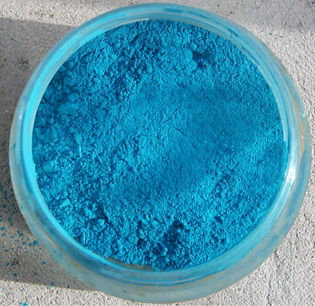

## Les manganèses
### Les manganèses, pigments utilisés en arts plastiques
 **Les manganèses**  

_La famille manganèse_

Dans la famille des couleurs au manganèse, citons pour commencer [le bleu du même nom](bleuschauds.html#lebleudemanganese), généralement remplacé par une imitation souvent fort fidèle de type [phtalocyanique](phtalocyanines.html) (voir photo). Signalons aussi les [terres de Sienne](terresdesienne.html), les [terres d'ombre](terresdombre.html) et la [terre verte](vertscomplexes.html#laterreverte) où sa présence chromatique est bien sensible.

Il existe un [violet de manganèse](violetsetmauves.html#levioletmineral), très utilisé dès la préhistoire. Il est associé au calcium ou au zinc (deux [métaux alcalins](annexe1.html#metauxalcalinsnonalcalinoterreux)). On l'emploie maintenant surtout dans le cadre des arts du feu ([lire passage in _Les oxydes_](oxydes.html#manganese)).

On signale aussi [un oxyde de manganèse de couleur noire](noirs.html#lenoirdemanganese), rarissime (information non confirmée).

Enfin, le minerai, de teinte perle dit-on, aurait déjà été employé par l'homme de Neandertal (en Israël et en France) ! D'autres emplois sont mentionnés en différents lieux sur la planète (se référer à l'excellent ouvrage d'[Anne Varichon](livres.html#annevarichon)).

Sur l'histoire de l'utilisation du manganèse, lire absolument [le texte consacré au violet de manganèse](violetsetmauves.html#levioletmineral).

_Un aspect important du manganèse : son pouvoir de siccativité_

Le manganèse, associé à l'oxygène, est l'un des plus puissants [siccatifs](siccatifs.html) des huiles à peindre (voir [Courtrai](siccatifs.html#lescourtrai)). C'est cette particularité qui rend certains pigments particulièrement difficiles à manipuler : le bleu et le violet de manganèse véritables en tout premier lieu, les [terres de Sienne](terresdesienne.html), les [terres d'ombres](terresdombre.html) et les [terres vertes](vertscomplexes.html#laterreverte) également mais de manière moins sensible.

_Nocivité_

Le manganèse est toxique par inhalation et par ingestion. Une quantité relativement importante est cependant nécessaire pour qu'il devienne pathogène.

La Sienne et l'Ombre doivent donc être manipulées avec quelques précautions : éviter l'inhalation répétée et l'ingestion. Cet avertissement vaut encore plus pour le bleu ou le violet de manganèse véritables, heureusement d'emploi assez rare comme nous l'avons dit.


 [Communication](http://www.artrealite.com/annonceurs.htm) 

[](index-2.html#20131014)


```
title: Les manganèses
date: Fri Dec 22 2023 11:27:38 GMT+0100 (Central European Standard Time)
author: postite
```
