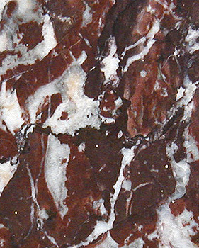

## Les marbres
### Les marbres, usage en sculpture
 **Les marbres**

_Les marbres sont une famille de minéraux [métamorphiques](metamorphiques.html) à base de [calcite](calcite.html). Ils résultent de la transformation métamorphique de [calcaires](calcaires.html). Ils sont plus solides et plus homogènes que ceux-ci ou que les [albâtres](albatres.html) qui peuvent parfois présenter un aspect similaire. Ils sont modérément opaques et ont un grain fin._

Pour ces raisons, ils ont été très prisés dès l'Antiquité et encore davantage à partir de la Renaissance. Peut-être excessivement.

Sommaire

[Catégories](marbres.html#categories)

[Polissage, transparence](marbres.html#polissagetransparence)

[Carrières, localisation](marbres.html#carriereslocalisation)

Au XIXème siècle, la seule pierre envisageable pour la sculpture était un marbre blanc de Carrare, censé ressembler au substrat des oeuvres de la Grèce antique (les fameux Paros, Pentélique, Scio ou Naxos) - compensation liée à une période marquée par un manque de repères esthétiques ?



Les choses ont un peu changé : après cette période de retour aux sources, beaucoup de sculpteurs se sont progressivement intéressés aux variétés noires (marbre belge notamment) et aux marbres légèrement veinés, considérés pourtant encore à ce jour comme "demi-statuaires", c'est-à-dire blancs comme les "statuaires", mais traversés de discrètes pigmentations jaunes, violacées, etc., voire aux marbres franchement veinés, micacés, impurs, auparavant réservés aux usages décoratifs.

La richesse "picturale" d'un marbre veiné ou micacé est souvent si grande qu'il n'est pas forcément aisé de s'accommoder de son expressivité. Le sculpteur contemporain en tient compte. Il agit souvent sur la pierre comme un peintre sur un tableau déjà plus qu'ébauché, d'une manière moins volontaire que dans le passé. Il regarde, il "écoute" le minéral qu'il a choisi, pas celui que la convention ou la mode ont choisi.

Note : "marbre" (du grec _marmoros_) donne l'adjectif "marmoréen" et d'autres mots similaires dans plusieurs langues, dont des noms de lieux.

_Catégories_

Il existe deux grandes catégories de marbres :

> \* les marbres calciques, plutôt lourds.
> 
> \* les marbres dolomitiques. Ils sont issus de la métamorphose de la [dolomie](dolomite.html), une pierre calcaire assez particulière.

Entre elles, il existe des compositions intermédiaires, mais même si l'on ne considère que les deux extrêmes, ceux-ci ne définissent pas une tendreté, un grain, un aspect spécifique précis car les facteurs les plus déterminants sont d'un autre ordre :

> \* la durée du temps de la [métamorphose](metamorphiques.html#cyclemetamorphique) et ses conditions (température, pression). Par exemple, certaines roches ont pu être mises sous pression durant mille ans, d'autres pendant cent mille ans, ceci à des températures très variables. Au final, les structures obtenues différent radicalement.
> 
> \* la présence de minéraux comme par exemple la [silice](silice.html) (quartz jouant le rôle de durcissant) détermine grandement la "réponse" de la pierre sous le ciseau.

En moyenne cependant, la [dolomite](dolomite.html) pure (entrant à peine pour 50% dans la composition de la dolomie, donc des marbres les plus dolomitiques) serait trois fois plus lente à constituer des grains épais que la calcite pure. Les grains fins sont donc _statistiquement_ plus courants et finalement, c'est surtout le poids qui reste le facteur distinctif le plus évident entre les deux grandes catégories chimiques.

Les aspects chromatiques des différents marbres sont extrêmement variables en fonction d'éléments tantôt noyés dans la masse de la roche, tantôt concentrés dans des "veines". Il s'agit de silice, d'alumine, d'oxydes de fer et d'autres métaux, de soufre, etc., sous des formes moléculaires variées. En principe, le marbre "pur" est très blanc et non veiné. Reste à définir ce que l'on est vraiment en droit de considérer comme pur - toute tradition mise à part - alors que ce qui pour nous, au quotidien, définit le mieux le marbre, ce sont précisément... les marbrures ! La science même ne reconnaît-elle pas deux types de natures chimiques fort différentes pour ce minéral ?

_Polissage, transparence_

Du point de vue plastique, l'une des spécificités communes à toutes ces pierres est la possibilité de leur donner un lissé, un poli ou un satiné inimitables (on mentionnera particulièrement le travail extraordinaire de Canova dans ce domaine, qui continue à faire référence).

Certains sculpteurs, dont ce dernier, ont également recherché la transparence. S'il faut saluer la performance - et la beauté - d'un _Enlèvement de Proserpine_ (Musée Borghèse, Rome) et d'autres merveilles, il est permis de s'interroger parfois sur le choix de cette pierre dans la perspective de la transparence. Une [albâtre](albatres.html) moyenne, par nature, serait plus transparente qu'un marbre moyen. Mais, plus fragile, elle ne pourrait être destinée à des travaux d'une certaine taille. Cependant, prolongeant la tradition du XIXème siècle, le sculpteur du XXIème siècle a encore parfois tendance à "penser marbre" un peu trop systématiquement.

[Lire aussi un passage du courrier des lecteurs](courrierdeslecteurs2010a060.html#20100207dm)

_Carrières, localisation_

La localisation des carrières n'a de sens qu'en fonction d'un choix préalable du type de marbre à traiter. En effet, il existerait en France 250 variétés de marbres (chiffre [Philippe Clérin](livres.html#philippeclerin)). De même, la Belgique (marbres colorés ou noirs surtout), l'Italie (nombreuses variétés), l'Espagne, la Grèce, l'Autriche, l'Union Indienne (ex. : marbres blancs de Makrana décorant le Taj Mahal), pour ne citer qu'elles, en ont chacune des centaines.

Certains artistes n'hésitent pas à s'adresser à des marbreries funéraires.

Nous ne voulons en aucun cas nous faire le relais de traditions souvent abusives et très monomaniaques en déclarant que tel ou tel marbre est meilleur qu'un autre. Un bon produit est un produit bien employé, c'est la philosophie de Dotapea. Il semble beaucoup plus utile de s'enquérir de la composition de la pierre que l'on souhaite utiliser afin de déterminer si elle est adéquate et comment la traiter correctement.

Le rôle du marbrier est important. Qu'il s'agisse de pierres tombales, de socles pour statues, de cheminées ou d'autres commandes, il lui est souvent demandé de préparer la pierre jusqu'à un niveau de finition élevé. Le premier découpage, après la livraison des blocs, se fait à _l'armure_, machine coupante. Puis vient la ponceuse à [grès](gres.html#abrasifs), ensuite la pierre ponce et enfin le lustrage à la [potée d'étain](poteedetain.html) ou un produit plus moderne et moins dangereux.

Voir [Poudre de marbre](chargesincolores.html#lapoudredemarbre)  
et [passage in _Les terres blanches_](terresblanches.html#craiemarbre)


 [Communication](http://www.artrealite.com/annonceurs.htm) 

[](index-2.html#20131014)


```
title: Les marbres
date: Fri Dec 22 2023 11:27:39 GMT+0100 (Central European Standard Time)
author: postite
```
