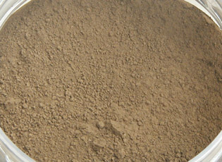
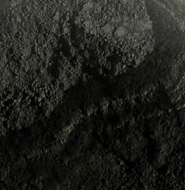
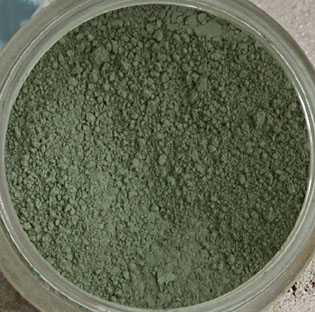
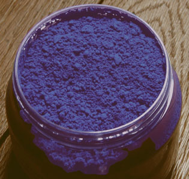

## Mauvaise absorption
### Mauvaise absorption, usage en arts plastiques et autres
 **Mauvaise absorption**  

Quand nous évoquons ici des pigments réputés "absorbant mal", nous entendons "mal" dans les deux sens possible : trop lentement ou trop rapidement. Nous distinguons par ailleurs le caractère absorbant d'un pigment de sa siccativité (présence d'un élément siccatif). Il n'est pas exceptionnel que ces deux propriétés soient confondues dans le contexte de la peinture à l'huile.

Il faut d'ailleurs préciser que la "prise d'huile" n'est pas la "prise d'acrylique" par exemple. Le caractère mouillant des liants joue un rôle de premier plan.

Selon la tradition, ces pigments sont :

**[](images/siennenaturelle.jpg)**_les [terres de Sienne](terresdesienne.html)_. Plusieurs peintres parmi nous ont effectivement constaté à maintes reprises le comportement très anormal (notamment très absorbant au broyage, mais aussi lors de la [siccativation](sechagesiccativation.html)) de ces très belles couleurs dans les traitements à l'huile, que ce soit sous forme de tubes ou de pigment incorporé manuellement au liant. Lire l'exemple sur les [terres de Siennes dans la section _Pouvoir absorbant et siccativité_ in _Les pigments, les couleurs_](pigments.html#exemplesiennes).

[](images/noirdivoireversionweb.jpg)_les [noirs](noirs.html)_. Bof ! Plusieurs auteurs en font tout un plat. _Ivoire,_ _Mars_, _Cassel_, finalement, ne sont vraiment pas si terribles et n'absorbent pas tant que les Sienne par exemple. Avouons cependant que nous n'avons pas encore testé le _[noir de fumée](noirs.html#lenoirdefumee)_ qui a une réputation particulièrement déplorable. Lire notre article sur [les noirs](noirs.html).

_[](images/garancepigment.jpg)les [laques](laques.html) d'origine végétale ou animale_. Là encore, la tradition, l'ouï-dire et le bouche à oreille s'installent effrontément dans la durée et continuent de faire des dégâts alors qu'il n'existe pratiquement plus aucune laque fabriquée à partir de végétaux ou d'animaux - variétés le plus souvent accusées. Le rouge kermès n'est plus extrait des oeufs de cochenille et l'alizarine a été synthétisée dès 1868 par Groebe et Libermannv(voir [anthraquinones](anthraquinones.html)). De fait, le broyage des laques ne pose absolument aucun problème, leur pouvoir absorbant étant tout à fait banal.

[](images/terreverte.jpg)_la [terre verte](vertscomplexes.html#loxydedechrome)_. Certains auteurs ont été jusqu'à accuser ce merveilleux pigment de "_faire glisser l'huile_". C'est vraiment une exagération incroyable ! La terre verte a sa manière de réagir. Celle-ci ne pose aucun problème. Il faut mélanger à peine plus que d'ordinaire le pigment et l'huile au début du liage. Il est incompréhensible qu'un pigment si exemplaire à tous points de vue soit encore l'objet de critiques aussi infondées.

[](images/terreverte.jpg)_le_ _[blanc de titane](blancssynthetiques.html#leblancdetitane)_. Son imbibition est toujours un peu lente que celle d'un pigment "moyen". Il a tendance à faire des grumeaux. Cela signifie qu'il faut prendre un peu plus de temps avec ce pigment lors de la mise en présence d'un liant.  
Après quoi il montre la tendance inverse : il absorbe très bien les liquides, quoique sans excès, comme si une "réserve d'air expulsable" demeurait en lui. Il n'est pas interdit de parier qu'il s'agit tout simplement de cela. En tout cas, tout se passe comme si c'était le cas. Le [titane](annexe1.html#ti) n'est-il pas un métal fort léger ? Est-ce un défaut ? Non. Il suffit de prendre le temps d'imbiber ce pigment de manière homogène au départ. En peinture à l'huile, on ne constate pas de problèmes de siccativation à proprement parler (aucune comparaison n'est possible avec les terres de Sienne mentionnées [ci-dessus](mauvaiseabsorp.html#terresdesienne)).  
Au contraire, on remarque quelquefois que les pigments trop chargés d'huile se bonifient lorsqu'ils sont mélangés avec un blanc de titane - y compris lorsqu'il s'agit de peinture en tubes. Ces phénomènes sont des particularités plus que des anomalies. Ils nécessitent une simple adaptation au procédé de peinture et aux mélanges envisagés.  
 

[](images/bleuoutremerfonce.jpg)_le [bleu outremer](outremer.html)_. Aucun d'entre nous n'a détecté la moindre anomalie dans les propriétés d'absorption de ce pigment remarquable, injustement accusé par de rares auteurs.

Dans l'ensemble, les pigments accusés à tort d'absorber mal ou trop sont avant tout les victimes de peintres quelquefois vraiment mal informés. Nous sommes finalement assez nombreux à estimer qu'il n'y a pas à proprement parler de mauvais pigments mais de mauvais broyages ou de mauvais emplois. Qu'un pigment absorbe peu ou beaucoup n'est pas un défaut mais une caractéristique exigeant une adaptation de notre part.


 [Communication](http://www.artrealite.com/annonceurs.htm) 

[](index-2.html#20131014)


```
title: Mauvaise absorption
date: Fri Dec 22 2023 11:27:40 GMT+0100 (Central European Standard Time)
author: postite
```
