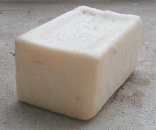

## Le nettoyage
### Le nettoyage des outils utilisés en peinture et arts plastiques
 **Le nettoyage**  

_Pour nettoyer outils et surfaces, l'emploi du [diluant](diluantssolvants.html) typique du procédé que vous utilisez - eau, essence, alcool ou autre - est nécessaire pour éviter de très mauvaises surprises à savoir des réactions chimiques inattendues. C'est cependant rarement suffisant : il est utile, le plus souvent, de recourir à la chimie toute simple de l'eau et du [savon](savon.html) dans un second temps._

Sommaire

[Outils dégradés et nettoyants dangereux](nettoyage.html#outilsdegrades)

[Cas courant : en cours ou en fin de séance](nettoyage.html#cascourants)

Dans des cas particuliers, lorsque par exemple on a affaire à des outils fortement dégradés, l'emploi d'un dissolvant puissant (voir [_Diluant, solvants, dissolvants_](diluantssolvants.html)) constitue un ultime recours qui n'est pas toujours sans danger non seulement pour les outils, mais aussi pour l'artiste.


> Certains fabricants proposent des "nettoyants pour pinceaux" comportant du [toluène](benzene.html#toluene), distribués sous les enseignes les plus habituelles. Sur l'étiquette des flacons, on ne voit que le X habituel et non la tête de mort des substances toxiques. Ce n'est pas une raison pour se sentir rassuré : il s'agit de produits réellement nocifs non seulement par ingestion et par inhalation _mais aussi par simple contact cutané_. Rien à voir avec le white-spirit, en principe plus bénin, estampillé pourtant d'un pictogramme identique.
> 
> 
> 
> De plus, bien qu'aucun pictogramme ne soit là pour avertir l'acheteur d'un simple coup d'oeil (sans lire la notice), ces produits sont parfois jugés "très inflammable" par les fabricant eux-mêmes. A ce titre, ils devraient, nous semble-t-il, arborer en toute logique le sigle habituel prévu à cet effet (voir ci-contre à gauche).

Alors comment nettoyer un outil vraiment dégradé ?

Pour dissoudre l'acrylique et la peinture à l'huile, [l'alcool à brûler](methanol.html#lalcoolabruler) et le [white spirit](essences.html#whitespirit) sont efficients mais doivent être testés sur un vieux pinceau car tous les poils ne le supportent pas forcément. Ils donnent rarement des résultats immédiats et il faut souvent une certaine patience. Il faut signaler en outre que ces produits ne sont pas anodins. Il faut absolument éviter un usage répété sans protections.

L'[acétone](acetone.html) dissout bien les graisses, mais ce produit, quoique non caustique, est assez puissant et doit donc être testé sur un échantillon lui aussi. Les pinceaux le supportent généralement mal. Seuls certains pinceaux à solvants, à poils synthétiques, le tolèrent vraiment bien.

En cas d'échec, il vaut mieux jeter l'outil que recourir à des produits trop agressifs qui posent non seulement des problèmes lors de leur emploi, mais aussi lorsqu'il faut les stocker.

_Dans tous les cas, il est conseillé, lorsque l'on travaille avec des pinceaux, de disposer de deux pots ou d'un pot et d'un [séchoir à pinceaux](outilspinceaux.html#lesechoirapinceaux) (qui évite l'écrasement des poils) ainsi que de chiffons ou de Sopalin ®. La spatule à peindre et les couteaux sont moins exigeants : un chiffon et un pot suffisent généralement._



Pour la peinture acrylique,  l'eau pure en cours de séance et l'eau savonnée en fin de séance sont généralement suffisants.

En ce qui concerne la peinture à l'huile, il faut **éviter l'essence de térébenthine** comme produit de nettoyage : contenant des résines végétales, _elle poisse_. Certaines essences minérales peuvent donner de meilleurs résultats. Le white spirit, à l'odeur entêtante, non dénué de résidus [benzéniques](benzene.html) et autres, peut gêner l'artiste et agresser un peu trop les poils de ses pinceaux. Les variétés désodorisées donnent des résultats inférieurs et sentent finalement assez fort (sorte d'odeur bizarre évoquant vaguement la lavande).

L'essence de pétrole désaromatisée (la [Kerdane ®](essences.html#kerdane) par exemple), moins agressive, inodore, plus pure et peu coûteuse, donne d'excellents résultats avec cette peinture. Les essences minérales raffinées peuvent également faire l'affaire. Elles sont encore plus pures, mais aussi plus chères.

En fin de séance, le nettoyage à l'eau et au savon est toujours très conseillé. Certaines sources signalent le [savon noir](savonnoir.html) comme particulièrement efficace. Nous pouvons confirmer cette information : on a rarement vu des pinceaux aussi propres !

Les autres peintures et produits de moulage peuvent nécessiter d'autres produits pour le nettoyage. Parfois, l'eau et le savon sont à déconseiller (avec la gomme laque notamment) et dans l'ensemble, il vaut mieux pratiquer un premier lavage approfondi avec le diluant normal du procédé concerné avant de recourir au savon.


 [Communication](http://www.artrealite.com/annonceurs.htm) 

[](index-2.html#20131014)


```
title: Le nettoyage
date: Fri Dec 22 2023 11:27:48 GMT+0100 (Central European Standard Time)
author: postite
```
