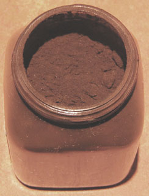

## Les noirs
### Les noirs, pigments utilisés en arts plastiques
 **Les noirs**  

_[English version](english/blacks.html) [](english/blacks.html)_ 

\[Lectures conseillées :  
[Le noir dans la langue française, Pourpre.com](http://www.pourpre.com/langue/expressions.php#noir)  
[La couleur noire, Pourpre.com](http://pourpre.com/chroma/dico.php?typ=fiche&&ent=noir)\]

_On rencontre quelques peintres qui signalent des difficultés avec les couleurs noires en tubes utilisées en sous-couches. Si la quantité d'huile adjointe par le fabricant est trop importante, il faut simplement respecter un temps de séchage plus long._

_Il semble qu'il y ait peut-être, à l'origine de ces rumeurs, une confusion entre noirs carbonés et [noir animal](noiranimal.html), confusion reproduite par certains fabricants de tubes américains, sans oublier certains auteurs européens par ailleurs excellents, qui assimilent à tort noir d'ivoire ou d'os avec noir animal._ _Le_ noir d'ivoire _n'est pas particulièrement porteur d'oxygène ni [d'osséine](no.html#osseine). Que dire du_ noir de vigne _qui par nature ne peut contenir d'osséine ?_

_Tout cela semble bizarre. Le noir n'est pas la seule couleur à se voir attribuer des facultés particulières : d'autres couleurs sombres sont dans le même cas. S'agit-il d'un problème de tradition mal transmise ou tout simplement de vision, se posant dans ces cas-là avec davantage d'acuité ? La réponse à cette question s'élaborera peu à peu, à la mesure des test que nous effectuerons, des [témoignages](ecrire.html) que nous recueillerons. Pour l'instant, il est hors de question que nous reprenions à notre compte les déplorables rumeurs sur ces couleurs majestueuses alors que l'expérience nous invite à ne pas le faire._

**Il existe au moins trois types d'emplois des noirs :** 

1.  **[l'emploi pur](noirs.html#lesnoirspurs)**
    
2.  **[la synthèse de noirs](noirs.html#lasynthesedenoirs)**
    
3.  **[l'emploi combiné du noir et d'autres couleurs](noirs.html#lesnoirscombinesadautrescouleurs)**
    

_Les noirs purs_

Ce sont :

> **\[Les noirs animaux\]**


> \* le noir d'ivoire et d'autres noirs produit par calcination d'os animaux dégraissés et blanchis, ont été utilisés, selon les sources d'informations soit en Grèce antique voire dans la Chypre préhistorique (3 000 BC selon [François Perego](livres.html#perego)) soit dans l'Égypte de l'Ancien Empire, donc quelques siècles plus tard. D'autres peuples ont pu s'en servir depuis des temps au moins aussi anciens.
> 
> Le noir d'ivoire véritable (_l'elephantinum_ de Pline) n'a été utilisé qu'assez rarement au cours de l'histoire, et pour cause : l'ivoire d'éléphant est coûteux, mais aussi fort apprécié à l'état brut, blanc cassé. Il faut avoir de sérieuses bonnes raisons pour calciner à grand peine un matériau simple qui a déjà une certaine valeur.
> 
> Ainsi, fort heureusement, aucun cimetière d'éléphants n'est exploité pour produire ce pigment, quoiqu'en disent certains auteurs décidément très mal informés. En fait, on ne distingue depuis longtemps le noir d'ivoire du [noir d'os](noirs.html#lenoirdos) que par la qualité de pigments obtenus avec d'autres animaux. L'espèce n'est d'ailleurs pas le seul critère de qualité car les méthodes de fabrication donnent des résultats variés.
> 
> D'après François Perego, ces noirs contiendraient 10 à 20% de carbone et le reste serait "inorganique" (un [sens particulier](organique.html#sensparticulier) de ce mot), principalement des sels de calcium dont un carbonate (information non recoupée), c'est-à-dire une [chaux](chaux.html) carbonatée, de la [calcite](calcite.html). Le fabricant pourrait - toujours selon F. Perego - modifier le rapport carbone/"inorganiques" par différents procédés afin d'obtenir un noir plus ou moins profond.
> 
> Le noir d'ivoire ordinaire est en général chromatiquement neutre quoique très discrètement chaud, mais la variété des animaux utilisés et les méthodes de fabrication peuvent donner d'autres colorations.
> 
> Il est normalement très permanent, stable dans les mélanges, très couvrant contrairement à ce que diverses sources affirment contre toute évidence, et fort colorant. Il est réputé peu siccatif, mais à tort : il se conduit parfaitement bien et même beaucoup mieux que certains pigments dont la réputation est meilleure. Ne pas parvenir à une pâte correctement siccative avec ce pigment remarquable serait très surprenant et pourrait résulter d'une fort mauvaise fabrication ou d'une contrefaçon.
> 
> _La photo ci-dessus représente un noir d'ivoire. Le contraste, la saturation et la luminosité de l'image ont été très accentués pour laisser percevoir quelques nuances chromatiques_.
> 
> Le noir d'ivoire est une référence pigmentaire de tout premier ordre.

Anecdote : "Un noir chaud qui bleuit ?", [ci-dessous](noirs.html#unnoirchaudquibleut)  
Lecture conseillée : [Le noir d'ivoire sur Pourpre.com](http://pourpre.com/chroma/dico.php?typ=fiche&&ent=ivoirenoir)

> \* le noir d'os, produit avec les os dégraissés de mouton calcinés ou d'autres animaux. De mauvaise qualité, peu couvrant et peu colorant, il a pratiquement disparu des palettes. On peut transformer un noir d'os en noir d'ivoire (entendre par là un noir de meilleure qualité) mais le procédé fait intervenir un produit et une manipulation dangereuse.
> 
> \* le noir de bois de cerf. Les andouillers râpés et calcinés ont été utilisés sur tout le continent eurasien. La poudre de bois de cerf calcinée est possiblement encore utilisé en Asie dans certains procédés secrets comme la fabrication de [l'encre de Chine](encredechine.html).
> 
> \* le noir de rhinocéros. En Chine, on a largement utilisé la poudre calcinée de la corne de ce malheureux animal. Elle autorise, c'est vrai, de très somptueux dégradés gris.
> 
> \* le noir de laine. Utilisé dans l'Orient musulman ancien, il aurait été produit par calcinations répétées de la laine située sur la queue du mouton, ajoutée de sel (source de l'information : [Anne Varichon](livres.html#annevarichon)). Il aurait donné une encre.
> 
> On mentionne aussi la laine des dromadaires noirs, teintée sans calcination préalable à l'aide de pigments ferreux et autres substances tinctoriales sombres.
> 
> \* les autres noirs d'origine animale. En Afrique notamment, les peaux de toutes sortes d'animaux ont été calcinées, souvent en association avec des oxydes de fer.
> 
> Il faut aussi mentionner la _sépia_, qui donne bien un noir lorsqu'elle n'est pas diluée. [Lire l'article consacré à cette substance](sepia.html).
> 
> Enfin, on travaille depuis quelque temps sur les spécificités exceptionnelles d'un "noir ultime" (dit ultrablack), découvert initialement sur les ailes d'un papillon. Ce noir est un métamatériau, pas un pigment. Détails dans un [passage](chap11metamateriaux.html#noirultime) du chapitre XI des Dialogues de Dotapea, _Les métamatériaux_.
> 
> **\[Les noirs végétaux\]**
> 
> \* le noir de pêche, produit traditionnellement par la calcination de noyaux de pêches, d'abricots, de cerises ou d'écorces d'amandes, fortement permanent. Il est de nuance chaude, légèrement rouge. C'est aujourd'hui un mélange de noir [d'aniline](anilines.html) et de terres qui a fait gagner à cette substance un caractère couvrant qu'elle n'avait pas auparavant (selon des sources sérieuses quoique non confirmées expérimentalement par nous).
> 
> \* le noir de vigne (dit au Moyen-âge _nigrum optimum_, "le meilleur des noirs"), fabriqué par combustion de jeunes pousses de vigne. Bleuté et splendide selon [Cennini](livres.html#cennini), il ne nous semble pas, dans les faits, présenter des caractéristiques si spectaculaires. Cela est peut-être dû aux procédés de fabrication actuels ou à leurs provenances. Certains peintres parmi nous confirment en effet qu'il présente bien un aspect bleuté mais ils indiquent que celui-ci a tendance à s'atténuer au séchage. D'autres expériences seront réalisées.
> 
> \* Le noir de campêche. Lire [le texte sur le bois de campêche dans l'article consacré aux violets et aux mauves](violetsetmauves.html#noirdecampeche).
> 
> \* Le noir de noix de galle. La noix de galle est une excroissance du chêne due à la présence de la larve d'un insecte parasite (cynips). Bourrée de tanin noir vaguement brun, connue au moins depuis 2500 BC (Égypte), elle a été utilisée en teinture, en peinture et en écriture, notamment au Moyen-âge en Occident où, associée au fer, elle a donné une "gallo-tannate de fer" très [permanente](pigments.html#permanence), encre très employée bien que coûteuse et difficile à réaliser (on mentionne donc évidemment des contrefaçons). L'association avec cet élément a persisté durablement, y compris en teinturerie.
> 
> Elle fut l'objet d'un fructueux commerce car elle était la seule substance produisant teintures et encres noires vraiment permanentes. La zone de production était assez vaste. Il s'agissait principalement d'une région syro-anatolienne très élargie, tout  le pourtour méditerranéen oriental produisant également la noix de galle pour une utilisation locale.
> 
> Comme teinture, la noix de galle est particulièrement difficile à utiliser. Colorant [substantif](substantif.html), elle a en elle-même des propriétés de [mordant](mordant.html) (elle fut parfois purement utilisée en tant que telle) pouvant la rendre corrosive lorsqu'elle est trop concentrée.
> 
> Son utilisation n'a pas cessé d'être intensive et a même connu une apogée en Occident au XVIIIème siècle (âge de la maîtrise pour de nombreuses teintures). Les adjuvants et procédés de teinturerie relevaient alors d'une chimie complexe, aguerrie.
> 
> Une variété japonaise de la noix de galle aurait été utilisée à l'époque médiévale.
> 
> \* le noir de fumée et le noir de suie. Ils désignent plus un procédé qu'une matière précise. Il se sont imposés pendant la préhistoire, l'Antiquité et au-delà. Pigments pour la peinture comme pour l'écriture et les teintures, il seraient les produits
> 
> > \* de la calcination de différentes substances résineuses, oléagineuses, ou d'empois dont le résidu serait recueilli au-dessus de la flamme. Fabriqués de cette manière, ils sont plus particulièrement employés en peinture. On les désigne couramment sous l'intitulé de "noirs de suie". Lire [passage in _Les dialogues de Dotapea, chap. I, A propos des liants_](chap01liants.html#stabiliteencredechine).
> > 
> > \* de la calcination du bois d'un pin, le _pinus teda_, particulièrement employé dans ce cas pour l'écriture. D'autres substances ligneuses peuvent être employées. Ces noirs sont couramment nommés "noirs de fumée" - appellation impropre car c'est toujours de suie qu'il s'agit, mais le terme fait référence.
> 
> Dans un cas comme dans l'autre, ces substances seraient couvrantes et colorantes, voire même liantes pour certaines d'entre elles ([voir bistre](encresdiverses.html#lebistre)) mais nous n'avons pas encore pu les tester. Nous ne nous attarderons pas sur la réputation que la rumeur leur a donnée concernant leurs caractéristiques de siccativation en utilisation avec les huiles à peindre tant ladite rumeur semble systématiquement injuste dès lors qu'il s'agit de pigments noirs. Leur aspect gras pourrait être à l'origine de cette opinion. Pour cette raison, certains auteurs insistent sur la difficulté de les incorporer aux peintures à l'eau et proposent des remèdes "costauds"  : détergents et alcool à brûler... Nous réservons pour plus tard une appréciation plus expérimentale et plus objective, _d'autant plus que les suies végétales et proprement oléagineuses n'ont vraiment pas le même comportement._
> 
>   
> Selon certaines sources, _le noir de fumée_ (pin) serait de meilleure qualité lorsqu'il est fortement carboné. Il a la réputation d'être généralement bleuté (contrairement au noir de suie, plutôt brun), mais toutes les suies ne se ressemblant pas, nous ne serons pas plus affirmatifs sur ce point.  
> En teinturerie, il figure parmi les colorants les plus misérables tandis que le noir de suie afficherait une tenue correcte.
> 
> Égyptiens, Grecs et Romains utilisèrent les deux variétés (lire [Encres diverses](encresdiverses.html)). On trouve aussi le noir de fumée à Ajanta (Dekkan, Union Indienne, IIème siècle BC - VIIème AC).  


> L'encre de Chine serait fabriquée avec un [noir de fumée](noirs.html#lenoirdefumee) très particulier (lire [l'article consacré à l'encre de Chine](encredechine.html)).
> 
> Toujours en Chine, on a utilisé les dépôts calcinés situés sur le bas des marmites (côté flamme, à l'extérieur) pour réaliser certains dessins et motifs d'importance traditionnellement mineure (cerf-volants notamment). Ce noir est dit "_noir de marmite_". On mentionne l'emploi de substances équivalentes en Afrique Centrale et dans la culture berbère, mais, dans ce cas, à des fins de tatouage.
> 
> Sur tous les continents et même sur la banquise, le noir de fumée serait le pigment le plus utilisé pour les tatouages traditionnels.
> 
> Variantes de noirs de suie :
> 
> > \* le bistre ([voir texte in _Encres diverses_](encresdiverses.html#lebistre)) est fabriqué à l'aide de suie.
> > 
> > \* le noir de lampe est une autre appellation du noir de suie ([voir ci-dessus](noirs.html#noirdesuie)). Il pourrait s'agir d'un anglicisme.
> > 
> > \* le noir de carbone - un nom qui en dit long ! -, fabriqué de différentes manières, est une version industrielle.
> 
> \* le noir obtenu par pyrogravure. C'est une variété un peu particulière de noir végétal. Il s'agit en effet de calciner du bois, la plupart du temps. Ce procédé n'a rien de contemporain. Il a été utilisé par diverses civilisations maîtrisant suffisamment la métallurgie. Avec un métal chauffé au rouge, on trace des motifs sur la surface. Mais on peu aussi carboniser intégralement des objets, plus ou moins superficiellement et pour cela, aucune technique précise n'est requise. 
> 
> Aujourd'hui, on peut utiliser des [pyrograveurs](pyrograveur.html) électriques pour traiter d'autres supports que le bois.
> 
> \* les autres noirs végétaux. Les écorces de saule, de hêtre, d'ébène, de daphné, de lianes, d'acacia, voire de fruits comme la grenade, l'amande ou la noix de coco - tous riches en [tanin](tanin.html), réagissant avec les oxydes métalliques, ce qui explique la pratique très courante de bains de boue ou de vase -, les noyaux de prunes, de pêches ou de cerises, les gousses de gommiers et les racines de chênes sauvages, le plus souvent calcinés, ont été employés sur les différents continents de la planète. Les teintes obtenues varient en fonction des essences végétales.
> 
> Dès la préhistoire, ce genre de noirs, à base de végétaux calcinés parfois mêlés à des graisses animales, a été utilisé pour la peinture pariétale. Parallèlement, tout au long de l'histoire, le bois brûlé (non lié à une graisse) tout comme le fusain actuel ont autorisé des corrections, donc des travaux d'[ébauche](ebauche.html), d'[esquisse](esquisse.html) et de [croquis](croquis.html) (lire [l'article consacré aux dessins préparatoires](dessinpreparatoire.html)). Les exemples d'emplois dans des domaines variés, à toutes les époques et dans toutes les régions du monde - y compris le Grand Nord - sont innombrables. L'usage conjoint d'un [liant](liants.html) permit d'obtenir, dès le paléolithique dans certains cas, de véritables peintures.
> 
> Mentionnons enfin l'emploi, non sans importance,
> 
> > \* du _noir de lie de vin calcinée_ dans l'Égypte du Fayoum. Il s'est bien conservé, mais dans des conditions exceptionnelles il est vrai. Voir [lie](lie.html).
> > 
> > \* du _noir de vin_, utilisé par les Étrusques conjointement au [noir de vigne](noirs.html#lenoirdevigne), il est issu de la calcination du marc de vin (lire [l'article marc du glossaire, acception 1](marc.html)).
> > 
> > \* des _feuilles de châtaigner, séchées ou non (et éventuellement l'écorce et les bogues des châtaignes, également colorantes)_. Naturellement, ces éléments donnent des dégradés allant du jaune impur au brun le plus foncé. Adjoints d'oxydes de fer, ils produisent des noirs et des gris. Au XIXème siècle, ils furent associées en sous-couche ou en sur-couche avec le [bois de campêche](violetsetmauves.html#leboisdecampeche) pour former de véritables noirs. Ils ont aussi été utilisées en tannerie. La moitié du XXème siècle voit survenir le début du déclin de l'exploitation des feuilles de châtaigner.
> > 
> > Les rameaux peuvent être utilisés en décoction comme [mordants](mordant.html), apportant cependant une coloration jaune. Les cendres donneraient par contre de très bons résultats.
> > 
> > La culture du châtaignier est pratiquée en Europe, en Afrique du Nord et en Amérique du Nord.
> > 
> > \* du _brou de noix_. [Lire la page consacrée à ce produit](broudenoix.html).
> 
> **\[Les noirs minéraux\]**

> \* les noirs de vase. Ils ont surtout été utilisés en teinturerie par de nombreux peuples. La longévité de ces procédés est assez faible de toutes manières. Délayés, les noirs de vase donnent des teintes variées (gris, verts, bruns). Certaines vases ont aussi des propriétés de [mordants](mordant.html). Quelques peintres travaillant avec des terres naturelles se servent occasionnellement de cet élément dont la composition peut varier considérablement.
> 
> Les vases marines les plus pures sont draguées autour des îles Chausey, au large de Granville (Manche, France) mais nous ne savons pas si elles peuvent être employées en peinture ou en teinturerie. Nos sources d'informations ne mentionnent que des vases non salines.
> 
> Ce qui caractérise les vases, ce qui leur a valu un emploi dans le monde entier, c'est en premier lieu le fait qu'elles contiennent des oxydes métalliques (voir _[Les autres noirs végétaux](noirs.html#lesautresnoirsvegetaux)_). Nous conseillons donc aux "curieux de la vase" de faire analyser préalablement des échantillons des produits prélevés afin de déterminer le traitement qui peut éventuellement être appliqué.
> 
> \* le noir de Mars ou noir de fer, un oxyde de fer naturel ou synthétique, très utilisé en peinture acrylique mais aussi en peinture à l'huile et autres procédés. Peu couvrant et peu colorant selon certaines sources, il compte en réalité parmi les substances les plus couvrantes et les plus colorantes, comme tous les oxydes ferreux purs. Il est très légèrement froid.  
> En peinture décorative, il présenterait aussi certaines vertus en tant qu'enduit antirouille.  
> C'est une référence notoire au même titre que le noir d'ivoire, bien qu'il se comporte différemment.
> 
> \* le noir de manganèse. C'est un oxyde du [manganèse](manganese.html). Il semble extrêmement rare. Il aurait notamment été utilisé dans le passé par les aborigènes australiens.
> 
> \* le khôl. Lire [l'article du glossaire](khol.html).
> 
> \* le noir de Prusse. C'est un [bleu de Prusse](bleuschauds.html#lebleudeprusse) calciné, très peu employé.
> 
> \* la terre de Cassel. Elle n'est pas une terre au sens strictement minéral du terme. Son origine est végétale : il s'agit d'une lignite (charbon de bois, riche en carbone à hauteur de 70%). C'est un noir très chaud. Il passe pour fugace mais nous n'avons pas du tout constaté ce défaut, loin s'en faut. Ce pigment est nettement moins couvrant que les noirs d'ivoire ou de Mars et autorise, pour cette raison, _de très intéressants dégradés de gris brunâtres_ même sans adjonction de blanc (par simple dilution). Pour cette raison, il a été employé dans la fabrication de substituts du brou de noix.
> 
> Une "variante" de la terre de Cassel serait une terre d'ombre particulière, celle de Nocera Umbra ([lien](chap10ocrebleue.html#terredenocera)).
> 
> 
> 
> \* le bitume (voir photo d'un pot de bitume de Judée ci-contre). Extrait sur des sols couvrant des nappes de pétrole, il a connu deux périodes glorieuses :
> 
> > \* dans l'antiquité moyen-orientale, il était une importante source de production de pigment noir
> > 
> > \* à la fin du XIXème siècle, il fit une apparition remarquée, peu avant que les peintres découvrent _le comportement catastrophiqu_e de ce colorant, surtout en peinture à l'huile. Il ne sèche jamais et traverse les couches de peinture, occasionnant des craquelures épouvantables ! Le _Radeau de la Méduse_ en aurait fait les frais.
> 
> Une imitation créée dans une gamme d'huiles extra-fines a donné lieu à une [laque de bitume](laques.html#lalaquedebitume) de bonne tenue. Le bitume de Judée n'est utilisé aujourd'hui qu'en gravure et en ébénisterie. A ce sujet, lire [l'article du glossaire](bitume.html).
> 
> Lecture conseillée : [Le bitume sur Pourpre.com](http://pourpre.com/chroma/dico.php?typ=fiche&&ent=bitume)
> 
> [Lire aussi passage _in_ Le craquelé.](craquelures.html#techniquesaubitumeetalapoix)
> 
> \* les noirs du tiers-monde. En Afrique et dans l'Australie des aborigènes, on utilise les substances composant les batteries et les piles pour la peinture décorative et les fonds d'oeuvres artistiques. Bien souvent, ces produits contiennent des métaux lourds.

_La synthèse de noirs_

Synthèse organique

Mentionnons pour le moment un _noir [d'aniline](anilines.html)_ qui n'a pas mauvaise presse.

Lecture conseillée : [le noir d'aniline sur Pourpre.com.](http://pourpre.com/chroma/dico.php?typ=fiche&&ent=anilinenoir)

Synthèse en mélange

Avec l'aquarelle, créer un noir est aisé : il suffit de combiner un bleu sombre (du [gris de Payne](gris.html#payne) à [l'outremer foncé](outremer.html#photobleuoutremerfonce)) avec une terre brune (de la [Sienne brûlée](terresdesienne.html#labrulee) à la [terre d'ombre brûlée](terresdombre.html#savarietecalcinee) en passant par [l'ombre naturelle](terresdombre.html#aletatnoncalcine)). La même combinaison en peinture à l'huile, est toujours un peu plus malaisée. Il est difficile de ne pas obtenir un gris mais certains peintres y parviennent. D'autres partent d'une base violacée très sombre obtenue par mélange de bleus sombres et de rouges froids.

En peinture à l'huile ou acrylique, souvent, le plus beau noir se révèle à la longue, après application de nombreux glacis par exemple.

Les noirs présynthétisés existent. Mentionnons tout particulièrement la TEINTE NEUTRE, sorte de noir employé en aquarelle. Sa composition est typiquement un PBk + un PR + un PB (voir [nomenclature pigmentaire](nomenclaturepig.html)). Elle donne donc généralement une teinte violacée parfois exagérée. Le terme 'neutre' pourrait référer à la réputation du violet, ni froid, ni chaud selon certains (alors que d'autres le considèrent comme froid). Il serait en effet excessif d'affirmer qu'un rouge adjoint d'un bleu donne une teinte neutre chromatiquement parlant car il ne s'agit en aucun cas de [complémentaires](c.html#complementaires).

Teintures noires anciennes

Dans le domaine des procédés de teinture du passé, le noir, toujours difficile à obtenir, a notamment été produit par passages successifs dans différents bains de couleurs plus ou moins complémentaires. Cependant, cette pratique a été durablement interdite en Occident pour des raisons religieuses ([voir Techniques de mélange de couleur](techmelangecouleurs.html)).

_Les noirs combinés à d'autres couleurs_

Ce type de combinaisons est une approche qui fait partie des procédés les plus représentatifs de la subtilité de la peinture à l'huile et à l'acrylique. Les noirs bleutés d'avance ou les noirs chauds prêts à l'emploi ne sont pas forcément préférables ni supérieurs aux synthèses opérées par de nombreux peintres qui ont créé leur "[noir corbeau](http://pourpre.com/chroma/dico.php?typ=fiche&ent=noir)" (un terme récurent) à l'aide d'un noir d'ivoire mêlé de bleu et parfois d'un blanc froid, ou bien leur "noir chaud", emprunt de rouge, leur "noir neutre" violacé, etc.

Il existe un mélange donnant des résultats très différents, semblant irréels : le noir avec le jaune. Il donne des verts somptueux, inattendus, beaucoup plus riches que la combinaison jaune+bleu.

_Toxicité_

Les noirs recelant du carbone pourraient être cancérigènes par contact fortement répété avec la peau (information absolument pas confirmée).

_Un noir chaud qui bleuit  ?_

Certains auteurs affublent le [noir d'ivoire](noirs.html#lenoirdivoire) de la capacité de former des bleus en emploi avec un blanc acrylique ou autre, en solution aqueuse. Nous avons maintes fois constaté l'effet contraire : ce noir produit un gris plutôt neutre mais très, très légèrement brun, certainement pas bleu. Peut-être la composition moléculaire du noir et du blanc peuvent-elles jouer un rôle suffisamment réactif dans la combinaison pour produire le résultat annoncé. Autre possibilité : c'est le blanc qui serait bleuté. Un titane, par exemple, peut avoir différentes teintes en fonction du matériau employé pour l'enrober ([lien](courrierdeslecteurs2010b270.html#20100802cs)).

Nous n'avons jamais constaté ce bleuissement et quand bien même on le constaterait, la variété des procédés de fabrication de ce noir ne permet pas, de toute façon, d'établir une véritable norme chromatique. L'existence de spécimens vaguement bleutés n'est pas de l'ordre de l'impossible, on le sait. On peut juste dire qu'en achetant un tube de ce noir et en y ajoutant un blanc quelconque, sauf miracle, on n'obtient pas un bleu, cela est un pur fantasme.

Dans des cas beaucoup plus particuliers, ce "miracle" peut quand même peut-être survenir. Le bleuissement est en effet mentionné pour un autre couleur où une substance d'origine osseuse pourrait avoir été employée conjointement à un blanc. C'est l'ocre bleue de Degottex dont il est question dans le chapitre X des Dialogues de Dotapea. Lire un passage [ici](chap10ocrebleue.html). Ou [tout l'article](chap10ocrebleue.html). Mais en aucun cas il ne s'agit de pigments ordinaires. C'est une réaction chimique dont l'existence n'est à cette heure même pas confirmée, encore moins expliquée et reconstituée, à défaut d'analyse des éléments en présence.


 [Communication](http://www.artrealite.com/annonceurs.htm) 

[](index-2.html#20131014)


```
title: Les noirs
date: Fri Dec 22 2023 11:27:50 GMT+0100 (Central European Standard Time)
author: postite
```
