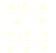
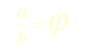
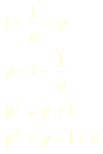
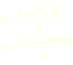
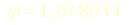
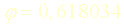

## Les nombres spéciaux
### Les nombres spéciaux, mathématique et cognition
 **Les nombres spéciaux**  

_Nombre d'or, règle d'harmonie et règle des tiers relèvent autant des mathématiques que de la science cognitive. Leur importance dans le domaine des arts plastiques est considérable._

_Certains peintres affirment qu'un [format figure](chassis.html#figure) (basé sur le nombre d'or), par exemple, est presque déjà une oeuvre en soi. C'est certain : le format, le rapport, le nombre, en fait, est esthétique et Pythagore ne nous a pas attendu pour l'affirmer. L'école de Crotone enseignait, autour du concept d'harmonie, une explication mathématique de l'univers qui a immédiatement et définitivement trouvé un écho dans le monde artistique. Du bâtisseur de cathédrales au fabricant de châssis en passant par le musicien, tous se sont saisis de l'harmonie engendrée par quelques nombres privilégiés._

Sommaire

[Le nombre d'or ou section dorée](nombresspeciaux.html#nombredor)

[La porte d'harmonie](nombresspeciaux.html#portedharmonie)

[La règle des tiers](nombresspeciaux.html#regledestiers)

[La règle du report](nombresspeciaux.html#regledureport)

Il semble que la science cognitive contemporaine donne une certaine assise à ces théories en constatant notamment que l'oeil humain est effectivement "calé" sur certaines règles de cognition de l'image, en relation avec des proportions. Cependant, il faut spécifier que la règle du report, la porte d'harmonie et surtout la règle des tiers - extrêmement efficace - n'ont pas la "noblesse mathématique" de la très fameuse section dorée. Elles sont construites sur un rapport direct et une constatation empirique d'efficience.

_Le nombre d'or, dit aussi règle d'or ou section dorée_

Ce chiffre est issu directement d'une équation simple mais très particulière dont nous donnerons la résolution :

> 
> 
> _Posons que_
> 
> 
> 
> > alors
> > 
> > 
> 
> _ce qui est une équation du second degré, donc,_
> 
> 
> 
> > _donc,_
> > 
> > 
> > 
> > _ou_
> > 
> > 

Voilà finalement le nombre d'or. Deux valeurs en fait.

Leurs carrés, leurs cubes, leurs multiplications ou leurs divisions par 2 ou par 3, leurs compléments à 2 (0,381966 et 1,381966) donnent également des résultats intéressants, exploités depuis l'Antiquité.

Dans le domaine des châssis destinés à l'emploi en peinture, [le format Marine](chassis.html#marine) est directement tiré du nombre d'or alors que [le format Figure](chassis.html#figure) est issu de sa multiplication par deux.

_La porte d'harmonie_

Elle a pour base la racine de 2 :

> ≈ 1,414214...

Elle n'est autre que le report de la diagonale d'un carré.

La porte d'harmonie s'inscrit dans la droite ligne des travaux mathématiques, esthétiques et philosophique de l'école pythagoricienne. Rappelons nous le fameux théorème "_Le carré de l'hypoténuse est égal à la somme des carrés des deux autres côtés_". Les maîtres de Crotone ont perçu dans cette règle naturelle une harmonie universelle.

La porte d'harmonie a trouvé une application dans l'établissement du [format de châssis dit "Paysage"](chassis.html#paysage).

_La règle des tiers_

Très efficace, très connue de tous les professionnels de l'image, très contemporaine mais déjà très utilisée - sans dire son nom - dans le passé (songer aux innombrables triptyques médiévaux), elle détermine surtout des "points forts" sur une image.

Les quatre points les plus importants, ceux qui captent le mieux l'attention dans un rectangle ou un carré, sont situés à l'intersection des tiers. Il s'agit peut-être moins d'une question d'harmonie que de cognition.

_La règle du report_

Parent pauvre, sans fondement mathématique, elle n'est autre que le report du petit côté sur le grand côté d'un rectangle dans le cas d'un fractionnement, ou le report du grand côté dans le cas d'un accroissement. _A tort ou à raison,_ elle n'est pas reconnue comme très efficace.


 [Communication](http://www.artrealite.com/annonceurs.htm) 

[](index-2.html#20131014)


```
title: Les nombres spéciaux
date: Fri Dec 22 2023 11:27:50 GMT+0100 (Central European Standard Time)
author: postite
```
