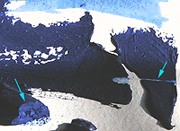
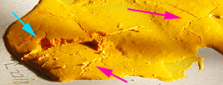
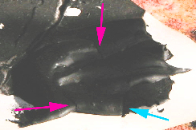

## L'oeuf
### L'oeuf, usage en arts plastiques
 **L'oeuf**  **Oeuf, jaune et huile d'oeuf**

Habituellement, c'est le jaune qui est employé car c'est lui qui contient le liant, la [lécithine](lecithine.html), dite "huile d'oeuf".

Xavier de Langlais (lui-même inventeur d'un médium à l'oeuf pour la peinture à l'huile) mentionne ce produit, cette pure "huile d'oeuf" dont le coûteux procédé d'extraction a été mis au point par [Vibert](livres.html#vibert) : "\[...\] _elle ne se corrompt pas et dissout les résines à froid. En outre, bien que non siccative par elle-même elle forme des vernis qui durcissent normalement._" "\[...\] _il n'est pas certain que Vibert (qui a su enrichir le matériel artistique de plusieurs produits intéressants, notamment de vernis au pétrole parfaitement stables) n'a pas commis une erreur en isolant l'un des éléments constitutifs de l'oeuf pour en faire une huile de broyage._ ". ([Xavier de Langlais, _La technique de la peinture à l'huile_](livres.html#langlais)).

_Sur un sujet proche  
(vernissage d'une tempera),  
lire le [courrier d'une lectrice](courrierdeslecteurs2011b160.html#20110710mm)_

**Une puissante émulsion qui implique des contraintes**

L'intérêt du procédé à l'oeuf réside pourtant dans le fait que le jaune d'oeuf est **une émulsion naturelle** ([émulsion maigre](liantsemulsions.html#emulsionsmaigres)). Il peut aussi bien être employé comme liant pur que comme adjuvant pour la peinture à l'huile ou bien comme complément légèrement oléagineux pour les peintures aqueuses.

Attention : le jaune d'oeuf, bien que partiellement gras, sèche tout de même assez rapidement. Notamment, employé sans huile additionnelle, il rend malaisé le travail [_alla prima_](p.html#primaallaprima) à cause de temps de séchage trop courts. Il se prête par contre très bien aux travaux semi-transparents, même s'il a longtemps été utilisé comme une gouache, à la manière opaque.

_Le diluant le plus utilisé est l'eau (de préférence [distillée](eau.html#eaudistillee) car chimiquement neutre et plus pure). [L'essence](essences.html) peut aussi être utilisée mais son intérêt et son efficacité ne se révèlent pleinement que lorsque la peinture est adjointe de corps plus gras ([émulsion grasse](liantsemulsions.html#emulsionsgrasses)) ou bien, dans le cas de la térébenthine, lorsque l'on veut diluer massivement la peinture car elle apporte des résines protectrices et solidifiantes. Dans ce cas, il est inutile d'en incorporer de grandes quantités (1/20ème, 1/10ème du volume de l'eau), sauf, encore une fois, si des corps gras ont été ajoutés._ 

**Emploi ancien du blanc d'oeuf au broyage**

A l'époque des enluminures, lorsqu'il fallait broyer un pigment dans le but de travailler à la plume et non au pinceau, on utilisait du blanc d'oeuf non pas comme liant mais comme adjuvant. Malgré les étranges dogmes proférées et appliqués dans ce domaine à cette époque, nous dirons seulement qu'il est possible que ce produit ait effectivement pu apporter un peu de fluidité aux pâtes étant donné sa charge en eau.

Certains auteurs actuels mentionnent l'emploi du blanc d'oeuf comme liant au Moyen-âge. La chose n'est pas totalement impossible mais les conditions de mise en oeuvre devaient être assez complexes étant donné les insuffisances dramatiques de cette substance par rapport au jaune.

**Médor et la tempera**

Une histoire vraie, d'un confrère qui s'essayait à la tempera à l'oeuf.

Il avait posé plusieurs tableaux le long du mur pour qu'ils sèchent, puis s'était absenté.

A son retour, il trouva son chien en train de terminer un festin de tempera. L'animal avait soigneusement léché (et détruit) les tableaux.

Médor eut beaucoup de chance que notre ami n'ait pas employé de pigments vraiment toxiques pour ses travaux. Il n'a donc ingéré que des arylides et autres azoïques, peut-être aussi quand même une peu de phtalocyanine de cuivre, déjà moins sain, mais pas de cadmium ni d'autres substances plus dangereuses. L'animal ne tomba pas malade, l'histoire fait donc rire.

Il fallait donc bien mentionner ce danger tout spécifique à la peinture à l'oeuf. Il est important de placer les tableaux frais et les pâtes non seulement hors de la portée des enfants, mais aussi de celle des animaux.

**Éléments pour recettes**

_Comme en gastronomie, les recettes de peintures à l'oeuf sont innombrables. Elles sont tantôt savantes, tantôt abracadabrantes. Elles peuvent mettre en oeuvre les éléments que nous avons pu recenser (voir ci-dessous) et beaucoup d'autres, valables ou non. Nous vous en livrons la liste non sans émettre quelques réserves : chaque élément ajouté constitue un risque supplémentaire de provoquer une réaction chimique ou mécanique incontrôlée sur le moyen ou le long terme._

_A noter, justement, que les méthodes les plus classiques de tempera à l'oeuf (icônes) peuvent certainement apporter des solutions stables, éprouvées par le temps, mais elles ne sont pas toujours très ludiques ! D'une manière générale, il est théoriquement prudent d'éviter d'incorporer des corps [alcalins](alcalin.html) qui risqueraient de [saponifier](saponification.html) la graisse du jaune. N'hésitez pas à [nous faire part de vos expériences](ecrire.html)._

**Liste de composants utilisables pour une tempera à l'oeuf :**

> \* le jaune, pour son rôle de liant-émulsion au satiné merveilleux. Il peut être pertinent de le crever afin de ne pas introduire sa membrane dans le mélange
> 
> \* une huile (oeillette, lin, etc., voir _[Les huiles](huiles.html)_), qui apporte sa solidité, sa beauté satinée, son épaisseur, son temps de séchage. Voir [émulsion huile/oeuf](liantsemulsions.html#emulsionhuileliantaloeuf)
> 
> \* le liant méthylcellulosique, ([voir article](methylcellulosiqueliant.html)) qui permet d'accroître l'onctuosité de la peinture
> 
> \* la caséine ([voir article](caseine.html)). Pour le moment, nous ne pouvons nous prononcer quant à la pertinence de son emploi. Tout témoignage est bienvenu ([nous écrire](ecrire.html)).
> 
> \* une résine tendre (dammar ou - plus rarement - mastic dilué dans l'essence, térébenthine de Venise), pour la même raison que l'huile : l'obtention d'une solidité tempérée. Les recettes aux résines dures comme le copal et l'ambre ou à [l'huile de copahu](autreshuiles.html#lhuiledecopahu) ne sont pas forcément à conseiller étant donné la structure déjà solide de la tempera à l'oeuf - quoique l'adjonction d'éléments comme la cire ou l'emploi d'une grande quantité d'huile pourraient compliquer cette donnée structurelle et autoriser l'emploi de ces produits moyennant expérimentation approfondie.  
> 1/2 coquille de résine diluée dans l'essence (chimiquement neutre et non-aromatique si possible - voir _[Les essences](essences.html)_) est une proportion normale pour un jaune d'oeuf entier, alors que le [baume de térébenthine de Venise](venise.html) ne doit être adjointe qu'en doses homéopathiques (5% grand maximum) 
> 
> \* la glycérine (3 gouttes pour un jaune d'oeuf environ), substance assouplissante et retardant le séchage, très intéressante mais non anodine chimiquement parlant - il s'agit d'un [polyalcool](polyalcoolpolyol.html)_._ Elle peut donc interagir lentement mais sûrement avec d'éventuels éléments acides. [Lire l'article consacré à ce produit.](glycerine.html)
> 
> 
> 
> \* le sucre candy ou le miel, très conseillés par certains artistes, allient plusieurs avantages : conservation, souplesse, onctuosité, "temps d'ouverture" plus long. Attention : pour la même raison que pour la glycérine - tous ces produits contiennent des alcools -, la présence d'acides dans la pâte et le support peut rendre délicate l'adjonction de [sucre](sucre.html). En ce qui concerne le miel, ils est souhaitable de choisir une variété classique, liquide et transparente (voir photo ci-contre)
> 
> \* la gomme arabique (environ 15 à 30 cl d'[eau gommée](gommearabaquar.html#eaugommee) pour un jaune d'oeuf) pour une cure amaigrissante... Il s'agit là de se rapprocher des propriétés de transparence de l'aquarelle
> 
> \* le vinaigre, adjuvant très classique qui prolonge la conservation de la pâte mais dont la composition chimique peut poser des problèmes d'interactions. Contenant de l'alcool éthylique et un aldéhyde, il peut interagir avec d'éventuels éléments acides. [Lire l'article du glossaire.](vinaigre.html)
> 
> \* le jus de persil est utilisé en lieu et place du vinaigre par quelques artistes qui n'ont pas pu (ou voulu) nous en donner la raison. L'utilisation de cet ingrédient serait traditionnelle mais les traditions, dans ce domaine, sont innombrables. Toute information au sujet de cet adjuvant sera [la bienvenue](ecrire.html)
> 
> \* les vins blancs doux, utilisés à la place du vinaigre et/ou du sucre, sont chaudement conseillés par certains artistes. Contenant de l'alcool, ils peuvent interagir avec d'éventuels éléments acide mais apportent encore plus que le vinaigre des propriétés de conservation.
> 
> \* Le citron à petite dose pourrait présenter la même fonction conservatrice. Il vaut mieux éviter de l'employer conjointement avec de l'alcool mais surtout avec des éléments [alcalins](alcali.html) (caséine, pigments [alcalinoterreux](alcalinoterreux.html), etc.).
> 
> \* la cire (2 cuillerées à café de [cire d'abeille blanche](cires.html#cireblanche) pour un jaune d'oeuf), combinée à des résines tendres ou dures et/ou de la gomme arabique, en grande quantité de toutes façons pour compenser la mollesse et la fragilité de cet adjuvant
> 
> \* le blanc d'oeuf, qui peut être utilisé à la manière d'un médium : très aqueux (85% d'eau), très maigre mais _**très visqueux**_ (voir [albumine](albumine.html)) et dépourvu d'onctuosité ; il est transparent, il donne de la vivacité aux couleurs, mais employé massivement il n'a aucune tenue : il devient friable au séchage. Il faut impérativement l'associer à un autre produit : un jaune, une huile, un liant aqueux, une résine.
> 
> \* l'eau, de préférence [déminéralisée ou distillée](eau.html).
> 
> \* La térébenthine ([voir glossaire](terebenthine.html)), utile comme diluant surtout si vous ajoutez des corps gras. Elle a aussi une fonction de médium, apportant les résines que ne contiennent pas les diluants purs.

Lire un [exemple de recette](liantsemulsions.html#unerecettedemulsionhuileoeuf) dans l'article consacré aux [liants émulsions](liantsemulsions.html).

**Une pratique originale mais digne d'intérêt : la peinture à la mayonnaise**

_Ce n'est pas une plaisanterie. Ce n'est pas non plus un procédé simple et rien ne dit qu'il fonctionne vraiment. C'est véritablement une piste de recherche qui peut intéresser des peintres et des curieux (voire des fabricants peut-être), mais on ne pourra livrer ici absolument aucune "recette de peinture" directement exploitable._

Avant d'en dire davantage, précisons qu'en cuisine, il existe en ce qui concerne la mayonnaise une infinité de recettes et de conseils souvent complètement absurdes (voire pires qu'absurdes) et encore plus souvent dénuées de fondements scientifiques ou expérimentaux. Avant d'effectuer les expériences qui ont permis la réalisation de ce petit texte, nous nous sommes notamment informés des travaux de Hervé This, un scientifique spécialisé bien connu des cuisiniers professionnels, afin de partir d'une vision où le vrai est d'emblée largement dégagé du faux ou du flou sur ce sujet en fait très épineux et assez "pointu" malgré les apparences banales.

Quel est l'enjeu ? L'obtention d'une pâte émulsionnée de bel aspect capable de siccativer en profondeur et autorisant donc de forts empâtements aussi bien que des jus très légers. Tout cela avec des produits parfaitement naturels. C'est en fait, ne le cachons pas, un enjeu de tout premier plan, presque un rêve de peintre et rien ne dit que les ébauches d'expériences qui sont décrites ci-dessous constituent vraiment un commencement de solution à cette quête. En fait, rien n'est sûr, le terrain est incertain.

De quoi s'agit-il ? Essentiellement d'une tempera à l'oeuf dont la spécificité repose sur les éléments suivants :

> \* le fait de battre les jaunes afin d'incorporer de l'air dans la future pâte,
> 
> \* l'apport d'une huile dont la siccativation bénéficie de cet apport d'air.

Au départ, une mayonnaise "culinaire"contient ceci :

> \* du jaune d'oeuf (remarquer que le blanc est utilisable aussi mais nos expériences ont démontré qu'il est plus ardu alors d'obtenir une substance bien mousseuse),
> 
> \* un apport aqueux sous la forme de vinaigre ou de citron dont les acides jouent un rôle avant tout gustatif - on peut dont utiliser de l'eau pure dans le cas qui nous occupe -,
> 
> \* une petite quantité d'huile alimentaire. On peut se servir de [l'huile de tournesol](autreshuiles.html#lhuiledetournesol) en peinture, mais il est très facile de lui substituer de l'huile de lin ou une autre huile à peindre. Cependant, le tournesol présente un petit avantage pour certains travaux très particuliers : l'huile est consommable et si le pigment l'est aussi, c'est toute la pâte à peindre (si elle est fraîche) qui peut être ingérée.
> 
> \* et enfin des apports destinés à rehausser le goût : le sel et le poivre, inutiles ici.

En quelles quantités ? Difficile a dire : d'une part il est difficile de trouver une recette indiquant des proportions, d'autre part elles varient de toute façon en fonction des goûts et des produits. Pourtant, c'est là que tout se joue dans notre démarche comme nous allons le voir..

_Note : dans les images qui suivent,  
les flèches bleues pointent des accidents provoqués  
(entailles dans la pâte) et les flèches mauves  
désignent des accidents non voulus._

_Précision : pour faire monter ces "mayonnaises",  
utiliser de préférence une batteuse électrique.  
Lorsque le produit "colle au fouet", c'est optimal, prêt à l'emploi._

_**Avertissements :** n'essayez pas de manger de tels mélanges !  
Les ingrédients ne sont pas toxiques mais mauvais et indigestes,  
sans parler de la toxicité propre aux pigments que vous pouvez ajouter.  
Éviter de faire sécher ce type de travaux a proximité de produits  
alimentaires **!** pour ne pas risquer une contamination bactérienne  
qui, elle, serait très grave (salmonelle ou autre).  
Noter que la fraîcheur n'est pas conseillée spécifiquement  
dans ce contexte, au contraire. Donc le réfrigérateur n'est d'aucun secours._

Voici le résultat d'un test effectué avec deux oeufs, à peine une petite cuillerée d'eau, une faible quantité d'huile de lin (petite cuillerée à peine remplie) et du pigment outremer foncé commun :



L'empâtement en bas à gauche est important. Il est épais d'un peu moins d'un centimètre. La césure volontaire, réalisée après trois jours de séchage révèle une matière déjà sèche et d'un aspect assez franc. Pourtant, comme on le voit ici à droite, une "incision" pratiquée avec une lame simple révèle une pâte assez friable.

De très fines craquelures cette fois involontaires sont apparues lors de la première journée de séchage dans les épaisseurs, mais en faible nombre. Leur nuisance semble pratiquement négligeable.

Cette pâte, bien qu'un peu fragile, n'est pas de mauvaise qualité. Il faut surtout en signaler _la siccativité remarquable,_ mais aussi - qui peut le plus peut le moins - la capacité de former des lavis excellents (petit exemple en haut de l'image), ce qui n'est pas négligeable.

Voici maintenant l'extrême contraire : une peinture beaucoup plus oléagineuse. Les ingrédients sont les mêmes mais cette fois on a adjoint trois cuillerées à soupes d'huile de lin. Le pigment est un jaune [azoïque](azoique.html) banal.



Le résultat est catastrophique ! Alors que l'on s'attendait à ce que l'huile en bonne quantité soit solidifiante, elle est tout le contraire. La pâte est très friable (la flèche bleue pointe une entaille qui a arraché des fragments presque pulvérulents) et les fissures non provoquées sont nombreuses (apparues dès les premiers jours). Voir flèches mauves. Enfin, cette pâte manque de "corps", elle est trop fluide (même avant adjonction du pigment, la mayonnaise obtenue est peu crémeuse) et elle siccative relativement lentement.

Autre expérience, avec deux cuillerées à soupe d'huile de lin et un noir d'ivoire sans particularité. Le résultat est intéressant :



Il y a là une certaine "tenue", des empâtements conséquents (voir la brisure commençant à la pointe de la flèche bleue), mais... malheureusement, les fissures non provoquées, pour être peu nombreuses, sont considérables (flèches mauves). Elles cisaillent la couche picturale du support à la surface.

La siccativation a été rapide et homogène malgré la quantité d'huile et l'empâtement. De plus, la pâte est cette fois plutôt solide.

_En conclusion, ce "procédé à la mayonnaise" semble - sous toute réserve - avoir des ressources et doit à tout le moins être exploré. Grâce aux travaux d'Hervé This et d'autres personnes qui se sont attachées, depuis quelques années, à résoudre scientifiquement et expérimentalement des questions jusqu'alors largement laissées en friche, nous pouvons entrevoir des possibilités a priori intéressantes pour la peinture. Mais les expériences décrites ci-dessus sont des balbutiements. Tout reste à faire ou presque._

Voir aussi _[Les dialogues de Dotapea, Chap. I, A propos des liants](chap01liants.html)_  
et _[Liquides à seuil in La rhéologie](rheologie.html#fromageblanc)_.

**La coquille d'oeuf**

Son emploi comme épaississant coloré est traité dans un autre article. [Cliquer ici](epaississantscolores.html#lacoquilledoeufbroyee).

Son emploi en incrustation dans les laques de Coromandel est traité dans l'article concerné. [Cliquer ici](gommelaque.html#coquillesdoeuf).

Les autres techniques (incrustation, collage ou autres) ne sont pas traitées spécifiquement car elles sont trop nombreuses et ne posent pas de problèmes techniques particuliers.

Lecture conseillée : [La coquille d'oeuf sur Pourpre.com](http://pourpre.com/chroma/dico.php?typ=fiche&&ent=coquilledoeuf)

**Un site à visiter absolument**

Un espace entièrement dédié à la tempera a retenu notre attention :

    [eggtempera.free.fr/fr](http://eggtempera.free.fr/fr)

Une agréable ballade sous le signe de la passion vous révélera des informations techniques et historiques particulièrement intéressantes...

\_\_\_\_\_

**l'oeuf de Dotapea/ArtRéalité**


_La redécouverte des emplois de la coquille nous a incités à choisir l'oeuf comme sigle de Dotapea et de ArtRéalité. Tout peut être utilisé dans l'oeuf._ _C__et objet familier peut être intégralement mis au service de la technique artistique qu'il symbolise donc parfaitement. D'autre part, par sa fragilité et son efficience vitale, il évoque l'audace et_ _l'efficacité._

_Assez de raisons pour que nous en fassions notre totem._


 [Communication](http://www.artrealite.com/annonceurs.htm) 

[](index-2.html#20131014)


```
title: L'oeuf
date: Fri Dec 22 2023 11:27:51 GMT+0100 (Central European Standard Time)
author: postite
```
