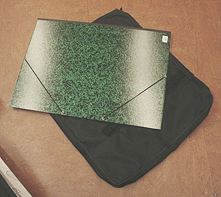

## Transport des oeuvres planes
### Transport des oeuvres planes, arts plastiques
 **Oeuvres planes (transport)**  

On ne mentionnerons ici que quelques matériaux susceptibles de faciliter le transport de certaines oeuvres. Pour les expéditions délicates, le recours aux spécialistes est inévitable. Voici donc une petite liste :

> \* [L'isorel ®](isorel.html). Il a l'avantage de la finesse et de la robustesse. C'est aussi un isolant thermique.
> 
> \* Le [carton plume](cartons.html#cartonplume) et le [carton-médium](cartons.html#lecartonmedium). Légers, relativement peu solides, ils amortissent les chocs.
> 
> \* Le papier bulles
> 
> \* Les mousses en plaques, en rouleaux
> 
> \* Les plaques de métal
> 
> \* Les oeuvres peintes encore fraîches peuvent être protégées lors d'un transport à l'aide _d'écarteurs_, des pièces assez difficiles à trouver dans le commerce.



Pour le transport en ville, le carton à dessin, entouré d'une sacoche qu'en jargon on nomme une vache (voir photo), est évidemment conseillé. _Nous mettons cependant nos chers visiteurs en garde au sujet des cartons à dessin en carton gris "brut" certes peu coûteux mais dont l'acidité peut provoquer la détérioration des oeuvres._ Ils ne peuvent convenir qu'à des esquisses ne devant pas être conservées.


 [Communication](http://www.artrealite.com/annonceurs.htm) 

[](index-2.html#20131014)


```
title: Transport des oeuvres planes
date: Fri Dec 22 2023 11:27:51 GMT+0100 (Central European Standard Time)
author: postite
```
