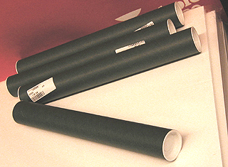

## Transport des oeuvres roulées
### Transport des oeuvres roulées, arts plastiques
 **Oeuvres roulées (transport)**  

_Les papiers plus lourds gagnent grandement à être placés dans un carton à dessins. Pour les grands formats, l'achat d'un porte-carton (sorte de poignée rendant le carton à dessins transportable) peut se révéler indispensable. Le carton à dessin est un investissement peu coûteux rendant service non seulement pour le transport, mais aussi pour le stockage (lire [Stockage, conservation, restauration](entretienrestauration.html))._

_Expédition_



Plusieurs objets et procédés peuvent être utilisés et combinées :

> \* le tube en carton, parfois chimiquement acide, pas toujours très facile à trouver dans le commerce et de diamètre beaucoup trop étroit la plupart du temps (voir photo). De plus, il est souvent en rupture de stock chez les fournisseurs
> 
> \* la gouttière en PVC : différents commerces (bricolage, plomberie) proposent des diamètres variés, ce qui peut faciliter l'expédition de certaines oeuvres ne pouvant être roulées trop serrées. C'est une solution éprouvée, fort valable, dont nous avons eu les meilleurs échos.
> 
> \* le carton ondulé "une face", qui peut se rouler autour d'un tableau roulé. Il amortit bien les chocs mais n'apporte pas beaucoup de rigidité.
> 
> \* le cylindre en bois ou métallique (ou autre matériau dur) placé au centre du rouleau pour solidifier l'ensemble, précaution salutaire pour l'envoi par avion en particulier, mais pour les autres transports également. C'est un "noyau dur" qui évite différents types d'accidents.

_Les tableaux n'aiment pas être roulés_

Dans tous les cas, ATTENTION : _un tableau roulé est un tableau martyrisé_. Les lésions sont à peu près invisibles dans l'immédiat, mais la fracture de la pâte et des vernis est réelle.

Si l'opération est cependant nécessaire, l'oeuvre doit être roulée de préférence _**face peinte vers l'extérieu**_**_r du rouleau_** pour éviter les lésions par compression, plus graves et plus apparentes que les lésions par extension.

_Adhérence et autres phénomènes_

L'huile colle ! Même lorsque la surface parait parfaitement sèche, elle conserve une viscosité. De même, l'acrylique qui est microporeuse peut être concernée par des phénomènes liés au contact du verso.

Pour éviter que les fibres de la toile n'adhèrent ou n'interagissent, on peut intercaler une feuille de [papier paraffiné](papiersspeciaux.html#sulfurparaff).

Concernant l'huile, il vaudrait mieux ne pas rouler un tableau ayant moins de deux ans d'âge (sauf matière très maigre) et surtout le laisser le moins longtemps possible roulé. L'acrylique en empâtement peut demander un temps de polymérisation de l'ordre de plusieurs mois. Quel que soit le procédé de peinture, la couche picturale doit être parfaitement sèche et polymérisé.

A lire à ce sujet :  
[Toiles sans châssis, roulage](courrierdeslecteurs2009c060.html#20091005cd)  
in Courrier des Lecteurs

_Remettre à plat un papier qui a pris une forme_

Un papier ayant pris une forme suite à un roulage trop serré ou un stockage trop long en rouleau peut généralement être remis à plat au fer à repasser (à basse température). Il faut cependant spécifier que ce traitement ne doit pas être appliqué lorsqu'il s'agit de papiers fragiles ou précieux : le remède serait pire que le mal ! Même dans les autres cas, il est conseillé de faire quelques essais préalables sur un échantillon témoin permettant de déterminer la température idéale.


 [Communication](http://www.artrealite.com/annonceurs.htm) 

[](index-2.html#20131014)


```
title: Transport des oeuvres roulées
date: Fri Dec 22 2023 11:27:51 GMT+0100 (Central European Standard Time)
author: postite
```
