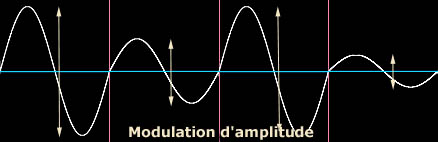

## L'onde
### Certains aspects des ondes
 **L'onde**

Avant de lire cet article, il est fortement conseillé de lire [un important passage du chapitre VI](chap06polaris.html#onde) des Dialogues de Dotapea. Des éléments essentiels de ce concept physique y sont exposés et légèrement développés. On apprend notamment à distinguer _l'onde amortie_ de _l'onde entretenue_ et, schémas à l'appui, _l'onde transversale_ de _l'onde longitudinale_.


Évoquons ici d'autres aspects de ce que nous nommons ondes, nos chères ondes qui font la lumière et la couleur de nos tableaux, de nos vidéos, ou qui entrent en jeu dans nos installations, réalisations architecturales, etc. Il s'agit de phénomènes qui sont évoqués ici et là sur le site. Ici, on n'entrera pas dans les détails car il s'agit de donner un simple aperçu mais on soulignera le fait que la recherche sur les phénomènes ondulatoires est toujours très active, beaucoup de questions restant en suspens.

L'onde est un phénomène cyclique qui a la particularité de se propager dans l'espace et le temps. A chaque cycle (quand il y en a plus d'un) il est possible de modifier, de "moduler" certaines propriétés de l'onde attachées à ce "cycle" ou à un groupe de cycles. Ces modulations, naturelles ou artificielles, jouent sur un nombre restreint de propriétés.

Il semble intéressant, plus parlant, d'évoquer ces propriétés au travers de leurs modulations.

**Les modulations cycliques**

Partons d'une sinusoïde toute simple qui a quelques points commun avec ce que nous pouvons voir en jetant un caillou dans une flaque d'eau :


Fig.1

... et "modulons-la". Ca ne concerne guère cette fois une onde s'étendant à la surface d'une flaque (difficile à moduler artificiellement) mais plutôt des ondes électromagnétiques, électriques ou autres. Qu'est-ce que l'on module ?



Fig. 2

_L'amplitude représente l'ampleur de la perturbation infligée par l'onde sur son milieu de propagation. C'est concrètement la mesure d'un déplacement, celui de la membrane d'un micro ou d'un haut-parleur, celui de la surface de l'eau ou de la terre (échelle de Richter pour les séismes)._

__

Fig. 3

_Les différentes couleurs, la hauteur des sons (aigus ou graves) sont des exemples de fréquences modulables._

__

Fig. 4

_Ce phénomène en quelque sorte dérivé de [l'amplitude](onde.html#amplitude) est inaccessible à nos sens car on ne peut pas percevoir le "signe" de l'amplitude. Ainsi, les quatre cycles représentés dans la figure 4 nous apparaissent rigoureusement semblables à ceux de la [figure 1](onde.html#fig1). Seul un jeu d'interférences permet de restituer indirectement l'information de la phase comme dans le cas de l'holographie, grâce à la cohérence du laser (lire à ce sujet le chapitre XIII des Dialogues de Dotapea, [Le laser](chap13laser.html))._

Ces modulations peuvent parfaitement être combinées. On le fait couramment pour véhiculer de l'information. Nos modems (mo-dulateurs dém-odulateurs) modulent et démodulent simultanément phases, fréquences et amplitudes parce que nous savons moduler et démoduler ces propriétés, du moins en ce qui concerne certaines ondes.

Modulations et combinaisons peuvent aussi bien être d'origine naturelle. Des ondes peuvent interférer ou s'annuler mutuellement. Certains principes de ces phénomènes sont exposés dans un passage illustré du chapitre VIII des Dialogues de Dotapea. [Cliquer ici.](chap08interferences.html#schemasgeneraux)

Par ailleurs, différentes ondes ont d'autres propriétés que l'on ne sait pas moduler correctement. [La polarisation de la lumière](chap06polaris.html) en est un exemple.

**Hors modulation**

On ne peut pas et on ne veut pas toujours moduler les propriétés des ondes. Dans le cas du laser par exemple, on a affaire à des ondes ayant la même phase, la même amplitude et la même fréquence, des ondes absolument jumelles, à cause des conditions dans lesquelles elles sont engendrées. C'est ce qui fait leur **cohérence**... et leur intérêt. Voir [vidéo](players/laser010/index.html) et [article](chap13laser.html).


 [Communication](http://www.artrealite.com/annonceurs.htm) 

[](index-2.html#20131014)


```
title: L'onde
date: Fri Dec 22 2023 11:27:52 GMT+0100 (Central European Standard Time)
author: postite
```
