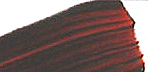

## Les orangés
### Les pigments orangés, usage en arts plastiques
 **Les orangés**

\[Lectures conseillées :  
[L'orangé dans la langue française, Pourpre.com](http://www.pourpre.com/langue/expressions.php#orange)  
[La couleur orange, Pourpre.com](http://pourpre.com/chroma/dico.php?typ=fiche&&ent=orange)\]

**Orangés azoïques**

> Comme les rouges et les jaunes du même type, ces pigments [azoïques](azoiques.html) sont assez colorants mais peu couvrants. Ils sont souvent employés comme imitations.

**Cadmiums**

> Les variétés oranges sont des sulfo-séléniures de cadmium, comme les rouges. Lire [l'article sur la famille chimique des cadmiums](cadmiums.html).

**L'orangé de Mars**

> C'est l'une des [terres de Mars](oxydesdefer.html#lesterresdemars) (des oxydes de fer). Il ne s'agit que d'un mélange entre oxydes jaune et rouge. Son appellation sûrement moderne n'est pas très convaincante. Les couleurs les plus proches d'âge plus ancien sont des terres italiennes ([lire texte in Terres rouges](terresrouges.html#siennebruleerougedepouzzolesrougevandyckocredechair)) que l'on classait dans les "couleurs terres", terme plus adéquat.

**L'orangé de quinacridone**



> Il est légèrement brunâtre.
> 
> Il est somptueux.
> 
> Il est assez récent.
> 
> Aussi orangé que brun, il est traité dans l'article sur les bruns ! [Cliquer ici](terresdombre.html#brundequinacridone).

**Le minium, la mine orange**

> Ces couleurs souvent assimilées au rouge sont traitées [dans un article séparé](minium.html).

**Le rouge d'Andrinople**

> Il serait peut-être considéré aujourd'hui comme un orangé. Lire [texte _in_ Les rouges](rouges.html#lerougedandrinople).

**Le rouge de carthame**

> C'est pratiquement un orangé également. Il est traité à l'extérieur de cette page. [Cliquer ici](rouges.html#lerougedecarthame).

**L'arséniate de cobalt**

> Cette substance couvre une large gamme de couleur. Lire [texte _in_ Les rouges](rouges.html#larseniatedecobalt).

**Le jaune de cobalt**

> S'agirait-il d'une autre appellation de l'arséniate du même métal ? Probablement pas car tous deux n'ont pas les mêmes caractéristiques de toxicité.
> 
> C'est un orangé clair traité (à cause de son appellation) dans l'article sur les jaunes. [Cliquer ici](jaunes.html#lejaunedecobalt).

**Les orangés persans**

> Nous avouons manquer cruellement d'information concernant ces couleurs. Les versions actuelles sont souvent des imitations [azoïques](azoiques.html).
> 
> Enquête en cours.

**La gomme gutte ou jaune du Cambodge**

> Tantôt jaune, tantôt orangée en fonction des compositions, des provenances et des choix des fabricants, elle est traitée dans l'article consacré aux jaunes. [Cliquer ici](jaunes.html#lagommegutteoujauneducambodge).


 

 

 [Communication](http://www.artrealite.com/annonceurs.htm) 

[](index-2.html#20131014)


```
title: Les orangés
date: Fri Dec 22 2023 11:27:53 GMT+0100 (Central European Standard Time)
author: postite
```
