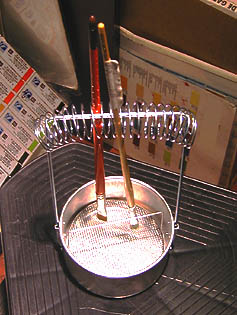

## Les accessoires pour pinceaux
### Les accessoires pour pinceaux
 **Accessoires pour pinceaux**  Certains commerçants le nomment aussi pincelier, mais l'Académie française, le Littré, le Robert et le Larousse tombent d'accord pour donner une tout autre définition de ce mot un rien précieux : le pincelier est l'assemblage de deux godets que l'on fixe par exemple au bord d'une palette portative, l'un contenant une essence permettant de nettoyer les pinceaux, l'autre accueillant une essence propre, un médium ou une huile. Un outil tombé en désuétude - sauf pour quelques emplois bien précis -, mais peu importe : le terme pincelier appliqué au séchoir est un détournement de sens, possiblement associé à une intention de type marketing. Intention pour le moins inefficace puisqu'elle amène à ceci : [lien](courrierdeslecteurs2009c100.html#20091201jpm) vers le courrier d'un lecteur. On oubliera donc ici le pincelier contrefait au profit de l'appellation tout à fait sans ambiguïté de séchoir à pinceaux désignant l'objet destiné à faire sécher les pinceaux.

L'objet a l'apparence d'un gadget mais ce n'en est pas un : il permet de conserver les pinceaux à portée de main en cours de séance tout en leur évitant d'être abîmés.

Mais il est tout aussi bien possible de les faire sécher, après une séance, sur cet outil (déjà propres) que de les laisser tremper dans un élément liquide si vous le souhaitez. Dans ce dernier cas, il est prudent de les laver d'abord grossièrement dans un récipient quelconque, puis de les nettoyer encore avant de les utiliser à nouveau. Le "séchoir" à pinceaux devient un "reposoir" qui permet de faire baigner les poils dans le diluant sans les écraser. De cette manière, le nettoyage final est beaucoup plus aisé et cela sans effort supplémentaire.

Un défaut : la plupart des modèles sont en aluminium, donc très légers et instables. Il est prudent de fixer l'objet ainsi que ses parties amovibles (la tige à spirale surtout). Quelques fabricants proposent des modèles lourds et solides.

Cependant, nombreux sont les peintres qui utilisent des brosses de grande taille qui ne peuvent être accrochées sur ce type de séchoirs. On peut leur conseiller tout simplement de bricoler un montage sur le même principe.

_Les trousses et outils de transport_

Indéniablement, la natte de bambou (naturel ou synthétique) est avantageuse  : elle permet aux pinceaux de sécher vraiment, mais les variétés adaptées aux manches longs sont plutôt rares. Nombre de trousses n'autorisent en effet aucun séchage et deviennent rapidement des bouillons de culture. Elles ne peuvent être employées que ponctuellement, à l'occasion de déplacements de courte durée.


 [Communication](http://www.artrealite.com/annonceurs.htm) 

[](index-2.html#20131014)


```
title: Les accessoires pour pinceaux
date: Fri Dec 22 2023 11:27:54 GMT+0100 (Central European Standard Time)
author: postite
```
