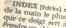

**Lettre P**

Accès direct aux autres lettres :

**Index lettre P**

**Commentaires**

Destinations  
(cf. [légende](p.html#legendeicones))


**Papier de verre**

[Passage _in Les abrasifs et les outils de polissage._](abrasifs.html#silices)
**[Papier tournesol ou papier de tournesol](papiertournesol.html)**[](papiertournesol.html)

**[Papyrus](papyrus.html)**

**[Paraffine](paraffine.html)**

**[Parchemin](parchemin.html)**

**[Pectine](mucilage.html)**

**[Pastel](pastel.html)**

**[Péridot](peridot.html)**

**[Pérylène](perylene.html)**

**[pH](ph.html)**

**[Phases](gazliquidessolides.html)**

(phases de la matière : gaz, liquide, solide)
**[Phénocristal](phenocristal.html)**

**[Phénol (le phénol, les phénols)](phenol.html)**

**[Phonon](chap13laser.html#phonon)**

**[Phosphate](phosphate.html)**

**[Phospholipide](phospholipide.html)**

**[Phosphore](phosphore.html)**

**Phosphorescence**

[Lire _Les pigments fluo et phospho._](phosphofluo.html)
**[Phosphorique (acide)](phosphoriqueacide.html)**

**Photoluminescence**

A. [_Article dédié._](photoluminescence.html)

B. [Lire _Les pigments fluo et phospho._](phosphofluo.html)


**[Phtalique](phtalique.html)**

**[Pierre noire](pierrenoire.html)**

**[Phase (d'une onde)](onde.html#phase)**

**[Phonon](chap13laser.html#phonon)**

**Pincelier**

[Passage _in Accessoires pour pinceaux._](outilspinceaux.html#lesechoirapinceaux)
**Plasma**

[Passage _in Les phases de la matière._](gazliquidessolides.html#plasma)
**[Plagioclase](plagioclase.html)**

**[Plasticité, plastique](plastique.html)**

**Plasticines et Plastiline ®**

[Passage _in Les pâtes à modeler._](patesamodeler.html#plasticines)
**[Plat d'étain](platdetain.html)**

**[Plâtre](platre.html)**

**Plexiglas ®**

[Passage in _Les matériaux synthétiques (supports, substrats)._](plastiques.html#plexy)
**[Plomb](plomb.html)**

**[Plombagine](plombagine.html)**

**Plume du peintre**

[Passage in _Les pinceaux._](pinceaux.html#plumedupeintre)
**[Pochade](pochade.html)**

**Point critique**

[Passage in _Gaz, liquides, solides._](gazliquidessolides.html#schema)
**[Point d'éclair](pointdeclair.html)**

**Point triple**

[Passage in _Gaz, liquides, solides._](gazliquidessolides.html#schema)
**[Pointe d'argent, pointes métalliques](pointedargent.html)**

**[Poix](poix.html)**

**[Polaire/apolaire](polaireapolaire.html)**

**Polarité et polarisation**

A. _Polarité moléculaire, liaisons polaires_ --> lire l'article _[L'électronégativité, la polarité](electronega.html)_.

B. _Polarisation ondulatoire_ --> lire le [chapitre VI](chap06polaris.html) des Dialogues de Dotapea.


**Polissoir**

Voir

A. [agate,](agate.html)

B. [brunissoir,](brunissoir.html)

C. [feuilles métalliques](feuillesmetalliques.html).


**[Polyacide](polyacide.html)**

**[Polyacrylique](polyacrylique.html)**

**[Polyalcool](polyalcoolpolyol.html)[, polyol](polyalcoolpolyol.html)**

**[Polyamide](polyamide.html)**

**[Polyamine](polyamine.html)**

**[Polycyclique](polycyclique.html)**

**[Polyester](polyester.html)**

**[Polymarbre](courrierdeslecteurs2009c050.html)**

**[Polymère,  
polymérie, polymérisation et copolymérie](polymere.html)**

**[Polyphénol](polyphenol.html)**

**[Polystyrène(s)](polystyrenes.html)**

[Section _Les polystyrènes._](polystyrenes.html)
**[Polysulfide](polysulfide.html)**

**Polyuréthane**

A. _[Vue d'ensemble (glossaire).](polyurethanegloss.html)_

B. _[Les polyuréthanes en peinture et en moulage (détails).](polyurethanegloss.html)_


**[Polyvinyle](polyvinyle.html)**

**Pompage laser**

[Passage _in Les dialogues de Dotapea, chap. XIII, le laser._](chap13laser.html#pompagelaser)
**[Popote](popote.html)**

**[Porcelaine](porcelaine.html)**

**[Potasse](potasse.html)**

**[Potassium et oxyde de potassium](potassium.html)**

**[Potée d'étain](poteedetain.html)**

**[Potentiel](chap25diffusionetatome.html#potentiel)** (électricité)

**Pourpre de Cassius**

[Passage _in La pourpre._](pourpre.html#cassius)
**[Pouzzoles, pouzzolane](pouzzoles.html)**

**Précipité**

[Passage _in Diluants, solvants, dissolvants._](diluantssolvants.html#precipite)
**Prima, alla prima**

[Passage _in Les techniques de mélange de couleurs._](techmelangecouleurs.html#travailallaprima)
**[Primaire](primaire.html)**

**[Protéine](proteine.html)**

**[Protide](protide.html)**

**[Proto, mono, bi, di, etc](protomonobidi.html)**

**Prusse, prussique**

A. Voir _[Le bleu de Prusse.](bleuschauds.html#lebleudeprusse)_

B. Voir _[Les verts prussiques ou anglais.](verts.html#vertsprussiquesouanglais)_


**Putoiser**

[Passage _in Les techniques de mélanges de couleurs._](techmelangecouleurs.html#putoiser)
**PVA**

[Passage _in Le vinyle._](vinyle.html#pva)
**[PVC](pvc.html)**

**[Pyroxène](pyroxene.html)**

\_\_\_\_\_

**Légende des icônes/liens (destinations)**

_Pour éviter toute surprise lors de la navigation, nous avons créé cette signalétique :_

article du glossaire

article hors glossaire

_passage_ situé dans un article du glossaire

_passage_ situé dans un article hors du glossaire

  liens en "portail", ouvrant sur différentes adresses

 

 [Communication](http://www.artrealite.com/annonceurs.htm) 

```
title: Lettre P
date: Fri Dec 22 2023 12:23:51 GMT+0100 (Central European Standard Time)
author: postite
```
