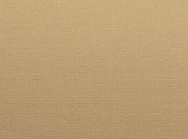
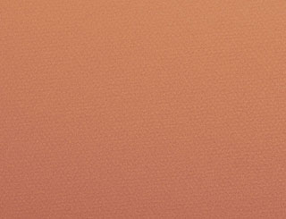
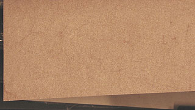

## Les papiers à dessin
### Les papiers à dessin, usage en arts plastiques
 **Papiers à dessin**  

_Il existe autant de papiers que de types de dessins. De plus, dans ce domaine de la papeterie d'art plus que dans tout autre, la couleur intervient et joue un rôle important, au même titre que le grammage et bien sûr la charge électrochimique._

Parmi les papiers destinés à [l'ébauche](ebauche.html), citons le papier pour [esquisse](esquisse.html), le papier pour [croquis](croquis.html) et le papier [rough](rough.html) ou [layout](layout.html). Leurs grammages ne dépasse généralement pas 120g/m2. Ils sont souvent conçus pour certaines techniques précises, comme l'Ingres Vidalon ® de Canson, papier coloré destiné au croquis au pastel sec ou au [fusain](fusain.html) rehaussé.



Au-delà, nous en venons aux papiers comme l'Ingres de Fabriano (différentes colorations, un bon grammage de160 g/m2 \- voir photo ci-contre), l'Ingres d'Arches (excellente qualité), destinés principalement au [fusain](fusain.html), mais aussi aux [techniques académiques](academies.html) et aux [pastels secs](pastelssecs.html), tandis que le "C à grain ®" de Canson et l'Accademia ® de Fabriano sont surtout dédiés au [graphite](graphite.html). Ces derniers ainsi que de nombreux autres papiers peuvent atteindre des grammages de plus de 200 g/m2, autorisant quelques interventions aqueuses.

Mentionnons aussi le "Mi-teinte" ® de Canson, décliné en plus de cinquante couleurs. Ce papier, inventé dans la première moitié du XXème siècle, a une face à grain fort (voir photo ci-dessous) et une face presque lisse. D'un grammage de 160 g/m2, il se prête beaucoup aux travaux réalisé avec des pastels secs.



Les papiers pour lavis ont un poids d'au moins 220g/m2. On sort alors du domaine classique du dessin "sec". [La tension de la feuille](tensiondupapier.html) peut jouer un rôle déterminant.

Le dessin proprement dit, par opposition aux différentes catégories [d'ébauches](ebauche.html), nécessite de 130 à 200 g/m2. Les variétés de papiers sont nombreuses, mais les plus représentatives sont "grammées" autour de 160g/m2, en feuilles souvent colorées ('Mi-teintes ®" de Canson, "Tiziano ®" de Fabriano, etc.), destinées à différentes techniques allant du [graphite](graphite.html) aux [pastels secs](pastelssecs.html), sans parler de l'encadrement ([papiers contrecollés](cartons.html#ccencadrement)).

Pour les travaux au [fusain](fusain.html) et les [académies](academies.html) à la [sanguine](sanguine.html), souvent renforcées par des [encres](encresdiverses.html), les Vélins d'Arches ® (voir [_Vélin_ in _Glossaire_](uv.html#velin), voir aussi _[Les](procedesdessin.html)_) et BFK Rives ®, normalement destinés à la gravure, sont assez couramment employés. Les vélins présentent un grain moyen, les BFK sont lisses. Les papiers pour l'aquarelle sont également utilisés.



Mentionnons enfin le papier "peau d'éléphant", fin et sans grain, mais présentant une bonne tenue en présence de liquides. Très lisse mais marbré, disponible en différentes couleurs, il est particulièrement intéressant pour l'encre de Chine appliquée à la plume ou au [calame](calame.html).

**Aplanir un papier trop ondulé.**

Il existe plusieurs manières d'effectuer cette opération délicate. L'important dans tous les cas est de réaliser un ou plusieurs essais préalables sur des échantillons préparés et peints (ou dessinés) de manière comparable à l'original que vous souhaitez traiter. Au moindre doute sur la sûreté du procédé, il faut en changer ou renoncer.

Évoquons d'abord une vieille recette. Elle est très simple : il s'agit de repasser au fer le verso de la feuille. Avec certains papiers, la vapeur peut être employée, avec d'autres non et cela dépend aussi des substances présentes à l'avers.

Une presse peut également être employée, par exemple dans un atelier de gravure. Il faut alors demander les conseils du responsable et de toute façon effectuer un test préalable sur un échantillon.

Une autre méthode nous a été communiquée par un lecteur de Dotapea qui a gentiment accepté que nous la publions. Elle concerne un travail à l'encre de Chine réalisé sur un papier de 125 grammes. La voici :

> _"j'ai passé la feuille Canson sous un filet d'eau (sur le dos), ce qui donna une sorte d'effet compensatoire : la feuille était sur le moment du moins comme désirée. Je l'ai ensuite posée sur une table, puis étendue, l'eau du dos de la feuille adhérant. Je l'ai laissée sécher un moment (quinze minutes il me semble) puis j'ai soulevé la feuille et épongé le surplus d'eau resté sur la table, avant de remettre ensuite la feuille au même endroit, à nouveau étirée légèrement (de façon a atteindre le résultat voulu). Et enfin j'ai usé du système de la presse en posant une encyclopédie dessus."_

Si cette méthode a fonctionné avec succès, c'est d'abord parce qu'elle a été appliquée sur un travail réalisé avec un matériau colorant fiable. En aucun cas ce type de procédés ne fonctionnerait dès lors que le principe colorant serait [réversible](liants.html#reversibilite). Il en va de même avec certains papiers qui risqueraient de se déliter.

Encore une fois, un test sur un échantillon - de préférence plusieurs - est une précaution minimale à peine suffisante. Tout particulièrement, les dessins ou peintures anciens et/ou précieux ondulant pour quelque raison, doivent impérativement être confiés à des restaurateurs.


 [Communication](http://www.artrealite.com/annonceurs.htm) 

[](index-2.html#20131014)


```
title: Les papiers à dessin
date: Fri Dec 22 2023 11:27:57 GMT+0100 (Central European Standard Time)
author: postite
```
