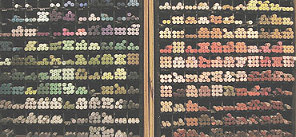

## Les pastels secs
### Les pastels secs, usage en arts plastiques
 **Pastels secs**  

[Lire l'article _Le pastel_ du glossaire](pastel.html)

> \* 2 à 3g d'un élément qui jouera le rôle de [liant](liants.html). Les recettes les plus courantes suggèrent un mélange de poudre de [craie](craie.html) (en quantité généralement mineure) et de [gomme adragante](adragante.html). On mentionne aussi le [glucose](glucose.html), la [gomme arabique](gommearabaquar.html) et la [dextrine](dextrinefarines.html)
> 
> \* [eau](eau.html) à discrétion : elle s'évaporera. L'important est d'obtenir une pâte. Éviter absolument les eaux acides qui agiraient sur la craie. _Préférer une eau distillée_ qui vous épargnera les impuretés et autres interactions indésirables.  
> 
> \* mélanger les éléments puis rouler la pâte à la main - c'est la meilleure méthode - ou couler dans un moule enduit de [vaseline](vaseline.html).  
> 
> \* laisser sécher 48 heures environ (24 dans une atmosphère favorable, très chaude et très sèche, cinq jours en milieu défavorable).  
> 
> \* envelopper le pastel avec du papier à cigarettes si vous le souhaitez et si sa forme le permet.



**\[Pastel et couleur\]**

D'autres recettes font intervenir les [terres blanches](terresblanches.html). Leur rôle est d'accentuer le caractère couvrant du pastel, mais elles en modifient la teinte. La concentration en craie peut également présenter cet inconvénient. Elle accentue la dureté du bâtonnet et diminue sa friabilité mais en trop forte quantité, elle donne ces fameux tons que l'on taxe de "couleurs pastel". Un pastel de bonne qualité n'a pas ce caractère adouci. Il donne des couleurs franches, intenses presque comme le pigment pur.

Pour en terminer avec l'aspect chromatique, précisons que les fabricants proposent, outre le pastel à l'unité (photo), différents types de boîtes et coffrets en fonction de types de travaux à effectuer : paysage, portrait, etc.

**\[Consistance\]**

Mais la consistance est peut-être un facteur plus important dans les choix.

La dureté peut être recherchée pour les travaux "gestuels", où le mouvement est important, mais aussi pour les pastellistes débutants qui ont parfois beaucoup de mal à manipuler les bâtonnets sans les fragmenter. Notons l'existence de petits supports qui peuvent présenter des avantages contre ce danger de rupture lors de la prise en main, mais ne concordent pas avec toutes les utilisations possibles du pastel.

Les pastellistes plus aguerris préfèrent le plus généralement les pastels tendres et poudreux, mais ce n'est pas une règle universelle.

**\[Chimie\]**

Dans tous les cas, il vaut mieux faire attention aux recettes trop chargées en craie, terres blanches et autres produits alcalins car les pastels obtenus peuvent très mal s'accommoder de supports acides. Ceux-ci sont moins rares que l'on ne le croit. _Canson indique ainsi que les variétés noires de ses papiers pour pastels ('Mi-teintes' ®, Vidalon ®, ...) sont acides._

_Toujours concernant la chimie du pastel sec, signalons que les variétés trop alcalines ne devraient pas être utilisées conjointement à la peinture à l'huile à cause du risque de [saponification](saponification.html). Brunissement garanti._

_Les pastels aquarellables_

Ce sont de très intéressants produits, généralement peu coûteux.

La dilution est opérée de la même manière qu'avec les [crayons aquarellables](crayon.html#crayonsaquarellables) : avec un pinceau imbibé d'eau, sur le dessin lui-même.

Ces produits sont relativement récents et n'ont donc pas encore eu la possibilité de faire leurs preuves en matière de tenue à long terme.

Une chose est certaine : pour des esquisses, pour des travaux n'étant pas destinés à être conservés très durablement, ils sont d'une grande utilité et ont des capacités très intéressantes. On peut même regretter la pauvreté de l'offre en France. De plus, les propriétés aquarellables de certains de ces pastels ne sont pas toujours affichées clairement sur les boîtes, ce qui est vraiment très dommage. Il y a sans aucun doute un effort à faire sur le plan de la communication chez certains fabricants.

_Le pastel en poudre, les mélanges_

Le pastel mis en poudre (à l'aide de papier de verre) peut être appliqué notamment avec un [coton](coton.html), une brosse [éventail](pincformes.html#eventails) ou une [brosse à pochoirs](pincformes.html#lesbrossesapochoirs). En fait, la mise en poudre, pratique peu répandue, est le seul moyen de réaliser de véritables mélanges, ce qui explique que les fabricants proposent d'aussi larges gammes de couleurs (voir photo ci-dessus).

Il existe pourtant des moyens de reconstituer un bâtonnet à l'aide de poudre de pastels. On peut par exemple humecter la poudre avec du lait écrémé (qui contient de l'[acide phosphorique](phosphoriqueacide.html) - HnPnOn - comme la [caséine](caseine.html)) de sorte à constituer une pâte que l'on roule comme dans le procédé ci-dessus.

_Le fixatif, compagnon ou ennemi du pastel ?_

La question est débattue dans [l'article sur les fixatifs](fixatifs.html).

_Pastels secs, feutre et talc_

Nous avons pu recueillir un témoignage étonnant sur une utilisation peu commune du pastel. Un graphiste nous a exposé le procédé suivant, utilisé conjointement à d'autres techniques de dessin dont le feutre :

> \* Travailler avec du [layout](layout.html) fin (un papier totalement déconseillé pour le pastel)
> 
> \* Couper la poudre de pastel avec du [talc](talc.html) pour donner de l'homogénéité et pour mieux la fixer à la surface du papier
> 
> \* Appliquer la poudre avec un [coton](coton.html)
> 
> \* Travailler ensuite avec d'autres techniques comme le feutre. 

Le graphiste qui nous a communiqué cet étrange procédé précise que le résultat ne doit pas être fixé si le feutre est utilisé, la réaction avec [l'éthanol](alcools.html#ethanolpur) (ou autre produit) du fixatif risquant de devenir incontrôlable. L'original est scanné puis conservé sans précautions supplémentaires (en fait, il perd toute importance à partir du moment où il est scanné).


 [Communication](http://www.artrealite.com/annonceurs.htm) 

[](index-2.html#20131014)


```
title: Les pastels secs
date: Fri Dec 22 2023 11:27:58 GMT+0100 (Central European Standard Time)
author: postite
```
