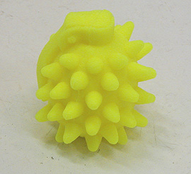
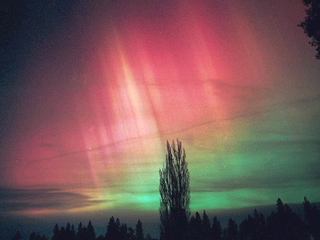
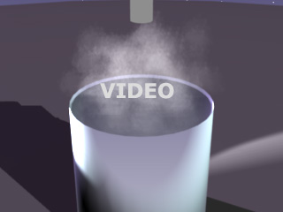

## Les pigments phospho/fluo
### Famille des pigments photoluminescents, phosphorescents ou fluorescents, usage en arts plastiques
 **Pigments et phénomènes phospho/fluo**

_\[note : d'importantes précisions ont été  
apportées dans le cadre d'un courrier nommé  
"Photoluminescence : histoire et matériaux".  
[Lien](courrierdeslecteurs2011b170.html#20110713ca)_

_A signaler aussi, un courrier intitulé  
"Fluorescence : enfin des couleurs rompues ?"  
[Lien](courrierdeslecteurs2011b210.html#20110726ca)\]_

La [fluorescéine](phosphofluo.html#fluoresceine) émet dans le vert tandis que différents tissus et papiers colorés avec d'autres substances irradient dans le violet (voir [azurants optiques](azurantoptique.html)). Ces substances sont bien connues depuis longtemps mais d'autres sont venues compléter la palette. Beaucoup de corps sont fluorescents, surtout parmi les molécules [organiques](organique.html).



Différentes peintures fluorescentes sont maintenant disponibles dans le commerce (notamment des peintures [vinyliques](vinyle.html)). Elles sont toutes réputées fugaces, mais certains choix peuvent atténuer ce phénomène, comme une coloration "dans la masse" (voir photo ci-contre, une _Sida-grenade_ (2003) de [Yves Bodiou](quinoussommes.html#yvesbodiou), résine [élastomère silicone](elastomeresilicone.html) transparente teintée).

De nombreux minéraux naturels émettent des lumières aux couleurs variées lorsqu'ils sont excités par un éclairage UV ou des rayons X.

Mentionnons par exemple le spathfluor, utilisé en verrerie, objet d'un _[article et d'un lien externe dans le glossaire](spath.html)_.

Au sujet d'objets fluorescents contemporains, lire absolument : _[Pourquoi le Post-it](http://pourpre.com/couleur/pourquoi.php#postitfluo)_ [_® est-il fluo ?_ sur Pourpre.com](http://pourpre.com/couleur/pourquoi.php#postitfluo)

La phosphorescence

Ce qui distingue la phosphorescence des autres phénomènes de luminescence est la durée : plusieurs secondes, plusieurs minutes, plusieurs heures ou davantage sans apport extérieur d'énergie.

Longtemps, très longtemps, trop longtemps (de 1900 à 1960 pour la plus grosse part), les peintures phosphorescente ont été réalisées avec du [radium](annexe1.html#ra), un élément extrêmement radioactif plus dangereux que l'uranium, mêlé à des produits luminescents. Les rayonnements énergétiques du radium excitent des molécules qui réémettent dans le visible. En quelque sorte la source d'énergie est intégrée (rayons X) et pratiquement permanente. En France, il existait encore en 1989 une usine (Bayard, fabricant de réveils à Saint-Nicolas d'Aliermont, près de Dieppe) où l'on employait ce type de produits. L'endroit a été nettoyé mais le sous-sol est certainement durablement contaminé.

Le radium a été remplacé par le tritium, moins dangereux (moins énergétique et de durée de vie moins longue). Puis, serait apparu un conditionnement particulier du tritium, annoncé comme plus sûr.

[](pigments.html#compatibilitesetincompatibilites)Mais les pigments phosphorescents sont aujourd'hui fabriqués sur une base

> \* de sulfure de [zinc](annexe1.html#zn), la wurtzite, de formule de base ZnS + un métal lourd (_gare aux incompatibilités potentielles avec les produits au [plomb](phosphofluo.html#plomb) si le produit pigmentaire est "mal lavé"_),
> 
> \* ou de scheelite, CaWO4,
> 
> \* ou d'un autre sulfure [alcalin](alcali.html) ou [alcalinoterreux](alcalinoterreux.html) comme CaS par exemple
> 
> \* ou d'autres [sels](formationdesels.html).

Sauf cas particuliers, ces produits ne sont pas radioactifs. Une matière phosphorescente n'est pas vouée par définition à être radioactive.

Concernant ZnS + un métal lourd, signalons que les atomes de cuivre notamment forment ce qui s'appelle des "centres F" (F comme _Farbe_, couleur en allemand), qui sont responsables du piégeage des électrons et donc de la phosphorescence.

En ce qui concerne la qualité des pigments, la quantité d'impuretés métalliques semble déterminante (il s'agirait d'autant de pièges, d'obstacles).

La phosphorescence est nettement déterminée par la température ([voir thermoluminescence ci-dessous](phosphofluo.html#thermoluminescence)) : le froid la gèle, la chaleur l'excite, l'agitation thermique favorisant semble-t-il le changement d'état des électrons. Les rayons infrarouges ont un effet spécialement brutal.

Les invalidants de la phosphorescence, sont l'humidité (les fabricants conseillent un taux inférieur à 50% pour la conservation), le broyage excessif (trop fin, le pigment perd ses propriétés) et les rayons ultraviolets (gare au soleil). Les liants à dominance aqueuse et/ou chimiquement neutres, sont souvent employés. Nous savons par ailleurs par expérience, grâce à plusieurs intervenants maintenant, que certains moulages en résine, malgré leur chimie complexe, peuvent parfaitement incorporer des pigments phosphorescents. Il est conseillé dans tous les cas de pratiquer des tests préliminaires.

La puissance de la phosphorescence varie en fonction de deux "facteurs temps" : la durée de chargement d'un bon pigment phosphorescent est de l'ordre de quelques minutes ; le temps de phosphorescence proprement dit peut être moyen ou très court, rarement long.

Chromatisme : les pigments phosphorescents sont le plus souvent d'une couleur jaune-vert. On peut mentionner des matériaux ayant d'autres couleurs que l'on classe parfois parmi les matières phosphorescentes (les pigments présents dans les tubes cathodiques, par exemple), mais la brièveté extrême des phénomènes photoélectriques en jeu ne semble pas justifier cet apparentement.

Terminons ce passage dédié à la phosphorescence par une intéressante question d'une lectrice de Dotapea et la réponse donnée par [Jean-Louis](quinoussommes.html#jeanlouis) en marge des [Dialogues](dialoguesdotapea.html) :

> _Je suis particulièrement intéressée par la phosphorescence. Elle dépend de plusieurs paramètres :_
> 
> > _\- l'intensité de l'éclairage,  
> > \- la longueur d'ondes des photons arrivant sur le matériau,  
> > \- la durée d'exposition,  
> > \- la température : avec la chaleur, l'agitation thermique favorise l'excitation des électrons._
> 
> _Plus l'éclairage est long et intense et plus le phénomène durera._
> 
> _Cependant savez-vous s'il existe une formule (reliant les paramètres cité ci dessus + d'autres que j'aurais sûrement oublié) qui permet de déterminer le temps pendant lequel le matériaux phosphorescent va continuer à émettre des photons ?_
> 
> _Jean-Louis : Ce n'est pas simple._
> 
> > _1) il n'y aura pas deux matériaux identiques, c'est déjà une variable importante._
> > 
> > _2) la question commence avec l'excitation. Il faut exciter les électrons pour les faire passer sur un niveau supérieur. Le processus va dépendre : de la puissance de l'éclairage, de la longueur d'onde, de la quantité de lumière réellement absorbée par le matériau (état de surface, réflectance, longueur de pénétration, température,...). La durée de l'excitation n'est pas vraiment un paramètre, contrairement à ce que l'on pourrait penser. Si on éclaire longtemps, les électrons commencent à se désexciter même pendant l'éclairement, donc on perd à droite ce qu'on gagne à gauche._
> > 
> > _3) ensuite on coupe l'excitation et ça réémet de la lumière par phosphorescence. La probabilité qu'un électron donné se désexcite et renvoie un photon suit une loi exponentielle. Tous les électrons ne vont pas réémettre de la lumière après un temps_ t_, auquel cas on pourrait définir facilement une durée de vie. Les uns après les autres, presque selon leur humeur, ils vont envoyer un photon. Ca va durer "un certain temps", mais il y aura toujours de la lumière émise après par d'autres électrons moins rapides.  
> > C'est comme la radioactivité, ça décroît exponentiellement, mais il en reste toujours. Ceci mis à part, on peut définir ce qu'on appelle "un temps caractéristique", mais il est évidemment dépendant du matériau, notamment de sa structure électronique. Autres paramètres : la pureté chimique, la température, la lumière ambiante,..._

Voir aussi : [La phosphorescence alimentaire, divers photoluminescence](courrierdeslecteurs2010a130.html#20100319sl) in Courrier des Lecteurs.

Emplois spécifiques, autres phénomènes

On mentionnera d'abord un phénomène particulier et original de luminescence : **la triboluminescence**. Dans ce cas, ce n'est pas un apport photonique mais une action mécanique (frottement, écrasement) qui fournit l'énergie initiale. Certains cristaux sont triboluminescents. Cette propriété extraordinaire peut parfaitement être exploitée dans les domaines de la sculpture et des installations.

**L'électroluminescence** est aussi un phénomène de photoluminescence original. L'apport initial d'énergie est effectué par un champ électrique. Le champ d'application dans le champ de l'art contemporain n'est pas négligeable. En dehors des minéraux naturels, la technologie a pu produire des substances plastiques, parfois élastiques, qui sont très faciles d'emploi. _Le faible courant (quelques dizaines de volts) qui passe dans le fil d'un simple combiné téléphonique peut être utilisé._

La technologie de l'électroluminescence est toute jeune, mais étant donné les enjeux - notamment la transformation d'un signal électrique en signal optique sans réchauffement -, elle a produit en peu d'années des résultats extraordinaires.

Moins extraordinaire, plutôt ordinaire même, une application simple, assez répandue, est bien connue : des systèmes d'éclairages censés imiter la lumière du jour sont, comme d'autres "néons", associés à des mélanges de sulfures [alcalino-métalliques](annexe1.html#metauxalcalinsnonalcalinoterreux) ou d'autres composés à très courte durée de photoluminescence (fluorescents). Leur réel avantage consiste en fait à présenter un rapport qualité/prix très relativement correct par rapport notamment à des systèmes d'éclairage désuets et chromatiquement misérables comme les "néons" classiques. Certains artistes utilisent ces derniers. Mais que sont ces vieux néons, comment fonctionnent-ils ?

Dans un tube à néon, un gaz (argon/mercure, néon/xénon, néon/sodium pour les éclairages publics, etc.) émet des ultraviolets sous l'action du courant électrique. Ces UV sont seulement destinés à exciter la fluorescence/luminescence des pigments qui sont collés sur la paroi du tube. C'est en associant plusieurs pigments que l'on peut (plus ou moins) obtenir une lumière blanche ou dite "solaire" par [synthèse additive](syntheseadditive.html), c'est à dire par un artefact sans commune mesure avec le très riche [spectre](pigments.html#spectre) solaire.

(voir aussi _[Les lampes à plasma](gazliquidessolides.html#lampesplasma)_)

Un principe relativement semblable est utilisé pour les les tubes TV ou informatiques dits "tubes cathodiques" ainsi que différents matériels comparables : les électrons qui frappent les pigments de l'écran excitent leur luminescence. Pour chaque pixel de l'écran il y a 3 pigments : un rouge, un vert et bleu (tout à fait visibles avec une loupe) qui reconstituent les différentes couleurs par [synthèse additive](syntheseadditive.html) grâce à une excitation proportionnelle sélective de chacune des trois couleurs.

Beaucoup de produits électroluminescents - et phosphorescents, [voir ci-dessus](phosphofluo.html#phosphorescence) - semblent basés sur ZnS + un composant métallique lourd, mais il existe aussi une importante quantité de minéraux naturellement électroluminescents, comme _le diamant bleu_ par exemple.

**La thermoluminescence**, elle, n'est pas une faculté d'accumulation d'énergie, mais plutôt une aptitude à libérer celle-ci sous l'effet d'un échauffement. C'est un épiphénomène de la phosphorescence ([voir ci-dessus](phosphofluo.html#phosphorescence)).

**La chimioluminescence**. Certains corps, dont le Luminol ® (3-aminophthalhydrazide, voir [lien externe](http://luminol.iquebec.com/)), se décomposent en donnant des produits dans un état excité. La désexcitation de ces produits produit de la lumière.

Ces substances sont commercialisées dans des tubes qui contiennent les réactifs et qui s'illuminent quand on brise une ampoule scellée à l'intérieur. "Lumières froides" (éclairages dégageant un minimum d'énergie calorique) ou Cyalume ®. Elles sont vendues sur le web, dans les magasins pour marins, explorateurs et différents corps de métiers, en plusieurs couleurs. On en fait aussi des colliers lumineux à destination festive.  
 

Au sujet des minéraux photoluminescents - auxquels des artistes semblent s'intéresser de près dans le monde entier -, nous conseillons à nos chers visiteurs une promenade sur le très remarquable site [reocities.com/RainForest/9911](http://reocities.com/RainForest/9911/) (lien retrouvé en 2010). Attention aux yeux !

**Les aurores polaires**

**\[refonte 2008\]** 



Elles comptent elles aussi parmi les phénomènes de [photoluminescence](photoluminescence.html). Leur exploitation est difficile dans le domaine des arts plastiques. Dans le domaine du sky-art ou du land-art, seul un "jeu" avec le phénomène naturel semble pour le moment accessible.

I. Aurores provoquées

"L'état de l'art" dans ce domaine semble se réduire à de très modestes points lumineux que des scientifiques ont réussi à faire apparaître dans l'ionosphère en déchaînant la puissance des émetteurs du projet américain HAARP (Gakona, Alaska).

Ce projet ([voir site](http://www.haarp.alaska.edu/haarp/gen.html)) à capitaux militaires consiste à exciter des régions de l'ionosphère à l'aide de micro-ondes [polarisées](chap06polaris.html) à haute fréquence, émises grâce à une série d'antennes et une quantité considérable d'énergie. Il fait par ailleurs l'objet de polémiques, en particulier à cause de sa capacité annoncée d'engendrer, à partir de l'ionosphère localement excitée, des émissions ELF (très basses fréquences, potentiellement susceptibles d'altérer le comportement humain), mais aussi à cause de l'intention clairement annoncée de l'initiateur, Bernard Eastlund (aujourd'hui sorti du projet, [voir site](http://www.eastlundscience.com/)), de contrôler différents phénomènes météorologiques (ouragans, tornades).

Bien sûr, tout cela fait jaser. Mais nous ne souhaitons pas entrer dans cette polémique planétaire hors-sujet.  
Nous nous contenterons de quelques précisions permettant de se représenter les échelles d'énergie.  
Concernant la possibilité d'engendrer une aurore atmosphérique artificielle, on lira dans la [FAQ](http://www.haarp.alaska.edu/haarp/faq.html) du site de HAARP l'intéressant passage "_Can HAARP create an artificial aurora?_", soit en français "_HAARP peut-il créer une aurore artificielle ?_"

Traduction de ce passage :

> « _L'aurore naturelle est créée quand des particules à très haute énergie, émises par le soleil, atteignent le voisinage de la terre, sont entraînées vers les pôles magnétiques, et frappent les molécules de gaz de la haute atmosphère. L'énergie en jeu dans ce processus est énorme mais entièrement naturelle et cela a été un événement normal pendant l'histoire de la terre._
> 
> _HAARP est tellement plus faible que ces processus naturels qu'il est incapable de produire le type d'apparitions observées pendant une aurore. De toute façon_
> 
> \[however\]_, des émissions optiques faibles et répétitives provoquées par HAARP ont été observées (et rapportées dans la littérature scientifique) à l'aide de caméras très sensibles._ »

Effectivement - et ce n'est pas un secret -, en 2005 des scientifiques ont réussi à faire apparaître de tout petits points lumineux par intervalles de 7,5 secondes. On a évoqué à l'époque la possibilité à terme d'éclairer des villes de cette manière mais il y a de sérieuses raisons de douter, étant donné les énergies à déployer, que ce fut bien là l'objectif de cette recherche qui après tout n'était peut-être que fondamentale : savons-nous provoquer une micro-aurore ?

L'expérience a été effectuée au sein d'une aurore naturelle mais on mentionne qu'elle pourrait aussi être produite en dehors (information non confirmée).

Pour terminer sur ce chapitre décidément lié à l'activité militaire, signalons la possibilité de provoquer une aurore à l'aide d'une bombe à hydrogène. L'expérience (projet Starfish) a été réalisée à l'aide d'une charge explosive particulièrement considérable de 1,45 mégatonnes à 400 km à la verticale de l'atoll Johnston (USA) le 9 juillet 1962 vers minuit heure locale. L'aurore était visible de Honolulu, à environ 1 200 km (horizontaux) de là. Il est possible de trouver sur des sites variés différentes photos de ce spectacle.

Ainsi, l'être humain peut tout à fait engendrer ce genre de phénomènes. Il n'est même pas certain que HAARP soit véritablement "_tellement plus faible que ces processus naturels_", s'agissant quand même de plusieurs gigawatts.

II. Aurores entièrement de synthèse

avec l'aide scientifique de [Jean-Louis](quinoussommes.html#jeanlouis),  
physico-chimiste au CNRS

Revenons à un traitement plus pacifique du sujet. Voici quelque temps dans ces pages nous publiions un schéma décrivant une installation susceptible d'engendrer une petite aurore artificielle. Nous nous sommes aperçus d'une petite erreur qui nous a conduits à réexaminer la question.

[](players/aurores/index.html)

Voici donc une série de schémas animés en imagerie de synthèse (cliquer sur l'image).

Quelques précisions seront apportées ultérieurement.

Une site anglophone à visiter : [cliquer ici.](http://www.mhs.ox.ac.uk/sphaera/index.htm?issue7/articl6)

Rappel : Un apport très important a été ajouté dans le Courrier des Lecteurs 2010 première saison. [Lien.](courrierdeslecteurs2010a130.html#20100319sl)

Toute personne souhaitant davantage d'informations peut nous contacter.


 [Communication](http://www.artrealite.com/annonceurs.htm) 

[](index-2.html#20131014)


```
title: Les pigments phospho/fluo
date: Fri Dec 22 2023 11:28:01 GMT+0100 (Central European Standard Time)
author: postite
```
