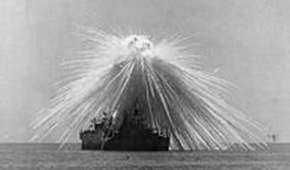

## Le phosphore
### Le phosphore, article du glossaire
 _Du grec_ phôs_, lumière et_ phorein_, porter._

Phosphore  : [n°15](annexe1.html#p) du tableau périodique des éléments.

Élément atomique [non-métallique](nonmetaux.html) assez important en arts plastiques comme dans d'autres domaines. En peinture par exemple, il entre dans la composition de deux liants à peindre au moins : la [caséine](caseine.html) et [l'oeuf](oeuf.html) (voir [lécithine](lecithine.html)), ce qui n'est pas surprenant car on peut le classer parmi les éléments les plus courants, notamment dans la chimie du vivant.

Lire absolument un [passage consacré au phosphore](chap03caseine.html)  
in _Les dialogues de Dotapea, Chap. III, Caséine, phosphore et dissociation._

En combinaison sous forme de [phosphate](phosphate.html), cet élément entre dans la composition de pigments violets et de différents sels aux utilisations très variées.

Le phosphore peut exister dans plusieurs états. Il a six [isotopes](ion.html#isotopeinion) radioactifs et plusieurs formes [allotropiques](allotropie.html) dont les suivantes sont les plus connues  :

> _\* le phosphore blanc_ est un solide très hautement toxique (un poison réputé) et dangereux : il s'enflamme très facilement par frottement, dès qu'il atteint la température de 44°C, moins selon certaines sources.
> 
> C'est cette variété qui est employée dans les "armes au phosphore". Utilisées depuis un siècle approximativement, celles-ci occasionneraient de très profondes brûlures (jusque dans l'os) facilement identifiables, tout comme la forme caractéristique que prennent les explosions - voir photo ci-dessous (1921).  
> Elles font l'objet d'une interdiction conventionnelle partielle [\*](phosphore.html#note1).  
> Fumigène et éclairante, cette substance pourrait certainement trouver des applications plastiques moins tragiques.



> _\* le phosphore rouge_, beaucoup moins toxique, était le composant majeur du bout inflammable des allumettes avant d'être remplacé ou minoré dans les dosages. Un peu capricieux tout de même, il s'enflamme à une température de 250°C pouvant être atteinte par friction.  
> Les anciennes allumettes, dites "au phosphore" avaient un bout rouge prolongé d'un segment jaune dit "soufré". Elles avaient tendance à prendre feu trop facilement.

La poudre à canon et le feu grégeois ne contiennent pas en principe de phosphore mais du [soufre](soufre.html) et du [salpêtre](salpetre.html).

Malgré ces aspects dangereux, le phosphore ne doit pas être diabolisé. Associé à d'autres éléments, il peut être non seulement sans danger mais utile.

Dans le domaine des arts du feu, le phosphore oxydé pourrait donner des teintes légèrement bleutées. Voir _[Cendre d'os](cendredos.html)_.

Le phosphore aurait une fonction dans la fabrication de composés halogénés (voir [groupe halogène](annexe1.html#halogene)). Toute information à ce sujet [est bienvenue](ecrire.html).

La fabrication du [papier](papier.html) requiert l'emploi de _formes_, sortes de trames métalliques contenant du phosphore qui en empêche l'oxydation.

Le phosphore sert dans différents domaine de la métallurgie. Notamment, c'est un durcisseur du [bronze](bronze2.html).

Cet élément et ses dérivés pourraient être utilisés (avec précautions) dans certaines installations artistiques.

Note : la première expérience de transmutation artificielle fut effectuée par Irène et Frédéric Joliot-Curie. C'est précisément du phosphore qui fut synthétisé. A ce sujet et sur la découverte du phosphore, lire un [passage](transmutation.html#aluminiumphosphore) de l'article consacré à la transmutation.

Voir aussi [acide phosphorique](phosphore.html#phosphoriqueacide), [phosphorescence](phosphofluo.html).

\_\_\_\_\_\_

\*  Cette interdiction porte sur l'usage incendiaire. Elle concerne également le napalm. Elle est édictée dans le Protocole III de la CCAC, Genève, 1980, protocole ratifié par 93 pays.


 [Communication](http://www.artrealite.com/annonceurs.htm) 

[](index-2.html#20131014)


```
title: Le phosphore
date: Fri Dec 22 2023 11:28:01 GMT+0100 (Central European Standard Time)
author: postite
```
