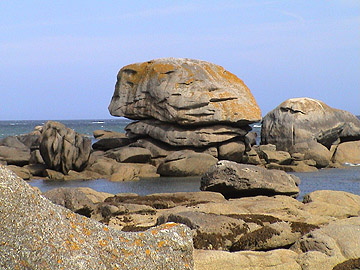

## La pierre
### La pierre, usage en arts plastiques
 **La pierre (support)**  

La pierre en tant que matériau de taille est traitée dans la section _Modelage, moulage, taille_. [Cliquer ici.](pierretaille.html)

[](quinoussommes.html#alainguillon)

La pierre en tant que support de la peinture et des patines ne pose guère de problèmes particuliers, sauf contextes exceptionnels, généralement liés à l'humidité. Avant de traiter du cas général, signalons un cas particulier, [l'ardoise](ardoise.html), traité dans une autre section.

La roche est par nature le plus souvent poreuse et dans le cas contraire elle peut être dépolie. Les enduits et substances picturales y adhèrent donc facilement.

Mais comme ne l'ignorent pas les peintres décorateurs, une pierre poreuse doit absolument être sèche avant d'être peinte. C'est là l'inconvénient majeur de ce support. Lorsqu'un bloc de roche exposé à l'extérieur a été copieusement imbibé d'eau, son séchage devient extrêmement lent. Le mur calcaire d'une maison de l'époque haussmannienne peut sécher en dix ans voire davantage. Quel que soit l'enduit utilisé, il est difficile de faire adhérer durablement un film pictural sur un tel support. Seule [la chaux](chaux.html) ne s'oppose pas au passage de l'humidité. Elle ne suffit cependant pas toujours à empêcher le développement de moisissures et l'altération de l'aspect du film pictural sous le seul effet de la présence d'eau. [Les grès](gres.html), roches littéralement gavées d'eau, sont à éviter sauf "traitement de choc" préalable.

La composition chimique d'une pierre peut éventuellement poser quelques problèmes dans certains cas.

Les pierres véritablement [acides](acides.html) (au sens chimique du terme, non au sens géologique) sont vraiment rares tandis que les pierres [alcalines](alcali.html) telles que le calcaire sont extrêmement répandues à la surface de notre planète. Lorsqu'elles sont peintes [à fresque](fresque.html) ou de quelque autre manière avec un matériau alcalin, le risque d'interaction demeure très limité (à l'acidité de l'air, des pluies ou des pigments eux-mêmes). Avec certains liants - par exemple des [ester](ester.html) communs comme les huiles à peindre -, une réaction de [saponification](saponification.html) peut survenir. De plus, les pigments, l'air ambiant ou la pluie peuvent être acides et provoquer [la formation de sels](formationdesels.html).

Autrement dit, il est important, dès lors qu'il s'agit de peindre directement sur une pierre assez alcaline (ou tout support alcalin), de bien restreindre les pigments à ceux qui sont généralement utilisés pour la peinture à fresque.

L'emploi d'enduits neutres est cependant suffisant pour empêcher les interactions. Mais bien souvent, ces produits ne laissent pas respirer la pierre.

Une pierre sèche, même fortement alcaline, si elle est destinée à ne jamais être durablement exposée aux intempéries, peut parfaitement être traitée à l'aide d'un enduit vinylique, acrylique, synthétique. _Il n'en va pas du tout de même avec un pierre humide._

Dans le cas de travaux devant être placés à l'extérieur, [la chaux](chaux.html), répétons-le, a largement fait ses preuves comme enduit ou comme [badigeon](badigeon.html). Du côté des produits synthétiques, signalons qu'il existe des peintures synthétiques particulièrement résistantes ainsi que des vernis (voir _[Polyuréthane](polyurethane.html)_)... dont le défaut majeur, encore une fois, est d'empêcher la plupart du temps la pierre de respirer.


 [Communication](http://www.artrealite.com/annonceurs.htm) 

[](index-2.html#20131014)


```
title: La pierre
date: Fri Dec 22 2023 11:28:02 GMT+0100 (Central European Standard Time)
author: postite
```
