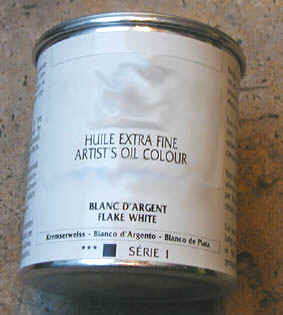

## Les pigments, les couleurs
### Les pigments, les couleurs, usage en arts plastiques
 **Les pigments,  
les couleurs**

Visite recommandée :  
[Chroma sur Pourpre.com](http://pourpre.com/chroma/)

_Introduction_

_Q__u'il le sache ou non, l'artiste qui manipule des couleurs utilise des pigments. Disons pour faire court que ceux-ci ne sont rien d'autre que de la matière en poudre très fine ayant un pouvoir colorant intrinsèque. Bien que tous les colorants ne soient pas pigmentaires, les pigments représentent l'immense majorité des colorants._

_Pour être utilisés, ils doivent être mêlés à un [liant](liants.html) ("mouillés par un liant", disent les chimistes), formant ainsi une peinture ou ce que l'on appelle un "colorant". Le liant ne se contente pas de mouiller le pigment : il tisse autour de lui au séchage un réseau fibreux ou cristallin. C'est ce que l'on nomme la [réticulation](reticulation.html)._

_Lors de ce mélange du pigment avec le liant, nous sommes parfois déçus par l'assombrissement de la couleur. Il est presque impossible de garder intacte la teinte originelle et l'aspect pulvérulent du pigment. "Presque impossible" parce que le seul moyen d'y parvenir serait de l'exposer nu, sans protection, ce qui poserait d'insolubles problèmes de conservation. La [fixation](fixatifs.html) altère également l'aspect et la couleur du pigment. Quelques plasticiens ont contourné la difficulté en photographiant leurs compositions effectuées avec le pigment pur._

_Bien que certains pastellistes qui ne "fixent" pas leurs travaux s'approchent de la perfection ([le pastel sec](pastelssecs.html) est particulièrement chargé de pigment), il n'existe pas, pour le moment, de véritable solution à ce problème._ 

 


[Introduction](pigments.html#intro)

[\- Pourpre.com et Dotapea : une complémentarité dans le traitement du thème de la couleur](pigments.html#pourpre)

[La finesse de la pulvérisation, facteur essentiel](pigments.html#lafinessedelapulverisationfacteuressentiel)

[Facteur couvrant](pigments.html#1facteurcouvrantopposetransparence)

[Facteur colorant](pigments.html#2facteurcolorant)

[Permanence](pigments.html#permanence)

[Floculation](pigments.html#aptitudealafloculation)

[Pouvoir d'absorption et pouvoir siccatif](pigments.html#pouvoirdabsorption)

[Stabilité/miscibilité/compatibilité](pigments.html#compatibilitesetincompatibilites)

[Brillance](pigments.html#7brillance)

[Toxicité](pigments.html#8toxiciteprecautions)

[Un pigment n'est pas une couleur](pigments.html#9unpigmentnestpasunecouleur)

[\- Le phénomène physique (spectre)](pigments.html#spectre)

[\- Le phénomène cognitif](pigments.html#phenomenecognitif)

[\- Les illusions (page sur Pourpre.com)](http://www.pourpre.com/couleur/illusions.php)

[\- Le phénomène imaginaire et culturel](pigments.html#phenomeneimaginaireetculturel)

[Variabilité de la composition et de la couleur d'un pigment](pigments.html#10variabilitedelacompositionetdelacouleurdunpigment)

_Ne nous lamentons pas : lier le pigment, fabriquer la couleur, c'est découvrir une nouvelle beauté, de nouvelles caractéristiques picturales d'une richesse inouïe notamment sur le plan [plastique](plastique.html). Voir_ [un pigment n'est pas une couleur](pigments.html#9unpigmentnestpasunecouleur)_._

_Toute personne cherchant des informations sur les couleurs à proprement parler, c'est-à-dire les noms et les caractéristiques scientifiques des couleurs et non des seuls pigments, est invité à visiter l'excellent_ [pourpre.com](http://pourpre.com/)_. Voir particulièrement_ [La couleur expliquée](http://pourpre.com/couleur)_,_ [les nuanciers](http://pourpre.com/nuanciers) _et aussi d'étonnantes_ [curiosités](http://pourpre.com/nuanciers/curiosites)_. Le versant linguistique est également passionnant. Le thème est largement abordé dans la section "_[La couleur et la langue](http://pourpre.com/langue)_"._

_La finesse de la pulvérisation, facteur essentiel_

[Xavier de Langlais](livres.html#langlais) l'affirme à juste titre : plus un pigment est broyé finement, plus il est couvrant et colorant. Une poudre très fine oblige en effet la lumière à employer une infinité de trajectoires qui empêchent toute transition de celle-ci dans les couches inférieures, donnant à la couleur un grand impact visuel, très enrichi - voire saturé.

N'importe quel pigment peut voir ses propriétés se transfigurer sous la seule influence d'un broyage plus ou moins fin.

Aujourd'hui, tous les pigments sont broyés très finement grâce à l'évolution de la technique industrielle.

Et pourtant, les grands maîtres flamands et vénitiens n'ont-ils pas considéré la transparence comme une vertu, largement mise à profit dans leurs oeuvres inégalées ?  
Et un [smalt](bleusfroids.html#lesmalt), un [lapis lazuli](l.html#lapisoulapislazuli), une [malachite](verts.html#vertmalachite), une [turquoise](bleuschauds.html#laturquoise) ne sont-ils pas plus beaux lorsqu'ils sont "mal broyés" ? 

La "perfection du broyage" évoquée par le grand maître armoricain consiste-t-elle vraiment en une finesse infinitésimale, ou bien en une bonne adéquation à "l'intention picturale" de l'artiste  ?

Prenons le pigment pour la perfection... qu'il est ! C'est l'un des rôles de l'artiste de savoir regarder, soit en l'occurrence de savoir découvrir la remarquable réalité d'un pigment qui pourrait sembler imparfait selon des critères finalement très marqués par l'évolution ponctuelle des techniques et des goûts.

_Facteur couvrant (opposé : transparence)_

Le terme "couvrant" provient probablement de la peinture décorative. Une question récurrente dans ce domaine est en effet de savoir quelle surface une peinture ou un enduit peut "couvrir".

Une substance colorée "couvre" une surface d'autant plus importante qu'elle est opaque (notamment parce qu'il y a toujours des moyens de la diluer ou de lui adjoindre des [charges incolores](chargesincolores.html)). Ainsi, le terme "couvrant" s'est substitué, y compris en peinture artistique, au terme "opaque".

Plusieurs facteurs déterminent le caractère couvrant d'une peinture :

\* _la finesse du broyage ([voir ci-dessus](pigments.html#lafinessedelapulverisationfacteuressentiel)),_

_\* l'opacité intrinsèque du pigment, qui est déterminée avant tout par sa nature à l'échelle de l'organisation moléculaire, mais aussi par la finesse du broyage. La nature physique, organique ou inorganique, est essentielle avant tout parce qu'elle est très variable d'un pigment à l'autre. En termes de tendances, les pigments organiques (**[carbures](carbure.html)** synthétiques, végétaux ou animaux) sont généralement assez transparents alors que les inorganiques (minéraux) sont souvent opaques. [Voir Organiques vs inorganiques.](organiquesvsinorganiques.html)_

_\* la manière dont le liant enrobe le pigment. Cela est directement déterminant lorsqu'il s'agit de liants minéraux. La blancheur "couvrante" d'un plâtre employé comme liant est radicalement différente de ce que l'on peut obtenir avec de la chaux. Quant aux liants organiques, de loin les plus courants, ils peuvent autoriser diverses épaisseurs, ce qui n'est pas sans conséquences sur l'aspect opaque ou transparent du résultat final._

_\* l'état de la pâte est aussi très déterminant et ce n'est pas une chose que l'on peut se permettre d'oublier. Certains liants sont blancs et opaques lorsqu'ils sont frais et transparents à sec. D'autres accentuent la transparence lorsqu'ils sont frais._

Il existe aussi quelques "tricheries" qui permettent de mesurer à quel point le "facteur couvrant" est un enjeu important. Certaines peintures dites couvrantes comme la [gouache](gouache.html) n'étaient autres initialement que des peintures habituelles auxquelles on avait ajouté un pigment blanc afin d'en augmenter la réfraction. A l'inverse, certaines couleurs à l'huile intitulées "laques" sont des pigments couvrants adjoints de [charges incolores](chargesincolores.html).

Si le liant et les adjuvants peuvent jouer un rôle sur le caractère couvrant d'une peinture, les propriétés des pigments dominent nettement, à tel point que des pigments couvrants et des charges sont parfois employés pour modifier cet aspect essentiel de la couche picturale.

_Facteur colorant_

Couvrant ou transparent, un pigment est susceptible de teinter plus ou moins ce qui l'entoure. Cette capacité prend tout son intérêt lors de l'adjonction à la pâte de substances incolores (médiums, charges).

Le "facteur colorant" n'est pas un caractère très sensible a priori car il est souvent masqué par le "facteur couvrant". On a généralement du mal à se représenter en quoi un pigment est plus colorant qu'un autre tant que l'on ne s'est pas trouvé en présence de variétés très colorantes comme [certains oxydes de fer](oxydesdefer.html#oxydejaune) notamment. Et là... la surprise est de taille.

_Permanence (fixité, solidité, tenue à la lumière)_

Faculté qu'a un pigment de conserver longtemps ses propriétés : intensité, vivacité et justesse de la couleur,  fonction couvrante, etc. C'est l'exposition à la lumière qui est considérée globalement comme le plus important facteur d'altération. La lumière solaire directe est rarement conseillée mais il faut signaler que certains pigments minéraux (notamment _[les terres](terrespigments.html)_) lui résistent fort bien.

Le cas particulier des matières photoluminescentes est traité séparément sur ce site. [Cliquer ici.](phosphofluo.html)

Par analogie avec les substances tinctoriale, la permanence est parfois nommée _[le teint](teint.html)_.

_Aptitude à la floculation (granulation)_

Cette propriété est importante pour l'aquarelle notamment. Elle n'est pas négligeable en ce qui concerne les peintures fortement diluées, quelles qu'elles soient. Elle n'est d'ailleurs pas sans importance pour d'autres matières utilisées en arts plastiques (voir _[barbotine](barbotine.html)_).

Les [pigments à base de terres](terrespigments.html), particulièrement, sont réputés pour leur tendance à s'agglomérer en granules, en flocons. Sous l'action du séchage, ces agglomérats se déposent dans les creux, colorant les surfaces peintes d'une manière hétérogène, marquant le relief du support.

Ainsi, un support choisi pour son grain tirera bénéfice de la floculation du piment apposé.

Certains fabricants d'aquarelles extra-fines affichent sur leurs nuanciers un indice permettant de repérer les couleurs ayant ce pouvoir.

Pour les cas - très rares - où ce phénomène est radicalement à éviter, il semblerait recommandé, lors du choix du pigment, de porter une grande opération à l'opération de [mouillage](chap22mouillage.html). Une [molette pigmentaire](molette.html) peut être utilisée.

Dans d'autres domaines - incluant l'industrie -, un défloculant est un produit permettant d'accentuer l'homogénéité d'un mélange, d'une [émulsion](emulsion.html).

_Pouvoir d'absorption et pouvoir siccatif_

_Nous l'avons testé pour vous : rien de tel que de parler à un chimiste de "siccativité d'un pigment" pour le voir esquisser un sourire amusé_. Certains enseignants, certains ouvrages pédagogiques, certains peintres, font effectivement - comme tout le monde, très naturellement - une confusion entre capacité d'absorption et aptitude au [séchage ou à la siccativation](sechagesiccativation.html).

... et ce chimiste moqueur n'a pas tort : un pigment pur est solide. Il ne peut ni sécher ni siccativer. Il peut se combiner plus ou moins rapidement avec tel ou tel liant en fonction de sa propre aptitude à entrer en solution, à _absorber_. C'est essentiel. Par la suite, c'est le liant qui sèche, aidé ou non par le pigment. Celui-ci joue un rôle de [siccatif](siccatifs.html) _seulement s'il contient un véritable élément siccatif pour le liant utilisé_, ce qui n'est pas si courant. Un pigment siccatif pour l'huile n'est pas forcément absorbant et n'accélère pas le séchage d' un autre liant. _La faculté d'absorption d'un pigment est une propriété différente de la siccativité._ La confusion concerne principalement la peinture à l'huile car les autres procédés permettent d'obtenir beaucoup plus rapidement une solidification sans qu'il soit question de _[siccativation](sechagesiccativation.html)_.

Concernant la siccativité _indépendamment du pouvoir absorbant_, de nombreux auteurs annoncent peut être un peu trop jovialement "_l'excellente siccativité_" de tel ou tel pigment ou au contraire "_l'exécrable siccativité_" de tel autre (quelquefois avec une animosité surprenante - cela sent l'expérience vécue !). Or, il ne s'agit, dans les deux cas, ni de qualités ni de défauts. Un pigment contenant une quantité non négligeable d'éléments siccatifs crée le même danger potentiel qu'un pigment neutre  : la véritable menace est surtout un trop grand "différentiel de siccativation" lorsque sont mises en contact des couches contenant des pigments n'ayant pas les mêmes propriétés. C'est en premier lieu ce "différentiel" qui crée des accidents : plissements, craquelures, [embus](embu.html) irréductibles, etc.  
Il est cependant parfaitement vrai que les pigments contenant un élément particulièrement siccatif (oxydes de manganèse, de cobalt) peuvent aussi engendrer des phénomènes mécaniques gênants lorsqu'ils sont employés seuls, _surtout en pâte épaisse_. Ainsi, le bleu de manganèse, par exemple, n'est pratiquement jamais utilisé en peinture à l'huile.

_Curieusement, une bonne partie des pigments peu couvrants (laques, terre verte, etc.) ont la réputation - le plus souvent erronée - d'être peu "siccatifs". Voila une troublante coïncidence ! Ce problème de siccativité n'est-il pas lié à une erreur au liage causé par une forte transparence intrinsèque dont on n'a pas su tenir compte ?_

_Une évidence apparaît lorsque nous explorons le monde pigmentaire, une évidence qui marque notre ligne éditoriale : **c'est le peintre qui doit s'adapter aux propriétés des pigments et non le contraire** car les couleurs ne sont jamais sans défauts pour certaines utilisations et les solutions alternatives ne sont pas innombrables. Le terme même de "pigment ou colorant douteux" n'a pas de sens._

_Stabilité dans les mélanges (miscibilité) : compatibilités et incompatibilités_

**a) Plomb et soufre**

D'abord, il faut rappeler que le [plomb](plomb.html) est un métal lourd qui n'est pas anodin pour le vivant.

En peinture et dans d'autres domaines proches, c'est **l'incompatibilité entre soufre et plomb** qui est de loin la plus notoire, particulièrement dans le procédé à l'huile où le recours au plomb est encore pratiqué. La mise en présence de ces deux éléments provoque un **noircissement très important**.

Les fabricants de peinture en tubes ou de gammes de pigments veillent généralement à éviter cette rencontre. Ils y parviennent par trois moyens :



\* supprimer les deux composants (rare)

\* supprimer l'un des composants (courant)

\* éliminer l'excédent de soufre libre, non moléculaire.

Ainsi, si le plomb a heureusement disparu des tubes et pots de pigments (sauf le [blanc d'argent](ceruse.html), encore disponible sous certaines enseignes, voir photo), le soufre est encore très présent. Ce dernier est avant tout un "adjuvant" (en fait un composant) indispensable pour le [cadmium](cadmiums.html) et les [blancs naturels](terresblanches.html), mais aussi [l'outremer](outremer.html) et de nombreuses autres couleurs-clés. Difficile de s'en passer !

Certains fabricants de produits de haute qualité ont distingué leurs pigments en groupes : un groupe miscible au plomb et un groupe de couleurs miscibles entre elles.

Utiliser un pigment sulfuré ne pose guère de problèmes en soi  mais _en peinture à l'huile, cela en pose un de taille :_ _le meilleur siccatif n'est autre que l'oxyde de plomb !_

_Courtrai blanc ou brun, flamands, Harlem, "huiles cuites", siccatifs "classiques" et litharges peuvent être incompatibles avec les pigments sulfurés lorsque ceux-ci ne sont pas suffisamment "lavés" de leur soufre non moléculaire._

Pour cette raison, tous les éléments recelant du soufre sont marqués dans notre site du signe suivant :


Les substances contenant du plomb sont accompagnées de l'image suivante : 


ATTENTION : ce n'est pas parce qu'une matière contient du soufre qu'il y a forcément risque de réaction. Le soufre libre, sorte de déchet des préparations incomplètes, est autrement plus fauteur d'interactions que le soufre moléculaire. Sans comparaison, c'est indéniable. Mais nous parlons là de phénomènes qui se déroulent à une échelle "probabiliste", en liaison notamment à [l'électronégativité](electronega.html) des atomes en présence, qui détermine en partie la solidité des liens. Il arrive que certains corps se "cassent", en présence de chaleur notamment. Ne soyons pas alarmistes : seuls des corps complexes (par exemple les [polysulfides](polysulfide.html)), souvent plus fragiles, sont véritablement concernés mais pas en tant que pigments, plutôt comme supports - rares.

Autrement dit, notre avertissement vaut non _pas univoquement mais principalement_ pour le cas précis des **pigments insuffisamment préparés,** par exemple les vieux pots de cadmium. Les techniques de préparation semblent avoir évolué dans le bon sens. Cependant, il demeure une méfiance _(y compris chez certains fabricants, [voir ci-dessus](pigments.html#attitudesfabricants))_ et nous ne sommes pas du tout en mesure d'opposer davantage d'arguments à celle-ci pour le moment.  
Pour réduire cette méfiance, nous pensons que les fabricants de produits de qualité auraient sans doute intérêt à communiquer davantage à ce sujet à l'aide d'arguments scientifiques et/ou historiques relativement détaillés à l'intention du public - qui d'ailleurs apprécie toujours, à juste titre, que l'on s'intéresse à lui.

Certains auteurs prétendent que le **chrome** pose le même problème que le plomb : il serait incompatible avec le soufre. En réalité les pigments jaunes et orangés chromés - aujourd'hui rares car avérés toxiques et même très toxiques sous une certaine forme - étaient associés à du plomb. Les chromates de plomb noircissaient donc effectivement au contact du soufre, mais pas par la faute du chrome (hypothèse non confirmée).

Ce dernier reste finalement très présent sur les palettes sous des formes sans danger : [vert oxyde de chrome](vertscomplexes.html#loxydedechrome), [vert émeraude](verts.html#vertemeraudeouviridien).

Il semble par contre que le [vert Véronèse](verts.html#vertveroneseoucendreverte) authentique, pourtant composé d'arséniate de cuivre - donc ni de plomb ni de soufre - et heureusement introuvable aujourd'hui, est vraiment réactif au soufre, voire même au plomb selon certaines sources. Cet épouvantable poison a cédé la place à des [imitations](imitations.html) moins malsaines et plus stables.

**b) Pigments trop alcalins et peintures grasses**

Le liant d'une peinture grasse est un [ester](ester.html) [d'acide gras](acidesgras.html). L'emploi de pigments alcalins comme les [terres blanches](terresblanches.html) avec un liant tel qu'une huile à peindre peut provoquer une [saponification](saponification.html). Cela se traduit généralement par un brunissement qui s'accentue au fil des années.

_Brillance_

Les pigments sont en eux-mêmes plus ou moins brillants, indépendamment de l'aspect que leur confèrent les [liants](liant.html) et les [médiums](medium.html), capables de modifier considérablement ces caractéristiques. 

Dans l'ensemble, les pigments organiques sont brillants et les inorganiques, mats.

Certains pigments généralement synthétiques sont littéralement "dédiés à la brillance" : [les pigments interférentiels ou iridescents](interferentielspigments.html) et [les pigments métalliques](metaux2.html).

_Toxicité, précautions_

Les pigments ne sont pas tous des produits anodins. La réglementation en matière d'obligation, pour les fabricants, de faire apparaître un pictogramme d'avertissement, est fluctuante en France. Certaines marques nord-américaines portent le _health label_, qui ne peut être attribué que moyennant finance, ce qui n'implique _a priori_ ni une garantie d'impartialité ni le contraire.

Nous conseillons à nos lecteurs européens de tenir compte (ni plus, ni moins) de tout avertissement, dans l'attente d'une réglementation claire durablement établie dans l'ensemble de l'Union Européenne. Dans les cas des autres pays francophones et des autres pays non francophones non européens, nous ne sommes malheureusement pas en mesure de nous prononcer à ce jour, mais [toute information sera bienvenue](ecrire.html).

Certains pigments arborent des pictogrammes.


Les pigments **toxiques** (pictogramme ci-contre). Ils sont hautement dangereux. Il vaut mieux les acheter sous forme liquide ou semi-liquide et éviter tout type de contact. Le port de masques adaptés, de gants et d'autres matériaux de protection s'avère nécessaire dans la plupart des cas. Il est vivement conseillé de s'informer des mesures à prendre auprès des services spécialisés (voir [Art, sécurité, pollution](liensutiles.html#artetsecurite)).


Les pigments **nocifs** - voir pictogramme ci-contre. Ils doivent être manipulés et stockés avec quelques précautions élémentaires : travailler dans le calme, tenir loin du visage les pots de pigments ouverts, ne les ouvrir que recouverts d'un plastique transparent ou d'un papier empêchant la poudre de se répandre dans l'air lors des quelques secondes qui suivent cette opération, les fermer dès que possible, se laver les mains souvent, éviter tout contact cutané durable avec ces produits, les stocker hors de portée des enfants et des animaux. **Pas de panique**  : ces produits, contrairement aux pigments toxiques, n'ont une action pathogène que dans le cadre d'un usage répété dans de mauvaises conditions ou bien dans le cas d'une inhalation massive ou d'une ingestion.

Références centres antipoison (espace francophone) : [cliquer ici.](liens.html#1secoursnumerosdurgence)

_Un pigment n'est pas une couleur_


Les considérations chimiques et physiques évoqués ci-dessus nous rappellent une chose essentielle : **un pigment n'est pas une couleur**. C'est une matière. Sa composition est plus ou moins précisément définie. Très souvent, en réfléchissant une lumière, elle en absorbe une partie qui devient ce que nous nommons "sa couleur". Fait tout aussi déterminant, celle-ci est altérée à la fois par le type de source(s) de lumière et par l'environnement : liants, adjuvants, support et bien sûr éclairage et atmosphère. Et ne parlons même pas de l'oeil de l'observateur (cf. _[L'oeil](http://pourpre.com/couleur/oeil.php)_ et _[Observer](http://pourpre.com/couleur/observer.php)_ sur Pourpre.com), qui est l'autre moitié du phénomène.

**On en vient donc naturellement à se demander ce qu'est une couleur.**

[](quinoussommes.html#klotz)Une lumière qui nous parvient est caractérisée par ce que les physiciens nomment un **spectre** ([voir photo ci-contre](pigments.html#superbespectre) - remerciements à [Alain Klotz](quinoussommes.html#klotz)). Le spectre, c'est, parmi l'ensemble des rayons lumineux de toutes les longueurs d'onde possibles, ceux qui parviennent réellement à nos yeux, réparties en raies, c'est à dire en fréquences. Le bleu occupe telles fréquences, le jaune telles autres, etc. Certaines "raies" peuvent être émises (raies d'émission), d'autres figurent l'absorption de la lumière émise (raies d'absorption - lire notamment le chapitre XII des Dialogues de Dotapea sur _[Le jaunissement](chap12jaunissement.html)_). Chaque raie est représentative de la présence et de l'état d'un élément ou d'un ensemble d'atomes dans le champ visé.

Pour un corps donné, certains rayonnements peuvent soit ne pas avoir été émis, soit ne pas avoir été réfléchis, soit avoir été absorbés. De plus, il faut tenir compte de l'intensité du rayonnement pour chaque longueur d'onde ([voir par exemple diagramme in _Le corps noir_](corpsnoir.html#diagrammetempercorpsnoir)) et ceci pour chaque phénomène : réverbération, absorption, émission.  
L'approche purement physique est donc plutôt centrée sur le rayonnement. Elle décrit essentiellement les couleurs en termes de raies d'émission, de raies d'absorption et d'intensité du rayonnement pour chaque raie - "point de vue" qui ne peut être ignoré car il décrit une réalité concrète.

Cependant, dans le contexte des arts plastiques comme dans la vie courante, la couleur prend davantage le sens de **phénomène cognitif**. Sur la base des impulsions électriques provoquées par une bouffée de photons percutant la rétine, nos neurones peuvent interpréter le monde : "je devine" qu'entre le pigment et moi il y a un air brumeux, je devine l'heure qu'il est et la saison en fonction des couleurs que j'observe, mais je devine aussi les émotions d'un être vivant, la passion d'un peintre, etc. Quelquefois aussi, "je me laisse berner" par de pures illusions. Lire [_Les illusions in Pourpre.com_](http://pourpre.com/couleur/illusions.php).

La couleur est certainement, à notre sens humain, un phénomène principalement "imaginaire".

De cette dimension imaginaire sont nées toutes sortes de tabous, de "[peurs bleues](bleusfroids.html#peurromaine)", de connotations et de préférences imbriquées dans des dimensions culturelles ancrées notamment dans la langue (lire _[Des couleurs sur la langue in Pourpre.com](http://pourpre.com/langue.php)_). Il en va de même pour les pigments. A ce point de vue, le statut des pigments est souvent associé directement à celui des couleurs, mais des exceptions ont existé. Par exemple, la pourpre succéda probablement au safran pour des raisons religieuses ou politiques associées au coût exceptionnel de ces deux substances en plus des symboliques de leurs teintes. En Inde, certains colorants précis ne devaient pas être touchés tandis que d'autres, comme le curcuma notamment, continuent aujourd'hui à porter bonheur. Le lapis-lazuli survécut à une certaine phobie occidentale du bleu car il avait une valeur intrinsèque. Il existe certainement d'autres exemples car l'être humain n'a jamais pu ignorer intégralement - même dans l'intégrisme - la dimension matérielle du pigment.

_Variabilité de la composition et de la couleur d'un pigment_

Un pigment n'est vraiment pas une couleur. En peinture décorative, une pratique est assez courante : mélanger les pots de peinture ou de pigments d'une même couleur pour obtenir un maximum d'homogénéité. C'est dire à quel point un pigment ne correspond que de manière statistique à une couleur. Les peintres décorateurs savent bien que de multiples facteurs intervenant sur le lieu d'extraction, d'apuration ou de synthèse  peuvent donner lieu à des produits, donc à des couleurs sensiblement différentes.

Une expérience édifiante consiste à comparer deux tubes ou deux pots de pigments censés être de la même couleur.

Dans une certaine mesure, les écarts ne sont pas des défauts, surtout en ce qui concerne les [pigments minéraux](organiquesvsinorganiques.html). Les fabricants ont les limites que la nature impose : les gisements sont ce qu'ils sont et c'est au peintre, artiste ou décorateur, qu'appartient la tâche de gérer les différences de composition avec tout ce que cela induit en termes de couleurs, de siccativité, de pouvoir absorbant, etc.


```
title: Les pigments, les couleurs
date: Fri Dec 22 2023 11:28:03 GMT+0100 (Central European Standard Time)
author: postite
```
