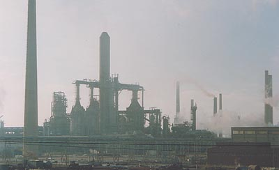

## Les plastiques (moulage)
### Les plastiques, la plasturgie, utilisation en arts plastiques
 **Les plastiques (plasturgie)**

Les plastiques en tant que supports --> [cliquer ici.](plastiques.html)

Lien externe conseillé :  
[Les techniques,](http://www.laplasturgie.fr/techniques.php) section du site _La plasturgie - fédération_



La plasturgie est un domaine qui n'est pas entièrement accessible à l'artiste. Ses possibilités sont énormes mais ses mises en oeuvre souvent compliquées. Il n'est pas rare que le recours à ce type de techniques nécessite soit la consultation de spécialistes, voire une sous-traitance, soit une formation solide et un équipement à la hauteur. Cependant, quelques produits permettent de travailler sans appareillage industriel. Attention : des protections peuvent être nécessaires.

Dans ce domaine, tout peut être modulé : la forme, la taille, le poids, la transparence, la couleur, la permanence, la résistance à la chaleur, à des facteurs chimiques ou mécaniques, etc. Pour peu poétique que nous paraisse le prosaïque "plastique", il faut reconnaître que ses fabricants sont parvenus à une maîtrise que l'on aurait taxée, dans le passé, d'alchimique ou de magique.

Il existe deux catégories principales de techniques plasturgiques :

> \* la thermoformation. C'est une technique que certains artistes connaissent par le [Varaform ®](varaform.html). La matière à former peut présenter un grand nombre d'aspects, de la poudre à la plaque. On lui apporte des calories par différents moyens, de sorte qu'elle devienne modelable, "[plastique](plastique.html)", ce qui permet de la couler, la projeter, la traiter de manières variées afin de lui donner la forme souhaitée. Refroidie, elle devient solide, mais peut toujours être réchauffée et remodelée. La température de fusion est donc un facteur très important qui peut déterminer la permanence du matériau.
> 
> \* le thermodurcissement. C'est un terme un peu abusif car le durcissement n'est pas toujours obtenu par échauffement, mais plutôt, bien souvent, par des [catalyseurs](catalyse.html) ou d'autres agents et procédés. Dans tous les cas, on recherche la [polymérisation](polymere.html) définitive, non réversible, d'un ou de plusieurs produits initialement liquides ou semi-liquides.

De nombreux procédés de formation des matériaux sont employés. Parmi les plus connus, citons [l'extrusion](extrusion.html).


 [Communication](http://www.artrealite.com/annonceurs.htm) 

[](index-2.html#20131014)


```
title: Les plastiques (moulage)
date: Fri Dec 22 2023 11:28:04 GMT+0100 (Central European Standard Time)
author: postite
```
