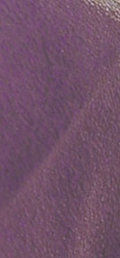
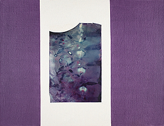
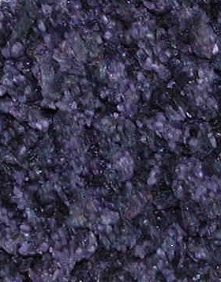
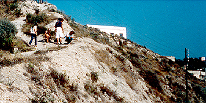
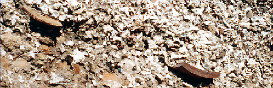
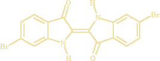
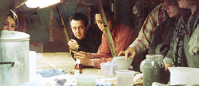
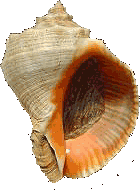

## La pourpre
### La pourpre, usage en arts plastiques, en teinturerie et autres disciplines
 **La pourpre** 

 

**Lectures conseillées :  
**La pourpre sur Pourpre.com [Lien](http://pourpre.com/chroma/dico.php?typ=fiche&&ent=pourpre)  
Le site de Inge Boesken Kanold [Lien](http://pourpre.inge.free.fr/)  
Chimie de la pourpre et autres teintures, Chris Cooksey (anglais) [Lien](http://www.chriscooksey.demon.co.uk/)  
Lire aussi la première Conversation de ArtRéalité. [Lien](http://www.artrealite.com/teinturepourprecouleur.htm)

Genre du mot "pourpre" : [voir note.](pourpre.html#notegenre)

_Couleur plutôt froide mais toujours vive, la pourpre (en grec_ phoinix_, soit phoenix, en latin purpura alors que porphyra, désignant également la couleur pourpre, est le substantif "rouge" en grec ancien) est d'abord un symbole de puissance. Plus qu'un symbole, elle est concrètement devenue une véritable richesse, de par sa valeur pécuniaire. Elle a peut-être fait la fortune de la Phénicie (Phoinikè, à rapprocher de la couleur de l'oiseau mythique Phoenix, rouge selon la légende). La forme hébraïque du mot Canaan pourrait même dériver d'une signification telle que "terre de la pourpre" (information non confirmée)._

_Sous forme de teinture, elle peut être d'une permanence exceptionnelle (inaltérable selon certains, en tous cas certainement d'une longévité rarissime) et d'une intensité peu ordinaire._

Sommaire

[Petite histoire de la pourpre](pourpre.html#petitehistoiredelapourpre)

[Extraction, espèces et spécificités](pourpre.html#extraction)

[Aujourd'hui](pourpre.html#aujourdhui)

[Bibliographie](pourpre.html#biblio) (travaux contemporains)

[Autres pourpres](pourpre.html#autrespourpres)

[Fausses pourpres](pourpre.html#faussespourpres)

_Elle n'est toujours pas très employée en peinture. Il est possible d'en faire un pigment, mais son emploi principal, complexe, l'identifie davantage comme un colorant, essentiellement tinctorial. Elle a cependant servi d'encre et peut être utilisée de différentes manières dans le domaine des arts plastiques et avoisinants._

_Petite histoire de la pourpre_

Produite par les Phéniciens (teinture avérée en 1500 BC à Ougarit, puis, à très grande échelle et durablement à Tyr et Sidon), dans les Cyclades et en Israël, elle symbolisa un haut rang social chez les Gréco-romains ainsi que dans nombreuses civilisations. A Rome, elle était l'apanage des consuls, des triomphateurs puis des empereurs (_color oficialis,_ exclusive sous peine de mort sous Néron). Dans l'empire romain d'Orient, elle représenta la dignité impériale : les enfants royaux nés sous le règne de leurs parents étaient dits "porphyrogénètes", c'est-à-dire "nés dans la pourpre". On utilise alors celle-ci comme teinture, mais aussi comme encre pour les documents officiels ou religieux, selon des modalités d'emploi complexes.

Pour les rois francs et les évêques et cardinaux catholiques, la pourpre, arborée par le biais du vêtement, était le symbole d'un pouvoir. Des exemples du même type sont innombrables de par le monde.

 Le procédé de production fut rigoureusement fixé par Rome au IIème siècle AC, peu avant que la Chine l'acquière (IIIème siècle AC). Le savoir-faire se perdra progressivement, très durablement. C'est un cas exceptionnel d'amnésie qui évoque, on ne le dira jamais assez, [l'étymologie](pourpre.html#etymologie) du mot pourpre.

<Photo Dotapea ©  
Tous droits réservés

Au XXème siècle seulement, en découvrant sa composition chimique, on commence lentement à reconstituer la méthode de teinture (cf. [Aujourd'hui](pourpre.html#aujourdhui)).

Longtemps, la pourpre, produit cher, exigeant une main-d'oeuvre importante et un grand savoir-faire, ne servit que comme teinture destinée aux puissants inquiets, désireux d'afficher leur pouvoir, leur richesse. _Sparte semble se distinguer par un dédain affiché de cette couleur._

A cause d'un attachement sincère à la pourpre ou d'intérêts économiques, les imitations, (à base d'indigo particulièrement), ont parfois été interdites (Salomon).

Des parchemins de grande qualité auraient été teints à la pourpre.

_Extraction, espèces et spécificités_

La pourpre était extraite de mollusques gastéropodes, les _murex_ (dits aussi escargots de mer), beaux animaux à la coquille hérissée d'épines.

La teinturerie n'est pas son seul champ d'application :

Le purpurissum désigne depuis l'Antiquité une pourpre pigmentaire, sèche. Il existe des moyens contemporains de la créer en éliminant les protéines et les graisses à l'aide de produits caustiques.

Parallèlement, il existe depuis longtemps des procédés - tinctoriaux ou non - ne faisant pas appel à des telles chimies :

> \- les procédés directs. [Les glandes de murex](pourpre.html#glandeshypo) ne sont pas placées dans une cuve à fermentation, mais appliquées directement. Le papier peut être traité de cette façon.

> On peut aussi extraire les glandes hypobronchiales des murex, les placer dans l'eau et tremper le tissus, soie, laine ou autre, dans le bain pendant quelques heures. Il n'y a pas fermentation. On rince ensuite le substrat, c'est tout. Cependant, dans ce procédé, les nuances se confondent et la teinture n'est ni homogène, ni solide. Par ailleurs, le substrat papier, qui doit en principe être travaillé avec le _[purpurissum](pourpre.html#purpurissum)_, ne résiste guère à cette immersion. Cependant, on peut quand même obtenir quelques résultats, notamment avec du [parchemin](parchemin.html). Un lavis est réalisable. Ci-contre, quelques travaux de Inge Boesken Kanold ([voir site](http://www.artemision.free.fr/boesken/)).

Photos Inge Boesken Kanold ©>  
Tous droits réservés  
_C__liquer pour agrandir_

> \- le procédé à la cuve par fermentation. Redécouvert par [John Edmonds](pourpre.html#johnedmonds), il est beaucoup plus complexe, mais donne des résultats solides et homogènes bien connus depuis l'Antiquité. Il s'agit d'obtenir une [réduction](reductionreducteur.html) par la fermentation des chairs. [Voir plus loin.](pourpre.html#cuvefermentation)

[](https://cbonvin.fr/sites/www.artemision.free.fr/boesken/new/IBK_20.jpg)

[](https://cbonvin.fr/sites/www.artemision.free.fr/boesken/new/IBK_15.jpg)

[](https://cbonvin.fr/sites/www.artemision.free.fr/boesken/new/IBK_14.jpg)

[](https://cbonvin.fr/sites/www.artemision.free.fr/boesken/new/IBK_13.jpg)

[](images/ingeboeskenkanold010.jpg)

> \- le procédé à la cuve à l'hydrosulfite de sodium (Na2S2O4), un agent réducteur. Contemporain, il est rapide.

Usuellement, quel que soit le procédé, dès lors que l'on ne synthétise pas la molécule colorante, on extrait le suc d'une petite glande ("hypobronchiale") de l'animal que l'on met à macérer en attendant que toutes les glandes soient réunies. _Comme celles-ci sont en contact avec l'air, elles commencent à virer en quelques heures du transparent au jaune en passant par le vert, le bleu, au violet ou certains rouges-violets._ A cette masse on ajoute de l'eau et on commence à chauffer le bain - du moins dans les procédés à la cuve -, et on contrôle l'alcalinité en incorporant une lessive [potassique](potasse.html). Après trois jours la couleur du bain qui jusque là était violet devient bleu/vert. Dans les jours qui suivent, elle tourne au vert foncé et finit après une semaine par être vert clair avec un dépôt pâteux au fond de la cuve.

Il ne faut sûrement pas sous-estimer l'organisation du travail qu'implique la quantité de murex à préparer car le prélèvement de cette glande demande une main d'oeuvre très conséquente.  
 

Lorsqu'un vert clair est atteint dans le bain, on est en présence d'une substance tinctoriale, y compris dans le procédé contemporain sulfuré.

Le procédé à la cuve par fermentation met en oeuvre un traitement de l'ordre d'une semaine au moins. Une bactérie encore mal connue pourrait jouer un rôle dans ce processus qui devient visuellement sensible à partir du troisième jour. Elle provoquerait, sous certaines conditions - électrochimiques notamment - ce que l'on nomme une réduction, condition sine qua non pour obtenir une teinture solide. Ce que l'on entend par [réduction](reductionreducteur.html) est en fait un processus complexe parfaitement décrit par Chris Cooksey ([cliquer ici](http://www.chriscooksey.demon.co.uk/tyrian/mollusc.html)), qui correspond concrètement à une sorte de retour en arrière chromatique (jusqu'au vert) accompagné d'une meilleure imbibition des fibres, garante de la permanence de la teinture. Après cette réduction, on provoque une oxydation à nouveau dès la sortie du bain. _Bolinus brandaris_ demande, en plus de cette mise en présence de l'air, une exposition au soleil.

Tous ces phénomènes expliquent :

> \* _les différences de tonalités chromatiques entre les différentes productions car toutes n'ont pas forcément répondu à des normes de fabrication. Il est vrai que ce que l'on nomme pourpre dans le langage courant correspond tantôt à un rouge froid, tantôt à un mauve, tantôt à un violet._
> 
> \* _le fait que le procédé de teinture soit potentiellement aussi déterminant que le coquillage choisi. Plusieurs espèces de coquillages ont pu être utilisées pour obtenir une couleur finale, comme ce pourrait avoir été le cas selon Pline dans la fabrication de la pourpre tyrienne (information non confirmée)._

**_Les coquillages_**

Selon une opinion répandue dans certains marchés où, d'ailleurs, on vend de la pourpre synthétique pour de la pourpre naturelle,

> \* le colorant pourpre violacé habituel serait issu du coquillage du murex femelle,
> 
> \* un étrange colorant turquoise qui soi-disant proviendrait du murex mâle, en fait d'origine particulièrement douteuse.

Ces affirmations sont hors de propos car d'une part, la couleur turquoise, surtout sous forme de poudre, a bien peu de chances de passer pour une véritable variété de pourpre, d'autre part, les murex sont hermaphrodites. D'un point de vue scientifique, le genre de l'escargot de mer pourrait avoir un effet sur la couleur, mais ce n'est pas encore un fait confirmé.

Une pourpre naturelle possède normalement une odeur d'algue qui permet de l'identifier.

Il existe plusieurs variétés de coquillages présents sur les côtes méditerranéennes et atlantiques jusqu'à la Mer du Nord, et au-delà, partout dans le monde, donnant des pourpres variées au finale, sur des bases chromatiques à cru (au naturel, avant teinture) elles-mêmes déjà variées. Mentionnons particulièrement :



> \* _Hexaplex trunculus_ (plus approximativement, _Murex trunculus, poivre, murex tronqué_ ou _Phyllonotus trunculus_) donne, on le voit ci-contre, une couleur tirant plus facilement sur le bleu que _Bolinus brandaris_. Il s'agit ici d'une image de glandes hypobronchiales de _Hexaplex trunculus_ séchées. Ce séchage en présence de sel est également une préservation qui permet par exemple de transporter le produit, donc de "délocaliser" le lieu de production des teintures. Cette préservation a un secret, bien connu des fabricants de levain et de [vinaigre](vinaigre.html) : il faut adjoindre au bain un restant des cuves précédentes.

Photo Inge Boesken Kanold ©>  
Tous droits réservés

> \* _Bolinus brandaris_ (plus imprécisément _Murex brandaris_), qui donne des teintes tirant sur le rouge et _Stramonita haemastoma_ (qui correspond sensiblement aux appellations _Purpura_ _haemastoma_, _Thaïs haemastoma_ ou encore _bouche de sang_). L'une de ces variétés, correspondant en principe - sous toute réserve - au _buccinum_ (appellation utilisée d'abord par Pline, mais ayant pu désigner, par l'intermédiaire des mots _buccin_ et _buccinidés_ - Linnée -, des variétés ne produisant pas de pourpre), fut récoltée sur la façade atlantique. _Bolinus cornutus_, notamment, est bien un buccinidé rare présent sur la côte atlantique africaine, mais il n'est pas connu comme producteur de pourpre.  
> _Bolinus brandaris_ est bien que moins colorant que _Hexaplex trunculus_. _Stramonita haemastoma_ semble n'avoir joué qu'un rôle de second plan.  
>  
> 
> \* il faut aussi mentionner les pourpres japonaises et américaines, également réputées. [Voir ci-dessous.](pourpre.html#autrespourpres)

Il y a de grandes différences de traitement en fonction des variétés. Par exemple, _Bolinus brandaris_ a besoin de soleil et d'oxygène, _Hexaplex trunculus_ d'oxygène seulement. Il y a aussi des tendances chromatiques, mais la versatilité des colorations en fonction des traitements est également déterminante.

**_Les collines phéniciennes_**

A Tyr et Sidon, d'après Pline, la fameuse pourpre locale aurait été obtenue en teignant les tissus en deux bains (_Stramonita haemastoma_ puis _Bolinus brandaris_), mais le procédé n'a jamais pu être reproduit de manière satisfaisante. D'ailleurs, il n'est absolument pas confirmé que ces murex aient été employés et non trunculus ou d'autres espèces. Quelle était la couleur obtenue, cela demeure un mystère. Aussi les appellations "rose tyrien" et "pourpre royale", dont certains fabricants de couleurs se sont emparés, n'ont-elles qu'une valeur poétique.



Liban 1979 - Photo Inge Boesken Kanold ©  
Tous droits réservés

Les véritables collines faites de coquilles de murex (photos ci-dessus et ci-dessous) témoignent d'une intense activité économique autour du coquillage dans la région. De fait, Friedlander a calculé que pour obtenir l'équivalent de 1,4 gr. de matière colorante synthétique, il faudrait traiter douze mille _Murex brandaris_. Même si _trunculus_ est moins exigeant (car plus colorant), on voit bien que c'est le traitement de la pourpre qui fait sa valeur prestigieuse plus que la rareté de la matière première. Ce n'est pas un cas unique dans le monde de la couleur (on peut citer le _[rouge d'Andrinople](rouges.html#lerougedandrinople)_, par exemple), mais cependant, c'est un fait assez rare pour être signalé.



Liban 1979 - Photo Inge Boesken Kanold ©  
Tous droits réservés

_Aujourd'hui_

Le murex recommence à produire de la pourpre. Des chercheurs, de rares artistes et spécialistes en teinturerie travaillent sur cette substance. On redécouvre progressivement les procédés anciens. Après le procédé de base, de nombreux problèmes se sont soulevés. L'exploration des comportements des différents murex fut une première tâche. Puis Inge Boesken Kanold (re)découvre le moyen de conserver le produit frais pour une utilisation ultérieure. D'autres apportent progressivement leurs découvertes et travaillent sur différentes questions en suspens. Ce secteur de recherches est vivant... ou renaissant. La pourpre-phoinix (cf. _[étymologie](pourpre.html#etymologie)_) mérite plus que jamais son nom.

On rencontre, comme dans le passé, des imitations. Des synthèses diverses qui sont vendues notamment au Maroc, comme des pourpres. A l'opposé, des artistes et des créateurs - encore très rares il faut le dire - utilisent actuellement des procédés beaucoup plus sérieux faisant intervenir une pourpre authentique traitée soit à l'aide de produits contemporains, soit d'une manière plus naturelle.

L'identification du principe colorant de la pourpre a été réalisée par P. Friedlander en 1909.



Il s'agit du 6,6'-dibromoindigo, bien présent dans murex brandaris. De fait, la similitude avec l'indigo est remarquable, à une paire de bromes près pour ainsi dire ([cliquer ici](bleusfroids.html#lindican)).

Les découvertes sur les procédés de teinture "à l'ancienne" datent seulement... du XXIème siècle grâce aux travaux de [John Edmonds](pourpre.html#johnedmonds) (2001), mais aussi de nombreux intervenants dans le monde entier comme par exemple Joseph Doumet (1980), Otto Elsner (1985), Takako Terada, [Chris Cooksey](pourpre.html#chriscooksey), Patrick McGovern et R. Michel, [Inge Boesken Kanold](http://www.artemision.free.fr/boesken/) et d'autres.



\[première cuve à fermentation avec murex frais,  
[Okhra](http://www.okhra.com/), janvier 2001, © Tous droits réservés\]

Autre aspect actuel de la question : le murex semble en péril de disparition dans certaines régions où il a même été protégé - il faut dire qu'au Moyen-Orient, il fait aussi partie du patrimoine historique. Cependant, il existe maintenant au moins un élevage en France, encore destiné à l'alimentation à ce jour.

**B****ibliographie (travaux contemporains) :**

> \- _Tyrian or Imperial Purple Dye_, John Edmonds, Historic Dyes Series No.7, ISBN 0953413365.
> 
> \- _The Purple Fermentation Vat : Dyeing or Painting Parchment with Murex trunculus_ (Inge Boesken Kanold), in _Dyes in History and Archaeology 20_, document présenté au 20ème Meeting d'Amsterdam (2001), Archetype Publications, Londres ; pp.150-154.
> 
> \- _[ChrisCooksey.demon.co.uk](http://www.chriscooksey.demon.co.uk/)_, le site scientifiquement très bien documenté - "incontournable" - de Chris Cooksey (en anglais).
> 
> \- _[Le monde des teintures naturelles](livres.html#dominiquecardon)_, de Dominique Cardon

_Autres pourpres_

Certaines sources mentionnent le _Purpura patula_, un mollusque d'Amérique centrale et/ou australe qui aurait pu être utilisé et pourrait l'être encore. Il aurait la particularité de ne pas nécessiter un traitement à la cuve. Les fibres textiles seraient traitées directement.



Au Japon, on distingue trois coquillages à pourpre :

> \* _Ibonishi_, un petit coquillage,
> 
> \* _Akanishi_ (image ci-contre),
> 
> \* _Reishi_ qui semble moins connu.

Nous espérons pouvoir fournir bientôt davantage d'informations sur ces variétés.

_Les fausses pourpres_

> On a pu parler de "pourpre française" au XIXème siècle à cause d'un regain d'intérêt pour [l'orseille](violetsetmauves.html#lorseille). D'autres colorants naturels, notamment à base de lichens (voir [chriscooksey.demon.co.uk/lichen](http://www.chriscooksey.demon.co.uk/lichen/index.htm) - lien externe), ont été utilisés. Beaucoup de soi-disant "pourpres" n'avaient aucun rapport avec des mollusques. Il s'agissait d'ailleurs souvent de mélanges.
> 
> La pourpre [thio](soufre.html)gène, à base de soufre, a pratiquement disparu.
> 
> La pourpre de Cassius (Allemagne, XVIIème siècle) est un cas très intéressant.  
> Elle était principalement destinée aux arts du feu et a également disparu. Il s'agissait d'une préparation complexe. On s'aperçut (Richard Zsigmondy, prix Nobel 1925) que l'oxyde d'or qu'elle contenait - était [colloïdal](colloide.html) (cf.  [hdelboy.club.fr/etain.html](http://hdelboy.club.fr/etain.html#8_pourpre), lien externe).

Étant donné l'enjeu économique qu'elle représente, la pourpre a été imitée d'innombrables manières, et son nom, même, a été utilisé à des fins variées, à toutes les époques.  
 

\_\_\_\_\_

Note :

En principe, la matière pourpre est un nom féminin et la couleur, un nom masculin. Ne souhaitant pas véhiculer une distinction peu égalitaire à la "_tota mulier in utero_", attribuant le produit brut au féminin et le concept au masculin - ce qui n'est pas une exception, lire notamment [encadré sur la page consacrée à la laque](gommelaque.html#lalaqueoulelaque) -, nous employons systématiquement pour ce mot le genre féminin sur Dotapea.com.


 [Communication](http://www.artrealite.com/annonceurs.htm) 

[](index-2.html#20131014) 


```
title: La pourpre
date: Fri Dec 22 2023 11:28:11 GMT+0100 (Central European Standard Time)
author: postite
```
