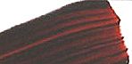
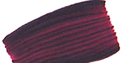
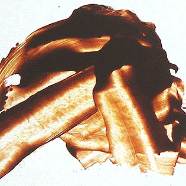

## Quinacridones et cinquasias, famille de pigments
### Quinacridones et cinquasias, famille de pigments utilisée en arts plastiques
 **Quinacridones et cinquasias (famille de pigments)**  



Les cinquasias sont des pigments quinacridoniques.  
Dans l'état actuel de notre enquête, nous sommes pas en mesure d'affirmer s'il s'agit ou non de synonymes parfaits.

Pigments [organiques](organiquesvsinorganiques.html) par excellence, tous les quinacridones sont caractérisés sur une paire de groupements intercalaires O-HN au sein d'un ensemble énantiomérique (voir [isomèrie](isomerie.html)) important.



Ils se distinguent par leur remarquable permanence. Ces colorants remplacent avantageusement les pigments utilisés antérieurement pour créer certaines couleurs importantes. Il existe enfin, grâce à eux, un magenta tenace (le PR122).

Ils fournissent un ensemble de couleurs assez variées allant d'un superbe orangé-marron (quinacridonequinone) au violet (PV19).


Ils ont un fort pouvoir colorant et un pouvoir couvrant très modéré.

Les variétés tirant sur le rouge ont une certaine tendance à la [floculation](pigments.html#aptitudealafloculation) qui occasionne des effets chromatiques car les grains les plus légers semblent nettement plus rouges que les autres (voir image ci-contre à gauche, PO48).

Les variétés dites brunes ou orangées sont également très intéressantes. Ainsi, tout comme le PO48, le PO49 (ci-dessous à droite) ne donne pas une couleur unique mais toute une gamme que l'on peut décliner en faisant varier l'épaisseur ou la densité de pigment.

C'est d'ailleurs globalement le cas avec toutes les couleurs de type quinacridonique. On obtient ainsi des couleurs claires intenses, des intermédiaires puissants et des sombres souvent rompus, parfois très obscurs.

Le plus souvent, les coloris obtenus ne sont pas sans noblesse. Hormis les peintres, ils intéressent notamment les luthiers et les ébénistes.



ATTENTION  : ces pigments ne sont pas anodins. Le contact avec la peau et les yeux est fortement déconseillé (information [RepTox - CSST](liensutiles.html#csst)).


```
title: Quinacridones et cinquasias, famille de pigments
date: Fri Dec 22 2023 11:28:14 GMT+0100 (Central European Standard Time)
author: postite
```
