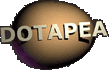
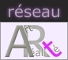
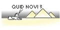

## Qui sommes-nous ?
### Qui sommes-nous ? Dotapea.com se présente
 **Qui sommes-nous ?**  

[L'histoire de ArtRéalité](quinoussommes.html#histoire)  
[Les remerciements](quinoussommes.html#remerciements)



D'abord, qu'est-ce que _Dotapea.com et ArtRéalité_ ?

Au tout début, il ne s'agissait que de notes techniques et de témoignages à rassembler. Très vite, des collaborations actives, des synthèses, des regroupements, un élargissement du champ éditorial et de très nombreuses rencontres ont permis de tisser un réseau - à la fois d'intervenants et d'informations - autour d'une ligne simple : _arts plastiques et réalité,_ un questionnement sur l'art tel qu'il se définit dans les faits. Cette sorte de "mise en perspective par le réel " autorise un désenclavement du discours sur l'art.

Le Réseau ArtRéalité est à la fois un ensemble de sites internet et un réseau de personnes réelles aux profils extrêmement variés.

La page d'accueil de [ArtRéalité.com](http://www.artrealite.com/) est le portail de notre réseau de sites. Dotapea en est le versant technique et scientifique, _quelque part entre l'atome et l'oeuvre._ Il fut fondateur.

L'histoire de ArtRéalité

En 2001, Dotapea naît et se développe. 200 pages, 300 pages, l'ouverture d'un ".com" en janvier 2003, 400 pages, 500, etc. Vers 2003, les premiers entretiens sont publiés. En avril 2004, ils sont regroupés sur un nouveau site, ArtRéalité.com, qui devient le versant "culturel" d'un petit réseau de deux sites.

En décembre 2004, l'audience explose littéralement. Courant 2004 également, des liens se tissent avec le magnifique site [Pourpre.com](http://www.pourpre.com/) sous la forme de nombreuses références croisées et de l'intégration de notre espace de communication sur ce site.

[](http://www.artrealite.com/)

Progressivement, on appelle de plus en plus communément cet espace commun "Réseau ArtRéalité". Un logo est créé en mars 2006.

Au cours des années 2005/2006/2007, une sorte de "canal vidéo" est ébauché. Initialement destiné à la diffusion d'entretiens et d'oeuvres originales, il trouve une vocation supplémentaire fin 2006 en permettant d'illustrer certains [Dialogues de Dotapea](dialoguesdotapea.html) à l'aide de séquence réalisées en imagerie de synthèse (Blender).

Pendant ce temps, une équipe vidéo a pu se constituer progressivement et la naissance d'un pôle actualité dynamique réalisé en coopération avec PourInfos.org et LaCritique.org survient début 2007 ([Fenêtre sur sites](http://fest.artrealite.com/)) mais connaît des problèmes techniques durables. Sur le plan humain cependant, des étapes sont franchies tandis que l'audience croissante fait très concrètement du Réseau ArtRéalité le premier acteur artistique du web francophone (750 000 pages lues par mois en janvier 2008). Néanmoins loin derrière certains acteurs anglophones comme l'admirable Ubu.com, qui joue sur un autre registre.

Parallèlement, de nouvelles capacités de diffusion en régie (c'est-à-dire dans la marge de droite de toutes les pages du réseau) sont mises en place. Pour la première fois de véritables vidéos sont diffusées par millions. Le système fonctionne grâce à un important changement technique (serveur dédié). Une porte est ouverte.

En 2008, la galerie [Walesgal](http://www.walesgal.com/) apparaît. C'est un recyclage salutaire de la contribution de ArtRéalité au projet Opline (prix web d'art contemporain), en suspens à ce jour. Le projet Walesgal est décisif : il est une application commerciale originale par rapport aux existants web et plus que les autres constituants de ArtRéalité, il est voué à faire communiquer le réel et l'irréel (cf. les "[nuits](http://www.walesgal.com/autour/index.html) "). Son contrepoids indispensable, le musée, est un projet en cours d'élaboration. Walesgal est un point de rencontre entre art et réalité.

Malheureusement, après une première édition qui eut bel et bien lieu, Walesgal ne put être continué. Il s'est avéré que la structure était trop lourde. Le projet pourra être repris sous une autre forme, davantage en réseau mais faisant appel à d'importantes ressources informatiques. Durant les années 2009-2011, des recherches ont été menées et un prototype, nommé WAL, a été conceptualisé, décrit et analysé. Malheureusement, il n'a pu être réalisé à cause d'une charge de travail trop lourde. Un autre concept est recherché et rapidement défini fin 2011.

En 2012, grâce à la complicité de l'Entrepôt, lieu culturel fondé par Frédéric Mitterrand, nous réalisons une émission filmée sensiblement hebdomadaire. [Lien.](http://entrepot.artrealite.com/)

[](http://www.quidnovi.net/)

La société [Quid Novi](quinoussommes.html#philippepingandquidnovi) est notre support sur le plan structurel.

Que signifie "DOTAPEA" ?

DOcumentation Technique sur les Arts Plastiques Et Avoisinants

_REMERCIEMENTS_

> Remerciement, d'abord, à tous ceux qui aujourd'hui, sur le réseau, nous aident à développer Dotapea grâce à leurs apports d'informations et leurs questionnements.
> 
> Merci aussi à tous ceux qui ont permis et permettent encore à Dotapea.com de répondre à ces questionnements. Voici une liste qui n'est pas exhaustive, mais où certaines personnes nous ont semblé devoir apparaître :
> 
> François ALBERTELLI, FRANCE, anciennement professionnel de la distribution dans notre métier. Un grand merci.
> 
> Keisuke ASAI, JAPON, maître laqueur.
> 
> > Voir oeuvres in [_La laque japonaise_](laquejaponaise.html#keisuke010).
> 
> Pascal AUBIER, FRANCE. Cinéaste. [Son site.](http://www.pascalaubier.com/)
> 
> Clothilde BERNAIR, FRANCE. Spécialiste des techniques à la chaux et notamment du tadelakt. Son site est : [SableRouge.be](http://www.sablerouge.be/)
> 
> > Elle intervient sur Dotapea dans les pages suivantes :
> > 
> > \* Dialogues de Dotapea, chapitre XVI : Intérieur, extérieur, chaux - [lien](chap16interieurexterieurchaux.html)  
> > \* Courrier des Lecteurs 2009-A : Pigments suspects et badigeon - [lien](courrierdeslecteurs2009c090.html#20091126dlclothilde)  
> > \* Courrier des Lecteurs 2010-A : Taloche et badigeon - [lien](courrierdeslecteurs2010a150.html#20100325rf)
> 
> Yan BILIK, FRANCE. Webmaster de l'excellent [POURPRE.COM](http://pourpre.com/), merveilleux site consacré aux couleurs.
> 
> BLENDER CLAN. [Site francophone](http://www.blenderclan.org/) consacré à Blender3d, un outil d'imagerie de synthèse en passe de devenir majeur sur nos sites. Un forum très réactif, de grandes compétences autour d'un produit légendaire. Merci à cette belle équipe.
> 
> Aurélien BIDAUD, FRANCE. Graphiste. Son aide a été irremplaçable pour les projets Opline et Walesgal. Voir [biztek-fr.com](http://www.biztek-fr.com/)
> 
> Catherine BLOCKX, FRANCE. Entreprise [Blockx](liens.html#blockx) ([Blockx.fr](http://www.blockx.fr/)).
> 
> Yves BODIOU, FRANCE. Artiste plasticien.
> 
> > Voir oeuvres in [Les élastomères silicones](elastomeresilicone.html#yveshexapodes), [Les pigments phospho/fluos](phosphofluo.html#yvesgrenade), [Le latex](latex.html#yvesmaisonpneumatique).
> 
> Inge BOESKEN KANOLD, FRANCE. Artiste plasticienne, spécialiste de la [pourpre](pourpre.html).
> 
> > Son site : [pourpre.inge.free.fr](http://pourpre.inge.free.fr/).
> 
> Emmanuel BOSSENNEC, FRANCE. Artiste et informaticien. Grand pourvoyeur d'excellents solutions techniques. [Lien vers son site.](http://manu.bossennec.free.fr/)
> 
> Hans BOUMAN, FRANCE. Plasticien. Lire une _[Conversation de ArtRéalité.com](http://www.artrealite.com/portail/arcom/)_ ainsi que [son site](http://hans.bouman.free.fr/).
> 
> Jean-Pierre BRAZS, FRANCE. Plasticien et écrivain. [Son site.](http://www.jpbrazs.com/)
> 
> > Lire [un entretien](http://www.artrealite.com/jpbrazs.htm) sur ArtRéalité.com. Jean-Pierre intervient également sur Dotapea en tant que connaisseur exceptionnel du matériau pictural.
> > 
> > Il est fondateur du Centre de Recherches sur les Faits Picturaux (voir [ParlonsPeinture.com](http://www.parlonspeinture.com/)).
> > 
> > Lire aussi une [intervention](courrierdeslecteurs2011a180.html#20110321jl) dans le Courrier des Lecteurs au sujet de Marc Havel et d'autres auteurs.
> 
> Sophie CATHALA-PRADAL, FRANCE, amatrice d'art. Cf. [artrealite.com/carlospradal.htm](http://www.artrealite.com/carlospradal.htm).
> 
> José CIARRUSTA, FRANCE. Artiste peintre, enseignant et grand pédagogue.
> 
> Anne CLERGET, FRANCE. Artiste peintre. [anneclerget.com](http://www.anneclerget.com/)
> 
> Quentin COSSET, FRANCE. Spécialiste en modelage et moulage.
> 
> Jacques COUDERC, FRANCE. Modèle artistique.
> 
> > Lire [l'interview de Jacques COUDERC](http://www.artrealite.com/jacquescouderc.htm).
> 
> Christophe DALECKI, FRANCE. Artiste plasticien. [christophe.dalecki](http://perso.wanadoo.fr/christophe.dalecki/)
> 
> Hugues DELBERG, FRANCE, webmaster du remarquable [EGGTEMPERA](http://eggtempera.free.fr/fr). Un site passionnant et passionné, particulièrement bien documenté dans le domaine de la [tempera](tempera.html) à [l'oeuf](oeuf.html).
> 
> Pierre DELCOURT, FRANCE, artiste peintre.
> 
> Emmanuel DELIVET, FRANCE, directeur du magasin _[La règle d'or](refqr.html#regledor)_.
> 
> Jean-Pierre DELPECH, FRANCE. Sculpteur, [auteur](livres.html#techniquesdulatex).
> 
> Erick DERAC, FRANCE. Plasticien, tout premier exposant de [Walesgal](http://www.walesgal.com/) en 2008.
> 
> Geoffrey FINCH, FRANCE. Traducteur.
> 
> Alain FOURGEREAU, FRANCE. Potier.
> 
> Gérard FROMANGER, FRANCE. Artiste peintre.
> 
> > Grand remerciement pour l'accueil et le temps consacré. [Lire l'article et les vidéos qui lui sont consacrés.](http://www.artrealite.com/gerardfromanger.htm)
> 
> Sylvie GARDYN, FRANCE. Amatrice d'art, marchande d'objets d'art.
> 
> Christian GATTINONI, France. Curateur, critique d'art, artiste, éditeur web... et ami précieux.
> 
> > Lire absolument [LaCritique.org](http://www.lacritique.org/) et [ChristianGattinoni.fr](http://christiangattinoni.fr/).
> 
> Sylvie GERMAIN, FRANCE. Écrivaine.
> 
> Alain GUILLON, FRANCE, webmaster de [VOLCANOGEOL](liensutiles.html#volcanogeol).
> 
> > Remerciements pour la photo publiée dans l'article [_Les basaltes_](basalte.html#photoorgueschilhac) et les deux photos publiées de l'article _[Les granits](granit.html)_.
> 
> Sylvie GUILLOT, FRANCE. Artiste peintre.
> 
> > Découvrir son site, [sylvieguillot.com](http://www.sylvieguillot.com/).
> > 
> > Voir également quelques oeuvres in [La sepia](sepia.html#sepiasylvie), [L'empâtement ou impasto](empatement.html#tableausylvie), [La gomme arabique, l'aquarelle](gommearabaquar.html#aquarsylvie), [Le dessin académique](academies.html#dessinsylvie).
> 
> Richard HALONEN, FRANCE. Curateur, galeriste, expert, "art dealer" comme il se plaisait à dire. Richard est aujourd'hui décédé. Le Réseau ArtRéalité lui doit beaucoup notamment pour la réflexion qu'il a suscitée sur le concept de « gallery without walls " lors de la création de [Walesgal](http://www.walesgal.com/). Un article lui est consacré sur ArtRéalité.com. [Cliquer ici.](http://www.artrealite.com/richardhalonen.htm)
> 
> Jean-Claude, FRANCE, physico-chimiste spécialiste des propriétés optiques des matériaux hétérogènes. Voir _[Les dialogues de Dotapea](dialoguesdotapea.html)_ à partir du [chapitre XXII](chap22mouillage.html).
> 
> Jean-Louis, FRANCE. Chercheur physico-chimiste du CNRS. Intervenant majeur des _[Dialogues de Dotapea](dialoguesdotapea.html)_.
> 
> Alain JOUFFROY, FRANCE. Poète, écrivain, critique d'art.
> 
> > Grand remerciement pour l'accueil. Lire [l'entretien](http://www.artrealite.com/alainjouffroy.htm) sur ArtRéalité.
> 
> Tomomi KAJITA, JAPON. Amatrice d'art et pâtissière.
> 
> Karen, FRANCE. Chercheuse.
> 
> Albin KESTER, FRANCE. Un grand webmaster.
> 
> Alain KLOTZ, FRANCE. Astrophysicien (CNRS). Plusieurs illustrations de notre site ont été extraites de son intéressant mémento _Physique de la lumière_ ([KlotZ-Physique-Lumiere-1.PPT](http://www.astrosurf.com/aude/oleron/ppt/KlotZ-Physique-Lumiere-1.PPT) - on regrette de ne pas avoir assisté à la conférence !), publié sur le site de l'association astronomique AUDE (voir [ASTROSURF-AUDE](http://astrosurf.com/aude) et en particulier [astrosurf.com/aude/oleron](http://astrosurf.com/aude/oleron/)).
> 
> > Voir [Diagramme spectre/température du corps noir](corpsnoir.html#diagrammetempercorpsnoir) et [Superbe spectre in Les pigments, les couleurs](pigments.html#superbespectre).
> 
> Tugdual de LANGLAIS, FRANCE, éditeur du très intéressant site [DELANGLAIS](http://membres.lycos.fr/delanglais) consacré au maître [Xavier de LANGLAIS](livres.html#langlais).
> 
> Jean-Jacques LARDOUX, FRANCE. Amateur d'art.
> 
> Yvon LE BARS, FRANCE, 06 6143 2810. Artiste peintre.
> 
> > Lire l'article qui lui est consacré sur ArtRéalité. [Cliquer ici.](http://www.artrealite.com/yvonlebars.htm)
> 
> Siu LEUNG, FRANCE. Artiste peintre.
> 
> Marc LINCOURT, QUEBEC, FRANCE. Plasticien.
> 
> Catherine LISACK, FRANCE. Créatrice de bagues, miroirs, etc. Une consultante majeure pour tout ce qui concerne le monde minéral.
> 
> Konrad LODER, FRANCE. Artiste plasticien. [Son site.](http://loder.club.fr/index.html)
> 
> > Merci beaucoup pour l'accueil et la patience.  
> > Voir son [exposition](http://www.walesgal.com/espacesexpo/expoactuelle3/LODER/index.html) sur Walesgal.
> 
> Marc LINCOURT, FRANCE, QUÉBEC. Artiste plasticien.
> 
> > [Voir la vidéo](http://www.artrealite.com/players/autres/marclincourt/recollets/) qui lui est consacrée sur ArtRéalité.com.
> 
> Emmanuel LUC, FRANCE. Fondateur et coordinateur du Réseau ArtRéalité.
> 
> Thierry MARIÉ, FRANCE. Artiste peintre, enseignant. [coursdedessin.wifeo.com](http://coursdedessin.wifeo.com/).
> 
> Jean MASCOLO, FRANCE. Éditeur. Voir le site des [Éditions Benoît-Jacob](http://www.benoitjacob-editions.fr/).
> 
> Erick MENGUAL, FRANCE. Se définit modestement comme photographe amateur. [erickmengual.com](http://www.erickmengual.com/)
> 
> Aurélien MORYUSEF, FRANCE. Cadreur professionnel.
> 
> Multi-Hardware.com, un forum vivant où vous trouverez un réel soutien en cas de soucis avec le matériel informatique. Merci Multi-Hardware ! [Lien](http://www.multi-hardware.com/)
> 
> Delphine NEGRE-BOUVET, FRANCE. Traductrice.
> 
> Francine NIGAUD, FRANCE. Amatrice d'art, chimiste.
> 
> Patrick-Gilles PERSIN, FRANCE. Critique et historien d'art, Expert, Président de salon.
> 
> > Lire un [entretien](http://www.artrealite.com/patrickgillespersin.htm) sur ArtRéalité.com.
> 
> [](http://www.quidnovi.net/)
> 
> Philippe PINGAND, FRANCE. Informaticien, Directeur de Quid Novi. Parmi les réalisations de cette entreprise, le site de _Face à l'Art_ ([face-art-paris.com](http://www.face-art-paris.com/)).
> 
> Marika PREVOSTO, FRANCE. Chercheure de talents, rédactrice émérite et éditrice web.
> 
> > Voir [BioStart.eu](http://www.biostart.eu/), site d'une entreprise spécialisée dans les produits naturels BTP et domaines voisins mais aussi [ArtCatalyse.eu](http://www.artcatalyse.eu/), dédié aux relations entre art et environnement.
> 
> Aude RIVARD, FRANCE. Amatrice d'art.
> 
> Jiwan SINGH, FRANCE. Artiste peintre. Voir [jiwansingh.com](http://www.jiwansingh.com/).
> 
> Claude SPIELMANN, FRANCE. Psychanalyste. Claude joue un rôle très actif sur ArtRéalité.com.
> 
> Christophe SPOTTI, FRANCE. [Galerie Fraîch'attitude.](http://www.galeriefraichattitude.fr/)
> 
> Jean-Paul VIDAL, FRANCE, photographe professionnel.
> 
> > Lire [Entretien avec ZOÉ](http://www.artrealite.com/zoemodele.htm).
> 
> Dimitri XENAKIS, FRANCE. Artiste plasticien, sculpteur. [Son site.](http://www.dimitri-xenakis.com/)
> 
> > Merci de ton accueil Dimitri.
> 
> Yaacov, FRANCE, étudiant en physique.
> 
> Shinji YAMADA, JAPON. Artiste peintre, enseignant.
> 
> > Voir oeuvres in [_Le brossé_ vs _le posé_](brossepose.html#shinji010).
> 
> Claude YVANS, FRANCE. Réalisateur. Voir [claudeyvans.com](http://www.claudeyvans.com/)
> 
> > Lire l'article qui lui est consacré sur ArtRéalité.com. [Lien.](http://www.artrealite.com/claudeyvans.htm)
> 
> ZOÉ, FRANCE, modèle artistique.
> 
> > [Lire l'article qui lui est consacré](http://www.artrealite.com/zoemodele.htm).
> 
> et de très nombreuses autres personnes, proches ou parfois inconnues mais ayant pourtant, chacune, apporté sa pierre.
> 
> Pour Dotapea en particulier,
> 
> Remerciements aux premiers professionnels et amateurs rencontrés au cours de la mise en place de cette entreprise, de 2001 à 2004. Sans eux rien n'aurait été possible et ce n'est pas une formule.
> 
> Remerciements également aux vendeurs des magasins de Beaux-arts et d'ébénisterie de Paris, pour leur patience et leur collaboration.
> 
> Remerciements enfin aux fabricants qui ont bien voulu nous faire parvenir gratuitement de nombreuses documentations.

_Crédits photos/vidéo_

> Nous avons fait le travail nous-mêmes dans la plupart des cas. Pour le reste, les autorisations sont directement associées aux images quand elles sont nécessaires, c'est-à-dire lorsque le sujet n'appartient pas au domaine public.
> 
> Merci de ne pas référencer nos images sans nous en demander l'autorisation. De toute façon, on y veille. Question de bande passante... et de cordialité.

Emmanuel LUC, éditeur, coordinateur


 [Communication](http://www.artrealite.com/annonceurs.htm) 

[](index-2.html#20131014)


```
title: Qui sommes-nous ?
date: Fri Dec 22 2023 11:28:14 GMT+0100 (Central European Standard Time)
author: postite
```
