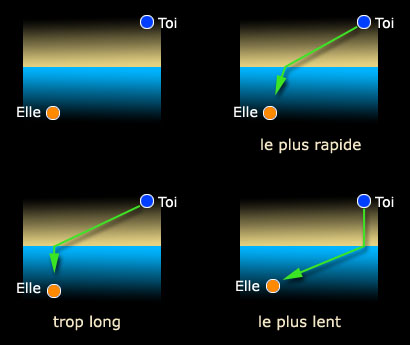

## Réfraction, réfringent
### Réfraction, réfringent, article du glossaire
 _Du latin_ refringere_,_ du latin refringere, briser,  
indirectement de frigus, froid (voir étymologie de [réfractaire](refractaire.html))

Issue d'un différentiel de vitesse de propagation de la lumière (ou d'un autre phénomène ondulatoire tel que le son) lors du passage d'un milieu à l'autre, la réfraction imprime aux rayonnements un angle de propagation.

**A. Mise au point lexicale.**

Le terme _réfraction_ semble lié à la _déviation_ des rayons alors que la _dispersion_ concernerait leur _division_ en fonction des longueurs d'onde. La _diffraction_, elle, réfère - au sens scientifique - aux phénomènes [d'interférences](chap08interferences.html) qui surviennent lorsqu'une onde rencontre un obstacle sur sa trajectoire. L'Académie française donne à ce mot un sens plus vaste.

**B. Réfraction.**

Elle n'est pas seulement un indice angulaire, mais aussi une mesure de la vitesse de la lumière dans un milieu. Lire absolument à ce sujet un [passage essentiel](chap06polaris.html#indicerefraction) du chapitre VI des _Dialogues de Dotapea_.

A la question "comment la vitesse se traduit-elle en angle ?", nous avons une réponse en marge de ce _Dialogue_ :

> "_Oui, c'est pas forcément intuitif. Je te fais un dessin._
> 
> _L'idée qui sous-tend tout est que le trajet des rayons lumineux est celui qui minimise le temps de trajet. Ca implique un changement d'angle. L'exemple de Feynman (Nobel de physique) : tu es sur une plage et tu vois Pamela Anderson qui se noie. Il faut que tu ailles le plus vite possible._
> 
> __
> 
> _Comme tu cours plus vite sur le sable que tu ne nages dans l'eau, tu as intérêt à minimiser ta nage, mais pas trop non plus, il y a un optimum._"

L'indice de réfraction n'est pas une moyenne. Soit on précise la longueur d'onde à laquelle il est mesuré, soit on utilise "la raie jaune du sodium", référence habituelle.

\[avec l'aide de [Jean-Louis](quinoussommes.html#jeanlouis)\]

Indices de réfraction négatifs : lire un [passage](chap11metamateriaux.html#indicerefractionnega) du chapitre XI, _Les métamatériaux_.

**C. Réfringent (adj.), réfringence (n.f.)**

Un corps réfringent fait dévier des rayons lumineux ou autres et crée une réfraction (voir ci-dessus).

Voir absolument [La biréfringence (glossaire)](birefringence.html).

Un [passage](chap08interferences.html#refraction) du chapitre VIII des Dialogues expose un autre cas particulier où la longueur d'onde joue un rôle.


 [Communication](http://www.artrealite.com/annonceurs.htm) 

[](index-2.html#20131014)


```
title: Réfraction, réfringent
date: Fri Dec 22 2023 11:28:17 GMT+0100 (Central European Standard Time)
author: postite
```
