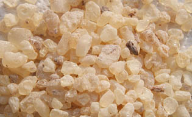

## La résine dammar
### La résine dammar, usage en arts plastiques et autres
 **La résine dammar**  

Liens directs  
[Fabriquer un médium dammar (autre page)](mediumdammar.html)  
[Usage dans un fixatif](resinedammar.html#fixatif)  
 



Résine de pins _Dammara_, cette résine est très employée par les peintres car elle combine trois propriétés remarquables :

> \* elle est très transparente, très peu colorée (c'est la moins colorée de toutes les résines solides naturelles) et ne jaunit pas
> 
> \* elle donne une peinture très brillante
> 
> \* elle est peu coûteuse.

On la dilue dans l'essence pour faire un médium maigre auquel on peut éventuellement ajouter d'autres produits.

Elle présente un très léger défaut : même bien filtrée, elle laisse des dépôts cireux (_résène bêta_) dans les flacons, ce qui n'a guère d'importance. On peut très bien la raffiner par décantation (voir [article](mediumdammar.html)), mais nous sommes assez nombreux à avoir constaté que cela n'est pas forcément nécessaire avec une gomme de bonne qualité.

_Elle rend de grands services_. Au point de vue de la siccativité, elle est assez neutre. Chimiquement parlant elle laisse indifférent le [papier tournesol](papiertournesol.html).

La _dammar batavia_ est (à tort ou à raison) la plus réputée parmi les différentes variétés de cette gomme. Toute information sur les qualités des différents types de gomme dammar [est bienvenue](ecrire.html) étant donné que la source de l'approvisionnement demeure un information vraiment très opaque dans l'offre généralement proposée en Europe.

Sur la question des _insolubles dans l'essence à peindre_, peu de données. [Xavier de Langlais](livres.html#langlais) ne donne aucun chiffre et [André Béguin](livres.html#beguin) non plus. [François Perego](livres.html#perego) en donne, mais ils ne semblent pas très parlants pour le peintre. En effet, il indique que par exemple la variété Batavia est totalement soluble dans la térébenthine. Mais qu'en est-il dans les faits ? A laisser la gomme se dissoudre intégralement, on intègre aussi sa cire. Celle-ci laisse un "reste" poisseux inexploitable, d'un volume conséquent, qu'il faut ensuite éliminer par décantation. Une dissolution intégrale n'est guère compatible avec l'usage en peinture car les composants les plus indésirables se répandent dans le médium. De nombreux enseignants conseillent une durée de dissolution modérée afin précisément d'éviter cet écueil, d'autant plus que l'utilisateur ignore souvent de quelle variété il s'agit.

_Comment fabriquer votre médium dammar ?_

 Voir [article](mediumdammar.html). En cas de problème voir [ici](courrierdeslecteurs2009a020.html#20090109gg).

_Emploi comme fixatif_

Un [fixatif](fixatifs.html) peut être réalisé avec cette remarquable résine dont l'insoluble dans [l'alcool](alcool.html) est compris entre 28,50 et 19,10 selon Xavier de Langlais.

Citons le témoignage d'un jeune artiste que nous nommerons Gabriel. Gabriel a réalisé un test comparatif très intéressant. Il s'agit de protéger un travail au [fusain](fusain.html) au-delà de la fixation simple réalisée avec les produits courants. Gabriel veut sinon vernir son travail, du moins le fixer bien solidement :

**Notes à droite**

> J'ai fait une [eau gommée](gommearabaquar.html#eaugommee) à partir de [gomme arabique](gommearabaquar.html) "en cailloux", et une autre avec de la gomme dammar diluée à [l'éthanol](alcool.html#ethanol), que j'ai faite aussi (les deux suivant les instructions de votre site). Je les ai passés au pinceau sur un fusain préalablement fixé bien sûr, et le résultat est celui que j'espérais : cela ne dénature pas le fusain, il garde sa transparence et sa couleur, c'est-à-dire le gris ne devient pas noir.

La gomme arabique peut protéger mais  
elle est un peu fragile pour que l'on puisse  
l'employer comme vernis à proprement parler.

> Avec la gomme arabique, l'aspect est satiné, avec la dammar, l'aspect est brillant.
> 
> Par contre on voit un peu les traces de pinceau - je n'ai cependant pas utilisé un pinceau synthétique souple et fin, ce qui résoudrait peut-être le problème (j'ai pris un pinceau "de bricolage").

Un poil fin peut résoudre le problème  
mais n'oublions pas la [soufflette](soufflette.html).

> Le dammar n'a pas fait de taches de gras, il n'a même pas laissé de cire dans le bocal où je l'ai préparé.

La quantité de cire dépend notamment du [temps de dissolution.](resinedammar.html#insolubles)

> En ce qui concerne le [dévernissage](devernissage.html), dans mon cas (fusain verni) bien sûr, la question ne se pose pas, cela détruirait l'oeuvre. Vraisemblablement, mais cela aussi dépend de la nature du fixatif.

Effectivement, une couche de fusain même fixée est bien fine par rapport à  
une couche de peinture, donc le décollage d'un tel "vernis" paraît une mission impossible.

> Les deux pellicules de vernis sont par contre assez "cassantes", donc c'est la dernière étape du processus (il faut maroufler avant).

L'usage de dammar sur d'autres types de surfaces picturales ne donne pas un résultat spécialement cassant, y compris sur support souple. Il en va de même pour la gomme arabique.

Mais tout dépend de l'épaisseur. S'agissant d'une aquarelle, d'un [jus](jus.html) fait de peinture à l'huile diluée avec un médium dammar même maigre, cela reste très fin, très dilué et l'on n'a pas entendu parler de problèmes à ce sujet.

Dans votre cas il est question d'une protection presque de l'ordre du vernis. Donc il vaut mieux en effet [maroufler](maroufler.html) le support avant cette opération afin d'éviter des incidents liés à une rigidité qu'un support trop souple mettrait à trop rude épreuve.


 [Communication](http://www.artrealite.com/annonceurs.htm) 

[](index-2.html#20131014)


```
title: La résine dammar
date: Fri Dec 22 2023 11:28:19 GMT+0100 (Central European Standard Time)
author: postite
```
