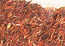

## Les rouges et les roses
### Les rouges et les roses, pigments utilisés en arts plastiques
 **Les rouges et les roses**  

_[English version](english/redsandpinks.html) [](english/redsandpinks.html)_ 

\[Lectures conseillées :  
[Le rouge dans la langue française, Pourpre.com](http://pourpre.com/langue/expressions.php#rouge)  
[La couleur rouge, Pourpre.com](http://pourpre.com/chroma/dico.php?typ=fiche&ent=rouge)\]

_Le rouge, bien que peu [énergétique](synthesesoustractive.html#energie), serait selon certains la couleur la plus rapidement aperçue, même à distance. On la retrouve un peu partout à travers le monde dans les célébrations maritales, les fiançailles, les saturnales, les lieux de plaisirs orientaux ou occidentaux, etc. C'est la couleur de Bacchus et de Dionysos. Même du point de vue linguistique, le rouge n'est pas dépourvu d'intérêt : il donne royro au Japon, holi en inde, rouge ou rouille en France et sans doute de très nombreux autres termes phonétiquement proches de par le monde._

_Mentionnons aussi l'association du rouge aux menstruations. L'occasion, pour certains peuples, de révérer au travers de cette couleur la féminité, et pour quelques autres, de signaler, par le port obligatoire sur le visage de la couleur rouge, un état prétendu impur, avertissant du même coup les autres civilisations humaines de leur propre obscurantisme._

_On relève cependant, heureusement, un usage traditionnel du rouge  globalement protecteur et propiciatoire au combat comme en amour, repoussant même parfois les esprits mauvais, soulignant un grade politique ou un pouvoir et protégeant le bétail - sans compter les vertus curatives supposées de [l'hématite](hematite.html) et du [sang-dragon](s.html#sangdragon) censées lutter contre la rougeole et telle ou telle autre inflammation -, dans de nombreuses traditions du monde entier. Ces traditions, faisant souvent référence à [l'ocre rouge](terresrouges.html), pourraient être tellement anciennes qu'elles se confondraient historiquement avec la naissance de l'acte de peindre._

Sommaire

[Couleurs évoquées sur d'autres pages](rouges.html#couleursevoqueesdansdautrespages)

[Les rouges azoïques](rouges.html#lesrougesazoiques)

[Le rouge hélios](rouges.html#lerougehelios)

[Le rouge vermillon de Chine](rouges.html#lerougevermillondechine)

[Le rouge de carthame](rouges.html#lerougedecarthame)

[Le rouge d'Andrinople](rouges.html#lerougedandrinople)

[Les couleurs écarlates](rouges.html#lescouleursecarlates)

[Le grenat](rouges.html#legrenat)

[Les thio-indigos](rouges.html#thioindigos)

[Le henné](rouges.html#lehenne)

[Le rose](rouges.html#lerose)

[Pour mémoire...](rouges.html#pourmemoire)

[L'arséniate de cobalt](rouges.html#larseniatedecobalt)

[Le réalgar](rouges.html#lerealgar)

[Le rose ou rosette ancien (rouge brésil, braziline)](rouges.html#leroseourosetteancien)

[Le rocou ou roucou (glossaire)](roucou.html)

[Le rouge de molybdène (courrier des lecteurs)](courrierdeslecteurs2010a070.html#20100210mf)

[Les rouges d'utilisation locale](rouges.html#lesrougesdutilisationlocale)

[A voir aussi](rouges.html#importantvoiraussi)

**Couleurs évoquées sur d'autres pages :**

Lecture conseillée : [Le rouge sur Pourpre.com](http://pourpre.com/chroma/dico.php?typ=fiche&&ent=rouge)

_Garance, alizarine, carmin, kermès_ et _cramoisis_ : voir [laques](laques.html) et [laques anciennes](laquesanciennes.html).

_Vermillon et cinabre :_ [article séparé](vermillons-2.html).

_Minium :_ [article séparé](minium.html).

_Rouges de cadmium_ : [article séparé](cadmiumsrouges.html).

_Terres rouges (rouge de Pouzzoles, rouge Van Dyck, etc.) :_ [article séparé](terresrouges.html).

_Sanguine :_ [article séparé.](sanguine.html)

**Les rouges azoïques**

_Voir [Famille des pigments azoïques](azoiques.html)_

Ils sont généralement superbes, éclatants, lumineux et d'une permanence très correcte. Fort [colorants](pigments.html#2facteurcolorant), ils sont peu [couvrants](pigments.html#1facteurcouvrantopposetransparence).

De très nombreuses imitations de pigments devenus rares ou considérés comme dangereux sont azoïques.

**Le rouge Hélios**

Sa base est la [toluidine](toluidine.html) éventuellement mêlée de [xylidine](xylidine.html) ([azoïque](azoique.html)). Il est très colorant, intense et lumineux mais moyennement permanent.

**Le rouge vermillon de Chine**

Imitations fabriquée aujourd'hui avec la même base que le [rouge hélios](rouges.html#lerougehelios), il est nettement plus rose que rouge. Pour plus de détails, lire passage in [_vermillons_](vermillons-2.html#enchine).

**Le rouge ou rose de carthame**



Il est bien dérivé de la même plante (famille des synanthérées) que [l'huile du même nom](huiledecarthame.html) - Nord-américaine - mais pas exactement de la même variété. Les variétés orientales sont réputées - ce pigment serait très utilisé dans les peintures chinoises - mais les acclimatations alsaciennes et provençales n'ont pas mauvaise presse.

Cette plante sert également de colorant alimentaire.

A dire vrai, nous manquons d'informations plus précises concernant la couleur pigmentaire que l'on en tire. [Merci](ecrire.html) de nous apporter tout témoignage concernant ce produit, sa fabrication, son utilisation, sa conservation.

Voir [Safran](jaunes.html#lesjaunessafran).


**Le rouge d'Andrinople**

Andrinople, aujourd'hui Edirne, est située en Thrace (Grèce).

Chromate de plomb + oxyde de plomb, vous avez deviné : le rouge d'Andrinople est un pigment toxique en voie avancée d'élimination. Sa composition actuelle est exactement la même que la version en cours du défunt [jaune de chrome](jaunes.html#lesjaunesdechrome) orangé. En fait, le terme de "rouge" d'Andrinople correspond à une ancienne lacune linguistique. Aujourd'hui, il serait plutôt classé parmi les orangés.

Il contenait de [l'éosine](eosine.html) (comme le jaune de chrome précité).

Son procédé de fabrication - un peu spécial - était _un_ _secret commercial majeur_ qui fut percé au cours du Moyen-âge. Graisses rances, huile, urine et excréments, sangs animaux : la fabrication était particulièrement infecte !

Et... cette couleur servait en premier lieu à la teinture.

Lecture conseillée : [Le rouge d'Andrinople sur Pourpre.com](http://pourpre.com/chroma/dico.php?typ=fiche&&ent=andrinople)

**Les couleurs écarlates**

Le terme d'écarlate (_scarlet_ en anglais, peut-être du persan _saqirlat_, étoffe) est quelquefois apposé à un intitulé courant de type "rouge de cadmium". Il s'agit parfois d'une modification obtenue par simple jaunissement de la couleur originelle (ex.: ajout d'un PY83, d'un [azo](azoiques.html)).

L'étymologie du mot dénote un voyage linguistique considérable durant lequel le sens originel - qui ,dit-on, désignait un bleu - a pu s'altérer quelque peu. Aujourd'hui on compte _grosso modo_ parmi les couleurs "écarlates" le vermillon, certains rouges de cadmium clairs et les rouges japonais clairs, tendant tous vers l'orangé. Plus globalement, il s'agit des couleurs rouges les plus éclatantes.

On mentionne en teinturerie l'écarlate des Gobelins et celui de Venise, peut-être plus froids que ceux que nous reconnaissons aujourd'hui sous cette appellation.

Lecture conseillée : [L'écarlate sur Pourpre.com](http://pourpre.com/chroma/dico.php?typ=fiche&&ent=ecarlate)

**Le grenat**

C'est une pierre, une ou plusieurs couleurs mais pas réellement un pigment.

Pourtant, les Romains fabriquaient un _usta_ qui était censé l'imiter, ou imiter la pourpre. [Lire l'article grenat du glossaire.](grenat.html)

D'ailleurs le terme "rouge grenat" est il valable ? S'agit-il d'un rouge ? Théoriquement seulement car il existe des grenats noirs et les fabricants de peintures proposent des "rouges grenats" fortement violacés !

Voir _[laque de grenat](laques.html#laquedegrenat)_.

**Les thio-indigos**

Pour des raisons étymologiques, ils sont traités dans l'article consacré aux bleus froids, dans la suite des sections indigo, indican et indanthrène.

[Cliquer ici.](bleusfroids.html#thioindigo)

**Le henné**

C'est avant tout un grand arbuste (_Lawsonia inermis_, famille des Lythrariacées) croissant en Inde, au Moyen-Orient et au Maghreb. La substance colorante est extraite des feuilles, simplement séchées puis réduites en poudre fine avant d'être mêlées à l'eau légèrement acide (citron) et bouillies pas plus d'une heure.

Il a une grande affinité avec la peau humaine (mais aussi les ongles et les cheveux) : non seulement il la colore très facilement, mais il aurait même des vertus cicatrisantes (information non confirmée) et fongicides (pas de confirmation non plus). Utilisé quelquefois pour teinter une peau trop blanche (celle de Fatima, fille du Prophète sAaws, selon la tradition religieuse, celle des nouveaux-nés selon certaines traditions coutumières), il est pourvu pour certains peuples musulmans de vertus divines, quoique non certifiées par le Coran. Il est ainsi, traditionnellement, censé protéger des esprits en des circonstances très diverses. Il est souvent appliqué sur les paumes, la plante des pieds, les ongles et les lèvres.

Il peut être utilisé en lavis mais sans garantie de [permanence](pigments.html#permanence).

Sa couleur, bien connue, est d'un rouge brun, devenant nettement jaune lorsqu'il est dilué.

**Le rose**

\[Lectures conseillées :  
[Le rose dans la langue française, Pourpre.com](http://www.pourpre.com/langue/expressions.php#rose)  
[La couleur rose, Pourpre.com](http://pourpre.com/chroma/dico.php?typ=fiche&ent=rose)\]

Le rose... une couleur si difficile à définir tant elle est délicate, comme la fleur dont elle a pris le nom. Elle tend si facilement vers le kitsch, elle est si ardue à manipuler !

On peut distinguer (plus ou moins) deux types de rose :

> \* Le plus "vulgaire" (généralement), qui est un rouge rehaussé de blanc. C'est le cas des couleurs très abusivement nommées "teintes chairs" et "ocres de chair" par les fabricants (voir [Les carnations](carnation.html)). Ce genre de mélanges binaires (il s'agit de Sienne brûlée et de blanc de zinc ou de titane) est reconnaissable à des kilomètres. Relativement peu commodes pour l'utilisation en glacis car très couvrants, ils sont... bien souvent à fuir en courant.  
> Les roses plus complexes, plus rompus, comme par exemple les "vieux roses", partent de deux couleurs ou plus et un blanc. Ils peuvent être très adaptés à des emplois abstraits ou figuratifs, mais plus difficilement et plus localement au portrait, spécifiquement, à moins d'être mêlés, juxtaposés intimement, encore et toujours.
> 
> \* Ceux qui naissent d'un rouge très transparent appliqué en glacis sur fond clair, ont une force, une puissante intensité. Bien que le résultat chromatique puisse être touchant, là aussi, rompre le ton (le rouge ou la couleur de fond) est souvent indispensable.

Le rose est associé à l'érotisme et comme souvent dans ce domaine, le risque est grand de sombrer dans la vulgarité et encore plus dans la facilité. Cette couleur nécessite certainement l'oeil le plus aguerri, le plus subtil. Jouer la provocation est aussi une solution. Cette voie a cependant été explorée, déclinée, chantée et hurlée sur tous les tons.

En résumé, le rose est un défi : **cette couleur n'est pas celle de la peau** (en général), mais elle l'a symbolisée si fortement qu'il est très difficile de faire oublier le symbole, lié selon certains à l'âge où le blanc de l'innocence parvient à se marier à l'ardeur du rouge. Son meilleur emploi est probablement celui qui s'éloigne le plus, par le contexte, de cette référence.

_Pour mémoire_

**[L'arséniate](arsenic.html) de [cobalt](cobalts.html)**

Peu permanent en présence de lumière, toxique. Son usage est impossible en peinture à l'huile.

Selon une source d'informations non confirmées, il serait obtenu par la précipitation d'une solution de chlorure d'antimoine à l'aide d'une autre solution, l'hyposulfite de soude. Un procédé dans lequel on ne voit apparaître ni [l'arsenic](arsenic.html) ni le [cobalt](cobalts.html) ! Manifestement, soit l'information est fausse, soit elle est beaucoup trop partielle, soit il s'agit d'une imitation. [Toute information précise sur l'arséniate de cobalt est bienvenue](ecrire.html).

Ce pigment aurait été très employé en Grande-Bretagne au XIXème siècle.

Sa couleur couvrirait un large spectre allant du jaune-orangé au rouge violacé.

**Le réalgar**

Encore présent sur les palettes à la fin du XIXème siècle, ce poison est heureusement à peu près laissé pour compte. Lire [l'article du glossaire](realgar.html).

**Le rose ou rosette ancien** **(rouge brésil, braziline)**

A l'époque des enluminures médiévales, ce rose était obtenu à partir d'un _bois nommé brésil_. L'appellation peut surprendre, le Brésil n'ayant été découvert que beaucoup plus tard, mais _brésil_ signifie bois, par analogie entre la braise et la couleur de la substance pigmentaire extraite de certains bois. L'Europe disposait déjà, avant Christophe Colomb, d'une essence arboricole utilisable dans la fabrication du pigment, _Caesalpinia sappan_. Cette plante comporte une substance colorante, la braziline ou braziléine.

Le premier nom du Brésil actuel fut _Vera Cruz_ (baptisé ainsi en 1500 par Pedro Cabral). Cette appellation se transforma très rapidement (XVIème) en _Braxil_ (prononcer _brachi'w_, évoluant en _brazi'w_) à cause de la découverte en cette contrée d'une grande quantité d'essence arboricoles ayant des vertus tinctoriales de toute première importance à l'époque - en fait dès l'Antiquité - pour l'économie mondiale et la géopolitique.

Le procédé de fabrication fut maîtrisé tardivement. Les fins copeaux de ce bois (râpé avec du verre et non du fer) étaient macérés dans du vin et/ou de l'eau adjointe d'[alun](alun.html) puis réchauffés (éventuellement, selon les recettes et les destinations : il existe des procédés à froid) afin de fournir un pigment exploitable en peinture ou pour les encres, ou pour la teinture. Il était en fait surtout utilisé pour teinter les draps de luxe et les vêtements princiers.

Ce pigment était en effet coûteux non seulement à cause de la difficulté, à l'époque, de réduire les copeaux en poudre, mais aussi parce que son importation suivait un très long trajet.

Il aurait en effet été importé en Europe dès la fin du XIIème siècle de Java, Sri Lanka, Sumatra et des Indes via Bagdad, par les Vénitiens.

Les essences brésiliennes (on parle cette fois du pays), qui poussent sur la côte atlantique, sont aussi des Césalpinées. Il existe en fait sur la planète différentes plantes de cette famille, dont le pernambouc et le sappan malais ou philippin.

La résistance à l'eau du rouge brésil est excellente, mais sa sensibilité à la lumière est signalée par certains auteurs, ce qui pourrait expliquer sa disparition progressive au profit d'autres substances plus [permanentes](pigments.html#permanence).

Sa teinte varie de l'orange au violet en fonction de la charge chimique de la solution où elle est mise à macérer. Elle virerait à l'orange en présence d'une solution [acide](acides.html) et vers le violet si la mixture est [basique](base.html) (information non confirmée). Le plus souvent, le teinturier et l'artiste recherchaient un rose.

Au XVIIIème siècle, on se servait encore du rouge brésil pour teinter les [mordants](mordant.html) afin de contrôler leur présence, l'imbibition de la fibre, et donc _la capacité d'une zone locale du tissus à retenir ultérieurement une teinture plus puissante_.

En tant que pigment d'origine végétale, colorant et transparent, le rouge brésil a pu être considéré comme une laque (cf. [laques](laques.html), [laques anciennes](laquesanciennes.html)).

**Le rocou ou roucou**

[Lire l'article du glossaire.](roucou.html)

**Le rouge et l'orangé de molybdène**

[Lire l'article du courrier des lecteurs.](courrierdeslecteurs2010a070.html#20100210mf)

**Les rouges d'utilisation locale**

Le sorgho (Chine), l'oseille et l'hibiscus sont mentionnés dans certains ouvrages ainsi que différents bois africains, mêlés à l'eau ou à [l'huile de palme](autreshuiles.html#lhuiledepalme). Le rouge batéké, par exemple, a été abordé dans le Courrier des Lecteurs ([lien](courrierdeslecteurs2011b090.html#20110618vd)).

L'aulne est souvent mentionné parmi certains peuples du Nord (Inuits, Saamis).

Le sang, humain ou animal, a été utilisé également et l'est peut-être encore.

Le vin est employé à des destinations artistiques (voir [alcools](alcools.html)).

**Important : voir aussi**

Pour des raisons d'ordre historique, la barrière entre rouges et mauves, voire violets, est particulièrement floue. Nous conseillons à nos lecteurs de visiter l'article _[Violets et mauves](violetsetmauves.html)_.


 [Communication](http://www.artrealite.com/annonceurs.htm) 

[](index-2.html#20131014)


```
title: Les rouges et les roses
date: Fri Dec 22 2023 11:28:21 GMT+0100 (Central European Standard Time)
author: postite
```
