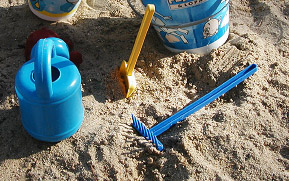

## Le sable
### Le sable, usage en arts plastiques
 **Le sable**  

_Le sable peut être employé pour toutes sortes de techniques : peintures à l'huile, acrylique, glycérophtalique, fresque, terres, modelage, verrerie, abrasion des pierres (voir [obsidienne](autrespierresign.html#abrasionobsidienne)), etc._

_Il s'agit d'une poudre sédimentaire [siliceuse](silice.html). Il contient souvent du [quartz](quartz.html) et doit dans tous les cas être considéré comme une charge [cristalloïde](cristalloide.html)._



Commençons par un petit tour d'horizon des emplois du sable.

En peinture à l'huile, à l'acrylique, à fresque, le sable ne pose aucun problème spécifique : son effet est purement plastique. Dans le domaine du modelage, par contre, il présente un avantage d'un tout autre ordre : il bonifie le retrait, facilitant l'évacuation de l'eau (lire _[Les terres, substrats, supports](terressupports.html)_). Il est également très présent dans les argiles destinées à la fabrication de briques car, élément grossier piégé dans une matière plus fine, il est solidifiant, à l'instar des graviers que l'on plonge dans le ciment pour en faire du béton. A ce propos, justement, il est possible d'utiliser le sable pour mouler [ciment](ciment.html) et [béton](beton.html). Enfin, en verrerie, le sable est... tout ! Ou presque. Le [verre](verre.html), c'est avant tout du sable.

Parmi les sables réputés les plus purs (au-delà de 99,6% de [silice](silice.html)), nous citerons le sable de Fontainebleau et celui de Nemours. Ils sont très utilisés dans les domaines de la verrerie et des [émaux](email.html). Tout fabricant souhaitant signaler un autre sable très pur est chaleureusement invité à se faire connaître [en cliquant ici](ecrire.html).

Certains fabricants proposent un sable de bonne qualité, chimiquement stable, mais on peut aussi s'approvisionner au bord d'une rivière ! En fonction des particularités géologiques locales, les variétés récoltées contiendront plus ou mois de silice. En général, il vaut mieux préférer les sables les plus durs, plus chargés en silice, les plus neutres chimiquement. Le sable coquiller, qu'il provienne des plages ou d'une falunière, doit bien entendu être débarrassé de son sel et tout sable doit de toutes manières être abondamment lavé.

Le sable et [l'argile](argile.html) peuvent parfois former une pâte contenant du falun ([cf. article du glossaire](falun.html)), sorte de sable coquiller ou d'amas de coquilles fracassées, qui peut être exploité et utilisé... pour l'amendement des terres cultivables trop acides. Il existe peut-être des utilisations artistiques du falun ([merci de nous faire signe si vous en connaissez](ecrire.html)).

Dans tous les cas, dès lors qu'il est question d'incorporer du sable dans une pâte, il est important de s'assurer de la neutralité chimique du produit et/ou de son adéquation aux autres produits. L'idéal est de tester au [papier tournesol](papiertournesol.html) le sable étendu [d'eau distillée](eau.html#eaudistillee).

Lire aussi [le passage sur la fulgurite dans l'article sur le verre](verre.html#fulgurite).


 [Communication](http://www.artrealite.com/annonceurs.htm) 

[](index-2.html#20131014)


```
title: Le sable
date: Fri Dec 22 2023 11:28:22 GMT+0100 (Central European Standard Time)
author: postite
```
