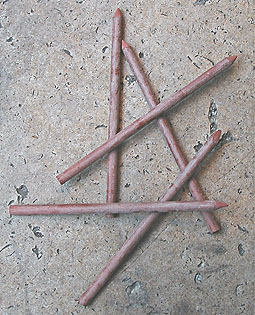

## La sanguine
### La sanguine, usage en arts plastiques
 **La sanguine**  **La sanguine** **classique**

A partir de l'âge classique, au XVIIIème siècle, on perfectionne le procédé de fabrication de la sanguine dont l'usage se répand considérablement.

On fabrique des bâtonnets à l'aide de poudre d'hématite adjointe à de la [gomme arabique](gommearabaquar.html). Dilués dans l'eau, ils fournissent une très belle encre, "l'encre sanguine", utilisée pour les académies. Le bâtonnet - qui peut sembler légèrement cireux - peut être trempé directement dans l'eau (contrairement aux crayons aquarellables) et donne alors un trait épais.  _Plus couramment, l'artiste fabrique une encre en dissolvant patiemment le bâton dans un peu d'eau ou [d'alcool](alcools.html) au creux d'une assiette ou d'un bol (il faut "crayonner" au fond du récipient durant une à deux minutes). Il se sert ensuite - alternativement ou simultanément - de cette encre, à la plume ou au pinceau et du bâtonnet, détrempé ou sec._

Note : il existe des porte-mines spécialement adaptés à ce type de bâtonnets. Plusieurs fabricants ont d'ailleurs choisi le même format de mine, adaptable à cet outil, pour des mines graphites et des fusains synthétiques. Certains de ces accessoires sont de beaux objets, d'une certaine valeur.

Parallèlement, des craies carrées et des crayons non diluables à l'eau ont apparu. Assez proches des pastels secs, ils ont réussi à s'imposer en tant que procédés dits académiques dans de nombreuses écoles. L'emploi de la sanguine classique est presque tombé dans l'oubli.

**Le papier, complice de la sanguine**

Quoi qu'il en soit, la coloration du papier joue un rôle important pour tous les travaux à la sanguine. Les papiers de teintes crème et gris ou gris-bleu sont fréquemment employés, comme pour toutes les académies. L'emploi d'encre sanguine nécessite, comme pour tout procédé liquide, un poids au mètre carré bien plus important que les techniques sèches (voir [papiers pour l'aquarelle](papierspourlaquarelle.html), [pour le lavis](papierspourlaquarelle.html#lespapierspourlavisouautres)). Une [tension de la feuille](tensiondupapier.html) peut être envisagée, autorisant par exemple une pigmentation rouge préalable sur toute la surface de la feuille ou de larges aplats, un véritable travail en [lavis](lavis1.html).

**Offre actuelle**

Certains fabricants proposent encore des bâtonnets de sanguine, de sépia - et autres couleurs "académiques" ou assimilées - pouvant être dilués, comme indiqué ci-dessus. Ces produits ne doivent pas être confondus avec les crayons et bâtonnets "aquarellables" contemporains qui se diluent beaucoup plus aisément, directement sur le papier, et couvrent une gamme chromatique bien plus importante, au-delà des seuls oxydes de fer. Ce n'est pas réellement un "mieux" du modernisme : c'est une nouvelle technique de travail qui n'a que peu de véritables points communs avec la sanguine classique.

D'autres fabricants ont abandonné les produits diluables pour se tourner notamment, comme nous le disions, vers des craies souvent carrées ressemblant à des pastels, mais moins pulvérulents. Ils proposent souvent différentes nuances de sanguines.

Lire aussi _[Le lavis](lavis1.html)_, _[La sépia](sepia.html)_, _[L'encre de Chine](encredechine.html), [Le brou de noix](broudenoix.html)_.


 [Communication](http://www.artrealite.com/annonceurs.htm) 

[](index-2.html#20131014)


```
title: La sanguine
date: Fri Dec 22 2023 11:28:23 GMT+0100 (Central European Standard Time)
author: postite
```
