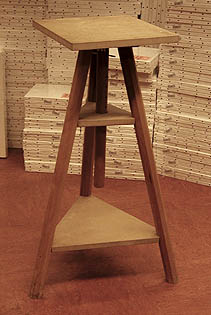

## La selle
### La selle, usage en arts plastiques
 **La selle**  



Outil essentiellement destiné au modelage et à la sculpture en général.

Le plateau tournant est réglable en hauteur, mais la position basse est toujours un peu élevée. Certains auteurs conseillent aux débutants d'utiliser un tabouret assez haut qui facilite le changement de station : assise ou debout.

Le trépied s'est imposé car il facilite le déplacement et le positionnement du corps.

Certains modèles sont démontables et transportables. Pour le reste, les différences entre les modèles sont assez faibles. La taille du plateau (influant sur celle du trépied) et la qualité du bois - toujours lourd, massif - sont pratiquement les seuls éléments sur lesquels reposent les variations.

Il existe cependant une autre conception du support : **le** **plateau tournant ou _tournette_** destinés à être posé sur une table. Les modèles métalliques ne sont réellement intéressants que par leur poids, leur assise.

Il est courant que l'on recouvre le plateau d'un plastique ou d'une planche de [mélaminé](melamine.html) pour faciliter le décollage de l'oeuvre. Le plateau gagne cependant, même dans ce cas, à être enduit d'huile de lin si le support est "fait maison".


```
title: La selle
date: Fri Dec 22 2023 11:28:24 GMT+0100 (Central European Standard Time)
author: postite
```
