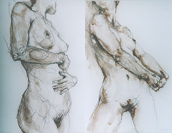

## La sépia
### sépia, seiche, céphalopodes dibranchiaux, poches à encre, carbonate de potasse, gomme arabique, papier tournesol, encre, noir, lavis
 **La sépia**  

**C'est l'encre de la seiche (_céphalopodes dibranchiaux_).**

[](quinoussommes.html#sylvieguillot)

Elle est naturellement noire, c'est une chose que nous avons oubliée à force de voir les travaux des artistes et les produits du commerce car c'est seulement très diluée qu'elle se révèle d'un brun bleuté (on dit que l'on peut en faire un véritable bleu). Le pouvoir colorant de la substance brute surprend par sa puissance et sa noirceur intense.

La sépia a d'abord été utilisée au moyen-âge comme noir. Elle se conservait dans un récipient en verre pour une raison que nous ignorons (merci de [nous informer](ecrire.html) si vous savez quelque chose à ce sujet).

Depuis maintenant fort longtemps, les artistes l'utilisent presque toujours pour son brun plus ou moins bleuté, en tout cas assez froid, bien particulier. La plus belle sépia est, dit-on, celle de l'Adriatique. Celle de l'Atlantique donne de bons résultats mais sa couleur manque de permanence (information attestée pour une encre non traitée). La préparation de l'encre (voir ci-dessous) peut certainement jouer un rôle contre la fugacité du colorant.

La sépia a été particulièrement à la mode à la fin du XVIIIème siècle et au-delà.

Chacun peut réaliser une encre sépia : il suffit de laisser sécher les poches à encre de l'animal puis d'en extraire le jus noir que l'on peut éventuellement faire sécher à son tour si l'on souhaite en faire un véritable pigment. Il n'est pas exclu de l'employer en peinture à l'huile, ce qui a déjà été fait. Cependant, cette couleur a été peu employée pour cette peinture car d'autres pigments moins chers à stabilité équivalente ou supérieure sont aisément disponibles.

Certains peintres l'utilisent sans adjuvant, d'autres préconisent une préparation compliquée à base de carbonate de [potasse](potasse.html) dilué à l'eau (purification) et d'acide (neutralisation). L'adjonction d'un liant aqueux comme [la gomme arabique](gommearabaquar.html) pourrait être secourable. Un contrôle rigoureux de la charge électrochimique à l'aide de [papier tournesol](papiertournesol.html) pourrait aussi se révéler utile afin de déterminer le traitement à appliquer.

Originellement, la sépia fut utilisée comme encre, particulièrement en [lavis](lavis1.html), mais la teinte brune de la véritable sépia de sèche a été transposée dans d'autres disciplines : dessin, peinture, photo, cinéma, etc.

Voir aussi _[La sanguine](sanguine.html)_, _[L'encre de Chine](encredechine.html)_, _[Le brou de noix](broudenoix.html),_ _[Le lavis](lavis1.html)_.

Lecture conseillée : [La sépia sur Pourpre.com](http://pourpre.com/chroma/dico.php?typ=fiche&&ent=sepia)


 [Communication](http://www.artrealite.com/annonceurs.htm) 

[](index-2.html#20131014)


```
title: La sépia
date: Fri Dec 22 2023 11:28:25 GMT+0100 (Central European Standard Time)
author: postite
```
