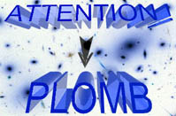
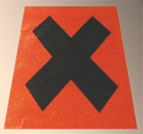

## Les siccatifs
### Les siccatifs, usage en peinture à l'huile
 **Les siccatifs  
****(pour huiles à peindre)**

_Le rôle d'un siccatif est d'apporter de l'oxygène à la peinture à [l'huile](huiles.html) pour accélérer la [polymérisation](polymere.html), qui donne lieu par [siccativation](sechagesiccativation.html) au durcissement de la couche picturale._

_La plupart des agents susceptibles de véhiculer l'oxygène au coeur de la pâte sont des métaux lourds oxydés (ce qui explique que cette page soit couverte de panneaux avertissant sur la toxicité). Certains métaux très affectueux comme le fer refusent farouchement de laisser partir l'oxygène (voir [oxydes de fer](oxydesdefer.html)) tandis que d'autres, comme le cobalt ou le manganèse, ont tendance à lâcher prise bien trop rapidement._

_Quelques [non-métaux](nonmetaux.html) et associations moléculaires ont aussi été utilisés dans le passé, puis abandonnés. Enfin, des solutions "siccatives" ne comportant pas à proprement parler de "siccatifs" sont assez utilisées et seront appelées à l'être de plus en plus, comme l'adjonction de certains liants aqueux en émulsion. Ils ne sont pas siccatifs de l'huile, mais accélèrent les temps de séchage par le simple fait d'être là, en mélange à l'huile, se substituant donc à elle en quantité partielle (lire [Les émulsions](liantsemulsions.html)). Les [huiles "soufflées"](autreshuiles.html#huilessoufflees) , déjà en partie saturées d'oxygène, constituent également une solution, peu employée dans le domaine artistique cependant._

**Sommaire**

[La litharge](siccatifs.html#lalitharge)

[Les Courtrai](siccatifs.html#lescourtrai)

[Siccatifs anciens de l'huile](siccatifs.html#siccatifsanciensdelhuile)

\- [La couperose blanche](siccatifs.html#lacouperoseblanche)

\- [Le noir animal](siccatifs.html#lenoiranimal)

\- [Le carbonate de plomb ou céruse](siccatifs.html#lecarbonatedeplombouceruse)

\- [Le sulfate de plomb](siccatifs.html#lesulfatedeplomb)

[Nouveaux métaux oxydés employés comme siccatifs](siccatifs.html#nouveauxmetauxsiccatifs)

[Pourquoi des siccatifs ?](siccatifs.html#pourquoiunsiccatif)

\- [La piste des émulsions](siccatifs.html#lapistedesemulsions)

\- [Poids de la tradition, efficacité réelle et santé publique](siccatifs.html#poidsdelatraditionefficacitereelleetsantepublique)

_Quel que soit le siccatif employé, le principal "danger pictural" de l'emploi de ce type de produits est l'accentuation des différences de temps de siccativation entre les différentes couches._

_La couche externe siccative beaucoup trop vite, rendant beaucoup plus difficile la siccativation des couches moyennes et profondes. En résultent toutes sortes d'accidents._ Il est donc conseillé d'utiliser nettement moins d'agents siccatifs dans les couches externes. _Un exemple : l'erreur courante d'utiliser un médium au plomb pour réaliser des glacis de finition au-dessus d'une peinture moins chargée de siccatif et encore fraîche en profondeur._

_Par ailleurs, l'excès de siccatifs ou la conjugaison d'agents chimiques différents peut entraîner des altérations des couleurs à moyen ou long terme._

**La litharge**

[](pigments.html#compatibilitesetincompatibilites)

Le premier agent siccatif pour la peinture à l'huile (quelle que soit l'huile) a été le monoxyde de [plomb](annexe1.html#pb) jaune (PbO), dit "litharge" ([voir composition et étymologie dans le glossaire](litharge.html)), parfois "litharge d'or", très abusivement car ce produit jaunâtre n'a guère de ressemblance avec le précieux métal. Cette coloration est sensible dans les "[huiles cuites](autreshuiles.html#lhuiledelincuite)" et dans certains [siccatifs de Courtrai](siccatifs.html#lescourtrai).

Il s'agit d'une poudre assez lourde à adjoindre à hauteur de 5% grand maximum du poids de l'huile, en pleine cuisson si possible (bain-marie ou autre procédé). Le produit obtenu est nommé un peu abusivement "huile cuite". Voir absolument _[Cuisine des huiles](cuisinedeshuiles.html)_.

L'oxyde de plomb occasionne une siccativation progressive bien tempérée, en profondeur comme en surface, qui est assez saine pour la peinture à l'huile mais par contre il est incompatible avec les couleurs au soufre qui sont fort nombreuses (voir [Compatibilités et incompatibilités _in_ Les pigments, les couleurs](pigments.html#compatibilitesetincompatibilites)).


C'est un **poison mortel** à l'état concentré et pulvérulent, donc potentiellement très dangereux.

A manier avec beaucoup de précautions, après apprentissage en atelier.

Conserver ce produit hors de portée des enfants et des animaux car le plomb présente ce que l'on pourrait nommer un inconvénient particulièrement vicieux  : il a bon goût. N'hésitez pas à le stocker dans un lieu fermant à clef.

Ne pas le jeter à la poubelle : il s'agit d'un puissant polluant. De nombreuses [déchetteries](liens.html#dechetteries) municipales proposent un enlèvement gratuit à domicile.

**Les Courtrai**


Il existe essentiellement deux variétés principales de siccatifs de Courtrai : une blanche, à base d'oxyde de plomb, et une brune, associant oxyde de plomb et oxyde de manganèse.

Selon [Xavier de Langlais](livres.html#langlais), "le Courtrai" (soit la variété originelle) correspond au Courtrai dit aujourd'hui "brun", qui présente certains petits défauts. Voir [ci-dessous](siccatifs.html#courtraibrun).

Plus utilisée de nos jours, la variété dite "Courtrai blanc" est une litharge (de plomb seulement) traitée, diluée dans [l'essence](essences.html) mais quand même assez toxique pour arborer la tête de mort. Elle apporte quelques améliorations par rapport au produit original, une [litharge](siccatifs.html#lalitharge) simplement diluée dans l'essence, et plus encore en comparaison avec les "[huiles cuites](autreshuiles.html#lhuiledelincuite)". Le Courtrai blanc est très peu coloré ; il n'est pas lui-même oléagineux. Comme les autres variétés, il peut être employé à froid à hauteur de 1 à 5% en fonction des nécessités et de la siccativité naturelle des pigments employés.

[](toxicite.html)

Le siccatif de Courtai, blanc (plomb) ou brun, est - dans les textes surtout - soumis à une réglementation contraignante. A partir d'une certaine concentration de plomb impliquant légalement la présence sur le flacon du pictogramme ci-contre, le distributeur est censé, selon les termes de la loi, entretenir un _livre d'apothicaire_ similaire au carnet à souche du pharmacien. Il en va de même avec tous les produits présentant une haute teneur en plomb. Certains magasins ont pris la décision (peut-être assez sage, en fin de compte) de faire une impasse sur ces substances mortellement toxiques. D'autres sont en parfaite infraction.



Constatant l'ampleur du problème, certains fabricants ont créé des Courtrai nocifs mais non toxiques (question de dosage, probablement), autorisant ainsi la vente sans consignation sur le livre d'apothicaire. Néanmoins, ils n'ont pas cru nécessaire de faire figurer une information capitale : quel est le principe actif de ces produits, et le taux de dilution ? Un "Courtrai blanc" contient à coup sûr du plomb, mais que dire, par exemple, d'un "Courtrai" sans épithète sans coloration jaune (non assimilable, donc à la variété originelle) : contient-il aussi du manganèse, du cobalt, du zinc, du zirconium ? Ce genre de produits existe.

_Une chose est sûre : pour la sécurité de l'artiste (et de ceux qui l'entourent, ainsi que des acquéreurs de ses travaux), celui-ci a intérêt à être plus prudent que certains industriels et détaillants qui semblent parfois ignorer le danger._

**Siccatifs anciens de l'huile**

D'autres produits ont été employés très tôt :

[](pigments.html#compatibilitesetincompatibilites)

> \* la couperose blanche. Réputée peu nocive mais aussi peu active, sa base est le [sulfate](annexe1.html#sr) de [zinc](annexe1.html#zn) (à distinguer du sulf[ure](uresiresates.html) de zinc, employé comme pigment blanc courant). Elle est assez mal connue. Les fabricants de peinture semblent l'avoir complètement abandonnée. C'est un produit à tester (merci de [nous faire parvenir](ecrire.html) toute information à ce sujet). _Contenant du soufre, elle ne doit pas être mêlée aux produits comprenant du plomb_, notamment la [litharge](siccatifs.html#lalitharge), les [Courtrai](siccatifs.html#lescourtrai), la plupart des [médiums siccatifs](mediumspourlhuile.html#lesmediumssiccatifs), la [céruse](ceruse.html) et certains pigments rares, si elle n'est pas bien "lavée", c'est-à-dire si elle contient du soufre libre.
> 
> \* le noir animal, dont le principe actif est l'osséine. Lire [l'article consacré à ce produit](noiranimal.html).  
> Ce produit a peut-être servi à préparer la "_[carta tinta](pointedargent.html#cartatinta)_", support spécifiquement destiné au dessin à la pointe métallique. Information non confirmée.
> 
> \* le carbonate de plomb ou céruse. Il a deux défauts de taille : il est hautement toxique ([lire l'article qui lui est consacré](ceruse.html)) et il est blanc. On mentionne quand même un emploi ancien marginal que l'on peut autant qualifier de siccatif que de chromatique.
> 
> \* le sulfate de plomb (SO4Pb) aurait été utilisé comme siccatif, mais nous manquons d'informations à ce sujet. [N'hésitez pas à nous en fournir !](ecrire.html)

**Nouveaux métaux oxydés employés comme siccatifs**

Aux XVIII et XIXème siècle, d'autres oxydes métalliques siccatifs ont été découverts. Dans l'ensemble, il n'est pas exagéré d'avancer qu'ils sont _trop siccatifs_ : ils peuvent créer une pellicule sèche en surface, provoquant des plissements et autres accidents. Ce sont :

> \* l'oxyde de [manganèse](manganese2.html), un peu jaune, provocant une siccativation assez véloce, supérieure à celle du plomb mais _encore assez modérée pour un emploi tempéré lorsqu'il est employé conjointement à l'oxyde de plomb_ (comme dans le siccatif de Courtrai brun). _Il ne faut cependant pas se leurrer quant à la capacité de cette combinaison de se transformer en association de malfaiteurs allant jusqu'à puiser l'oxygène dans les pigments eux-mêmes dès que l'huile de lin s'est solidifiée ! La grande valse des couleurs est alors assurée...  
> _Le manganèse aurait tendance à rendre la pâte légèrement friable. Cette hypothèse n'est pas recoupée par l'expérience de notre côté, mais elle devrait être prise au sérieux selon nous ([merci de nous communiquer toute information expérimentale à ce sujet](ecrire.html)).  
> Certains pigments, les [terres de Sienne](terresdesienne.html) et les [terres d'ombre](terresdombre.html) ou encore, évidemment, les [couleurs au manganèse](manganese.html) véritable, contiennent de l'oxyde de manganèse et se comportent effectivement d'une manière bien particulière, nécessitant une adaptation très réfléchie de la part du peintre.
> 
> \* l'oxyde de [cobalt](annexe1.html#co), pratiquement inutilisable tant son pouvoir siccativant est puissant, il pourrait cependant être présent dans certains produits destinés à la peinture décorative. Noter que les couleurs au cobalt - contenant de l'oxyde de cobalt - ont aussi un pouvoir siccatif. Voir _[Famille des cobalts](cobalts.html)_.
> 
> \* l'oxyde ou plutôt le dioxyde de [zirconium](annexe1.html#zr) (zircone, ZrO2), encore mal connu des peintres (merci de [nous faire parvenir](ecrire.html) toute information à son sujet).
> 
> \* d'autres oxydes métalliques.

**Dangerosité**

Manganèse, cobalt et zirconium et autres métaux ne présentent pas une dangerosité aussi notoire que celle du plomb. Ils sont parfois adjoints à des encres oléagineuses utilisées dans l'emballage alimentaire, en très faibles quantités parce que certains ont un goût. Mais ils ne sont quand même pas anodins.

> Le cobalt, en particulier, peut tuer de différentes manières et occasionner différentes sortes de dysfonctionnements majeurs (notamment thyroïdiens). Il pourrait être cancérigène. On parle là de ses différents oxydes.
> 
> Une grande quantité de troubles peuvent être provoqués par différents oxydes de manganèse. Devenus chroniques, ils donnent ce que l'on nomme le manganisme. Lire [passage in Le bleu MnYIn](hitechbleumnyin.html#dangers).
> 
> Le zirconium sous sa forme pure est explosif en présence d'air et hautement réactif à de nombreux éléments et molécules, cependant il en va tout autrement de son dioxyde que le [Reptox](liensutiles.html#csst) classe parmi les produits stables. Les mises en garde ne concernent que de possibles réactions allergiques surtout cutanées (donc éviter tout contact ou inhalation) et - toujours selon cette nomenclature toxicologique - les faibles quantités peuvent être jetées sans traitement particulier.  
> Un bon point donc pour le zircone.

Aujourd'hui, beaucoup de [médiums](mediumsetvernis.html) (médiums siccatifs) et la quasi totalité des siccatifs pour la peinture à l'huile ne contiennent du plomb qu'à faible dose comme agent siccativant. La dilution du plomb dans certains d'entre eux (le Harlem par exemple) est suffisamment importante pour que ces produits soient classés parmi les nocifs et non les toxiques. Cela ne nous empêche pas de conseiller une grande prudence dans la manipulation de ces substances.

Heureusement, les fabricants semblent se tourner progressivement vers d'autres solutions techniques que les siccatifs métalliques.

**Pourquoi des siccatifs ?**

Étant donné 

> \- le risque qu'ils font peser sur la santé et sur l'environnement, 
> 
> \- le grand nombre d'accidents sur les tableaux, qui ont eu lieu à cause d'emplois inadéquats de siccatifs,

il y a lieu, sans aucun doute, pour le peintre, de s'interroger quant au bien-fondé de l'usage de ces produits.

L'huile de lin est déjà la plus siccative des huiles. Cuite sans litharge et claircée, clarifiée, elle l'est un petit peu plus (voir [Cuisine des huiles](cuisinedeshuiles.html)). L'adjonction de siccatifs à une telle huile n'est donc pas forcément nécessaire. La méthode de travail (en série ou non, séances étalées sur un ou sur plusieurs jours, travail gras ou maigre, procédé à l'huile ou non) peut être remise en question lorsque le peintre se trouve en face des spécificités de l'huile en termes de délais à respecter entre les couches : faut-il plomber la peinture ou changer de procédé ?

**La piste des émulsions**

Pour qui recherche la siccativité, les [émulsions](liantsemulsions.html) ([méthylcellulosiques](liantsemulsions.html#emulsionhuileliantmethylcellulosique), à [l'oeuf](liantsemulsions.html#emulsionhuileliantaloeuf), etc., voire même des [alkydes](alkydes.html) dans certains cas) constituent des pistes **au moins aussi intéressantes** que les oxydes métalliques siccatifs.

Il ne s'agit d'ailleurs pas à proprement parler de siccatifs. Ces produits sont eux-mêmes des [liants](liants.html) ayant deux particularités : ils sont aqueux, donc sèchent vite, et ils peuvent se mêler intimement à l'huile. Ils n'apportent pas d'oxygène à l'huile, mais _ils diminuent la quantité d'huile_, donc la durée globale du séchage !

Évidemment, ces émulsions ont chacune leurs spécificités. Elles ne peuvent pas être utilisées comme les siccatifs métalliques car elles apportent quelque chose de plus "marqué" dans la pâte : une onctuosité, une aptitude ou une inaptitude à l'empâtement, un satiné délicat, une matité, etc. Elles nécessitent souvent que l'on s'attache à expérimenter différentes possibilités pour élaborer une sorte de "méthode personnelle", démarche courante chez les peintres atteignant différents caps de leur évolution, à des moments variant en fonction des personnalités. Les fabricants se sont d'ailleurs posé les mêmes questions et sont parfois parvenus à y apporter des réponses très valables. Nombre de médiums sans plomb du commerce contiennent de la chaux, de la cire, etc.

On peut employer les émulsions comme liants ou comme médiums. [Lire absolument l'article sur les émulsions](liantsemulsions.html).

**Poids de la tradition, efficacité réelle et santé publique**

Pourquoi recourir au procédé à l'huile si l'on souhaite des temps de séchage courts ? Pourquoi ajouter une litharge dans un jus très dilué, un glacis ? Est-il vraiment nécessaire de se conformer à des traditions souvent déformées ou obsolètes et aussi vaines que dangereuses. Par exemple, en peinture décorative de type [patines](patines.html#patinesmurale) murales, certains continuent à prôner l'adjonction de litharge, ce qui n'est pas seulement inutile, mais GRAVE au point de vue de la santé publique.

Tout cela ne doit pas masquer une constatation purement technique : l'emploi maîtrisé de siccatifs métalliques peut être dans certains cas d'un précieux secours (par exemple, figer rapidement dans la masse certaines [charges incolores](chargesincolores.html) qui ont tendance à "tomber", équilibrer les temps de siccativation lorsque on emploie localement des pigments naturellement siccatifs, compenser le manque de siccativité de certaines huiles, etc.). Il peut par contre - c'est vraiment très courant - être funeste pour les tableaux s'il ne s'agit que de rattraper un retard ou de compenser des erreurs techniques dans l'ignorance ou au mépris des considérations techniques que nous venons d'exposer. De plus, les siccatifs métalliques peuvent être funestes au sens propre : il s'agit de poisons et de polluants, mieux vaut ne pas l'oublier.


 [Communication](http://www.artrealite.com/annonceurs.htm) 

[](index-2.html#20131014)


```
title: Les siccatifs
date: Fri Dec 22 2023 11:28:25 GMT+0100 (Central European Standard Time)
author: postite
```
