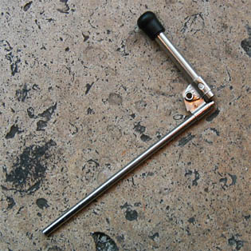

## La soufflette
### La soufflette, usage en arts plastiques et autres
 **La soufflette**  



Elle sert à projeter une substance. Cette substance est choisie pour sa tendance à s'évaporer vivement car sa fonction est de véhiculer une autre substance comme une [résine](resine.html) (pour fixatifs, pour vernis spéciaux), une peinture, du colorant alimentaire, etc. Cette "substance-véhicule" est le plus souvent de l'[éthanol](alcools.html#ethanolpur) (lire l'article sur [les alcools](alcools.html)) mais d'autres substances volatiles peuvent être utilisées en fonction de la matière à véhiculer.

On plonge le tuyau dans le flacon contenant le liquide à projeter. Les émanations gazeuses montent dans le tube, ce qui prend au moins une dizaine de secondes dans le cas de l'éthanol. Il suffit alors de souffler dans l'embouchure prévue à cet effet (embout caoutchouteux situé en haut de l'image ci-contre) pour projeter le produit.

Il existe des modèles plus perfectionnés.


 [Communication](http://www.artrealite.com/annonceurs.htm) 

[](index-2.html#20131014)


```
title: La soufflette
date: Fri Dec 22 2023 11:28:28 GMT+0100 (Central European Standard Time)
author: postite
```
