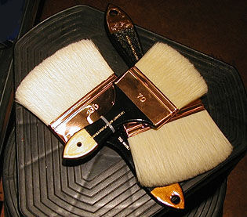
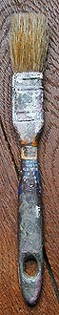

## Le spalter et la queue de morue²
### Le spalter et la queue de morue, usage en arts plastiques et autres
 **Le spalter et la queue de morue**  



_Pinceaux aux formes un peu particulières, ces outils sont indispensables à la peinture artistique, aux arts plastiques en général, aux arts décoratifs et aux BTP. Ils représentent un investissement faible au regard des services rendus._

**Important**  : spalter et queues de morues sont souvent en [soie de porc](pincpoils.html#lasoiedeporc) de qualité moyenne. L'emploi de poils plus fins ou de [synthétique](pincpoils.html#lesynthetique) autorise davantage de travaux notamment en enduction, pour les aplats, etc.

**_Le spalter_**

Brosse à virole plus large que la longueur de la sortie.

La sortie est elle-même assez longue, sensiblement égale à celle des queues de morue.

Photo ci-dessus à droite : de beaux spalters de qualité "Beaux-arts".



**_La queue de morue_**

Sa sortie est plus longue que sa virole, elle-même plus étroite que celle du spalter. _Elle contient beaucoup de liquide_. Son utilisation ne se limite pas à l'enduction. De bonne qualité, elle peut parfaitement être utilisée à l'exécution.

Ci-contre, une queue de morue de qualité basique ayant quelques années de bons et loyaux services à son actif.


 [Communication](http://www.artrealite.com/annonceurs.htm) 

[](index-2.html#20131014)


```
title: Le spalter et la queue de morue²
date: Fri Dec 22 2023 11:28:28 GMT+0100 (Central European Standard Time)
author: postite
```
